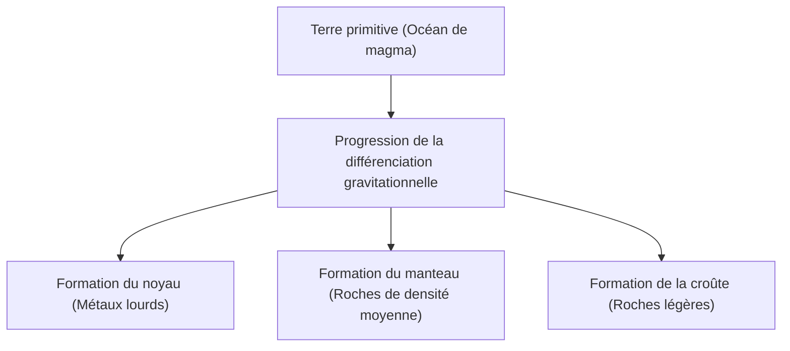

## Introduction : La Terre, une immense usine chimique

La Terre qui s'étend sous nos pieds. À première vue, elle peut ressembler à une masse rocheuse silencieuse, mais son intérieur est une usine chimique dynamique en constante activité. Depuis sa naissance il y a environ 4,6 milliards d'années, elle a évolué sur une période inimaginable pour devenir ce qu'elle est aujourd'hui.

Dans cet article, nous allons examiner la composition élémentaire globale de la Terre et explorer en profondeur comment la structure à trois couches composée de la croûte, du manteau et du noyau (noyau externe et interne) s'est formée, et de quels éléments chacune est constituée. De la naissance de l'étoile à la différenciation de la matière, jusqu'à la formation de la riche surface sur laquelle nous vivons, découvrons l'histoire de la formation de notre planète sous l'angle de la chimie.

## La composition élémentaire globale de la Terre : Les quatre grands éléments (Big Four)

Si nous pouvions réduire la Terre en poussière dans un gigantesque mixeur et analyser ses composants, quels seraient les résultats ? En réalité, le nombre de types d'éléments constituant la Terre n'est pas si grand. La majeure partie de la masse est constituée de seulement quatre éléments.

1. **Fer (Fe)** : Environ 32,1 %
2. **Oxygène (O)** : Environ 30,1 %
3. **Silicium (Si)** : Environ 15,1 %
4. **Magnésium (Mg)** : Environ 13,9 %

Ces quatre éléments à eux seuls représentent **plus de 90 %** de la masse totale de la Terre. Les 10 % restants sont constitués d'éléments traces tels que le soufre (2,9 %), le nickel (1,8 %), le calcium (1,5 %) et l'aluminium (1,4 %).

### Pourquoi y a-t-il tant de fer et d'oxygène ?

La raison pour laquelle le fer est l'élément le plus abondant de la Terre remonte au processus de formation du système solaire. Dans la réaction de fusion nucléaire qui a lieu à l'intérieur des étoiles, le fer possède le noyau atomique le plus stable. Par conséquent, les matériaux dispersés dans l'espace lors des explosions de supernovas, par exemple, étaient riches en fer. Lorsque la Terre s'est formée, ces planétésimaux contenant du fer se sont accumulés, c'est pourquoi une grande quantité de fer est présente sur Terre.

D'autre part, l'oxygène est le troisième élément le plus abondant dans l'univers. Il se lie facilement au silicium, au magnésium et au fer qui composent les roches, il a donc été incorporé en grandes quantités sous forme d'oxydes (roches).

## La structure de la Terre : L'histoire de la différenciation

La Terre primitive était dans un état d'"océan de magma", fondue par la chaleur générée par les impacts des planétésimaux et la chaleur de désintégration des isotopes radioactifs. Dans cet état liquide à haute température, un phénomène appelé "**différenciation gravitationnelle**" s'est produit.

Les matériaux lourds (principalement le fer et le nickel) ont coulé pour former le centre de la Terre (le noyau), tandis que les matériaux légers (comme les silicates) ont flotté vers la surface pour former le manteau et la croûte. C'est cette différenciation qui a créé la structure en couches actuelle de la Terre.

Examinons maintenant chaque couche plus en détail.

## Le noyau : Une sphère de fer géante au centre de la Terre

Le noyau est situé au centre de la Terre, à une profondeur d'environ 2 900 km à 6 371 km de la surface. Il représente environ 32 % de la masse totale de la Terre et est principalement composé d'un alliage de fer et de nickel.

Le noyau est lui-même divisé en deux parties : le **noyau externe** et le **noyau interne**.

### Le noyau externe (Outer Core)

Le noyau externe est situé à une profondeur comprise entre environ 2 900 km et 5 150 km. La température y est extrêmement élevée (environ 4 000 à 5 000 °C) et il se trouve à l'état **liquide**, le fer et le nickel y étant en fusion.

On pense que la convection du métal liquide dans le noyau externe génère le champ magnétique terrestre (théorie de la dynamo). Ce champ magnétique joue un rôle crucial dans la protection de la vie sur Terre contre les rayons cosmiques nocifs et les vents solaires. Outre le fer et le nickel, on estime que le noyau externe contient environ 10 % d'éléments plus légers tels que le soufre, l'oxygène et le silicium.

### Le noyau interne (Inner Core)

Le noyau interne s'étend d'une profondeur d'environ 5 150 km jusqu'au centre de la Terre (6 371 km). La température y est encore plus élevée que dans le noyau externe (environ 5 000 à 6 000 °C, comparable à la température de surface du Soleil) ; malgré cela, il reste à l'état **solide**.

Cela est dû à la pression qui augmente de manière spectaculaire vers le centre (environ 3,3 à 3,6 millions d'atmosphères), élevant ainsi le point de fusion du fer dans cet environnement à ultra-haute pression. Aujourd'hui encore, à mesure que la Terre se refroidit, le fer liquide du noyau externe se solidifie progressivement, et on estime que le noyau interne continue de croître à un rythme d'environ 1 mm par an.

## Le manteau : L'immense couche rocheuse qui occupe la majeure partie de la Terre

Le manteau s'étend sous la croûte, d'une profondeur de quelques dizaines de kilomètres jusqu'à environ 2 900 km. C'est la plus grande couche de la Terre, représentant environ 84 % de son volume et 67 % de sa masse.

On croit souvent à tort que le manteau est un océan de magma en fusion, mais il est en réalité constitué de **roches solides**. Ses principaux composants sont les "**minéraux silicatés**" formés de silicium, d'oxygène, de magnésium et de fer. Le manteau supérieur, en particulier, est composé d'une roche appelée péridotite (olivine et pyroxène).

### Le mouvement colossal de la convection mantellique

Bien que le manteau soit solide, sur une longue échelle de temps géologique (des dizaines de milliers à des centaines de millions d'années), il s'écoule très lentement, comme du sirop (déformation plastique). Pour évacuer la chaleur interne de la Terre (chaleur provenant du noyau et de la désintégration des éléments radioactifs) vers la surface, le manteau connaît d'immenses mouvements de convection.

Cette convection mantellique est la force motrice qui déplace les plaques tectoniques à la surface, et la cause fondamentale des mouvements de la croûte terrestre qui provoquent des tremblements de terre, l'activité volcanique et l'orogenèse (formation des montagnes).

## La croûte : La mince enveloppe sur laquelle nous vivons

La "croûte" est la couche la plus externe et la plus fine qui recouvre la surface de la Terre. Par rapport au rayon de la Terre (environ 6 371 km), l'épaisseur de la croûte n'est que de 5 à 70 km environ. Pour comparer avec une pomme, c'est une couche plus fine que sa peau.

La croûte s'est formée par la concentration d'éléments plus légers (silicium, aluminium, calcium, sodium, potassium, etc.) provenant du manteau. Bien qu'elle représente moins de 1 % de la masse totale de la Terre, c'est un endroit essentiel où existent divers éléments indispensables à la vie.

En termes de composition de la croûte (nombre de Clarke), l'oxygène (environ 46,6 %) et le silicium (environ 27,7 %) sont de loin les plus abondants, représentant à eux deux près des trois quarts de la masse de la croûte. Viennent ensuite l'aluminium (environ 8,1 %) et le fer (environ 5,0 %).

Il existe deux grands types de croûte terrestre :

### La croûte continentale

C'est la base des terres émergées sur lesquelles nous vivons. Son épaisseur moyenne est d'environ 30 à 40 km (jusqu'à 70 km dans les zones épaisses comme le plateau tibétain). Ses principaux composants sont des roches silicatées telles que le granit, et comme elle est riche en silicium (Si) et en aluminium (Al), elle est également appelée "**Sial**". Sa densité est relativement faible, d'environ 2,7 g/cm³.

### La croûte océanique

C'est la croûte qui forme le fond des océans. Elle est fine, avec une épaisseur d'environ 5 à 10 km, et est principalement composée de basalte. Riche en silicium (Si) et en magnésium (Mg), elle est aussi appelée "**Sima**". Comme elle contient plus de fer et de magnésium que la croûte continentale, sa densité est plus élevée, d'environ 3,0 g/cm³.

## Conclusion : Un équilibre miraculeux qui nourrit la vie

La Terre est fondée sur un équilibre subtil : un puissant champ magnétique généré par un noyau de fer, des mouvements crustaux actifs causés par un manteau en écoulement, et une croûte où se concentrent des éléments variés.

Si le fer avait été moins abondant et qu'il n'y avait pas eu de champ magnétique, la vie aurait été brûlée par les rayons cosmiques. S'il n'y avait pas de convection mantellique et d'activité tectonique, les nutriments n'auraient pas circulé, et l'évolution de la vie aurait peut-être stagné.

Sous la terre sur laquelle nous marchons naturellement au quotidien se cachent une histoire extraordinaire de 4,6 milliards d'années et le drame de l'univers. Comprendre la structure interne de la Terre est un indice essentiel pour comprendre pourquoi nous pouvons vivre sur cette planète.
