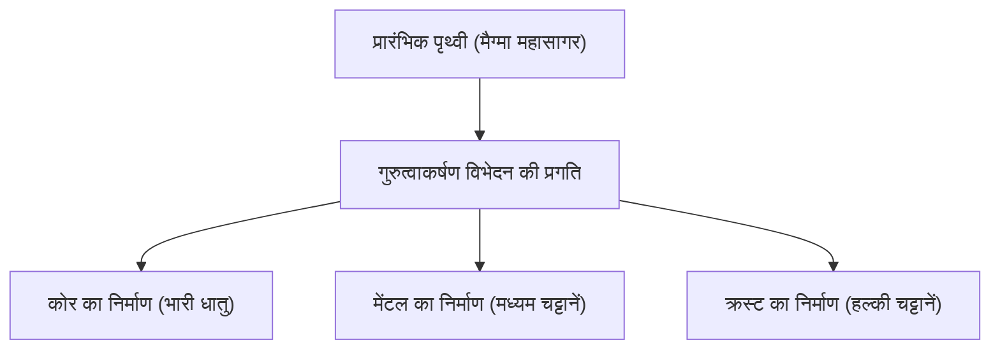

## परिचय: पृथ्वी, एक विशाल रासायनिक कारखाना

हमारे पैरों के नीचे फैली हुई पृथ्वी। पहली नज़र में यह चट्टान का एक शांत टुकड़ा लग सकती है, लेकिन इसका आंतरिक भाग एक गतिशील रासायनिक कारखाना है जो लगातार काम कर रहा है। लगभग 4.6 अरब वर्ष पहले अपने जन्म के बाद से, पृथ्वी ने अपने वर्तमान स्वरूप में विकसित होने के लिए बहुत लंबा समय लिया है।

इस लेख में, हम पूरी पृथ्वी की मौलिक संरचना का अवलोकन करेंगे और इस बात की गहराई से पड़ताल करेंगे कि क्रस्ट, मेंटल और कोर (बाहरी कोर और आंतरिक कोर) की तीन-स्तरीय संरचना कैसे बनी और प्रत्येक परत किन घटकों से बनी है। तारों के जन्म से लेकर पदार्थों के विभेदन और हमारी समृद्ध सतह के निर्माण तक, आइए रसायन विज्ञान के दृष्टिकोण से पृथ्वी के निर्माण को समझें।

## पृथ्वी की संपूर्ण मौलिक संरचना: बिग फोर (4 प्रमुख तत्व)

यदि हम पृथ्वी को एक विशाल मिक्सर में डालकर उसे चूर्ण कर दें और उसके घटकों का विश्लेषण कर सकें, तो हमें क्या परिणाम मिलेंगे? वास्तव में, पृथ्वी का निर्माण करने वाले तत्वों के प्रकार बहुत अधिक नहीं हैं। द्रव्यमान का अधिकांश भाग केवल चार तत्वों से बना है।

1. **लोहा (Fe)**: लगभग 32.1%
2. **ऑक्सीजन (O)**: लगभग 30.1%
3. **सिलिकॉन (Si)**: लगभग 15.1%
4. **मैग्नीशियम (Mg)**: लगभग 13.9%

केवल ये चार तत्व ही पृथ्वी के कुल द्रव्यमान का **लगभग 90% से अधिक** हिस्सा बनाते हैं। शेष 10% सल्फर (2.9%), निकल (1.8%), कैल्शियम (1.5%), और एल्युमिनियम (1.4%) जैसे अल्प मात्रा वाले तत्वों से बना है।

### लोहा और ऑक्सीजन इतनी अधिक मात्रा में क्यों हैं?

लोहा पृथ्वी पर सबसे प्रचुर मात्रा में पाया जाने वाला तत्व क्यों है, इसका कारण सौर मंडल के निर्माण की प्रक्रिया से जुड़ा है। तारों के अंदर होने वाली परमाणु संलयन प्रतिक्रियाओं में लोहे का नाभिक सबसे स्थिर होता है। इसलिए, सुपरनोवा विस्फोटों द्वारा अंतरिक्ष में बिखरे पदार्थ में लोहे की प्रचुर मात्रा थी। जब पृथ्वी का निर्माण हो रहा था, तब लोहे से युक्त ये ग्रहाणु एक साथ जमा हो गए, जिसके कारण पृथ्वी पर बड़ी मात्रा में लोहा मौजूद है।

दूसरी ओर, ऑक्सीजन ब्रह्मांड में तीसरा सबसे प्रचुर तत्व है, और क्योंकि यह चट्टान बनाने वाले सिलिकॉन, मैग्नीशियम और लोहे के साथ आसानी से जुड़ जाता है, इसलिए इसे ऑक्साइड (चट्टानों) के रूप में बड़ी मात्रा में शामिल कर लिया गया।

## पृथ्वी की संरचना: विभेदन का इतिहास

प्रारंभिक पृथ्वी ग्रहाणुओं की टक्कर की गर्मी और रेडियोधर्मी समस्थानिकों के क्षय की गर्मी के कारण पिघले हुए "मैग्मा महासागर" की अवस्था में थी। इस उच्च तापमान वाली तरल अवस्था में, "**गुरुत्वाकर्षण विभेदन**" नामक एक घटना हुई।

भारी पदार्थ (मुख्य रूप से लोहा और निकल) डूबकर पृथ्वी का केंद्र (कोर) बनाने लगे, और हल्के पदार्थ (जैसे सिलिकेट) ऊपर उठकर मेंटल और क्रस्ट बनाने लगे। इस विभेदन ने पृथ्वी की वर्तमान परतदार संरचना का निर्माण किया।

तो चलिए, प्रत्येक परत पर विस्तार से नज़र डालते हैं।

## कोर (नाभिक): पृथ्वी के केंद्र में एक विशाल लोहे का गोला

पृथ्वी के केंद्र में, सतह से लगभग 2,900 किमी से 6,371 किमी की गहराई पर कोर (नाभिक) स्थित है। कोर पृथ्वी के कुल द्रव्यमान का लगभग 32% है, और यह मुख्य रूप से लोहे और निकल के मिश्र धातु से बना है।

कोर को आगे दो भागों में बांटा गया है: **बाहरी कोर** और **आंतरिक कोर**।

### बाहरी कोर (Outer Core)

बाहरी कोर लगभग 2,900 किमी से 5,150 किमी की गहराई पर स्थित है। इसका तापमान बहुत अधिक (लगभग 4,000-5,000℃) है, और इसमें लोहा तथा निकल पिघले हुए **तरल** अवस्था में हैं।

माना जाता है कि बाहरी कोर में तरल धातु के संवहन से पृथ्वी का चुंबकीय क्षेत्र उत्पन्न होता है (डायनेमो सिद्धांत)। यह चुंबकीय क्षेत्र पृथ्वी पर जीवन को हानिकारक ब्रह्मांडीय किरणों और सौर पवनों से बचाने में बहुत महत्वपूर्ण भूमिका निभाता है। इसके अलावा, ऐसा अनुमान है कि बाहरी कोर में लोहे और निकल के अतिरिक्त सल्फर, ऑक्सीजन और सिलिकॉन जैसे लगभग 10% हल्के तत्व भी घुले हुए हैं।

### आंतरिक कोर (Inner Core)

आंतरिक कोर लगभग 5,150 किमी की गहराई से लेकर पृथ्वी के केंद्र (6,371 किमी) तक का क्षेत्र है। इसका तापमान बाहरी कोर से भी अधिक है (लगभग 5,000-6,000℃, जो सूर्य के सतह के तापमान के बराबर है), लेकिन इसके बावजूद, यह **ठोस** अवस्था में बना हुआ है।

ऐसा इसलिए है क्योंकि केंद्र की ओर जाने पर दबाव तेजी से बढ़ता है (लगभग 33 से 36 लाख वायुमंडलीय दबाव), और अत्यधिक उच्च दबाव वाले वातावरण में लोहे का गलनांक बढ़ जाता है। ऐसा माना जाता है कि पूरी पृथ्वी के ठंडा होने के साथ-साथ, बाहरी कोर का तरल लोहा धीरे-धीरे जमता जा रहा है, और आंतरिक कोर प्रति वर्ष लगभग 1 मिमी की दर से बढ़ता जा रहा है।

## मेंटल: पृथ्वी के अधिकांश भाग को घेरने वाली विशाल चट्टानी परत

क्रस्ट के नीचे, कुछ दसियों किलोमीटर से लेकर लगभग 2,900 किलोमीटर की गहराई तक मेंटल फैला हुआ है। मेंटल पृथ्वी की सबसे बड़ी परत है, जो पृथ्वी के आयतन का लगभग 84% और द्रव्यमान का लगभग 67% हिस्सा बनाती है।

अक्सर मेंटल को पिघले हुए मैग्मा का समुद्र समझ लिया जाता है, लेकिन वास्तव में यह **ठोस चट्टान** से बना है। इसके मुख्य घटक सिलिकॉन, ऑक्सीजन, मैग्नीशियम और लोहे से बने "**सिलिकेट खनिज**" हैं। विशेष रूप से ऊपरी मेंटल पेरिडोटाइट नामक चट्टान से बना है (जिसमें ओलिवाइन और पाइरोक्सिन शामिल हैं)।

### मेंटल संवहन नामक विशाल गति

यद्यपि मेंटल ठोस है, लेकिन हजारों से करोड़ों वर्षों के भूवैज्ञानिक समय के पैमाने पर देखने पर, यह गाढ़े सिरप की तरह बहुत धीरे-धीरे प्रवाहित होता है (प्लास्टिक विरूपण)। पृथ्वी के अंदर की गर्मी (कोर से आने वाली गर्मी और रेडियोधर्मी तत्वों के क्षय से उत्पन्न गर्मी) को सतह पर छोड़ने के लिए, मेंटल में बड़े पैमाने पर संवहन गति होती है।

यही मेंटल संवहन सतह पर टेक्टोनिक प्लेटों को खिसकाने वाली प्रेरक शक्ति है, और यह भूकंप, ज्वालामुखी गतिविधि और पर्वत निर्माण जैसी भूगर्भीय गतिविधियों का मूल कारण है।

## क्रस्ट: वह पतली परत जिस पर हम रहते हैं

पृथ्वी की सतह को ढंकने वाली सबसे बाहरी, पतली परत "क्रस्ट" है। पृथ्वी की त्रिज्या (लगभग 6,371 किमी) की तुलना में, क्रस्ट की मोटाई केवल 5 से 70 किमी तक है। यदि हम इसकी तुलना एक सेब से करें, तो यह उसके छिलके से भी पतली परत है।

क्रस्ट का निर्माण मेंटल से आने वाले हल्के तत्वों (जैसे सिलिकॉन, एल्यूमीनियम, कैल्शियम, सोडियम और पोटेशियम) के जमा होने से हुआ था। यह पृथ्वी के कुल द्रव्यमान का 1% से भी कम हिस्सा है, लेकिन यह एक महत्वपूर्ण स्थान है जहाँ जीवन के लिए आवश्यक विभिन्न तत्व मौजूद हैं।

यदि हम क्रस्ट की संरचना (क्लार्क नंबर) को देखें, तो इसमें ऑक्सीजन (लगभग 46.6%) और सिलिकॉन (लगभग 27.7%) सबसे अधिक मात्रा में हैं, और ये दोनों मिलकर क्रस्ट के द्रव्यमान का लगभग तीन-चौथाई हिस्सा बनाते हैं। इसके बाद एल्यूमीनियम (लगभग 8.1%) और लोहा (लगभग 5.0%) का स्थान आता है।

क्रस्ट मुख्य रूप से दो प्रकार की होती है।

### महाद्वीपीय क्रस्ट

यह वह आधार है जिस पर हमारे रहने वाले भूभाग स्थित हैं। इसकी औसत मोटाई लगभग 30-40 किमी (तिब्बत के पठार जैसी कुछ मोटी जगहों पर 70 किमी तक) होती है। इसका मुख्य घटक ग्रेनाइट जैसी सिलिकेट चट्टानें हैं, और सिलिकॉन (Si) तथा एल्युमिनियम (Al) से भरपूर होने के कारण इसे "**सियाल (SiAl)**" भी कहा जाता है। इसका घनत्व लगभग 2.7 ग्राम/सेमी³ है, जो अपेक्षाकृत हल्का है।

### महासागरीय क्रस्ट

यह वह क्रस्ट है जो समुद्र तल का निर्माण करती है। इसकी मोटाई केवल 5-10 किमी तक है, और इसका मुख्य घटक बेसाल्ट है। सिलिकॉन (Si) और मैग्नीशियम (Mg) से भरपूर होने के कारण इसे "**सिमा (SiMa)**" भी कहा जाता है। चूँकि इसमें महाद्वीपीय क्रस्ट की तुलना में अधिक लोहा और मैग्नीशियम होता है, इसलिए इसका घनत्व लगभग 3.0 ग्राम/सेमी³ है, जो अपेक्षाकृत भारी है।

## निष्कर्ष: जीवन का पोषण करने वाला एक चमत्कारी संतुलन

पृथ्वी एक उत्कृष्ट संतुलन पर टिकी हुई है, जिसमें लोहे के कोर के कारण एक शक्तिशाली चुंबकीय क्षेत्र, बहने वाले मेंटल के कारण सक्रिय टेक्टोनिक गतिविधियां, और विविध तत्वों से भरपूर क्रस्ट शामिल हैं।

यदि लोहा कम होता और कोई चुंबकीय क्षेत्र नहीं होता, तो ब्रह्मांडीय किरणों से जीवन जलकर नष्ट हो गया होता। यदि मेंटल संवहन नहीं होता और कोई टेक्टोनिक गतिविधि नहीं होती, तो पोषक तत्वों का चक्र नहीं चलता और जीवन का विकास रुक गया होता।

हम जिस धरती पर सामान्य रूप से चलते हैं, उसके नीचे 4.6 अरब वर्षों का एक विशाल इतिहास और ब्रह्मांडीय नाटक छिपा हुआ है। पृथ्वी की आंतरिक संरचना को समझना यह जानने की एक महत्वपूर्ण कुंजी है कि हम इस ग्रह पर कैसे जीवित रह सकते हैं।
