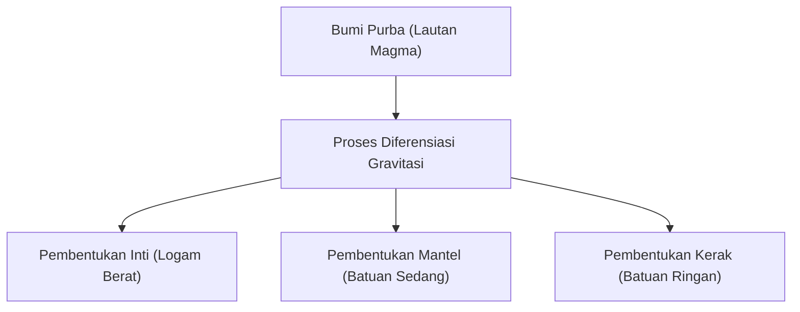

## Pendahuluan: Bumi sebagai Pabrik Kimia Raksasa

Bumi yang terbentang di bawah kaki kita. Sekilas mungkin tampak seperti bongkahan batu yang tenang, tetapi bagian dalamnya adalah pabrik kimia dinamis yang terus aktif. Sekitar 4,6 miliar tahun sejak Bumi lahir, ia telah berevolusi menjadi bentuknya yang sekarang melalui periode waktu yang luar biasa.

Pada artikel ini, kita akan melihat sekilas komposisi unsur Bumi secara keseluruhan, dan menggali lebih dalam bagaimana struktur tiga lapisan kerak, mantel, dan inti (inti luar dan inti dalam) terbentuk, serta komponen apa yang menyusun masing-masing lapisan tersebut. Dari kelahiran bintang, diferensiasi materi, hingga pembentukan permukaan bumi yang kaya tempat kita tinggal, mari kita ungkap asal usul planet Bumi dari sudut pandang kimia.

## Komposisi Unsur Keseluruhan Bumi: Empat Besar (4 Unsur Utama)

Jika kita menghancurkan Bumi menjadi berkeping-keping dalam blender raksasa dan dapat menganalisis komponennya, hasil seperti apa yang akan didapatkan? Sebenarnya, jenis unsur yang menyusun Bumi tidaklah terlalu banyak. Sebagian besar massanya didominasi oleh hanya empat unsur.

1. **Besi (Fe)**: Sekitar 32,1%
2. **Oksigen (O)**: Sekitar 30,1%
3. **Silikon (Si)**: Sekitar 15,1%
4. **Magnesium (Mg)**: Sekitar 13,9%

Keempat unsur ini saja menyusun **lebih dari sekitar 90%** dari total massa Bumi. Sekitar 10% sisanya terdiri dari unsur-unsur minor seperti belerang (2,9%), nikel (1,8%), kalsium (1,5%), dan aluminium (1,4%).

### Mengapa Besi dan Oksigen Melimpah?

Alasan mengapa besi merupakan unsur paling melimpah di Bumi secara keseluruhan dapat ditelusuri kembali ke proses pembentukan tata surya. Dalam reaksi fusi nuklir yang terjadi di dalam bintang, besi memiliki inti atom yang paling stabil. Oleh karena itu, materi yang tersebar ke luar angkasa akibat ledakan supernova dan peristiwa lainnya sangat kaya akan besi. Saat Bumi terbentuk, planetesimal yang mengandung besi ini berkumpul, sehingga terdapat sejumlah besar besi di Bumi.

Di sisi lain, oksigen adalah unsur paling melimpah ketiga di alam semesta, dan karena mudah berikatan dengan unsur penyusun batuan seperti silikon, magnesium, dan besi, oksigen dimasukkan dalam jumlah besar sebagai oksida (batuan).

## Struktur Bumi: Sejarah Diferensiasi

Bumi purba berada dalam kondisi "lautan magma" yang mencair dan kental akibat panas dari tabrakan planetesimal dan panas peluruhan isotop radioaktif. Di dalam keadaan cair bersuhu tinggi ini, fenomena yang disebut "**diferensiasi gravitasi**" terjadi.

Materi yang berat (terutama besi dan nikel) tenggelam untuk membentuk pusat Bumi (inti), sementara materi yang ringan (seperti silikat) naik untuk membentuk mantel dan kerak. Melalui diferensiasi inilah, struktur berlapis Bumi saat ini tercipta.

Sekarang, mari kita lihat setiap lapisan secara rinci.

## Inti (Core): Bola Besi Raksasa di Pusat Bumi

Terletak di pusat Bumi, pada kedalaman sekitar 2.900 km hingga 6.371 km dari permukaan, adalah inti (core). Inti menyumbang sekitar 32% dari total massa Bumi, dan sebagian besar terbuat dari paduan besi dan nikel.

Inti lebih lanjut dibagi menjadi dua: **inti luar** dan **inti dalam**.

### Inti Luar (Outer Core)

Inti luar terletak pada kedalaman sekitar 2.900 km hingga 5.150 km. Suhunya sangat tinggi (sekitar 4.000-5.000°C), dan berada dalam keadaan **cair** di mana besi dan nikel meleleh secara kental.

Diyakini bahwa konveksi logam cair di inti luar menghasilkan medan magnet Bumi (geomagnetisme) (Teori Dinamo). Medan magnet ini memainkan peran yang sangat penting dalam melindungi kehidupan di Bumi dari sinar kosmik berbahaya dan angin surya. Selain itu, diperkirakan selain besi dan nikel, sekitar 10% unsur ringan seperti belerang, oksigen, dan silikon juga terlarut di inti luar.

### Inti Dalam (Inner Core)

Inti dalam adalah wilayah dari kedalaman sekitar 5.150 km hingga ke pusat Bumi (6.371 km). Suhunya bahkan lebih tinggi dari inti luar (sekitar 5.000-6.000°C, sebanding dengan suhu permukaan matahari), tetapi meskipun demikian, ia mempertahankan keadaan **padat**.

Hal ini terjadi karena tekanan meningkat tajam menuju pusat (sekitar 3,3 juta hingga 3,6 juta atmosfer), dan di bawah lingkungan tekanan sangat tinggi, titik lebur besi meningkat. Bahkan saat ini, seiring dengan mendinginnya Bumi secara keseluruhan, besi cair di inti luar perlahan-lahan mengeras, dan inti dalam diperkirakan terus tumbuh pada kecepatan sekitar 1 mm per tahun.

## Mantel: Lapisan Batuan Raksasa yang Mendominasi Sebagian Besar Bumi

Tersebar di bawah kerak bumi, dari kedalaman puluhan kilometer hingga sekitar 2.900 km, adalah mantel. Mantel adalah lapisan terbesar Bumi, menyumbang sekitar 84% dari volume Bumi dan sekitar 67% dari massanya.

Mantel sering disalahpahami sebagai lautan magma yang mencair, namun nyatanya ia terbuat dari **batuan padat**. Komponen utamanya adalah "**mineral silikat**" yang terdiri dari silikon, oksigen, magnesium, besi, dan lainnya. Secara khusus, mantel atas terdiri dari batuan yang disebut peridotit (olivin dan piroksen).

### Pergerakan Raksasa yang Disebut Konveksi Mantel

Meskipun mantel itu padat, namun jika dilihat dalam skala waktu geologis yang panjang, puluhan ribu hingga ratusan juta tahun, ia mengalir perlahan seperti sirup (deformasi plastis). Untuk melepaskan panas dari bagian dalam Bumi (panas dari inti dan panas dari peluruhan unsur radioaktif) ke permukaan, mantel menghasilkan gerakan konveksi raksasa.

Konveksi mantel inilah yang menjadi tenaga pendorong di balik pergerakan lempeng (batuan dasar) di permukaan bumi, dan merupakan penyebab utama terjadinya pergerakan kerak bumi seperti gempa bumi, aktivitas vulkanik, dan pembentukan pegunungan.

## Kerak: Cangkang Tipis Tempat Kita Tinggal

Lapisan luar yang tipis yang menutupi permukaan Bumi adalah "kerak" (crust). Dibandingkan dengan jari-jari Bumi (sekitar 6.371 km), ketebalan kerak hanya sekitar 5-70 km. Jika diibaratkan dengan apel, ini adalah lapisan yang lebih tipis dari kulitnya.

Kerak terbentuk oleh konsentrasi unsur-unsur yang lebih ringan (seperti silikon, aluminium, kalsium, natrium, dan kalium) dari mantel. Meskipun massanya kurang dari 1% dari total massa Bumi, ini adalah tempat yang penting di mana terdapat beragam unsur yang sangat diperlukan bagi kehidupan.

Dilihat dari komposisi kerak (Angka Clarke), oksigen (sekitar 46,6%) dan silikon (sekitar 27,7%) sangat mendominasi, dan keduanya saja menyumbang sekitar tiga perempat massa kerak. Diikuti oleh aluminium (sekitar 8,1%) dan besi (sekitar 5,0%).

Kerak bumi secara umum terbagi menjadi dua jenis.

### Kerak Benua

Ini adalah bagian yang menjadi fondasi daratan tempat kita tinggal. Ketebalannya rata-rata sekitar 30-40 km (di tempat-tempat tebal seperti Dataran Tinggi Tibet mencapai 70 km). Komponen utamanya adalah batuan silikat seperti granit, dan karena kaya akan silikon (Si) dan aluminium (Al), disebut juga "**Sial (SiAl)**". Densitasnya relatif ringan, yaitu sekitar 2,7 g/cm³.

### Kerak Samudra

Ini adalah kerak yang membentuk dasar laut. Ketebalannya tipis, sekitar 5-10 km, dan komponen utamanya adalah basal. Karena kaya akan silikon (Si) dan magnesium (Mg), disebut juga "**Sima (SiMa)**". Karena mengandung lebih banyak besi dan magnesium daripada kerak benua, ia lebih berat dengan kepadatan sekitar 3,0 g/cm³.

## Penutup: Keseimbangan Ajaib yang Memelihara Kehidupan

Bumi dibangun di atas keseimbangan yang indah: medan magnet yang kuat dari inti besi, pergerakan kerak yang aktif karena mantel yang mengalir, dan kerak tempat terkonsentrasinya berbagai macam unsur.

Jika besi lebih sedikit dan medan magnet tidak ada, kehidupan mungkin sudah hangus terbakar oleh sinar kosmik. Jika tidak ada konveksi mantel dan tidak ada pergerakan kerak, garam nutrisi tidak akan bersirkulasi, dan evolusi kehidupan mungkin akan terhenti.

Di bawah tanah yang kita injak sebagaimana mestinya ini, tersembunyi sejarah yang luar biasa selama 4,6 miliar tahun dan drama alam semesta. Mengetahui struktur internal Bumi adalah petunjuk penting untuk memahami mengapa kita bisa hidup di planet ini.
