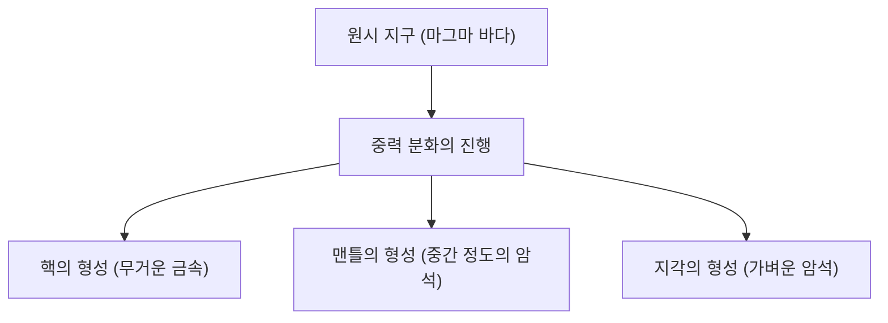

## 머리말: 지구라는 거대한 화학 공장

우리의 발밑에 펼쳐진 지구. 언뜻 보면 고요한 바위 덩어리처럼 보일지 모르지만, 그 내부는 끊임없이 활동을 계속하는 역동적인 화학 공장입니다. 지구가 탄생한 지 약 46억 년, 엄청난 세월에 걸쳐 현재의 모습으로 진화해 왔습니다.

본 기사에서는 지구 전체의 원소 조성을 조감하고, 지각, 맨틀, 핵(외핵・내핵)이라는 삼층 구조가 어떻게 형성되었으며, 각각이 어떤 성분으로 구성되어 있는지를 깊이 파헤쳐 보겠습니다. 별의 탄생부터 물질의 분화, 그리고 우리가 사는 풍요로운 지표면의 형성에 이르기까지, 지구라는 별의 기원을 화학의 관점에서 밝혀봅시다.

## 지구 전체의 원소 조성: 빅 포 (4대 원소)

만약 지구를 거대한 믹서기에 넣고 산산조각 내어 그 성분을 분석할 수 있다면, 어떤 결과를 얻을 수 있을까요? 사실 지구를 구성하는 원소의 종류는 그리 많지 않습니다. 질량의 대부분은 단 4개의 원소가 차지하고 있습니다.

1. **철 (Fe)**: 약 32.1%
2. **산소 (O)**: 약 30.1%
3. **규소 (Si)**: 약 15.1%
4. **마그네슘 (Mg)**: 약 13.9%

이 4개의 원소만으로 지구 전체 질량의 **약 90% 이상**을 차지하고 있습니다. 나머지 약 10%는 황 (2.9%), 니켈 (1.8%), 칼슘 (1.5%), 알루미늄 (1.4%) 등의 미량 원소로 구성되어 있습니다.

### 왜 철과 산소가 많은가?

철이 지구 전체에서 가장 많은 원소인 이유는 태양계의 형성 과정으로 거슬러 올라갑니다. 항성 내부에서 일어나는 핵융합 반응에서 철은 가장 안정한 원자핵을 가지고 있습니다. 그 때문에 초신성 폭발 등으로 우주 공간에 흩뿌려진 물질 중에는 철이 풍부하게 포함되어 있었습니다. 지구가 형성될 때, 이러한 철을 포함한 미행성들이 모였기 때문에 지구에는 다량의 철이 존재하는 것입니다.

반면, 산소는 우주에서 세 번째로 풍부한 원소이며, 암석을 구성하는 규소나 마그네슘, 철 등과 결합하기 쉽기 때문에 산화물(암석)의 형태로 대량으로 유입되었습니다.

## 지구의 구조: 분화의 역사

초기 지구는 미행성의 충돌에 의한 열과 방사성 동위 원소의 붕괴열에 의해 걸쭉하게 녹은 '마그마 바다' 상태였습니다. 이 고온의 액체 상태 속에서 '**중력 분화**'라고 불리는 현상이 일어났습니다.

무거운 물질(주로 철과 니켈)은 가라앉아 지구의 중심(핵)을 형성하고, 가벼운 물질(규산염 등)은 떠올라 맨틀과 지각을 형성한 것입니다. 이 분화에 의해 현재 지구의 층상 구조가 만들어졌습니다.

그러면 각 층에 대해 자세히 살펴보겠습니다.

## 핵(코어): 지구 중심에 있는 거대한 철의 구슬

지구의 중심부, 지표면에서 약 2,900km~6,371km의 깊이에 위치하는 것이 핵(코어)입니다. 핵은 지구 전체 질량의 약 32%를 차지하고 있으며, 주로 철과 니켈로 이루어진 합금으로 되어 있습니다.

핵은 다시 **외핵**과 **내핵**의 두 가지로 나뉩니다.

### 외핵 (Outer Core)

외핵은 깊이 약 2,900km에서 5,150km에 위치하고 있습니다. 온도는 매우 높고(약 4,000~5,000℃), 철과 니켈이 걸쭉하게 녹은 **액체** 상태에 있습니다.

외핵의 액체 금속이 대류함으로써 지구의 자기장(지자기)이 만들어지고 있다고 여겨집니다(다이나모 이론). 이 자기장은 유해한 우주선이나 태양풍으로부터 지구상의 생명을 보호하는 매우 중요한 역할을 하고 있습니다. 또한, 외핵에는 철・니켈 외에 황, 산소, 규소 등의 가벼운 원소가 약 10% 정도 녹아 있다고 추정됩니다.

### 내핵 (Inner Core)

내핵은 깊이 약 5,150km에서 지구의 중심(6,371km)까지의 영역입니다. 온도는 외핵보다 더욱 높지만(약 5,000~6,000℃로, 태양의 표면 온도에 필적합니다), 그럼에도 불구하고 **고체** 상태를 유지하고 있습니다.

이것은 중심부로 향할수록 압력이 급격히 높아져(약 330만~360만 기압), 초고압 환경에서는 철의 녹는점이 상승하기 때문입니다. 현재도 지구 전체의 냉각에 따라 외핵의 액체 철이 서서히 굳어지며, 내핵은 연간 약 1mm의 속도로 계속 성장하고 있다고 여겨집니다.

## 맨틀: 지구의 대부분을 차지하는 거대한 암석 층

지각 아래, 깊이 수십 km에서 약 2,900km까지의 범위에 펼쳐진 것이 맨틀입니다. 맨틀은 지구 부피의 약 84%, 질량의 약 67%를 차지하는, 지구 최대의 층입니다.

맨틀은 걸쭉하게 녹은 마그마 바다라고 오해받기 쉽지만, 실제로는 **고체 암석**으로 되어 있습니다. 주성분은 규소, 산소, 마그네슘, 철 등으로 이루어진 '**규산염 광물**'입니다. 특히 상부 맨틀은 감람암(감람석이나 휘석)이라고 불리는 암석으로 구성되어 있습니다.

### 맨틀 대류라는 거대한 움직임

맨틀은 고체지만, 수만 년~수억 년이라는 지질학적인 긴 시간 척도로 보면 물엿처럼 천천히 유동합니다(소성 변형). 지구 내부의 열(핵에서 오는 열이나 방사성 원소의 붕괴열)을 지표면으로 방출하기 위해, 맨틀은 거대한 대류 운동을 일으키고 있습니다.

이 맨틀 대류야말로 지표면의 판(암반)을 움직이는 원동력이자, 지진이나 화산 활동, 조산 운동 등의 지각 변동을 일으키는 근본적인 원인입니다.

## 지각: 우리가 사는 얇은 껍질

지구의 표면을 덮고 있는 가장 바깥쪽의 얇은 층이 '지각'입니다. 지구의 반지름(약 6,371km)에 비해, 지각의 두께는 불과 5~70km 정도입니다. 사과에 비유하자면 그 껍질보다도 얇은 층입니다.

지각은 맨틀에서 더욱 가벼운 원소(규소, 알루미늄, 칼슘, 나트륨, 칼륨 등)가 농집되어 형성되었습니다. 지구 전체 질량의 불과 1% 미만이지만, 생명에게 불가결한 다양한 원소가 존재하는 중요한 장소입니다.

지각의 조성(클라크 수)으로 보면, 산소(약 46.6%)와 규소(약 27.7%)가 압도적으로 많으며, 이 두 가지가 지각 질량의 약 4분의 3을 차지합니다. 그다음으로 알루미늄(약 8.1%), 철(약 5.0%)이 뒤를 잇습니다.

지각은 크게 두 가지 유형으로 나뉩니다.

### 대륙 지각

우리가 살고 있는 육지의 토대가 되는 부분입니다. 두께는 평균하여 약 30~40km(티베트고원 등 두꺼운 곳에서는 70km)입니다. 주성분은 화강암 등의 규산염 암석이며, 규소(Si)와 알루미늄(Al)이 풍부하기 때문에 '**시알 (SiAl)**'이라고도 불립니다. 밀도는 약 2.7 g/cm³로 비교적 가볍습니다.

### 해양 지각

해저를 구성하는 지각입니다. 두께는 약 5~10km로 얇고, 주성분은 현무암입니다. 규소(Si)와 마그네슘(Mg)이 풍부하기 때문에 '**시마 (SiMa)**'라고도 불립니다. 대륙 지각보다 철이나 마그네슘을 많이 포함하기 때문에, 밀도는 약 3.0 g/cm³로 더 무겁습니다.

## 맺음말: 생명을 키우는 기적의 균형

지구는 철로 된 핵에 의한 강력한 자기장, 유동하는 맨틀에 의한 활발한 지각 변동, 그리고 다양한 원소가 농집된 지각이라는 절묘한 균형 위에 성립되어 있습니다.

만약 철이 적어 자기장이 존재하지 않았다면, 생명은 우주선에 의해 타버렸을 것입니다. 만약 맨틀 대류가 없고 지각 변동이 없었다면, 영양염이 순환하지 않아 생명의 진화는 정체되었을지도 모릅니다.

우리가 당연한 듯이 딛고 있는 대지 아래에는, 46억 년이라는 엄청난 역사와 우주의 드라마가 숨겨져 있습니다. 지구의 내부 구조를 아는 것은 우리가 왜 이 별에서 살아갈 수 있는지를 아는 중요한 단서입니다.
