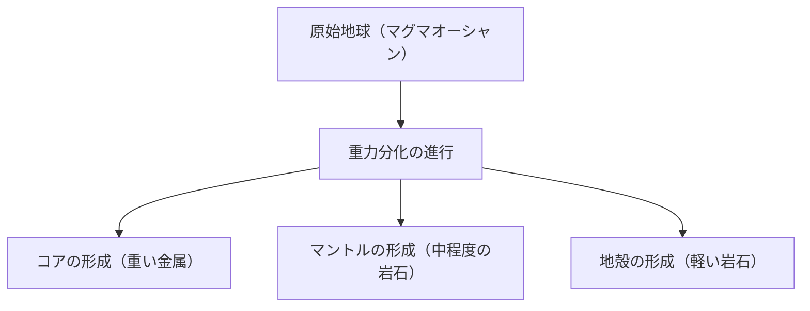

## はじめに：地球という巨大な化学工場

私たちの足元に広がる地球。一見すると静かな岩の塊のように思えるかもしれませんが、その内部は絶えず活動を続けるダイナミックな化学工場です。地球が誕生してから約46億年、途方もない年月をかけて現在の姿へと進化してきました。

本記事では、地球全体の元素組成を俯瞰し、地殻、マントル、コア（外核・内核）という三層構造がどのように形成され、それぞれがどのような成分で構成されているのかを深く掘り下げていきます。星の誕生から物質の分化、そして私たちが住む豊かな地表の形成に至るまで、地球という星の成り立ちを化学の視点から解き明かしましょう。

## 地球全体の元素組成：ビッグフォー（4大元素）

もし、地球を巨大なミキサーにかけて粉々にし、その成分を分析できたとしたら、どのような結果が得られるでしょうか。実は、地球を構成する元素の種類はそれほど多くありません。質量の大部分は、わずか4つの元素で占められています。

1. **鉄 (Fe)**: 約32.1%
2. **酸素 (O)**: 約30.1%
3. **ケイ素 (Si)**: 約15.1%
4. **マグネシウム (Mg)**: 約13.9%

この4つの元素だけで、地球全体の質量の**約90%以上**を占めています。残りの約10%は、硫黄 (2.9%)、ニッケル (1.8%)、カルシウム (1.5%)、アルミニウム (1.4%) などの微量元素で構成されています。

### なぜ鉄と酸素が多いのか？

鉄が地球全体で最も多い元素である理由は、太陽系の形成過程に遡ります。恒星の内部で行われる核融合反応において、鉄は最も安定した原子核を持っています。そのため、超新星爆発などで宇宙空間にばらまかれた物質の中には、鉄が豊富に含まれていました。地球が形成される際、これらの鉄を含む微惑星が集積したため、地球には大量の鉄が存在するのです。

一方、酸素は宇宙で3番目に豊富な元素であり、岩石を構成するケイ素やマグネシウム、鉄などと結合しやすいため、酸化物（岩石）として大量に取り込まれました。

## 地球の構造：分化の歴史

初期の地球は、微惑星の衝突による熱と放射性同位元素の崩壊熱によって、ドロドロに溶けた「マグマオーシャン」の状態でした。この高温の液体状態の中で、「**重力分化**」と呼ばれる現象が起きました。

重い物質（主に鉄とニッケル）は沈み込んで地球の中心（コア）を形成し、軽い物質（ケイ酸塩など）は浮き上がってマントルと地殻を形成したのです。この分化によって、現在の地球の層状構造が作られました。

それでは、各層について詳しく見ていきましょう。

## コア（核）：地球の中心にある巨大な鉄の球

地球の中心部、地表から約2,900km〜6,371kmの深さに位置するのがコア（核）です。コアは地球全体の質量の約32%を占めており、主に鉄とニッケルからなる合金でできています。

コアはさらに、**外核**と**内核**の2つに分けられます。

### 外核（Outer Core）

外核は、深さ約2,900kmから5,150kmに位置しています。温度は非常に高く（約4,000〜5,000℃）、鉄とニッケルがドロドロに溶けた**液体**の状態にあります。

外核の液体の金属が対流することで、地球の磁場（地磁気）が生み出されていると考えられています（ダイナモ理論）。この磁場は、有害な宇宙線や太陽風から地球上の生命を守るという、非常に重要な役割を果たしています。また、外核には鉄・ニッケルの他に、硫黄、酸素、ケイ素などの軽い元素が約10%ほど溶け込んでいると推定されています。

### 内核（Inner Core）

内核は、深さ約5,150kmから地球の中心（6,371km）までの領域です。温度は外核よりもさらに高く（約5,000〜6,000℃、太陽の表面温度に匹敵します）、にもかかわらず、**固体**の状態を保っています。

これは、中心部に向かうにつれて圧力が急激に高まり（約330万〜360万気圧）、超高圧環境下では鉄の融点が上昇するためです。現在も地球全体の冷却に伴って、外核の液体の鉄が徐々に固まり、内核は年間約1mmのペースで成長し続けていると考えられています。

## マントル：地球の大部分を占める巨大な岩石の層

地殻の下、深さ数十kmから約2,900kmまでの範囲に広がるのがマントルです。マントルは地球の体積の約84%、質量の約67%を占める、地球最大の層です。

マントルはドロドロに溶けたマグマの海だと誤解されがちですが、実際には**固体の岩石**でできています。主成分は、ケイ素、酸素、マグネシウム、鉄などからなる「**ケイ酸塩鉱物**」です。特に上部マントルは、かんらん岩（かんらん石や輝石）と呼ばれる岩石で構成されています。

### マントル対流という巨大な動き

マントルは固体ですが、数万年〜数億年という地質学的な長い時間スケールで見ると、水飴のようにゆっくりと流動します（塑性変形）。地球内部の熱（コアからの熱や放射性元素の崩壊熱）を地表へ逃がすため、マントルは巨大な対流運動を起こしています。

このマントル対流こそが、地表のプレート（岩盤）を動かす原動力であり、地震や火山活動、造山運動などの地殻変動を引き起こす根本的な原因です。

## 地殻：私たちが暮らす薄い殻

地球の表面を覆う、最も外側の薄い層が「地殻」です。地球の半径（約6,371km）に対して、地殻の厚さはわずか5〜70kmほど。リンゴに例えるなら、その皮よりも薄い層です。

地殻はマントルからさらに軽い元素（ケイ素、アルミニウム、カルシウム、ナトリウム、カリウムなど）が濃集して形成されました。地球全体の質量のわずか1%未満ですが、生命にとって不可欠な多様な元素が存在する重要な場所です。

地殻の組成（クラーク数）で見ると、酸素（約46.6%）とケイ素（約27.7%）が圧倒的に多く、この2つで地殻の質量の約4分の3を占めます。次いでアルミニウム（約8.1%）、鉄（約5.0%）と続きます。

地殻は、大きく分けて2つのタイプが存在します。

### 大陸地殻

私たちが住んでいる陸地の土台となる部分です。厚さは平均して約30〜40km（チベット高原など厚いところでは70km）あります。主成分は花崗岩などのケイ酸塩岩石で、ケイ素（Si）とアルミニウム（Al）が豊富なため、「**シアル (SiAl)**」とも呼ばれます。密度は約2.7 g/cm³と比較的軽いです。

### 海洋地殻

海底を構成する地殻です。厚さは約5〜10kmと薄く、主成分は玄武岩です。ケイ素（Si）とマグネシウム（Mg）が豊富なため、「**シマ (SiMa)**」とも呼ばれます。大陸地殻よりも鉄やマグネシウムを多く含むため、密度は約3.0 g/cm³と重くなっています。

## おわりに：生命を育む奇跡のバランス

地球は、鉄のコアによる強力な磁場、流動するマントルによる活発な地殻変動、そして多様な元素が濃集した地殻という、絶妙なバランスの上に成り立っています。

もし、鉄が少なく磁場が存在しなければ、生命は宇宙線によって焼き尽くされていたでしょう。もし、マントル対流がなく地殻変動がなければ、栄養塩が循環せず、生命の進化は停滞していたかもしれません。

私たちが当たり前のように踏みしめている大地の下には、46億年という途方もない歴史と、宇宙のドラマが秘められています。地球の内部構造を知ることは、私たちがなぜこの星で生きていられるのかを知る、重要な手がかりなのです。
