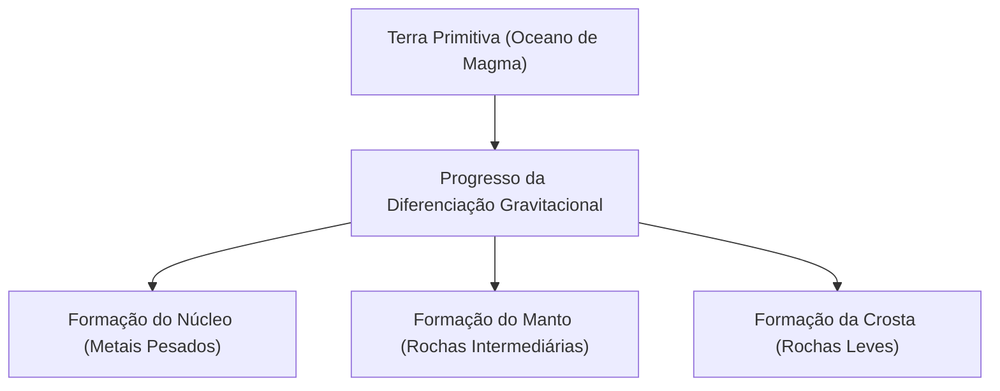

## Introdução: A Terra como uma Fábrica Química Gigante

A Terra que se estende sob nossos pés. À primeira vista, pode parecer um bloco de rocha silencioso, mas seu interior é uma fábrica química dinâmica em constante atividade. Cerca de 4,6 bilhões de anos se passaram desde o nascimento da Terra, e ela evoluiu ao longo de um período inimaginável até atingir sua forma atual.

Neste artigo, vamos ter uma visão geral da composição elementar de toda a Terra e nos aprofundar em como a estrutura de três camadas (crosta, manto e núcleo - interno e externo) se formou, e de quais componentes cada uma é constituída. Do nascimento das estrelas à diferenciação da matéria e à formação da rica superfície terrestre onde vivemos, vamos desvendar a origem de nosso planeta a partir da perspectiva da química.

## Composição Elementar Global da Terra: Os Quatro Grandes Elementos (Big Four)

Se pudéssemos colocar a Terra em um liquidificador gigante, triturá-la e analisar seus componentes, que resultados obteríamos? Na verdade, não há tantos tipos de elementos que compõem a Terra. A maior parte de sua massa é composta por apenas quatro elementos.

1. **Ferro (Fe)**: Aprox. 32,1%
2. **Oxigênio (O)**: Aprox. 30,1%
3. **Silício (Si)**: Aprox. 15,1%
4. **Magnésio (Mg)**: Aprox. 13,9%

Apenas esses quatro elementos representam **mais de 90%** da massa total da Terra. Os aproximadamente 10% restantes são compostos por oligoelementos como enxofre (2,9%), níquel (1,8%), cálcio (1,5%) e alumínio (1,4%).

### Por que há tanto ferro e oxigênio?

A razão pela qual o ferro é o elemento mais abundante na Terra remonta ao processo de formação do sistema solar. Nas reações de fusão nuclear que ocorrem no interior das estrelas, o ferro tem o núcleo atômico mais estável. Portanto, o material espalhado pelo espaço sideral devido a explosões de supernovas, entre outros eventos, era rico em ferro. Quando a Terra se formou, planetesimais contendo ferro se acumularam, razão pela qual existe uma grande quantidade de ferro na Terra.

Por outro lado, o oxigênio é o terceiro elemento mais abundante no universo e se liga facilmente ao silício, magnésio, ferro, etc., que compõem as rochas, por isso foi incorporado em grandes quantidades na forma de óxidos (rochas).

## Estrutura da Terra: História da Diferenciação

Em seus primórdios, a Terra era um oceano de magma derretido devido ao calor gerado pelo impacto de planetesimais e ao calor do decaimento de isótopos radioativos. Neste estado líquido de alta temperatura, ocorreu um fenômeno chamado '**diferenciação gravitacional**'.

Materiais pesados (principalmente ferro e níquel) afundaram para formar o centro da Terra (núcleo), enquanto materiais leves (como silicatos) subiram para formar o manto e a crosta. Por meio dessa diferenciação, a atual estrutura em camadas da Terra foi criada.

Vamos dar uma olhada mais detalhada em cada camada.

## O Núcleo: Uma Esfera Gigante de Ferro no Centro da Terra

Localizado no centro da Terra, a uma profundidade de cerca de 2.900 km a 6.371 km da superfície, encontra-se o núcleo. O núcleo representa cerca de 32% da massa total da Terra e é feito de uma liga consistindo principalmente de ferro e níquel.

O núcleo é dividido em **núcleo externo** e **núcleo interno**.

### Núcleo Externo (Outer Core)

O núcleo externo está localizado a uma profundidade de cerca de 2.900 km a 5.150 km. A temperatura é extremamente alta (cerca de 4.000 a 5.000 °C), e o ferro e o níquel estão em um estado **líquido** derretido.

Acredita-se que a convecção do metal líquido no núcleo externo gere o campo magnético da Terra (teoria do dínamo). Este campo magnético desempenha um papel crucial na proteção da vida na Terra contra raios cósmicos prejudiciais e ventos solares. Além do ferro e do níquel, estima-se que elementos mais leves, como enxofre, oxigênio e silício, representem cerca de 10% do núcleo externo.

### Núcleo Interno (Inner Core)

O núcleo interno é a região de uma profundidade de cerca de 5.150 km até o centro da Terra (6.371 km). A temperatura é ainda maior do que a do núcleo externo (cerca de 5.000 a 6.000 °C, comparável à temperatura da superfície do sol), no entanto, mantém um estado **sólido**.

Isso ocorre porque a pressão aumenta acentuadamente em direção ao centro (cerca de 3,3 a 3,6 milhões de atmosferas), e o ponto de fusão do ferro aumenta sob ambientes de pressão ultra-alta. À medida que a Terra inteira continua a esfriar, o ferro líquido do núcleo externo se solidifica gradualmente, e acredita-se que o núcleo interno continue a crescer a uma taxa de cerca de 1 mm por ano.

## O Manto: A Camada Gigante de Rocha que Compõe a Maior Parte da Terra

Abaixo da crosta, estendendo-se de dezenas de quilômetros de profundidade até cerca de 2.900 km, encontra-se o manto. O manto é a maior camada da Terra, representando cerca de 84% de seu volume e cerca de 67% de sua massa.

O manto é frequentemente confundido com um oceano de magma derretido, mas, na verdade, é feito de **rocha sólida**. Os principais componentes são 'minerais de silicato' consistindo em silício, oxigênio, magnésio, ferro, etc. O manto superior, em particular, é composto de rochas chamadas peridotitos (olivina e piroxênio).

### O Movimento Gigante da Convecção do Manto

Embora o manto seja sólido, ao longo de uma escala de tempo geológico de dezenas de milhares a centenas de milhões de anos, ele flui lentamente como um xarope (deformação plástica). Para liberar o calor interno da Terra (calor do núcleo e o calor do decaimento dos elementos radioativos) para a superfície, o manto experimenta enormes movimentos de convecção.

Esta convecção do manto é a força motriz que move as placas tectônicas na superfície terrestre e a causa raiz dos movimentos crustais, como terremotos, atividades vulcânicas e formação de montanhas (orogênese).

## A Crosta: A Fina Casca onde Vivemos

A fina camada mais externa que cobre a superfície da Terra é a 'crosta'. Em comparação com o raio da Terra (cerca de 6.371 km), a espessura da crosta é de apenas 5 a 70 km. Para usar o exemplo de uma maçã, é uma camada mais fina que a casca.

A crosta foi formada através da concentração de elementos mais leves do manto (silício, alumínio, cálcio, sódio, potássio, etc.). Embora represente menos de 1% da massa total da Terra, é um lugar importante onde existe uma diversidade de elementos essenciais para a vida.

Em termos de composição da crosta (número de Clarke), o oxigênio (cerca de 46,6%) e o silício (cerca de 27,7%) são, de longe, os mais abundantes, com esses dois representando cerca de três quartos da massa da crosta. Estes são seguidos por alumínio (cerca de 8,1%) e ferro (cerca de 5,0%).

A crosta pode ser amplamente dividida em dois tipos.

### Crosta Continental

Esta é a fundação da terra onde vivemos. A espessura média é de cerca de 30 a 40 km (até 70 km em áreas espessas, como o Planalto do Tibete). O componente principal é a rocha de silicato, como o granito, e por ser rico em silício (Si) e alumínio (Al), também é chamado de '**Sial**'. Sua densidade é relativamente leve, cerca de 2,7 g/cm³.

### Crosta Oceânica

Esta é a crosta que constitui o fundo do oceano. É fina, com cerca de 5 a 10 km de espessura, e seu componente principal é o basalto. Por ser rico em silício (Si) e magnésio (Mg), também é chamado de '**Sima**'. Por conter mais ferro e magnésio do que a crosta continental, tem uma densidade maior de cerca de 3,0 g/cm³.

## Conclusão: Um Equilíbrio Milagroso que Sustenta a Vida

A Terra é construída sobre um equilíbrio delicado: um forte campo magnético do núcleo de ferro, movimentos ativos da crosta devido ao manto em fluxo, e a crosta onde diversos elementos estão concentrados.

Se houvesse menos ferro e nenhum campo magnético, a vida teria sido queimada pelos raios cósmicos. Se não houvesse convecção do manto e movimentos crustais, os nutrientes não circulariam e a evolução da vida poderia ter estagnado.

Sob a terra que pisamos como certa, existe uma imensa história de 4,6 bilhões de anos e um drama cósmico oculto. Conhecer a estrutura interna da Terra é uma pista crucial para entender por que somos capazes de viver neste planeta.
