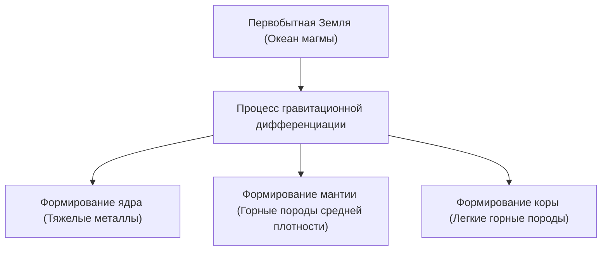

## Введение: Земля как гигантская химическая фабрика

Земля, раскинувшаяся у нас под ногами. На первый взгляд она может показаться тихим куском камня, но внутри неё — это динамичная химическая фабрика, которая постоянно активна. С момента своего рождения около 4,6 миллиардов лет назад Земля прошла через невероятное количество времени, эволюционируя до своего нынешнего состояния.

В этой статье мы подробно рассмотрим элементный состав Земли в целом и углубимся в то, как сформировалась ее трехслойная структура — кора, мантия и ядро (внешнее и внутреннее) — и из каких компонентов состоит каждый из этих слоев. От рождения звезд и дифференциации веществ до формирования богатой земной поверхности, на которой мы живем — давайте разгадаем историю формирования планеты Земля с точки зрения химии.

## Элементный состав всей Земли: Большая четверка (4 основных элемента)

Если бы мы могли поместить Землю в гигантский блендер, измельчить её в пыль и проанализировать её состав, какие бы результаты мы получили? На самом деле, элементов, из которых состоит Земля, не так уж много. Большая часть массы приходится всего на четыре элемента.

1. **Железо (Fe)**: около 32.1%
2. **Кислород (O)**: около 30.1%
3. **Кремний (Si)**: около 15.1%
4. **Магний (Mg)**: около 13.9%

Только эти четыре элемента составляют **более 90%** всей массы Земли. Оставшиеся примерно 10% состоят из микроэлементов, таких как сера (2.9%), никель (1.8%), кальций (1.5%) и алюминий (1.4%).

### Почему так много железа и кислорода?

Причина, по которой железо является самым распространенным элементом на Земле, кроется в процессе формирования Солнечной системы. В реакциях ядерного синтеза, происходящих внутри звезд, железо имеет наиболее стабильное атомное ядро. Поэтому среди вещества, рассеянного в космосе в результате взрывов сверхновых, было много железа. Когда формировалась Земля, эти железосодержащие планетезимали накапливались, в результате чего на Земле присутствует огромное количество железа.

С другой стороны, кислород является третьим по распространенности элементом во Вселенной, и поскольку он легко соединяется с кремнием, магнием, железом и другими элементами, образующими горные породы, он в больших количествах был включен в их состав в виде оксидов (горных пород).

## Структура Земли: История дифференциации

Ранняя Земля представляла собой "океан магмы", расплавленный теплом от столкновений планетезималей и теплом распада радиоактивных изотопов. В этом высокотемпературном жидком состоянии произошло явление, называемое "**гравитационной дифференциацией**".

Тяжелые вещества (в основном железо и никель) опустились, образовав центр Земли (ядро), а легкие вещества (например, силикаты) поднялись, образовав мантию и кору. В результате этой дифференциации и сформировалась нынешняя слоистая структура Земли.

Давайте теперь рассмотрим каждый слой более подробно.

## Ядро: Гигантская железная сфера в центре Земли

Ядро расположено в центре Земли, на глубине примерно от 2900 км до 6371 км от поверхности. Ядро составляет около 32% общей массы Земли и состоит в основном из сплава железа и никеля.

Ядро дополнительно делится на два слоя: **внешнее ядро** и **внутреннее ядро**.

### Внешнее ядро (Outer Core)

Внешнее ядро располагается на глубине примерно от 2900 км до 5150 км. Температура там чрезвычайно высока (около 4000-5000°C), и оно находится в состоянии **жидкости**, где железо и никель полностью расплавлены.

Считается, что магнитное поле Земли (геомагнитное поле) генерируется за счет конвекции жидкого металла во внешнем ядре (теория динамо). Это магнитное поле играет исключительно важную роль в защите жизни на Земле от вредных космических лучей и солнечного ветра. Предполагается также, что помимо железа и никеля, во внешнем ядре растворено около 10% более легких элементов, таких как сера, кислород и кремний.

### Внутреннее ядро (Inner Core)

Внутреннее ядро - это область от глубины около 5150 км до центра Земли (6371 км). Температура здесь еще выше, чем во внешнем ядре (около 5000-6000°C, что сравнимо с температурой поверхности Солнца), но, тем не менее, оно сохраняет **твердое** состояние.

Это связано с тем, что давление резко возрастает по мере приближения к центру (приблизительно 3,3 - 3,6 миллиона атмосфер), а температура плавления железа повышается в условиях сверхвысокого давления. Считается, что жидкое железо во внешнем ядре постепенно затвердевает по мере того, как Земля в целом охлаждается, и внутреннее ядро продолжает расти со скоростью около 1 мм в год.

## Мантия: Гигантский слой горных пород, составляющий большую часть Земли

Мантия простирается под земной корой, на глубинах от нескольких десятков километров до примерно 2900 км. Мантия является самым большим слоем Земли, составляя около 84% объема и 67% ее массы.

Часто ошибочно полагают, что мантия - это океан расплавленной магмы, но на самом деле она состоит из **твердых горных пород**. Основным компонентом являются "**силикатные минералы**", состоящие из кремния, кислорода, магния, железа и других элементов. В частности, верхняя мантия состоит из горной породы, называемой перидотитом (оливин и пироксен).

### Гигантское движение: Мантийная конвекция

Хотя мантия является твердой, на длительных геологических временных масштабах от десятков миллионов до сотен миллионов лет, она медленно течет, как густой сироп (пластическая деформация). Мантия осуществляет гигантское конвективное движение для отвода тепла из недр Земли (тепло от ядра и тепло от распада радиоактивных элементов) к поверхности.

Именно эта конвекция мантии является движущей силой, перемещающей поверхностные плиты (скальные породы), и фундаментальной причиной тектонических движений коры, таких как землетрясения, вулканическая активность и горообразование.

## Кора: Тонкая оболочка, на которой мы живем

Самый внешний тонкий слой, покрывающий поверхность Земли - это "земная кора". По сравнению с радиусом Земли (около 6371 км), толщина коры составляет всего лишь от 5 до 70 км. Если сравнить Землю с яблоком, то этот слой будет тоньше его кожуры.

Кора образовалась за счет концентрации более легких элементов из мантии (кремний, алюминий, кальций, натрий, калий и т.д.). Она составляет менее 1% от общей массы Земли, но является важным местом, где присутствуют разнообразные элементы, необходимые для жизни.

Если посмотреть на состав коры (числа Кларка), то кислород (около 46.6%) и кремний (около 27.7%) встречаются в подавляющем большинстве, и на эти два элемента приходится около трех четвертей массы коры. За ними следуют алюминий (около 8.1%) и железо (около 5.0%).

Существует два основных типа земной коры:

### Континентальная кора

Это фундамент участков суши, на которых мы живем. Ее средняя толщина составляет около 30-40 км (до 70 км в толстых местах, таких как Тибетское плато). Основным компонентом являются силикатные породы, такие как гранит, и, поскольку они богаты кремнием (Si) и алюминием (Al), их также называют "**Сиаль (SiAl)**". Она имеет относительно низкую плотность около 2.7 г/см³.

### Океаническая кора

Это кора, образующая дно океана. Она тонкая, около 5-10 км толщиной, и состоит в основном из базальта. Поскольку она богата кремнием (Si) и магнием (Mg), ее также называют "**Сима (SiMa)**". Поскольку она содержит больше железа и магния, чем континентальная кора, она тяжелее, с плотностью около 3.0 г/см³.

## Заключение: Чудесный баланс, взращивающий жизнь

Земля зиждется на удивительном балансе: мощное магнитное поле, создаваемое железным ядром, активные движения земной коры, вызванные текучей мантией, и кора с высокой концентрацией разнообразных элементов.

Если бы железа было меньше и не существовало бы магнитного поля, жизнь была бы выжжена космическими лучами. Если бы не было мантийной конвекции и движений земной коры, питательные вещества не циркулировали бы, и эволюция жизни могла бы остановиться.

Под землей, по которой мы привычно ступаем, скрывается невероятная история длиной в 4,6 миллиарда лет и космическая драма. Познание внутреннего строения Земли является важным ключом к пониманию того, почему мы можем жить на этой планете.
