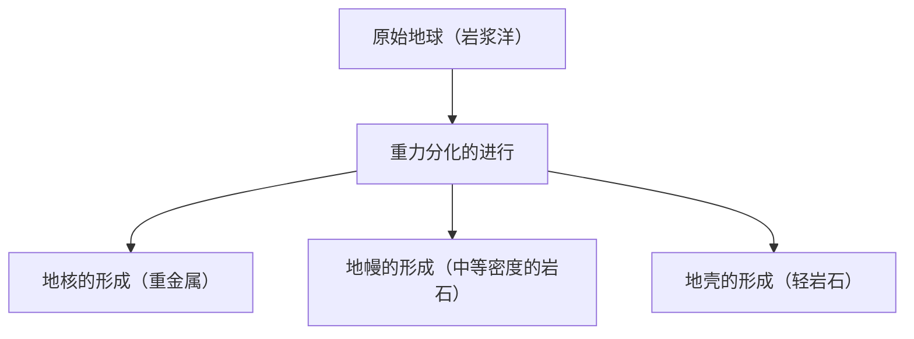

## 引言：地球这个巨大的化工厂

我们脚下广阔的地球，乍看之下可能像是一块安静的岩石，但其内部却是一个不断活动的充满动力的化工厂。地球自诞生以来的约46亿年里，经过了漫长的岁月，才演变成今天的模样。

本文将从整体上俯瞰地球的元素组成，深入探讨地壳、地幔和地核（外核、内核）这三层结构是如何形成的，以及它们分别由什么成分构成。从恒星的诞生到物质的分化，再到我们所居住的丰富地表的形成，让我们从化学的视角来揭开地球这颗行星的形成之谜。

## 地球整体的元素组成：四大元素（Big Four）

如果把地球放进一个巨大的搅拌机里粉碎，并分析其成分，会得到什么样的结果呢？实际上，构成地球的元素种类并没有那么多。其质量的绝大部分仅由四种元素占据。

1. **铁 (Fe)**: 约32.1%
2. **氧 (O)**: 约30.1%
3. **硅 (Si)**: 约15.1%
4. **镁 (Mg)**: 约13.9%

仅仅这四种元素，就占据了整个地球质量的**约90%以上**。剩下的约10%由硫 (2.9%)、镍 (1.8%)、钙 (1.5%)、铝 (1.4%) 等微量元素构成。

### 为什么铁和氧那么多？

铁是地球整体中最丰富的元素，其原因可以追溯到太阳系的形成过程。在恒星内部进行的核聚变反应中，铁拥有最稳定的原子核。因此，通过超新星爆发等散布到宇宙空间的物质中，含有丰富的铁。在地球形成时，由于这些含铁的微行星聚集在一起，所以地球上存在大量的铁。

另一方面，氧是宇宙中第三丰富的元素，因为它很容易与构成岩石的硅、镁、铁等结合，所以作为氧化物（岩石）被大量吸收进来。

## 地球的结构：分化的历史

早期的地球，由于微行星碰撞产生的热量和放射性同位素衰变产生的热量，处于一种熔融的“岩浆洋”状态。在这种高温液体状态中，发生了被称为“**重力分化**”的现象。

较重的物质（主要是铁和镍）下沉形成了地球的中心（地核），较轻的物质（硅酸盐等）上浮形成了地幔和地壳。通过这种分化，形成了现代地球的分层结构。

接下来，让我们详细看看各个圈层。

## 地核：地球中心的巨大铁球

位于地球中心部位，距离地表约2,900公里至6,371公里深处的就是地核。地核占据了整个地球质量的约32%，主要由铁和镍组成的合金构成。

地核可以进一步分为**外核**和**内核**两部分。

### 外核（Outer Core）

外核位于地下约2,900公里至5,150公里的深处。温度非常高（约4,000至5,000℃），铁和镍处于熔融的**液体**状态。

人们认为，外核中液态金属的对流产生了地球的磁场（地磁）。这个磁场在保护地球上的生命免受有害的宇宙射线和太阳风侵害方面，发挥着极其重要的作用。此外，据推测，外核中除了铁和镍之外，还溶解了约10%的硫、氧、硅等轻元素。

### 内核（Inner Core）

内核是从地下约5,150公里深处到地球中心（6,371公里）的区域。这里的温度比外核还要高（约5,000至6,000℃，与太阳表面温度相当），尽管如此，它却保持着**固体**状态。

这是因为越向中心，压力急剧增加（约330万至360万大气压），在超高压环境下，铁的熔点会上升。随着整个地球的持续冷却，现在外核中的液态铁仍在逐渐凝固，据认为内核正以每年约1毫米的速度持续生长。

## 地幔：占据地球大部分的巨大岩石层

地壳之下，从地下几十公里延伸至约2,900公里深处的就是地幔。地幔占地球体积的约84%，质量的约67%，是地球最大的圈层。

人们常常误以为地幔是熔融的岩浆海洋，但实际上它是由**固态岩石**构成的。主要成分是由硅、氧、镁、铁等组成的“**硅酸盐矿物**”。特别是上地幔，由被称为橄榄岩（橄榄石和辉石）的岩石构成。

### 地幔对流这一巨大的运动

虽然地幔是固体，但在数万年至数亿年的地质学漫长时间尺度下来看，它会像麦芽糖一样缓慢流动（塑性变形）。为了将地球内部的热量（来自地核的热量和放射性元素衰变产生的热量）散发到地表，地幔发生了巨大的对流运动。

这种地幔对流正是推动地表板块（岩层）运动的动力，也是引起地震、火山活动、造山运动等地壳变动的根本原因。

## 地壳：我们居住的薄壳

覆盖在地球表面，最外层的薄层就是“地壳”。相对于地球的半径（约6,371公里），地壳的厚度只有约5到70公里。如果把地球比作苹果，地壳比苹果皮还要薄。

地壳是由地幔中更轻的元素（硅、铝、钙、钠、钾等）富集形成的。虽然它只占整个地球质量的不到1%，但这里存在着生命所必需的多种元素，是一个非常重要的地方。

从地壳的组成（克拉克值）来看，氧（约46.6%）和硅（约27.7%）占绝对优势，这两种元素占据了地壳质量的约四分之三。其次是铝（约8.1%）和铁（约5.0%）。

地壳大致可以分为两种类型。

### 大陆地壳

这是我们居住的陆地的地基部分。平均厚度约为30到40公里（在青藏高原等较厚的地方可达70公里）。主要成分是花岗岩等硅酸盐岩石，由于富含硅（Si）和铝（Al），也被称为“**硅铝层 (SiAl)**”。密度相对较小，约为2.7 g/cm³。

### 海洋地壳

构成海底的地壳。厚度较薄，约为5到10公里，主要成分是玄武岩。由于富含硅（Si）和镁（Mg），也被称为“**硅镁层 (SiMa)**”。因为含有比大陆地壳更多的铁和镁，所以密度较大，约为3.0 g/cm³。

## 结语：孕育生命的奇迹平衡

地球建立在一种绝妙的平衡之上：由铁质地核产生的强大磁场、由流动的地幔引起的活跃地壳变动，以及富集了多种元素的地壳。

如果没有足够的铁，没有磁场的存在，生命可能早已被宇宙射线燃烧殆尽。如果没有地幔对流，没有地壳变动，营养盐就无法循环，生命的进化可能就会停滞不前。

在我们视为理所当然踏在脚下的大地深处，隐藏着46亿年不可思议的历史和宇宙的剧目。了解地球的内部结构，是弄清我们为什么能在这颗星球上生存的重要线索。
