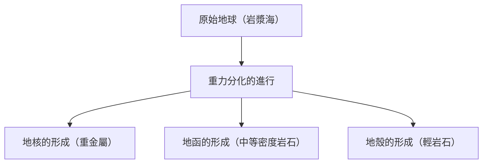

## 簡介：地球這座巨大的化學工廠

在我們腳下延伸的地球。乍看之下，它可能像是一塊安靜的岩石，但其內部卻是一座不斷持續活動的動態化學工廠。自地球誕生以來的約 46 億年間，它經歷了漫長的歲月，演化成如今的樣貌。

本文將鳥瞰地球整體的元素組成，並深入探討地殼、地函與地核（外核、内核）這三層結構是如何形成的，以及它們各自是由什麼樣的成分所構成。從星體的誕生到物質的分化，乃至我們所居住的豐饒地表的形成，讓我們從化學的視角來解開地球這顆星體的形成之謎。

## 地球整體的元素組成：四大元素 (Big Four)

如果將地球放進巨大的果汁機裡打碎，並分析其成分，會得到什麼樣的結果呢？事實上，構成地球的元素種類並不多。其質量的絕大部分，僅由四種元素所佔據。

1. **鐵 (Fe)**: 約 32.1%
2. **氧 (O)**: 約 30.1%
3. **矽 (Si)**: 約 15.1%
4. **鎂 (Mg)**: 約 13.9%

僅僅這四種元素，就佔了地球整體質量的**約 90% 以上**。剩下的約 10%，則由硫 (2.9%)、鎳 (1.8%)、鈣 (1.5%)、鋁 (1.4%) 等微量元素所構成。

### 為什麼鐵和氧特別多？

鐵成為地球整體含量最多的元素，其原因可以追溯到太陽系的形成過程。在恆星內部進行的核融合反應中，鐵擁有最穩定的原子核。因此，在超新星爆炸等事件中散佈到宇宙空間的物質裡，就含有豐富的鐵。在地球形成時，由於這些含鐵的微行星聚集，使得地球上存在著大量的鐵。

另一方面，氧是宇宙中含量第三豐富的元素，且容易與構成岩石的矽、鎂、鐵等結合，因此作為氧化物（岩石）被大量地吸收到地球中。

## 地球的結構：分化的歷史

早期的地球，因為微行星撞擊的熱能以及放射性同位素的衰變熱，呈現著熔融狀態的「岩漿海」(Magma Ocean)。在這種高溫的液體狀態中，發生了稱為「**重力分化**」的現象。

較重的物質（主要是鐵和鎳）下沉並形成地球的中心（地核），而較輕的物質（如矽酸鹽等）則浮起並形成地函和地殼。透過這種分化，造就了現今地球的層狀結構。

接下來，讓我們詳細看看各個分層。

## 地核 (Core)：位於地球中心的巨大鐵球

位於地球中心部，距離地表約 2,900 公里至 6,371 公里深處的就是地核。地核約佔地球整體質量的 32%，主要由鐵和鎳組成的合金構成。

地核可進一步分為**外核**與**内核**兩部分。

### 外核 (Outer Core)

外核位於深度約 2,900 公里至 5,150 公里處。溫度極高（約 4,000〜5,000℃），鐵和鎳處於熔融的**液體**狀態。

一般認為，外核液體金屬的對流產生了地球的磁場（地磁）（發電機理論）。這個磁場扮演著非常重要的角色，保護地球上的生命免受有害宇宙射線和太陽風的侵襲。此外，據推測外核除了鐵和鎳之外，還溶入了約 10% 的硫、氧、矽等較輕元素。

### 内核 (Inner Core)

内核是深度約 5,150 公里至地球中心（6,371 公里）的區域。儘管溫度比外核更高（約 5,000〜6,000℃，足以媲美太陽表面溫度），但它卻保持著**固體**狀態。

這是因為越往中心，壓力急遽升高（約 330 萬〜360 萬大氣壓），在超高壓環境下鐵的熔點會上升。人們認為，隨著地球整體的冷卻，外核的液態鐵至今仍在逐漸凝固，内核正以每年約 1 毫米的速度持續成長。

## 地函 (Mantle)：佔據地球絕大部分的巨大岩石層

位於地殼下方，從深度數十公里延伸至約 2,900 公里處的範圍便是地函。地函佔了地球體積的約 84%、質量的約 67%，是地球最大的分層。

人們經常誤以為地函是熔融狀態的岩漿海，但實際上它是由**固態岩石**所構成。主要成分是由矽、氧、鎂、鐵等組成的「**矽酸鹽礦物**」。特別是上部地函，是由被稱為橄欖岩（橄欖石和輝石）的岩石所構成。

### 地函對流這項巨大的運動

雖然地函是固體，但從數萬年到數億年這種地質學的漫長時間尺度來看，它會像麥芽糖一樣緩慢流動（塑性變形）。為了將地球內部的熱能（來自地核的熱以及放射性元素的衰變熱）散發到地表，地函會產生巨大的對流運動。

這種地函對流正是推動地表板塊（岩盤）的動力，也是引發地震、火山活動、造山運動等地殼變動的根本原因。

## 地殼 (Crust)：我們居住的薄殼

覆蓋在地球表面，最外層的薄層就是「地殼」。相對於地球的半徑（約 6,371 公里），地殼的厚度僅有約 5〜70 公里。若以蘋果來比喻，它是一層比蘋果皮還要薄的分層。

地殼是由地函中更輕的元素（矽、鋁、鈣、鈉、鉀等）富集而形成的。雖然僅佔地球整體質量不到 1%，但卻是存在著對生命不可或缺的各種元素的重要場所。

從地殼的組成（克拉克值）來看，氧（約 46.6%）和矽（約 27.7%）佔了壓倒性的多數，這兩者就佔了地殼質量約四分之三。其次是鋁（約 8.1%）和鐵（約 5.0%）。

地殼大致可分為兩種類型。

### 大陸地殼

這是我們所居住的陸地基底部分。平均厚度約為 30〜40 公里（在西藏高原等較厚的地方可達 70 公里）。主要成分是花崗岩等矽酸鹽岩石，由於富含矽 (Si) 和鋁 (Al)，因此也被稱為「**矽鋁層 (SiAl)**」。密度約為 2.7 g/cm³，相對較輕。

### 海洋地殼

構成海底的地殼。厚度較薄，約為 5〜10 公里，主要成分是玄武岩。由於富含矽 (Si) 和鎂 (Mg)，因此也被稱為「**矽鎂層 (SiMa)**」。因為比大陸地殼含有更多的鐵和鎂，所以密度較重，約為 3.0 g/cm³。

## 結語：孕育生命的奇蹟平衡

地球之所以能夠存在，是建立在絕妙的平衡之上：鐵質地核所產生的強大磁場、流動的地函所帶來的活躍地殼變動，以及富集了多種元素的地殼。

如果鐵含量較少、磁場不存在的話，生命恐怕早已被宇宙射線燃燒殆盡。如果沒有地函對流和地殼變動，營養鹽就無法循環，生命的演化可能也會因此停滯。

在我們理所當然踩踏的大地之下，隱藏著 46 億年的漫長歷史以及宇宙的戲劇性演變。了解地球的內部結構，正是讓我們明白為何能夠在這顆星球上生存的重要線索。
