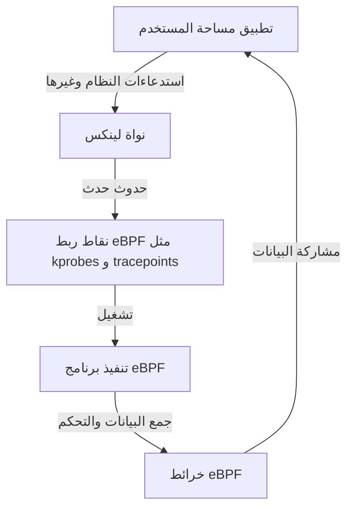

# مقدمة إلى eBPF: آلية مراقبة والتحكم في نواة لينكس دون تعديلها

في البيئات السحابية الأصلية (cloud-native) الحديثة والبنى التحتية متزايدة التعقيد، من المهم للغاية أن نفهم بدقة ما يحدث داخل النظام. ومن بين التقنيات التي جذبت أكبر قدر من الاهتمام في السنوات الأخيرة تقنية "eBPF (Extended Berkeley Packet Filter)".

في هذه المقالة، سنتعمق في المفاهيم الأساسية لتقنية eBPF، وكيف تحقق توسعاً ديناميكياً للوظائف مع الحفاظ على أمان النواة (kernel)، وكيف يتم استخدامها في مجالات متنوعة مثل قابلية المراقبة (observability)، الشبكات، والأمان.

## 1. تحديات توسيع نواة لينكس التقليدية

تعمل نواة لينكس باعتبارها القلب النابض لنظام التشغيل، حيث تتحكم في جميع عمليات النظام مثل إدارة الأجهزة، جدولة العمليات، واتصالات الشبكة. لفهم سلوك النظام والتحكم فيه بشكل عميق، لا غنى عن الوصول إلى داخل النواة. ومع ذلك، واجهت الطرق التقليدية عدة عقبات كبيرة.

### مشاكل وحدات النواة (Kernel Modules)

في الماضي، كانت الوسيلة الأساسية لتوسيع وظائف النواة أو إجراء تتبع عميق (tracing) هي كتابة وتحميل وحدة نواة قابلة للتحميل (Loadable Kernel Module: LKM). ومع ذلك، يحمل هذا النهج المخاطر والتحديات القاتلة التالية:

1. **خطر الانهيار (Kernel Panic)**
   لا توجد آلية حماية للذاكرة في مساحة النواة (kernel space) كما هو الحال في مساحة المستخدم (user space). إذا كان هناك خطأ (bug) في وحدة النواة (مثل: الإشارة إلى مؤشر فارغ (NULL pointer)، تسرب الذاكرة، حلقة لا نهائية)، فسوف ينهار النظام بأكمله على الفور، مما يتسبب في حدوث ذعر في النواة (kernel panic). إذا حدث هذا في بيئة الإنتاج، فهذا يعني توقف الخدمة بالكامل.
2. **الثغرات الأمنية**
   إذا تم تنفيذ كود ضار أو كود ضعيف في مساحة النواة، فهناك خطر فقدان التحكم في النظام بأكمله. تستغل العديد من البرامج الخبيثة (Rootkits) هذه الآلية.
3. **تعقيد الصيانة**
   تعتمد وحدات النواة بشكل كبير على إصدارات محددة من النواة. في كل مرة يتم فيها تحديث إصدار نواة لينكس، قد تتغير واجهات برمجة التطبيقات (APIs) وهياكل البيانات، ومتابعة ذلك وتحديث وإعادة تجميع الوحدات بشكل مستمر يعتبر مكلفاً للغاية.

لهذه الأسباب، كانت هناك حاجة ماسة لآلية آمنة ومرنة لمراقبة والتحكم في سلوك النواة دون التعديل المباشر على كود النواة. وهنا ظهرت تقنية eBPF.

## 2. ما هي eBPF؟

تقنية eBPF (Extended Berkeley Packet Filter) هي تقنية مبتكرة لتشغيل برامج معزولة (sandboxed) بأمان داخل نواة لينكس. يُشار إليها أحياناً بـ "جافا سكريبت الخاصة بلينكس (JavaScript for Linux)". تماماً كما ينفذ متصفح الويب جافا سكريبت لتحويل HTML الثابت إلى تطبيق ويب ديناميكي، تحول تقنية eBPF نواة لينكس إلى منصة قابلة للبرمجة بشكل ديناميكي.

### التطور من BPF إلى eBPF

تم تصميم "BPF (Berkeley Packet Filter)" الأصلي في عام 1992 بهدف تصفية حزم الشبكة (network packets) بكفاءة (يُستخدم في أدوات مثل tcpdump).
في حوالي عام 2014، تم توسيع بنية BPF هذه بشكل كبير (Extended)، مما أتاح ربطها وتنفيذها ليس فقط لتصفية الحزم، بل على أي حدث في النظام، مثل استدعاءات النظام (system calls)، وظائف النواة (kernel functions)، ووظائف مساحة المستخدم (user space functions). في الوقت الحاضر، عندما نشير ببساطة إلى "eBPF" أو "BPF"، فإننا نعني عموماً هذا الإصدار الموسع.



## 3. معمارية eBPF: التوازن بين الأمان والسرعة

ما يجعل eBPF مبتكرة هو أنها تجمع بين **"الأمان المطلق" و "سرعة التنفيذ القريبة من الكود الأصلي"**. دعونا نلقي نظرة على المكونات الرئيسية التي تحقق ذلك.

### 3.1. الرمز الثنائي (Bytecode) وصندوق الحماية (Sandbox)

تتم كتابة برامج eBPF بمجموعة فرعية من لغة C أو Rust، ويتم تجميعها بواسطة مترجم LLVM/Clang إلى "رمز ثنائي eBPF" مخصص. يتم تحميل هذا الرمز الثنائي من مساحة المستخدم إلى مساحة النواة، ولكنه لا يُنفذ مباشرة. بل يُنفذ في بيئة معزولة (صندوق حماية) داخل النواة.

### 3.2. الفحص الصارم بواسطة أداة التحقق (Verifier)

أهم مكون يضمن أمان eBPF هو "أداة التحقق (Verifier)". عند تحميل البرنامج إلى النواة، تقوم أداة التحقق بتحليل الرمز الثنائي بشكل ثابت وتتحقق مما إذا كان يستوفي شروطاً صارمة مثل:

- **عدم وجود حلقات لا نهائية (Infinite loops)** (يجب إثبات أن البرنامج سينتهي لمنع تجمد النظام. في النوى الحديثة، يُسمح بالحلقات المحدودة).
- **عدم وجود وصول إلى ذاكرة غير مهيأة**.
- **عدم وجود وصول إلى مناطق ذاكرة النواة غير المصرح بها**.
- **عدم تجاوز حدود حجم البرنامج**.

أي برنامج تعتبره أداة التحقق "غير آمن" يُرفض تحميله. هذا يمنع حدوث ذعر النواة.

### 3.3. تسريع التنفيذ عبر مترجم JIT (Just-In-Time)

بمجرد اجتياز الرمز الثنائي لفحص أداة التحقق، يقوم "مترجم JIT" داخل النواة بتحويله إلى كود الآلة الأصلي (native machine code) الخاص بهيكلية المعالج (CPU) للجهاز المضيف (مثل x86_64، ARM64).
نظراً لأنه يتم تنفيذه ككود أصلي بدلاً من كونه مترجماً (interpreted)، فإنه يقدم أداءً عالياً جداً يضاهي وحدات النواة (kernel modules).

### 3.4. مشاركة البيانات عبر خرائط eBPF (eBPF Maps)

برامج eBPF نفسها هي عمليات قصيرة وعديمة الحالة (stateless)، ولكنها تحتاج إلى تمرير البيانات المجمعة إلى التطبيقات في مساحة المستخدم أو الحفاظ على الحالة عبر عمليات تنفيذ متعددة. لتحقيق ذلك، يتم توفير "خرائط eBPF".
وهي عبارة عن مخازن للمفتاح والقيمة (key-value stores) توفر هياكل بيانات مثل جداول التجزئة (hash tables)، المصفوفات، والمخازن المؤقتة الحلقية (ring buffers)، ويمكن الوصول إليها بشكل غير متزامن من كل من مساحة النواة ومساحة المستخدم.

## 4. قابلية المراقبة (Observability) والتتبع (Tracing)

أحد أكثر حالات الاستخدام شيوعاً لـ eBPF هو تحسين قابلية المراقبة، مثل تحليل أداء النظام وتصحيح الأخطاء (debugging). يمكنك الارتباط ديناميكياً بوظائف النواة أو استدعاءات النظام للحصول على بيانات مفصلة في الوقت الفعلي.

### kprobes و uprobes

تستخدم تقنية eBPF بشكل أساسي الآليات التالية لالتقاط الأحداث (hook):
- **kprobes (Kernel Probes):** ترتبط ديناميكياً بأي استدعاء لوظيفة في مساحة النواة (نقطة الدخول ونقطة العودة).
- **uprobes (User Probes):** ترتبط ديناميكياً بالوظائف داخل تطبيقات مساحة المستخدم (الثنائيات المكتوبة بلغات مجمعة مثل C و C++ و Go).
- **Tracepoints:** هي نقاط ارتباط ثابتة محددة مسبقاً من قبل مطوري النواة. وتتميز باستقرار ABI أعلى من kprobes.

### BCC و bpftrace

كتابة برامج eBPF من الصفر بلغة C وتنفيذ المُحمِّل يتطلب جهداً كبيراً. لذلك، تُستخدم أدوات الواجهة الأمامية مثل "BCC (BPF Compiler Collection)" و "bpftrace" على نطاق واسع.

**مثال على bpftrace:**
على سبيل المثال، إذا كنت ترغب في مراقبة الملفات التي يتم فتحها حالياً في النظام بأكمله (استدعاء النظام `openat`)، يمكنك تحقيق ذلك بسطر واحد من السكربت باستخدام bpftrace.

```bash
sudo bpftrace -e 'tracepoint:syscalls:sys_enter_openat { printf("%s %s\n", comm, str(args->filename)); }'
```
يتم تجميع هذا السكربت داخلياً إلى برنامج eBPF، وتحميله في النواة وتنفيذه. سيتم إخراج اسم العملية (`comm`) واسم الملف المفتوح في الوقت الفعلي. القدرة على القيام بهذا المستوى من العمليات بأمان دون الحاجة إلى وحدة نواة يوضح قوة eBPF.

## 5. ثورة في الشبكات والأمان (مثل Cilium)

بالإضافة إلى قابلية المراقبة، تُحدث تقنية eBPF تحولاً جذرياً في مجالي الشبكات والأمان. تتجلى قيمتها الحقيقية بشكل خاص في بيئات الحاويات (container environments) مثل Kubernetes.

### XDP (eXpress Data Path)

في حزمة الشبكة (network stack)، XDP هي آلية تتيح تنفيذ برامج eBPF في مرحلة مبكرة جداً (على مستوى تعريف بطاقة الشبكة). نظراً لأنها تعالج الحزم (packets) قبل أن تقوم النواة بتحليلها أو توجيهها (مثل تخصيص sk_buff)، فإنها تحقق إنتاجية هائلة (throughput).
تُستخدم هذه الآلية في الدفاع ضد هجمات حجب الخدمة الموزعة (DDoS) وتطوير موازنات تحميل (load balancers) فائقة السرعة. تتيح التحكم القابل للبرمجة في إسقاط الحزم (DROP)، أو نقلها (TX)، أو تمريرها (PASS) إلى حزمة الشبكة العادية.

### شبكة الخدمات (Service Mesh) و Cilium

تم تحقيق الاتصال بين الحاويات في Kubernetes التقليدي من خلال قواعد توجيه معقدة باستخدام iptables. ومع ذلك، مع توسع حجم الخدمات، تصبح قواعد iptables التي قد تصل لعشرات الآلاف من الأسطر عنق زجاجة للأداء، وتصل إدارتها إلى أقصى حدودها.

وهنا ظهرت إضافات CNI (Container Network Interface) المعتمدة على eBPF مثل "Cilium". تتجاوز Cilium أداة iptables تماماً، وتستخدم eBPF لتنفيذ توجيه الحزم، وموازنة التحميل، وتطبيق سياسات الأمان مباشرة داخل النواة.
بالإضافة إلى مستوى TCP/IP، فإنها توفر أيضاً إمكانية رؤية والتحكم في الطبقة السابعة L7 (مثل HTTP، gRPC، Kafka) من خلال إعادة توجيه حركة المرور بشكل شفاف إلى وكلاء جانبيين (sidecar proxies مثل Envoy)، مما يشكل التكنولوجيا الأساسية لشبكة الخدمات (service mesh) من الجيل التالي.

## 6. مستقبل eBPF والنظام البيئي (Ecosystem)

يتوسع النظام البيئي لتقنية eBPF حالياً بسرعة. تقوم شركات التكنولوجيا العملاقة مثل جوجل، ميتا، ونتفليكس بتشغيل eBPF في بيئات الإنتاج الخاصة بها، وتستمر في المساهمة في مجتمع المصادر المفتوحة.

- **Tetragon:** أداة لمراقبة الأمان مشتقة من مشروع Cilium. تقوم بمراقبة تنفيذ العمليات والوصول إلى الملفات على مستوى النواة في الوقت الفعلي، وتحظر السلوكيات التي تنتهك السياسات.
- **Pixie:** منصة قابلة للمراقبة (observability) في Kubernetes موجهة للمطورين. تقوم تلقائياً بجمع المقاييس (metrics)، والتتبعات (traces)، والملفات الشخصية (profiles) للتطبيقات دون تعديل الكود.
- **المنفذ إلى نظام Windows:** تحت رعاية مؤسسة eBPF Foundation، يجري العمل على مشروع "eBPF for Windows"، ومن المتوقع أن تصبح في المستقبل تقنية عابرة للمنصات (cross-platform) حيث يمكن تشغيل برامج eBPF المشتركة ليس فقط على لينكس ولكن أيضاً على نواة نظام Windows.

## 7. الخلاصة

eBPF ليست مجرد ميزة إضافية، بل هي تقنية منصة تُغيّر بشكل جذري كيفية تفاعل مساحة المستخدم مع نواة نظام التشغيل. آلية حقن البرامج ديناميكياً دون المساس بأمان واستقرار النواة أصبحت الآن أداة لا غنى عنها لتحسين الأداء، استكشاف الأخطاء وإصلاحها بشكل مفصل، التحكم المتقدم في الشبكات، وتنفيذ أمان انعدام الثقة (zero-trust security).

مع تطور التقنيات السحابية الأصلية، من المتوقع أن يزداد نطاق تطبيقات eBPF بشكل أكبر. بالنسبة للمهندسين المهتمين بمبادئ التشغيل العميقة للينكس، يُعد تعلم eBPF استثماراً مجزياً للغاية سيرتقي بفهمهم للنظام إلى مستوى أعلى بكثير.
