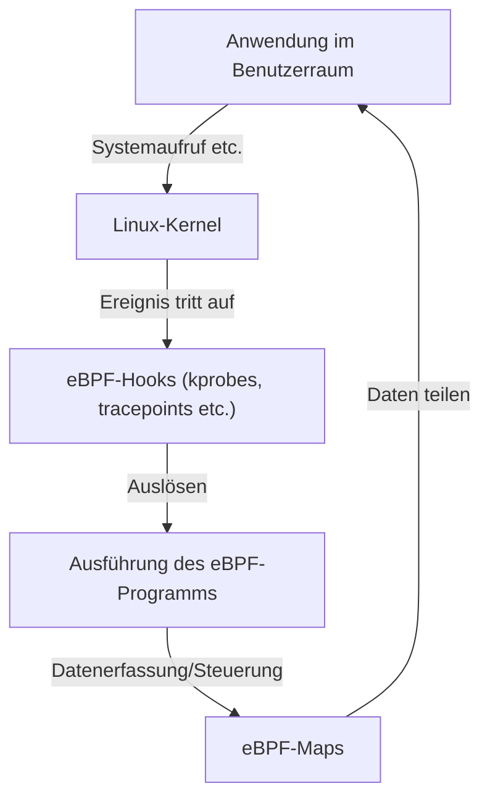

# Einführung in eBPF: Mechanismus zur Beobachtung und Steuerung ohne Änderung des Linux-Kernels

In modernen Cloud-nativen Umgebungen und zunehmend komplexen Infrastrukturen ist es extrem wichtig, genau zu verstehen, was im Inneren des Systems passiert. In diesem Zusammenhang ist "eBPF (Extended Berkeley Packet Filter)" eine der Technologien, die in den letzten Jahren am meisten Aufmerksamkeit erregt hat.

In diesem Artikel werden wir tief in die grundlegenden Konzepte von eBPF eintauchen, wie es dynamische Funktionserweiterungen ermöglicht und gleichzeitig die Sicherheit des Kernels aufrechterhält, und wie es in einer Vielzahl von Bereichen wie Observability (Beobachtbarkeit), Networking und Sicherheit eingesetzt wird.

## 1. Herausforderungen bei der herkömmlichen Erweiterung des Linux-Kernels

Der Linux-Kernel fungiert als Herzstück des Betriebssystems und steuert alle Systemoperationen, einschließlich Hardware-Management, Prozess-Scheduling und Netzwerkkommunikation. Um das Systemverhalten tiefgehend zu verstehen und zu steuern, ist der Zugriff auf das Innere des Kernels unerlässlich. Traditionelle Methoden stießen jedoch auf einige große Hindernisse.

### Probleme von Kernel-Modulen

Früher bestand das Hauptmittel zur Erweiterung der Kernel-Funktionalität oder zur Durchführung von tiefem Tracing darin, eigene ladbare Kernel-Module (Loadable Kernel Module: LKM) zu erstellen und zu integrieren. Dieser Ansatz war jedoch mit den folgenden fatalen Risiken und Herausforderungen verbunden:

1. **Risiko von Abstürzen (Kernel Panic)**
   Im Kernel-Raum (Kernel Space) gibt es keinen Speicherschutz wie im Benutzer-Raum (User Space). Wenn ein Kernel-Modul einen Fehler enthält (z. B. Dereferenzierung von NULL-Zeigern, Speicherlecks, Endlosschleifen), stürzt das gesamte System sofort ab und verursacht eine Kernel-Panik (Kernel Panic). Tritt dies in einer Produktionsumgebung auf, bedeutet dies einen vollständigen Ausfall des Dienstes.
2. **Sicherheitslücken**
   Die Ausführung von bösartigem oder anfälligem Code im Kernel-Raum birgt die Gefahr, dass die Kontrolle über das gesamte System übernommen wird. Viele Rootkits nutzen diesen Mechanismus aus.
3. **Komplexität der Wartung**
   Kernel-Module sind stark von bestimmten Kernel-Versionen abhängig. Bei jedem Versions-Upgrade des Linux-Kernels können sich APIs oder Datenstrukturen ändern, was es sehr kostspielig macht, Module kontinuierlich zu aktualisieren und neu zu kompilieren, um damit Schritt zu halten.

Aus diesen Gründen bestand ein starkes Bedürfnis nach einem Mechanismus zur sicheren und flexiblen Überwachung und Steuerung des Kernel-Verhaltens, ohne den Kernel-Code direkt zu verändern. Hier kommt eBPF ins Spiel.

## 2. Was ist eBPF?

eBPF (Extended Berkeley Packet Filter) ist eine revolutionäre Technologie zur sicheren Ausführung von Programmen in einer Sandbox-Umgebung im Linux-Kernel. Manchmal wird es auch als "JavaScript im Linux-Kernel" bezeichnet. So wie Webbrowser JavaScript ausführen, um statisches HTML in dynamische Webanwendungen zu verwandeln, macht eBPF den Linux-Kernel zu einer dynamisch programmierbaren Plattform.

### Entwicklung von BPF zu eBPF

Der ursprüngliche "BPF (Berkeley Packet Filter)" wurde 1992 entwickelt, um Netzwerkpakete effizient zu filtern (wird unter anderem von tcpdump verwendet).
Um 2014 wurde die Architektur dieses BPF erheblich erweitert (Extended), sodass er an alle Systemereignisse, wie Systemaufrufe, Kernel-Funktionen, User-Space-Funktionen und nicht nur an die Paketfilterung, angehängt und dort ausgeführt werden konnte. Heutzutage wird mit den Begriffen "eBPF" oder einfach "BPF" im Allgemeinen diese erweiterte Version bezeichnet.



## 3. Architektur von eBPF: Gleichgewicht zwischen Sicherheit und Geschwindigkeit

Das Revolutionäre an eBPF ist die Kombination aus **"absoluter Sicherheit" und "Ausführungsgeschwindigkeit, die nativem Code nahekommt"**. Lassen Sie uns die wichtigsten Komponenten ansehen, die dies ermöglichen.

### 3.1. Bytecode und Sandbox

eBPF-Programme werden in einer Teilmenge von C oder in Rust geschrieben und vom LLVM/Clang-Compiler in speziellen "eBPF-Bytecode" kompiliert. Dieser Bytecode wird vom Benutzerraum in den Kernel-Raum geladen, aber nicht direkt ausgeführt. Er wird in einer isolierten Sandbox-Umgebung innerhalb des Kernels ausgeführt.

### 3.2. Strenge Prüfung durch den Verifier (Verifizierer)

Die wichtigste Komponente zur Gewährleistung der Sicherheit von eBPF ist der "Verifier (Verifizierer)". Wenn ein Programm in den Kernel geladen wird, der Verifier führt eine statische Analyse des Bytecodes durch und prüft, ob er strenge Bedingungen wie die folgenden erfüllt:

- **Keine Endlosschleifen** (Es muss bewiesen werden, dass das Programm immer beendet wird, damit das System nicht einfriert. In neueren Kerneln sind begrenzte Schleifen erlaubt)
- **Kein Zugriff auf nicht initialisierten Speicher**
- **Kein Zugriff auf nicht autorisierte Kernel-Speicherbereiche**
- **Die Größenbeschränkungen für das Programm werden nicht überschritten**

Wenn der Verifier entscheidet, dass ein Programm "nicht sicher" ist, wird das Laden verweigert. Dies verhindert Kernel Panics.

### 3.3. Beschleunigung durch JIT-Compiler

Der vom Verifier geprüfte Bytecode wird dann vom "JIT-Compiler (Just-In-Time)" im Kernel in den nativen Maschinencode der Host-CPU-Architektur (x86_64, ARM64 usw.) übersetzt.
Da er als nativer Code und nicht von einem Interpreter ausgeführt wird, bietet er eine extrem hohe Leistung, die mit der von Kernel-Modulen vergleichbar ist.

### 3.4. Datenaustausch durch eBPF-Maps

eBPF-Programme selbst sind kurze zustandslose Prozesse. Es ist jedoch oft notwendig, die gesammelten Daten an Anwendungen im Benutzerraum weiterzugeben oder den Zustand über mehrere Ausführungen hinweg beizubehalten. Hierfür sind die "eBPF Maps" vorgesehen.
Es handelt sich um Schlüssel-Wert-Speicher (Key-Value-Stores), die Datenstrukturen wie Hash-Tabellen, Arrays und Ringpuffer bereitstellen. Auf sie kann asynchron sowohl vom Kernel- als auch vom Benutzerraum aus zugegriffen werden.

## 4. Observability (Beobachtbarkeit) und Tracing

Einer der populärsten Anwendungsfälle für eBPF ist die Verbesserung der Observability, z. B. durch Leistungsanalysen und System-Debugging. Indem es dynamisch an Kernel-Funktionen oder Systemaufrufe angehängt wird, können detaillierte Daten in Echtzeit erfasst werden.

### kprobes und uprobes

eBPF verwendet hauptsächlich die folgenden Mechanismen, um sich in Ereignisse einzuhaken (Hooking):
- **kprobes (Kernel Probes):** Hängt sich dynamisch an beliebige Funktionsaufrufe (Einstiegspunkte und Rückkehrpunkte) im Kernel-Raum.
- **uprobes (User Probes):** Hängt sich dynamisch an Funktionen innerhalb von Anwendungen im Benutzerraum (Binärdateien, die in kompilierten Sprachen wie C, C++ oder Go geschrieben sind).
- **Tracepoints:** Statische Hook-Punkte, die von Kernel-Entwicklern vordefiniert wurden. Sie zeichnen sich durch eine höhere ABI-Stabilität als kprobes aus.

### BCC und bpftrace

Das Schreiben von eBPF-Programmen von Grund auf in C und das Implementieren des Loaders ist sehr aufwendig. Daher sind Frontend-Tools wie "BCC (BPF Compiler Collection)" und "bpftrace" weit verbreitet.

**Beispiel mit bpftrace:**
Wenn Sie beispielsweise systemweit alle aktuell geöffneten Dateien (Systemaufruf `openat`) überwachen möchten, können Sie dies mit bpftrace durch folgendes Einzeiler-Skript erreichen:

```bash
sudo bpftrace -e 'tracepoint:syscalls:sys_enter_openat { printf("%s %s\n", comm, str(args->filename)); }'
```
Dieses Skript wird intern in ein eBPF-Programm kompiliert, in den Kernel geladen und ausgeführt. Der Prozessname (`comm`) und der Name der geöffneten Datei werden in Echtzeit ausgegeben. Dass dies ohne Kernel-Module und absolut sicher durchgeführt werden kann, verdeutlicht die Mächtigkeit von eBPF.

## 5. Revolution in Netzwerk und Sicherheit (Cilium etc.)

Neben der Observability sorgt eBPF auch in den Bereichen Netzwerk und Sicherheit für einen Paradigmenwechsel. Insbesondere in Container-Umgebungen wie Kubernetes zeigt sich sein wahrer Wert.

### XDP (eXpress Data Path)

XDP ist ein Mechanismus zur Ausführung von eBPF-Programmen im frühestmöglichen Stadium des Netzwerk-Stacks (auf der Treiberebene der Netzwerkkarte). Da Pakete verarbeitet werden können, bevor der Kernel sie analysiert oder routet (z. B. Zuweisung von sk_buff), bietet es einen enormen Durchsatz.
Es wird zur Abwehr von DDoS-Angriffen und zur Entwicklung superschneller Load Balancer eingesetzt. Es ermöglicht die programmierbare Steuerung von Paketen: Verwerfen (DROP), Senden (TX) oder Weiterleiten an den normalen Netzwerk-Stack (PASS).

### Service Mesh und Cilium

Die Container-zu-Container-Kommunikation in traditionellem Kubernetes wurde durch komplexe Routing-Regeln mit iptables realisiert. Wenn jedoch der Umfang des Dienstes wächst, werden Zehntausende von iptables-Regeln zu einem Leistungsengpass, und die Verwaltung stößt an ihre Grenzen.

Hier tauchten eBPF-basierte CNI-Plugins (Container Network Interface) wie "Cilium" auf. Cilium umgeht iptables vollständig und nutzt eBPF, um Paket-Routing, Load Balancing und die Anwendung von Sicherheitsrichtlinien direkt im Kernel durchzuführen.
Darüber hinaus ermöglicht es nicht nur Sichtbarkeit und Kontrolle auf TCP/IP-Ebene, sondern auch auf L7-Ebene (HTTP, gRPC, Kafka usw.) durch transparente Traffic-Weiterleitung an Sidecar-Proxys (wie Envoy) und wird so zur Kerntechnologie für Service-Meshes der nächsten Generation.

## 6. Zukunft von eBPF und das Ökosystem

Derzeit wächst das eBPF-Ökosystem rasant. Tech-Giganten wie Google, Meta und Netflix nutzen eBPF in ihren eigenen Infrastrukturen für die Produktion und leisten weiterhin Beiträge zur Open-Source-Community.

- **Tetragon:** Ein Sicherheitsüberwachungs-Tool, das aus dem Cilium-Projekt hervorgegangen ist. Es überwacht Prozessausführungen und Dateizugriffe auf Kernel-Ebene in Echtzeit und blockiert Aktionen, die gegen Richtlinien verstoßen.
- **Pixie:** Eine Kubernetes-Observability-Plattform für Entwickler. Sie erfasst automatisch Anwendungsmetriken, Traces und Profile, ohne dass Codeänderungen erforderlich sind.
- **Portierung auf Windows:** Unter der Schirmherrschaft der eBPF Foundation läuft das Projekt "eBPF for Windows". Es wird erwartet, dass es in Zukunft eine plattformübergreifende Technologie sein wird, in der dasselbe eBPF-Programm nicht nur unter Linux, sondern auch auf dem Windows-Kernel läuft.

## 7. Zusammenfassung

eBPF ist nicht nur eine neue Funktion, sondern eine Plattformtechnologie, die die Art und Weise, wie das OS-Kernel und der Benutzerraum interagieren, grundlegend verändert. Der Mechanismus, mit dem Programme dynamisch injiziert werden können, ohne die Sicherheit und Stabilität des Kernels zu beeinträchtigen, ist heute ein unverzichtbares Werkzeug für Leistungsoptimierung, detaillierte Fehlerbehebung, erweiterte Netzwerksteuerung und die Implementierung von Zero-Trust-Sicherheit.

Mit der Entwicklung von Cloud-nativen Technologien wird sich das Anwendungsspektrum von eBPF weiter vergrößern. Für Ingenieure, die sich für die tieferen Funktionsprinzipien von Linux interessieren, dürfte das Erlernen von eBPF eine sehr lohnende Investition sein, die ihr Systemverständnis auf die nächste Ebene hebt.
