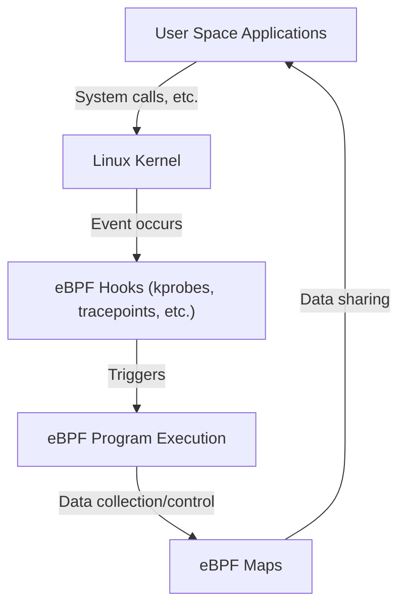

# Introduction to eBPF: How to Observe and Control Without Modifying the Linux Kernel

In modern cloud-native environments and increasingly complex infrastructures, accurately understanding what is happening inside the system is crucial. Among these, one of the most attention-gathering technologies in recent years is "eBPF (Extended Berkeley Packet Filter)".

In this article, we will dig deep into the fundamental concepts of eBPF, how it achieves dynamic functional extensions while maintaining kernel safety, and how it is utilized across a wide range of areas such as observability, networking, and security.

## 1. Challenges in Traditional Linux Kernel Extension

The Linux kernel, as the core of the OS, governs all system operations including hardware management, process scheduling, and network communication. Access to the inside of the kernel is essential for deeply understanding and controlling system behavior. However, traditional methods had several major barriers.

### Problems with Kernel Modules

In the past, the primary means of extending kernel functionality or performing deep-level tracing was to create and insert a custom Loadable Kernel Module (LKM). However, this approach comes with the following fatal risks and challenges.

1. **Risk of Crashes (Kernel Panic)**
   There is no memory protection mechanism in kernel space like there is in user space. A bug in a kernel module (e.g., NULL pointer dereference, memory leak, infinite loop) immediately crashes the entire system, causing a kernel panic. If this happens in a production environment, it means a complete service outage.
2. **Security Vulnerabilities**
   Executing malicious or vulnerable code in kernel space carries the danger of losing control of the entire system. Most rootkits exploit this mechanism.
3. **Maintenance Complexity**
   Kernel modules are strongly dependent on specific kernel versions. Every time the Linux kernel version goes up, APIs and data structures may change, and the cost of continuously updating and recompiling modules to keep up is very high.

For these reasons, there was a strong demand for a mechanism that safely and flexibly monitors and controls kernel behavior without directly modifying the kernel code. That is where eBPF came in.

## 2. What is eBPF?

eBPF (Extended Berkeley Packet Filter) is a revolutionary technology for safely executing sandboxed programs within the Linux kernel. It is sometimes compared to "JavaScript for Linux". Just as web browsers execute JavaScript to turn static HTML into dynamic web applications, eBPF transforms the Linux kernel into a dynamically programmable platform.

### Evolution from BPF to eBPF

The original "BPF (Berkeley Packet Filter)" was designed in 1992 for the purpose of efficiently filtering network packets (used in tools like tcpdump).
Around 2014, the architecture of this BPF was significantly extended, making it possible to attach to and execute on not just packet filtering, but all system events, including system calls, kernel functions, and user-space functions. Today, when simply referring to "eBPF" or "BPF", it generally points to this extended version.



## 3. Architecture of eBPF: Balancing Safety and Speed

What makes eBPF innovative is its ability to balance **"absolute safety" and "execution speed close to native code"**. Let's look at the main components that make this possible.

### 3.1. Bytecode and Sandbox

eBPF programs are written in a subset of C or Rust and compiled into dedicated "eBPF bytecode" by the LLVM/Clang compiler. This bytecode is loaded from user space into kernel space, but it is not executed directly. It is executed within an isolated sandbox environment inside the kernel.

### 3.2. Strict Inspection by the Verifier

The most important component ensuring the safety of eBPF is the "Verifier". When a program is loaded into the kernel, the Verifier statically analyzes the bytecode and checks whether it clears strict conditions such as the following:

- **No infinite loops exist** (It must be proven to always terminate to prevent system freezes. Bounded loops are permitted in recent kernels).
- **No access to uninitialized memory.**
- **No access to unauthorized kernel memory areas.**
- **Does not exceed the program size limit.**

Programs determined by the Verifier to be "unsafe" are rejected from being loaded. This prevents kernel panics.

### 3.3. Acceleration by the JIT Compiler

The bytecode that passes the Verifier's inspection is then converted into the native machine code of the host machine's CPU architecture (x86_64, ARM64, etc.) by the in-kernel "JIT (Just-In-Time) compiler".
Because it is executed as native code rather than being interpreted, it demonstrates extremely high performance comparable to kernel modules.

### 3.4. Data Sharing via eBPF Maps

eBPF programs themselves are short, stateless processes, but they need to pass collected data to user-space applications or retain state across multiple executions. "eBPF Maps" are provided for this purpose.
These are key-value stores offering data structures like hash tables, arrays, and ring buffers, which can be accessed asynchronously from both kernel space and user space.

## 4. Observability and Tracing

One of the most popular use cases for eBPF is improving observability, such as system performance analysis and debugging. By dynamically attaching to kernel functions and system calls, detailed data can be acquired in real-time.

### kprobes and uprobes

eBPF primarily uses the following mechanisms to hook events:
- **kprobes (Kernel Probes):** Dynamically attaches to any function call (entry point and return point) in kernel space.
- **uprobes (User Probes):** Dynamically attaches to functions within user-space applications (binaries written in compiled languages like C, C++, or Go).
- **Tracepoints:** Static hook points predefined by kernel developers. They feature higher ABI stability than kprobes.

### BCC and bpftrace

Writing eBPF programs in C from scratch and implementing a loader is very time-consuming. Therefore, front-end tools like "BCC (BPF Compiler Collection)" and "bpftrace" are widely used.

**bpftrace Example:**
For instance, if you want to monitor currently opened files (`openat` system call) across the entire system, you can achieve this with a single-line script using bpftrace like the following:

```bash
sudo bpftrace -e 'tracepoint:syscalls:sys_enter_openat { printf("%s %s\n", comm, str(args->filename)); }'
```
This script is internally compiled into an eBPF program, loaded into the kernel, and executed. The process name (`comm`) and the opened file name are output in real-time. The power of eBPF lies in being able to perform such operations safely without a kernel module.

## 5. Revolution in Networking and Security (Cilium, etc.)

In addition to observability, eBPF is causing a paradigm shift in the fields of networking and security. Its true value is especially demonstrated in container environments like Kubernetes.

### XDP (eXpress Data Path)

In the network stack, XDP is a mechanism that executes eBPF programs at the earliest possible stage (at the network card driver level). Because it can process packets before the kernel parses them or performs routing (such as allocating `sk_buff`), it boasts incredible throughput.
It is used for DDoS attack defense and the development of ultra-fast load balancers. You can programmatically control whether to drop (DROP), transmit (TX), or pass (PASS) packets to the normal network stack.

### Service Mesh and Cilium

Traditionally, container-to-container communication in Kubernetes was achieved through complex routing rules using iptables. However, as the scale of services expands, iptables rules numbering in the tens of thousands become a performance bottleneck, and management reaches its limit.

This is where eBPF-based CNI (Container Network Interface) plugins like "Cilium" have emerged. Cilium completely bypasses iptables and uses eBPF to directly perform packet routing, load balancing, and security policy enforcement within the kernel.
Furthermore, it achieves visibility and control not only at the TCP/IP level but also at L7 (HTTP, gRPC, Kafka, etc.) through transparent traffic redirection to a sidecar proxy (like Envoy), serving as the foundational technology for next-generation service meshes.

## 6. The Future of eBPF and its Ecosystem

Currently, the eBPF ecosystem is expanding rapidly. Tech giants like Google, Meta, and Netflix are running eBPF in production on their infrastructures and continue to contribute to the open-source community.

- **Tetragon:** A security monitoring tool derived from the Cilium project. It monitors process executions and file access at the kernel level in real-time, blocking actions that violate policies.
- **Pixie:** A Kubernetes observability platform for developers. It automatically collects application metrics, traces, and profiles without changing any code.
- **Porting to Windows:** The "eBPF for Windows" project is underway under the eBPF Foundation, and it is expected to become a cross-platform technology where common eBPF programs will run not only on Linux but also on the Windows kernel in the future.

## 7. Conclusion

eBPF is not just a feature addition; it is a platform technology that fundamentally changes the relationship between the OS kernel and user space. The ability to dynamically inject programs without compromising kernel safety and stability has now made it an indispensable tool for performance tuning, detailed troubleshooting, advanced network control, and implementing zero-trust security.

Along with the evolution of cloud-native technologies, the application range of eBPF will surely expand even further. For engineers interested in the deep working principles of Linux, learning eBPF should be a highly meaningful investment that elevates their understanding of systems to a higher level.
