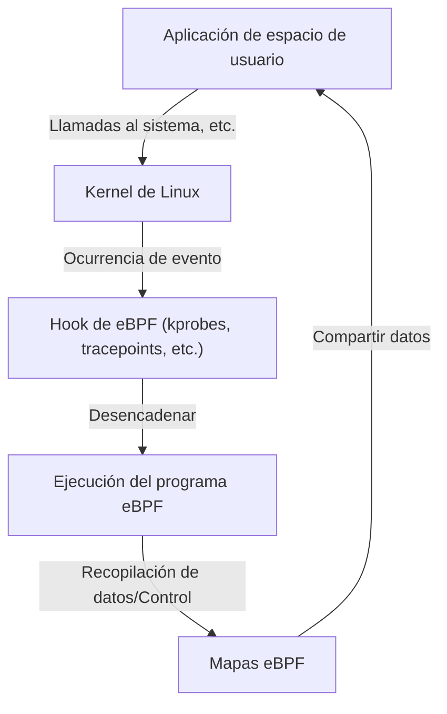

# Introducción a eBPF: Mecanismo para observar y controlar sin modificar el kernel de Linux

En los entornos cloud-native modernos y la infraestructura cada vez más compleja, es extremadamente importante comprender con precisión qué está sucediendo dentro del sistema. En este contexto, una de las tecnologías que más ha llamado la atención en los últimos años es "eBPF (Extended Berkeley Packet Filter)".

En este artículo, profundizaremos y explicaremos desde los conceptos básicos de eBPF, cómo logra una extensión dinámica de funciones manteniendo la seguridad del kernel, hasta cómo se utiliza en diversas áreas como la observabilidad, las redes y la seguridad.

## 1. Desafíos en la extensión tradicional del kernel de Linux

El kernel de Linux, como núcleo del sistema operativo, gestiona todo el comportamiento del sistema, incluida la gestión de hardware, la programación de procesos y la comunicación de red. Para comprender profundamente y controlar el comportamiento del sistema, el acceso al interior del kernel es indispensable. Sin embargo, los métodos tradicionales presentaban varias barreras importantes.

### Problemas de los módulos del kernel

En el pasado, el método principal para extender las funciones del kernel o realizar rastreos a nivel profundo era crear e incorporar un módulo de kernel propio (Loadable Kernel Module: LKM). Sin embargo, este enfoque conlleva los siguientes riesgos y desafíos fatales.

1. **Riesgo de bloqueo (Kernel Panic)**
   En el espacio del kernel, no existe un mecanismo de protección de memoria como en el espacio de usuario. Si hay un error en el módulo del kernel (por ejemplo, una referencia a un puntero NULL, fuga de memoria, bucle infinito), todo el sistema colapsará instantáneamente, provocando un "kernel panic". Si esto ocurre en un entorno de producción, significa la parada total del servicio.
2. **Vulnerabilidades de seguridad**
   Si se ejecuta código malicioso o vulnerable en el espacio del kernel, existe el peligro de perder el control de todo el sistema. Muchos Rootkits abusan de este mecanismo.
3. **Complejidad de mantenimiento**
   Los módulos del kernel dependen fuertemente de una versión específica del kernel. Cada vez que se actualiza la versión del kernel de Linux, es posible que las API y las estructuras de datos cambien, por lo que actualizar y recompilar continuamente los módulos para seguir estos cambios es muy costoso.

Por estas razones, existía una fuerte demanda de un mecanismo que permitiera monitorear y controlar de forma segura y flexible el comportamiento del kernel, sin tener que modificar directamente el código del kernel. Es ahí donde entra en juego eBPF.

## 2. ¿Qué es eBPF?

eBPF (Extended Berkeley Packet Filter) es una tecnología innovadora para ejecutar programas de forma segura en un entorno de pruebas (sandbox) dentro del kernel de Linux. A veces se le compara con "JavaScript en Linux". Al igual que un navegador web ejecuta JavaScript para convertir un HTML estático en una aplicación web dinámica, eBPF transforma el kernel de Linux en una plataforma programable dinámicamente.

### Evolución de BPF a eBPF

El "BPF (Berkeley Packet Filter)" original se diseñó en 1992 con el propósito de filtrar de manera eficiente los paquetes de red (se utiliza en herramientas como tcpdump).
Alrededor de 2014, la arquitectura de este BPF se expandió significativamente (Extended), permitiendo adjuntarse y ejecutarse no solo para el filtrado de paquetes, sino en cualquier evento del sistema, como llamadas al sistema (syscalls), funciones del kernel y funciones del espacio de usuario. Hoy en día, cuando simplemente decimos "eBPF" o "BPF", generalmente nos referimos a esta versión extendida.



## 3. Arquitectura de eBPF: Combinando seguridad y alta velocidad

Lo innovador de eBPF es que **combina "seguridad absoluta" con una "velocidad de ejecución cercana al código nativo"**. Veamos los componentes principales para lograr esto.

### 3.1. Bytecode y Sandbox

Los programas de eBPF están escritos en un subconjunto de C, Rust, etc., y se compilan mediante el compilador LLVM/Clang en un "bytecode de eBPF" dedicado. Este bytecode se carga desde el espacio de usuario al espacio del kernel, pero no se ejecuta directamente. Se ejecuta en un entorno aislado (sandbox) dentro del kernel.

### 3.2. Examen estricto por el Verificador (Verifier)

El componente más importante que garantiza la seguridad de eBPF es el "Verificador (Verifier)". Cuando el programa se carga en el kernel, el Verificador analiza estáticamente el bytecode para comprobar si cumple con condiciones estrictas como las siguientes:

- **Ausencia de bucles infinitos** (Debe demostrarse que siempre terminará para no congelar el sistema. En kernels recientes se permiten los bucles acotados).
- **No hay acceso a memoria no inicializada**
- **No hay acceso a áreas de memoria del kernel no permitidas**
- **No excede el límite de tamaño del programa**

Si el Verificador determina que un programa "no es seguro", se rechaza su carga. Esto evita los "kernel panic".

### 3.3. Aceleración mediante el compilador JIT

El bytecode que ha pasado la inspección del Verificador es luego traducido por el "compilador JIT (Just-In-Time)" del kernel al código de máquina nativo de la arquitectura de la CPU de la máquina host (x86_64, ARM64, etc.).
Dado que se ejecuta como código nativo en lugar de ser interpretado, ofrece un rendimiento muy alto que rivaliza con el de los módulos del kernel.

### 3.4. Intercambio de datos a través de los Mapas de eBPF (eBPF Maps)

Los programas de eBPF en sí son procesos cortos sin estado, pero necesitan pasar los datos recopilados a las aplicaciones en el espacio de usuario, o mantener el estado entre múltiples ejecuciones. Para ello, se proporcionan los "Mapas de eBPF (eBPF Maps)".
Se trata de un almacén de tipo clave-valor que proporciona estructuras de datos como tablas hash, matrices y búferes en anillo (ring buffers), a los que se puede acceder de forma asíncrona tanto desde el espacio del kernel como desde el espacio de usuario.

## 4. Observabilidad y rastreo

Uno de los casos de uso más populares de eBPF es la mejora de la observabilidad, como el análisis de rendimiento del sistema y la depuración. Al adjuntarse dinámicamente a las funciones del kernel o las llamadas al sistema, es posible obtener datos detallados en tiempo real.

### kprobes y uprobes

eBPF utiliza principalmente los siguientes mecanismos para enganchar (hook) eventos:
- **kprobes (Kernel Probes):** Se adjunta dinámicamente a cualquier llamada de función en el espacio del kernel (puntos de entrada y puntos de retorno).
- **uprobes (User Probes):** Se adjunta dinámicamente a funciones dentro de aplicaciones en el espacio de usuario (binarios escritos en lenguajes compilados como C, C++, Go).
- **Tracepoints:** Son puntos de enganche estáticos definidos previamente por los desarrolladores del kernel. Tienen la característica de tener una estabilidad de ABI superior a la de kprobes.

### BCC y bpftrace

Escribir un programa eBPF desde cero en C e implementar el cargador requiere mucho esfuerzo. Por lo tanto, herramientas de front-end como "BCC (BPF Compiler Collection)" y "bpftrace" se utilizan ampliamente.

**Ejemplo de bpftrace:**
Por ejemplo, si desea monitorear los archivos que se están abriendo actualmente (llamada al sistema `openat`) en todo el sistema, puede lograrlo con un script de una línea como el siguiente utilizando bpftrace:

```bash
sudo bpftrace -e 'tracepoint:syscalls:sys_enter_openat { printf("%s %s\n", comm, str(args->filename)); }'
```
Este script se compila internamente en un programa eBPF, se carga en el kernel y se ejecuta. El nombre del proceso (`comm`) y el nombre del archivo abierto se imprimen en tiempo real. El poder de eBPF es que este tipo de operación se puede realizar de forma segura sin un módulo del kernel.

## 5. Revolución en redes y seguridad (Cilium, etc.)

Además de la observabilidad, eBPF está provocando un cambio de paradigma en las áreas de redes y seguridad. Su verdadero valor se demuestra especialmente en entornos de contenedores como Kubernetes.

### XDP (eXpress Data Path)

En la pila de red, el mecanismo para ejecutar un programa eBPF en la etapa más temprana posible (a nivel del controlador de la tarjeta de red) es XDP. Al permitir que el paquete sea procesado antes de que el kernel realice el análisis o enrutamiento del paquete (como la asignación de sk_buff), logra un rendimiento asombroso.
Se utiliza para la defensa contra ataques DDoS y el desarrollo de balanceadores de carga ultrarrápidos. Permite un control programable para descartar (DROP), transmitir (TX) o pasar el paquete a la pila de red normal (PASS).

### Service Mesh y Cilium

En la arquitectura tradicional de Kubernetes, la comunicación entre contenedores se implementaba mediante reglas de enrutamiento complejas que usaban iptables. Sin embargo, a medida que el tamaño del servicio aumenta, las decenas de miles de líneas de reglas de iptables se convierten en un cuello de botella de rendimiento y la administración llega a su límite.

Aquí es donde entraron los plugins CNI (Container Network Interface) basados en eBPF, como "Cilium". Cilium elude (bypasses) completamente iptables y utiliza eBPF para realizar directamente el enrutamiento de paquetes, el balanceo de carga y la aplicación de políticas de seguridad dentro del kernel.
Además, permite la visualización y el control no solo a nivel TCP/IP, sino también en L7 (HTTP, gRPC, Kafka, etc.) mediante el reenvío transparente de tráfico a proxies sidecar (como Envoy), convirtiéndose en la tecnología fundacional para el service mesh de próxima generación.

## 6. El futuro de eBPF y su ecosistema

En la actualidad, el ecosistema de eBPF se está expandiendo rápidamente. Grandes empresas tecnológicas como Google, Meta y Netflix ejecutan eBPF en producción dentro de sus propias infraestructuras y continúan contribuyendo a la comunidad de código abierto.

- **Tetragon:** Herramienta de monitoreo de seguridad derivada del proyecto Cilium. Monitorea la ejecución de procesos y el acceso a archivos en tiempo real a nivel del kernel y bloquea comportamientos que violan las políticas.
- **Pixie:** Plataforma de observabilidad en Kubernetes para desarrolladores. Recopila automáticamente métricas, trazas y perfiles de aplicaciones sin modificar el código.
- **Migración a Windows:** Bajo la Fundación eBPF, el proyecto "eBPF for Windows" está en marcha y se espera que en el futuro se convierta en una tecnología multiplataforma donde un programa eBPF común pueda ejecutarse no solo en Linux, sino también en el kernel de Windows.

## 7. Conclusión

eBPF no es solo una función adicional, sino una tecnología de plataforma que cambia fundamentalmente la forma en que el kernel del sistema operativo interactúa con el espacio de usuario. Su capacidad para inyectar programas de forma dinámica sin comprometer la seguridad ni la estabilidad del kernel se ha convertido en una herramienta indispensable para el ajuste de rendimiento, la resolución detallada de problemas, el control avanzado de red y la implementación de seguridad Zero Trust.

Con la evolución de las tecnologías cloud-native, el alcance de las aplicaciones de eBPF seguramente se ampliará aún más. Para los ingenieros interesados en los principios de funcionamiento profundo de Linux, aprender eBPF es una inversión muy valiosa que elevará su comprensión del sistema a un nivel superior.
