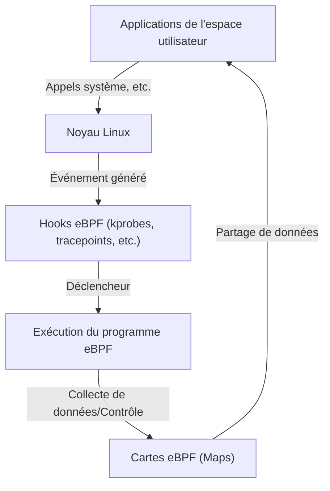

# Introduction à eBPF : Comment observer et contrôler le noyau Linux sans le modifier

Dans les environnements cloud natifs modernes et les infrastructures de plus en plus complexes, il est extrêmement important de comprendre avec précision ce qui se passe à l'intérieur du système. Parmi ces technologies, l'une de celles qui attirent le plus l'attention ces dernières années est « eBPF (Extended Berkeley Packet Filter) ».

Dans cet article, nous allons explorer en profondeur les concepts de base d'eBPF, la manière dont il permet une extension dynamique des fonctionnalités tout en préservant la sécurité du noyau, ainsi que son utilisation dans des domaines variés tels que l'observabilité (observability), la mise en réseau (networking) et la sécurité.

## 1. Les défis de l'extension classique du noyau Linux

Le noyau Linux, en tant que cœur du système d'exploitation, gère l'ensemble des opérations du système, telles que la gestion du matériel, la planification des processus et les communications réseau. Pour comprendre et contrôler en profondeur le comportement du système, l'accès à l'intérieur du noyau est indispensable. Cependant, les méthodes traditionnelles présentaient plusieurs obstacles majeurs.

### Les problèmes des modules du noyau

Autrefois, le principal moyen d'étendre les fonctionnalités du noyau ou d'effectuer des traçages à un niveau profond consistait à créer et intégrer ses propres modules de noyau (Loadable Kernel Module : LKM). Cependant, cette approche comporte des risques et des défis fatals :

1. **Risque de plantage (Kernel Panic)**
   L'espace noyau ne dispose pas de mécanismes de protection de la mémoire comme l'espace utilisateur. Un bug dans un module du noyau (par exemple : déréférencement de pointeur NULL, fuite de mémoire, boucle infinie) entraîne un plantage immédiat du système dans son ensemble, provoquant un kernel panic. Si cela se produit dans un environnement de production, cela signifie un arrêt total du service.
2. **Vulnérabilités de sécurité**
   Exécuter du code malveillant ou vulnérable dans l'espace noyau risque de donner le contrôle de l'ensemble du système à un attaquant. La plupart des Rootkits exploitent ce mécanisme.
3. **Complexité de la maintenance**
   Les modules du noyau sont fortement dépendants d'une version spécifique du noyau. À chaque mise à jour de la version du noyau Linux, les API et les structures de données peuvent changer, et le fait de devoir continuellement mettre à jour et recompiler les modules en conséquence est très coûteux.

Pour ces raisons, il y avait une forte demande pour un mécanisme permettant de surveiller et de contrôler de manière sûre et flexible le comportement du noyau sans modifier directement son code. C'est là qu'intervient eBPF.

## 2. Qu'est-ce qu'eBPF ?

eBPF (Extended Berkeley Packet Filter) est une technologie révolutionnaire permettant d'exécuter de manière sûre des programmes dans un bac à sable (sandbox) au sein du noyau Linux. Il est parfois comparé au « JavaScript de Linux ». Tout comme un navigateur Web exécute du JavaScript pour transformer du HTML statique en applications Web dynamiques, eBPF transforme le noyau Linux en une plateforme dynamiquement programmable.

### L'évolution de BPF vers eBPF

Le « BPF (Berkeley Packet Filter) » d'origine a été conçu en 1992 pour filtrer efficacement les paquets réseau (il est utilisé par tcpdump, etc.).
Vers 2014, l'architecture de ce BPF a été considérablement étendue (Extended) pour s'attacher et s'exécuter non seulement sur le filtrage de paquets, mais aussi sur tout événement système tel que les appels système, les fonctions du noyau et les fonctions de l'espace utilisateur. Aujourd'hui, lorsqu'on parle simplement d'« eBPF » ou de « BPF », on fait généralement référence à cette version étendue.



## 3. L'architecture d'eBPF : Concilier sécurité et vitesse

L'aspect révolutionnaire d'eBPF réside dans le fait qu'il concilie **« sécurité absolue » et « vitesse d'exécution proche de celle du code natif »**. Examinons les principaux composants qui rendent cela possible.

### 3.1. Bytecode et bac à sable (Sandbox)

Les programmes eBPF sont écrits dans un sous-ensemble du langage C ou en Rust, etc., et compilés en un « bytecode eBPF » dédié par le compilateur LLVM/Clang. Ce bytecode est chargé de l'espace utilisateur vers l'espace noyau, mais n'est pas exécuté directement. Il s'exécute dans un environnement de bac à sable isolé au sein du noyau.

### 3.2. Examen strict par le Verifier (Vérificateur)

Le composant le plus important garantissant la sécurité d'eBPF est le « Verifier ». Lorsqu'un programme est chargé dans le noyau, le Verifier analyse statiquement le bytecode et vérifie s'il respecte des conditions strictes telles que :

- **L'absence de boucles infinies** (pour ne pas figer le système, il doit être prouvé que le programme se terminera à coup sûr. Les noyaux récents autorisent les boucles bornées).
- **L'absence d'accès à une mémoire non initialisée**.
- **L'absence d'accès à des zones de mémoire du noyau non autorisées**.
- **Le respect de la limite de taille du programme**.

Les programmes jugés « non sûrs » par le Verifier voient leur chargement refusé. Cela prévient les kernel panics.

### 3.3. Accélération grâce au compilateur JIT

Une fois que le bytecode a passé l'examen du Verifier, il est ensuite traduit par le « compilateur JIT (Just-In-Time) » du noyau en code machine natif pour l'architecture CPU de la machine hôte (x86_64, ARM64, etc.).
Puisqu'il est exécuté en tant que code natif plutôt qu'interprété, il offre des performances très élevées, comparables à celles d'un module du noyau.

### 3.4. Partage de données via les eBPF Maps

Un programme eBPF lui-même est un processus court et sans état, mais il doit transmettre les données collectées aux applications de l'espace utilisateur ou conserver un état entre plusieurs exécutions. C'est pour cela que les « eBPF Maps » (cartes eBPF) ont été créées.
Il s'agit de magasins de type clé-valeur offrant des structures de données telles que des tables de hachage, des tableaux et des tampons circulaires (ring buffers), qui peuvent être consultées de manière asynchrone à la fois depuis l'espace noyau et l'espace utilisateur.

## 4. Observabilité et traçage

L'un des cas d'utilisation les plus populaires d'eBPF est l'amélioration de l'observabilité, comme l'analyse des performances et le débogage du système. Il permet de s'attacher dynamiquement aux fonctions du noyau et aux appels système pour obtenir des données détaillées en temps réel.

### kprobes et uprobes

eBPF utilise principalement les mécanismes suivants pour accrocher (hook) les événements :
- **kprobes (Kernel Probes) :** S'attache dynamiquement à tout appel de fonction dans l'espace noyau (points d'entrée et de retour).
- **uprobes (User Probes) :** S'attache dynamiquement aux fonctions au sein d'applications de l'espace utilisateur (binaires écrits dans des langages compilés tels que C, C++, Go, etc.).
- **Tracepoints :** Ce sont des points d'ancrage statiques définis à l'avance par les développeurs du noyau. Ils offrent une stabilité d'ABI supérieure par rapport aux kprobes.

### BCC et bpftrace

Écrire un programme eBPF à partir de zéro en C et implémenter un chargeur est très laborieux. C'est pourquoi des outils front-end comme « BCC (BPF Compiler Collection) » ou « bpftrace » sont largement utilisés.

**Exemple bpftrace :**
Par exemple, si vous souhaitez surveiller les fichiers actuellement ouverts dans l'ensemble du système (appel système `openat`), vous pouvez le faire avec un script d'une seule ligne en utilisant bpftrace, comme ceci :

```bash
sudo bpftrace -e 'tracepoint:syscalls:sys_enter_openat { printf("%s %s\n", comm, str(args->filename)); }'
```
Ce script est compilé en interne en un programme eBPF, puis chargé dans le noyau et exécuté. Le nom du processus (`comm`) et le nom du fichier ouvert sont affichés en temps réel. La puissance d'eBPF réside dans sa capacité à effectuer ce type d'opérations en toute sécurité, sans module du noyau.

## 5. Une révolution dans le réseau et la sécurité (Cilium, etc.)

Outre l'observabilité, eBPF provoque un changement de paradigme dans les domaines du réseau et de la sécurité. Sa véritable valeur se révèle particulièrement dans les environnements de conteneurs comme Kubernetes.

### XDP (eXpress Data Path)

Dans la pile réseau, le mécanisme permettant d'exécuter des programmes eBPF au stade le plus précoce (au niveau du pilote de la carte réseau) est XDP. Étant donné qu'il peut traiter les paquets avant que le noyau n'effectue l'analyse et le routage des paquets (comme l'allocation sk_buff), il offre un débit incroyable.
Il est utilisé pour se défendre contre les attaques DDoS et pour développer des équilibreurs de charge (load balancers) ultra-rapides. Il permet de contrôler de manière programmable si un paquet doit être rejeté (DROP), transmis (TX) ou passé à la pile réseau normale (PASS).

### Service Mesh et Cilium

Traditionnellement, la communication entre conteneurs dans Kubernetes était réalisée à l'aide de règles de routage complexes basées sur iptables. Cependant, à mesure que l'échelle des services augmente, les dizaines de milliers de lignes de règles iptables deviennent un goulot d'étranglement des performances, et leur gestion atteint ses limites.

C'est là que les plugins CNI (Container Network Interface) basés sur eBPF, comme « Cilium », sont apparus. Cilium contourne complètement iptables et utilise eBPF pour effectuer directement le routage des paquets, l'équilibrage de charge et l'application des politiques de sécurité au sein du noyau.
De plus, il permet la visibilité et le contrôle non seulement au niveau TCP/IP, mais aussi au niveau L7 (HTTP, gRPC, Kafka, etc.) via un transfert de trafic transparent vers des proxys side-car (comme Envoy), constituant ainsi la technologie fondamentale des service mesh de nouvelle génération.

## 6. L'avenir et l'écosystème d'eBPF

Aujourd'hui, l'écosystème eBPF connaît une expansion rapide. Des géants de la technologie tels que Google, Meta et Netflix utilisent eBPF en production dans leur infrastructure et continuent de contribuer à la communauté open source.

- **Tetragon :** Un outil de surveillance de la sécurité dérivé du projet Cilium. Il surveille en temps réel l'exécution des processus et l'accès aux fichiers au niveau du noyau, et bloque les actions qui violent les politiques.
- **Pixie :** Une plateforme d'observabilité Kubernetes pour les développeurs. Elle collecte automatiquement les métriques, traces et profils des applications sans modifier le code.
- **Portage vers Windows :** Sous l'égide de l'eBPF Foundation, le projet « eBPF for Windows » est en cours. À l'avenir, on s'attend à ce qu'il devienne une technologie multiplateforme permettant aux programmes eBPF communs de s'exécuter non seulement sur Linux, mais aussi sur le noyau Windows.

## 7. Résumé

eBPF n'est pas simplement un ajout de fonctionnalité, mais une technologie de plateforme qui modifie fondamentalement la façon dont le noyau de l'OS et l'espace utilisateur interagissent. Ce mécanisme permettant d'injecter dynamiquement des programmes sans compromettre la sécurité et la stabilité du noyau est désormais un outil indispensable pour l'optimisation des performances, le dépannage détaillé, le contrôle réseau avancé et la mise en œuvre de la sécurité Zero Trust.

Avec l'évolution des technologies cloud natives, le champ d'application d'eBPF va certainement continuer à s'élargir. Pour les ingénieurs intéressés par les principes de fonctionnement profonds de Linux, apprendre eBPF sera un investissement très précieux qui portera leur compréhension du système à un niveau supérieur.
