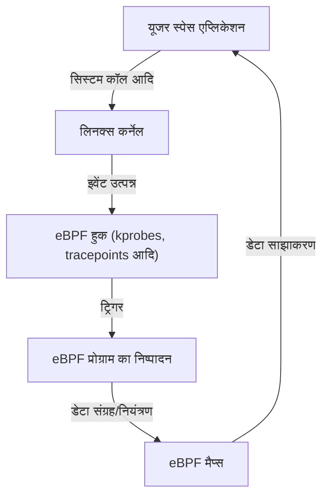

# eBPF परिचय: लिनक्स कर्नेल को बदले बिना निरीक्षण और नियंत्रण करने का तंत्र

आधुनिक क्लाउड-नेटिव वातावरण और जटिल होते इंफ्रास्ट्रक्चर में, सिस्टम के अंदर क्या हो रहा है, यह सटीक रूप से समझना अत्यंत महत्वपूर्ण है। हाल के वर्षों में सबसे अधिक ध्यान आकर्षित करने वाली तकनीकों में से एक "eBPF (Extended Berkeley Packet Filter)" है।

इस लेख में, हम eBPF की बुनियादी अवधारणाओं से लेकर, यह कर्नेल की सुरक्षा को बनाए रखते हुए डायनामिक रूप से कार्यक्षमता का विस्तार कैसे करता है, और इसे ऑब्जर्वेबिलिटी (अवलोकन क्षमता), नेटवर्किंग, और सुरक्षा जैसे विभिन्न क्षेत्रों में कैसे उपयोग किया जाता है, इस पर गहराई से चर्चा करेंगे।

## 1. पारंपरिक लिनक्स कर्नेल एक्सटेंशन में चुनौतियाँ

लिनक्स कर्नेल, OS के मूल के रूप में हार्डवेयर प्रबंधन, प्रोसेस शेड्यूलिंग, और नेटवर्क संचार जैसी सभी सिस्टम गतिविधियों को नियंत्रित करता है। सिस्टम के व्यवहार को गहराई से समझने और नियंत्रित करने के लिए कर्नेल के अंदर तक पहुँच आवश्यक है। हालाँकि, पारंपरिक तरीकों में कुछ बड़ी बाधाएँ थीं।

### कर्नेल मॉड्यूल की समस्याएँ

अतीत में, कर्नेल की कार्यक्षमता का विस्तार करने या गहरे स्तर पर ट्रेसिंग करने का मुख्य तरीका कस्टम कर्नेल मॉड्यूल (Loadable Kernel Module: LKM) बनाना और उन्हें लोड करना था। लेकिन इस दृष्टिकोण के साथ निम्नलिखित गंभीर जोखिम और चुनौतियाँ जुड़ी हैं।

1. **क्रैश का जोखिम (कर्नेल पैनिक)**
   कर्नेल स्पेस में यूजर स्पेस की तरह मेमोरी प्रोटेक्शन मैकेनिज्म नहीं होता है। यदि कर्नेल मॉड्यूल में कोई बग (जैसे: NULL पॉइंटर रेफरेंस, मेमोरी लीक, इनफिनिट लूप) है, तो पूरा सिस्टम तुरंत क्रैश हो जाएगा, जिससे कर्नेल पैनिक होता है। यदि यह प्रोडक्शन वातावरण में होता है, तो इसका मतलब है सर्विस का पूरी तरह से ठप होना।
2. **सुरक्षा भेद्यता (सिक्योरिटी वल्नरेबिलिटी)**
   यदि दुर्भावनापूर्ण या असुरक्षित कोड को कर्नेल स्पेस में निष्पादित किया जाता है, तो पूरे सिस्टम का नियंत्रण खोने का खतरा होता है। अधिकांश Rootkits इसी तंत्र का दुरुपयोग करते हैं।
3. **मेंटेनेंस की जटिलता**
   कर्नेल मॉड्यूल विशिष्ट कर्नेल संस्करण पर बहुत अधिक निर्भर करते हैं। हर बार जब लिनक्स कर्नेल का संस्करण अपडेट होता है, तो API या डेटा संरचनाओं के बदलने की संभावना होती है, और उसके अनुसार मॉड्यूल को अपडेट और फिर से कंपाइल करना बहुत महंगा होता है।

इन कारणों से, कर्नेल कोड को सीधे संशोधित किए बिना सुरक्षित और लचीले ढंग से कर्नेल के व्यवहार की निगरानी और नियंत्रण करने के लिए एक तंत्र की सख्त आवश्यकता थी। यहीं eBPF अस्तित्व में आया।

## 2. eBPF क्या है?

eBPF (Extended Berkeley Packet Filter) लिनक्स कर्नेल के भीतर सुरक्षित रूप से सैंडबॉक्स किए गए प्रोग्राम चलाने के लिए एक क्रांतिकारी तकनीक है। इसकी तुलना अक्सर "लिनक्स में जावास्क्रिप्ट" से की जाती है। जैसे वेब ब्राउज़र जावास्क्रिप्ट चलाकर स्थिर HTML को डायनामिक वेब एप्लिकेशन में बदल देते हैं, वैसे ही eBPF लिनक्स कर्नेल को डायनामिक रूप से प्रोग्राम करने योग्य प्लेटफॉर्म में बदल देता है।

### BPF से eBPF तक का विकास

मूल "BPF (Berkeley Packet Filter)" को 1992 में नेटवर्क पैकेट को कुशलतापूर्वक फ़िल्टर करने के उद्देश्य से डिज़ाइन किया गया था (इसका उपयोग tcpdump आदि में किया जाता है)।
लगभग 2014 में, इस BPF आर्किटेक्चर का काफी विस्तार (Extended) किया गया, जिससे यह न केवल पैकेट फ़िल्टरिंग, बल्कि सिस्टम कॉल, कर्नेल फ़ंक्शन, और यूज़र-स्पेस फ़ंक्शन जैसे सिस्टम के किसी भी इवेंट से जुड़कर (attach) निष्पादित होने में सक्षम हो गया। आज, जब हम केवल "eBPF" या "BPF" कहते हैं, तो यह आम तौर पर इस विस्तारित संस्करण को संदर्भित करता है।



## 3. eBPF का आर्किटेक्चर: सुरक्षा और उच्च गति दोनों

eBPF की क्रांतिकारी बात यह है कि यह **"पूर्ण सुरक्षा" और "नेटिव कोड के करीब निष्पादन गति" दोनों** प्राप्त करता है। आइए इसे संभव बनाने वाले मुख्य घटकों पर एक नज़र डालें।

### 3.1. बाइटकोड और सैंडबॉक्स

eBPF प्रोग्राम C भाषा के सबसेट या Rust आदि में लिखे जाते हैं, और LLVM/Clang कंपाइलर द्वारा एक विशेष "eBPF बाइटकोड" में कंपाइल किए जाते हैं। यह बाइटकोड यूजर स्पेस से कर्नेल स्पेस में लोड होता है, लेकिन इसे सीधे निष्पादित नहीं किया जाता है। इसे कर्नेल के भीतर एक अलग सैंडबॉक्स वातावरण में निष्पादित किया जाता है।

### 3.2. Verifier (सत्यापनकर्ता) द्वारा सख्त जांच

eBPF की सुरक्षा सुनिश्चित करने वाला सबसे महत्वपूर्ण घटक "Verifier (सत्यापनकर्ता)" है। जब किसी प्रोग्राम को कर्नेल में लोड किया जाता है, तो Verifier बाइटकोड का स्थैतिक विश्लेषण (static analysis) करता है और यह जांचता है कि क्या यह निम्नलिखित सख्त शर्तों को पूरा करता है:

- **कोई अनंत लूप नहीं होना चाहिए** (सिस्टम को फ्रीज होने से बचाने के लिए, यह साबित होना चाहिए कि प्रोग्राम हमेशा समाप्त होता है। हाल के कर्नेल में सीमित लूप की अनुमति है)
- **प्रारंभ नहीं की गई (uninitialized) मेमोरी तक कोई पहुंच नहीं होनी चाहिए**
- **अनधिकृत कर्नेल मेमोरी क्षेत्रों तक कोई पहुंच नहीं होनी चाहिए**
- **प्रोग्राम के आकार की सीमा पार नहीं होनी चाहिए**

यदि Verifier निर्धारित करता है कि कोई प्रोग्राम "सुरक्षित नहीं है," तो उसे लोड करने से मना कर दिया जाता है। यह कर्नेल पैनिक को रोकता है।

### 3.3. JIT कंपाइलर द्वारा गति बढ़ाना

Verifier की जांच पास करने वाले बाइटकोड को फिर कर्नेल के "JIT (Just-In-Time) कंपाइलर" द्वारा होस्ट मशीन के CPU आर्किटेक्चर (x86_64, ARM64, आदि) के नेटिव मशीन कोड में परिवर्तित किया जाता है।
चूंकि यह इंटरप्रेटर द्वारा नहीं बल्कि नेटिव कोड के रूप में निष्पादित किया जाता है, यह कर्नेल मॉड्यूल के बराबर बहुत उच्च प्रदर्शन प्रदान करता है।

### 3.4. eBPF Maps के माध्यम से डेटा साझाकरण

हालाँकि eBPF प्रोग्राम स्वयं स्टेटलेस (stateless) और छोटे होते हैं, उन्हें एकत्र किए गए डेटा को यूजर स्पेस के एप्लिकेशन तक पहुंचाने या कई निष्पादनों के बीच स्थिति बनाए रखने की आवश्यकता होती है। इसके लिए "eBPF Maps" प्रदान किए जाते हैं।
यह एक की-वैल्यू स्टोर है जो हैश टेबल, ऐरे (arrays), और रिंग बफ़र्स जैसी डेटा संरचनाएँ प्रदान करता है, और इसे कर्नेल स्पेस और यूजर स्पेस दोनों से एसिंक्रोनस रूप से एक्सेस किया जा सकता है।

## 4. ऑब्जर्वेबिलिटी (अवलोकन क्षमता) और ट्रेसिंग

eBPF के सबसे लोकप्रिय उपयोग के मामलों में से एक सिस्टम प्रदर्शन विश्लेषण और डिबगिंग जैसी ऑब्जर्वेबिलिटी में सुधार करना है। आप कर्नेल फ़ंक्शंस और सिस्टम कॉल को डायनामिक रूप से अटैच करके रीयल-टाइम में विस्तृत डेटा प्राप्त कर सकते हैं।

### kprobes और uprobes

eBPF मुख्य रूप से इवेंट्स को हुक करने के लिए निम्नलिखित तंत्र का उपयोग करता है।
- **kprobes (Kernel Probes):** कर्नेल स्पेस में किसी भी फ़ंक्शन कॉल (एंट्री पॉइंट और रिटर्न पॉइंट) से डायनामिक रूप से जुड़ता है।
- **uprobes (User Probes):** यूजर स्पेस में एप्लिकेशन के भीतर फ़ंक्शंस (C, C++, Go जैसी संकलित भाषाओं में लिखी गई बाइनरी) से डायनामिक रूप से जुड़ता है।
- **Tracepoints:** कर्नेल डेवलपर्स द्वारा पहले से परिभाषित स्टैटिक हुक पॉइंट्स। kprobes की तुलना में इनका ABI अधिक स्थिर होता है।

### BCC और bpftrace

शुरुआत से C भाषा में eBPF प्रोग्राम लिखना और लोडर लागू करना बहुत समय लेने वाला काम है। इसलिए, फ्रंट-एंड टूल के रूप में "BCC (BPF Compiler Collection)" और "bpftrace" का व्यापक रूप से उपयोग किया जाता है।

**bpftrace का उदाहरण:**
उदाहरण के लिए, यदि आप पूरे सिस्टम में वर्तमान में खोली जा रही फाइलों (`openat` सिस्टम कॉल) की निगरानी करना चाहते हैं, तो आप bpftrace का उपयोग करके निम्नलिखित 1-लाइन स्क्रिप्ट के साथ इसे प्राप्त कर सकते हैं:

```bash
sudo bpftrace -e 'tracepoint:syscalls:sys_enter_openat { printf("%s %s\n", comm, str(args->filename)); }'
```
यह स्क्रिप्ट आंतरिक रूप से eBPF प्रोग्राम में संकलित होती है, कर्नेल में लोड होती है, और निष्पादित होती है। प्रोसेस का नाम (`comm`) और खोली गई फ़ाइल का नाम रीयल-टाइम में आउटपुट होता है। eBPF की यही शक्ति है कि वह कर्नेल मॉड्यूल के बिना इतनी सुरक्षित रूप से यह कार्य कर सकता है।

## 5. नेटवर्क और सुरक्षा में क्रांति (Cilium, आदि)

ऑब्जर्वेबिलिटी के अलावा, eBPF नेटवर्क और सुरक्षा के क्षेत्र में भी एक पैराडाइम शिफ्ट ला रहा है। इसका असली मूल्य विशेष रूप से कुबेरनेट्स (Kubernetes) जैसे कंटेनर वातावरण में देखा जाता है।

### XDP (eXpress Data Path)

नेटवर्क स्टैक में, XDP एक ऐसा तंत्र है जो नेटवर्क कार्ड के ड्राइवर स्तर पर सबसे शुरुआती चरण में eBPF प्रोग्राम को निष्पादित करता है। चूँकि कर्नेल द्वारा पैकेट का विश्लेषण या रूटिंग (जैसे sk_buff का आवंटन) करने से पहले ही पैकेट को प्रोसेस किया जा सकता है, यह अविश्वसनीय थ्रूपुट प्रदान करता है।
इसका उपयोग DDoS हमलों से बचाव और अल्ट्रा-फास्ट लोड बैलेंसर विकसित करने के लिए किया जाता है। यह प्रोग्राम करने योग्य नियंत्रण की अनुमति देता है कि पैकेट को ड्रॉप (DROP) करना है, ट्रांसमिट (TX) करना है, या सामान्य नेटवर्क स्टैक पर पास (PASS) करना है।

### सर्विस मेश और Cilium

पारंपरिक कुबेरनेट्स में कंटेनरों के बीच संचार को iptables का उपयोग करके जटिल रूटिंग नियमों के माध्यम से प्रबंधित किया जाता था। हालांकि, जैसे-जैसे सेवाओं का पैमाना बढ़ता है, हजारों लाइनों के iptables नियम प्रदर्शन में बाधा (bottleneck) बन जाते हैं और प्रबंधन अपनी सीमा तक पहुँच जाता है।

यहीं पर "Cilium" जैसे eBPF-आधारित CNI (Container Network Interface) प्लगइन्स सामने आए। Cilium पूरी तरह से iptables को बायपास करता है और सीधे कर्नेल के भीतर पैकेट रूटिंग, लोड बैलेंसिंग, और सुरक्षा नीतियों को लागू करने के लिए eBPF का उपयोग करता है।
इसके अलावा, यह न केवल TCP/IP स्तर पर बल्कि L7 (HTTP, gRPC, Kafka, आदि) की दृश्यता और नियंत्रण भी साइडकार प्रॉक्सी (जैसे Envoy) पर पारदर्शी ट्रैफ़िक अग्रेषण (transparent traffic forwarding) के माध्यम से प्रदान करता है, जो इसे अगली पीढ़ी के सर्विस मेश के लिए एक आधारभूत तकनीक बनाता है।

## 6. eBPF का भविष्य और इकोसिस्टम

वर्तमान में, eBPF इकोसिस्टम का तेज़ी से विस्तार हो रहा है। Google, Meta और Netflix जैसी बड़ी टेक कंपनियाँ अपने प्रोडक्शन इंफ्रास्ट्रक्चर में eBPF का उपयोग कर रही हैं और ओपन-सोर्स कम्युनिटी में योगदान दे रही हैं।

- **Tetragon:** Cilium प्रोजेक्ट से प्राप्त एक सुरक्षा निगरानी उपकरण। यह कर्नेल स्तर पर रीयल-टाइम में प्रोसेस निष्पादन और फ़ाइल एक्सेस की निगरानी करता है और नीतियों का उल्लंघन करने वाले व्यवहार को रोकता है।
- **Pixie:** डेवलपर्स के लिए कुबेरनेट्स ऑब्जर्वेबिलिटी प्लेटफॉर्म। यह कोड बदले बिना एप्लिकेशन मेट्रिक्स, ट्रेसेस और प्रोफाइल को स्वचालित रूप से एकत्र करता है।
- **विंडोज़ में पोर्टिंग:** eBPF Foundation के तहत, "eBPF for Windows" प्रोजेक्ट प्रगति पर है, और यह उम्मीद की जाती है कि भविष्य में यह एक क्रॉस-प्लेटफॉर्म तकनीक बन जाएगी जहां समान eBPF प्रोग्राम न केवल लिनक्स बल्कि विंडोज़ कर्नेल पर भी चलेंगे।

## 7. निष्कर्ष

eBPF केवल एक फीचर एडिशन नहीं है, बल्कि एक प्लेटफॉर्म तकनीक है जो मौलिक रूप से बदल देती है कि OS कर्नेल और यूजर स्पेस कैसे इंटरैक्ट करते हैं। कर्नेल की सुरक्षा और स्थिरता से समझौता किए बिना प्रोग्राम को डायनामिक रूप से इंजेक्ट करने की क्षमता अब प्रदर्शन ट्यूनिंग, विस्तृत समस्या निवारण (troubleshooting), उन्नत नेटवर्क नियंत्रण, और जीरो-ट्रस्ट सुरक्षा (zero-trust security) को लागू करने के लिए एक अनिवार्य उपकरण बन गई है।

क्लाउड-नेटिव प्रौद्योगिकियों के विकास के साथ, eBPF के अनुप्रयोगों की सीमा का और भी विस्तार होगा। लिनक्स के गहरे ऑपरेटिंग सिद्धांतों में रुचि रखने वाले इंजीनियरों के लिए, eBPF सीखना एक बहुत ही सार्थक निवेश होगा जो सिस्टम की उनकी समझ को अगले स्तर तक ले जाएगा।
