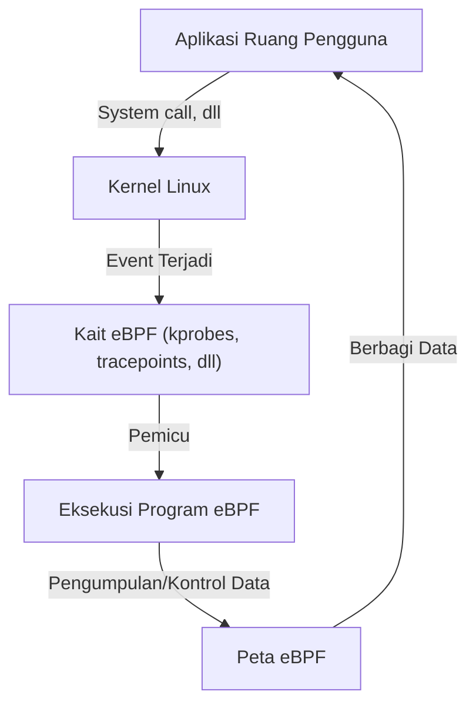

# Pengenalan eBPF: Mekanisme Mengamati dan Mengontrol Tanpa Mengubah Kernel Linux

Dalam lingkungan cloud-native modern dan infrastruktur yang semakin kompleks, memahami secara akurat apa yang terjadi di dalam sistem sangatlah penting. Di antara berbagai teknologi, salah satu yang paling banyak menarik perhatian dalam beberapa tahun terakhir adalah "eBPF (Extended Berkeley Packet Filter)".

Artikel ini akan menggali dan menjelaskan mulai dari konsep dasar eBPF, bagaimana ia mewujudkan perluasan fungsi dinamis sambil menjaga keamanan kernel, hingga bagaimana ia dimanfaatkan di berbagai bidang seperti observabilitas (keteramatan), jaringan, dan keamanan.

## 1. Tantangan pada Perluasan Kernel Linux Tradisional

Kernel Linux, sebagai inti dari OS, mengatur semua operasi sistem termasuk manajemen perangkat keras, penjadwalan proses, dan komunikasi jaringan. Untuk memahami perilaku sistem secara mendalam dan mengendalikannya, akses ke dalam kernel sangatlah penting. Namun, metode tradisional memiliki beberapa hambatan besar.

### Masalah pada Modul Kernel

Dahulu, metode utama untuk memperluas fungsi kernel atau melakukan pelacakan mendalam adalah dengan membuat dan memasukkan modul kernel (Loadable Kernel Module: LKM) sendiri. Namun, pendekatan ini disertai dengan risiko dan tantangan fatal berikut:

1. **Risiko Kerusakan (Kernel Panic)**
   Di ruang kernel (kernel space), tidak ada mekanisme perlindungan memori seperti di ruang pengguna (user space). Jika ada bug dalam modul kernel (contoh: referensi pointer NULL, kebocoran memori, loop tak terbatas), seluruh sistem akan segera crash dan menyebabkan kernel panic. Jika ini terjadi di lingkungan produksi, berarti layanan akan berhenti total.
2. **Kerentanan Keamanan**
   Mengeksekusi kode berbahaya atau rentan di ruang kernel dapat berisiko diambil alihnya kendali seluruh sistem. Sebagian besar Rootkit menyalahgunakan mekanisme ini.
3. **Kompleksitas Pemeliharaan**
   Modul kernel sangat bergantung pada versi kernel tertentu. Setiap kali versi kernel Linux diperbarui, API dan struktur data dapat berubah, sehingga memperbarui dan mengkompilasi ulang modul terus-menerus memakan biaya yang sangat besar.

Karena alasan ini, sangat dibutuhkan mekanisme yang dapat memantau dan mengontrol perilaku kernel secara aman dan fleksibel tanpa mengubah kode kernel secara langsung. Di sinilah eBPF hadir.

## 2. Apa itu eBPF?

eBPF (Extended Berkeley Packet Filter) adalah teknologi inovatif untuk menjalankan program yang di-sandbox secara aman di dalam kernel Linux. Sering juga diibaratkan sebagai "JavaScript untuk Linux". Sama seperti browser web mengeksekusi JavaScript untuk mengubah HTML statis menjadi aplikasi web dinamis, eBPF mengubah kernel Linux menjadi platform yang dapat diprogram secara dinamis.

### Evolusi dari BPF ke eBPF

"BPF (Berkeley Packet Filter)" yang asli dirancang pada tahun 1992 dengan tujuan untuk memfilter paket jaringan secara efisien (digunakan pada tcpdump dan sejenisnya).
Sekitar tahun 2014, arsitektur BPF ini diperluas secara signifikan (Extended), sehingga tidak hanya untuk pemfilteran paket, tetapi juga dapat dipasang dan dieksekusi pada setiap kejadian (event) sistem, seperti system call, fungsi kernel, dan fungsi user space. Saat ini, jika hanya menyebut "eBPF" atau "BPF", umumnya merujuk pada versi yang diperluas ini.



## 3. Arsitektur eBPF: Menyeimbangkan Keamanan dan Kecepatan

Inovasi eBPF terletak pada kemampuannya **menyeimbangkan "keamanan absolut" dan "kecepatan eksekusi yang mendekati kode native"**. Mari kita lihat komponen utama untuk mewujudkannya.

### 3.1. Bytecode dan Sandbox

Program eBPF ditulis dalam subset bahasa C, Rust, dan lainnya, kemudian dikompilasi oleh kompilator LLVM/Clang menjadi "eBPF bytecode" khusus. Bytecode ini dimuat dari ruang pengguna ke ruang kernel, namun tidak dieksekusi secara langsung. Ia dieksekusi dalam lingkungan sandbox yang terisolasi di dalam kernel.

### 3.2. Pemeriksaan Ketat oleh Verifier (Verifikator)

Komponen paling penting yang menjamin keamanan eBPF adalah "Verifier (Verifikator)". Saat program dimuat ke kernel, Verifier melakukan analisis statis pada bytecode untuk memeriksa apakah program memenuhi syarat ketat berikut:

- **Tidak ada loop tak terbatas** (Agar tidak membekukan sistem, program harus dibuktikan pasti akan selesai. Pada kernel terbaru, loop berbatas sudah diizinkan)
- **Tidak ada akses ke memori yang belum diinisialisasi**
- **Tidak ada akses ke area memori kernel yang tidak diizinkan**
- **Tidak melebihi batas ukuran program**

Program yang dinilai "tidak aman" oleh Verifier akan ditolak saat pemuatan. Hal ini mencegah kernel panic.

### 3.3. Akselerasi oleh Kompilator JIT

Bytecode yang lulus pemeriksaan Verifier selanjutnya diubah menjadi bahasa mesin native yang sesuai dengan arsitektur CPU mesin host (x86_64, ARM64, dll) oleh "Kompilator JIT (Just-In-Time)" di dalam kernel.
Karena tidak dieksekusi oleh interpreter melainkan sebagai kode native, kinerjanya sangat tinggi, sebanding dengan modul kernel.

### 3.4. Berbagi Data melalui Peta eBPF (eBPF Maps)

Meskipun program eBPF sendiri berupa pemrosesan singkat yang tidak berstatus (stateless), ia perlu mengirimkan data yang dikumpulkan ke aplikasi di ruang pengguna atau mempertahankan status di antara beberapa eksekusi. Untuk itulah "eBPF Maps" disediakan.
Ini adalah penyimpanan tipe key-value yang menyediakan struktur data seperti hash table, array, dan ring buffer, serta dapat diakses secara asinkron baik dari ruang kernel maupun ruang pengguna.

## 4. Observabilitas (Keteramatan) dan Pelacakan (Tracing)

Salah satu kasus penggunaan eBPF yang paling populer adalah meningkatkan observabilitas, seperti analisis kinerja sistem dan debugging. Dengan menempel secara dinamis ke fungsi kernel atau system call, data mendetail dapat diperoleh secara real-time.

### kprobes dan uprobes

eBPF menggunakan mekanisme berikut untuk mengaitkan event:
- **kprobes (Kernel Probes):** Menempel secara dinamis ke pemanggilan fungsi mana pun (titik masuk dan titik kembali) di ruang kernel.
- **uprobes (User Probes):** Menempel secara dinamis ke fungsi di dalam aplikasi (biner yang ditulis dalam bahasa kompilasi seperti C, C++, Go) di ruang pengguna.
- **Tracepoints:** Titik kait statis yang telah ditentukan sebelumnya oleh pengembang kernel. Karakteristiknya adalah stabilitas ABI yang lebih tinggi daripada kprobes.

### BCC dan bpftrace

Menulis program eBPF dari awal dengan bahasa C dan mengimplementasikan loader membutuhkan banyak usaha. Oleh karena itu, tool front-end seperti "BCC (BPF Compiler Collection)" dan "bpftrace" banyak digunakan.

**Contoh bpftrace:**
Misalnya, jika Anda ingin memantau file yang sedang dibuka (system call `openat`) di seluruh sistem, Anda dapat mewujudkannya dengan skrip 1 baris berikut menggunakan bpftrace.

```bash
sudo bpftrace -e 'tracepoint:syscalls:sys_enter_openat { printf("%s %s\n", comm, str(args->filename)); }'
```
Skrip ini dikompilasi ke program eBPF secara internal, dimuat ke kernel, dan dieksekusi. Nama proses (`comm`) dan nama file yang dibuka akan dicetak secara real-time. Kemampuan melakukan operasi sebanyak ini secara aman tanpa modul kernel adalah kehebatan eBPF.

## 5. Revolusi dalam Jaringan dan Keamanan (Cilium, dll.)

Selain observabilitas, eBPF juga menciptakan pergeseran paradigma di bidang jaringan dan keamanan. Nilai sebenarnya ini sangat terlihat pada lingkungan container seperti Kubernetes.

### XDP (eXpress Data Path)

Dalam tumpukan jaringan (network stack), mekanisme mengeksekusi program eBPF pada tahap paling awal (level driver kartu jaringan) disebut XDP. Karena paket dapat diproses sebelum kernel melakukan analisis paket atau perutean (seperti alokasi sk_buff), ia menawarkan throughput yang luar biasa.
Ini digunakan untuk perlindungan dari serangan DDoS atau pengembangan load balancer berkecepatan sangat tinggi. Kontrol untuk membuang (DROP), meneruskan (TX), atau melewatkan (PASS) paket ke tumpukan jaringan normal dapat dilakukan secara terprogram.

### Service Mesh dan Cilium

Komunikasi antar-container tradisional pada Kubernetes dicapai melalui aturan perutean kompleks menggunakan iptables. Namun, seiring dengan membesarnya skala layanan, puluhan ribu baris aturan iptables menjadi hambatan kinerja (bottleneck), dan manajemennya pun mencapai batas.

Di sinilah plugin CNI (Container Network Interface) berbasis eBPF seperti "Cilium" muncul. Cilium mem-bypass iptables sepenuhnya dan menggunakan eBPF untuk secara langsung melakukan perutean paket, penyeimbangan beban, dan penerapan kebijakan keamanan di dalam kernel.
Selain level TCP/IP, ia juga mewujudkan visibilitas dan kontrol L7 (HTTP, gRPC, Kafka, dll) melalui penerusan lalu lintas transparan ke proksi sidecar (seperti Envoy), menjadikannya teknologi dasar untuk service mesh generasi berikutnya.

## 6. Masa Depan dan Ekosistem eBPF

Saat ini, ekosistem eBPF berkembang sangat pesat. Perusahaan teknologi raksasa seperti Google, Meta, dan Netflix menjalankan eBPF dalam lingkungan produksi pada infrastruktur mereka, serta terus berkontribusi pada komunitas sumber terbuka (open source).

- **Tetragon:** Alat pemantauan keamanan yang diturunkan dari proyek Cilium. Ia memantau eksekusi proses dan akses file pada tingkat kernel secara real-time, dan memblokir perilaku yang melanggar kebijakan.
- **Pixie:** Platform observabilitas Kubernetes untuk pengembang. Ia mengumpulkan metrik, jejak (traces), dan profil aplikasi secara otomatis tanpa perlu mengubah kode.
- **Porting ke Windows:** Di bawah eBPF Foundation, proyek "eBPF for Windows" sedang berlangsung. Di masa depan, eBPF diharapkan menjadi teknologi lintas platform di mana program eBPF yang sama dapat berjalan tidak hanya di Linux tetapi juga di atas kernel Windows.

## 7. Kesimpulan

eBPF bukanlah sekadar penambahan fitur, melainkan teknologi platform yang secara mendasar mengubah cara berinteraksi antara kernel OS dan ruang pengguna. Mekanisme untuk menyuntikkan program secara dinamis tanpa mengorbankan keamanan dan stabilitas kernel kini telah menjadi alat yang sangat diperlukan dalam implementasi penyesuaian kinerja, pemecahan masalah terperinci, kontrol jaringan tingkat lanjut, dan keamanan Zero Trust.

Seiring dengan evolusi teknologi cloud-native, cakupan aplikasi eBPF tentu akan semakin meluas. Bagi para insinyur yang tertarik dengan prinsip kerja mendalam Linux, mempelajari eBPF pasti akan menjadi investasi yang sangat berharga untuk meningkatkan pemahaman terhadap sistem ke tingkat yang jauh lebih tinggi.
