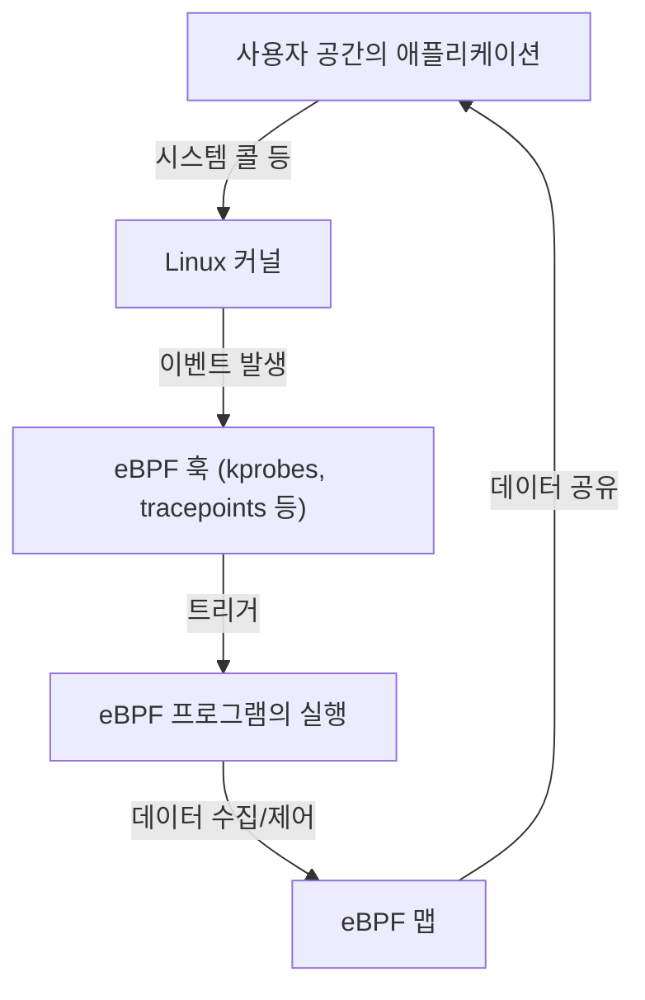

# eBPF 입문: Linux 커널을 변경하지 않고 관측 및 제어하는 구조

현대의 클라우드 네이티브 환경이나 복잡해지는 인프라스트럭처에서 시스템 내부에서 무슨 일이 일어나고 있는지 정확하게 파악하는 것은 매우 중요합니다. 그 중 최근 가장 주목받고 있는 기술 중 하나가 'eBPF(Extended Berkeley Packet Filter)'입니다.

본 기사에서는 eBPF의 기초적인 개념부터, 어떻게 커널의 안전성을 유지하면서 동적인 기능 확장을 실현하고 있는지, 그리고 옵저버빌리티(관측성), 네트워킹, 보안이라는 다양한 영역에서 어떻게 활용되고 있는지에 대해 깊이 파헤쳐 해설합니다.

## 1. 기존 Linux 커널 확장의 과제

Linux 커널은 OS의 핵심으로서 하드웨어 관리, 프로세스 스케줄링, 네트워크 통신 등 모든 시스템 동작을 관장하고 있습니다. 시스템의 동작을 깊이 이해하고 제어하기 위해서는 커널 내부에 대한 접근이 필수적입니다. 그러나 기존 방법에는 몇 가지 큰 장벽이 있었습니다.

### 커널 모듈의 문제점

과거에 커널의 기능을 확장하거나 깊은 수준에서의 트레이스를 수행하기 위한 주요 수단은 커널 모듈(Loadable Kernel Module: LKM)을 자체 제작하여 통합하는 것이었습니다. 그러나 이 접근 방식에는 다음과 같은 치명적인 위험과 과제가 따릅니다.

1. **크래시 위험 (커널 패닉)**
   커널 공간에는 사용자 공간과 같은 메모리 보호 메커니즘이 존재하지 않습니다. 커널 모듈 내에 버그(예: NULL 포인터 참조, 메모리 누수, 무한 루프)가 있으면 시스템 전체가 즉각적으로 크래시되며 커널 패닉을 일으킵니다. 프로덕션 환경에서 이것이 발생할 경우 서비스의 완전한 중단을 의미합니다.
2. **보안 취약성**
   악의적인 코드나 취약한 코드를 커널 공간에서 실행해 버리면 시스템 전체의 제어권을 빼앗길 위험이 있습니다. 루트킷(Rootkit)의 대부분은 이 구조를 악용하고 있습니다.
3. **유지보수의 복잡성**
   커널 모듈은 특정 커널 버전에 강하게 의존합니다. Linux 커널의 버전이 올라갈 때마다 API나 데이터 구조가 변경될 가능성이 있으며, 그에 맞춰 모듈을 계속 업데이트하고 재컴파일하는 것은 매우 비용이 많이 듭니다.

이러한 이유로 커널 코드에 직접 손을 대지 않고 안전하고 유연하게 커널의 동작을 감시하고 제어할 수 있는 구조가 강하게 요구되었습니다. 그래서 등장한 것이 eBPF입니다.

## 2. eBPF란 무엇인가?

eBPF(Extended Berkeley Packet Filter)는 Linux 커널 내에서 안전하게 샌드박스화된 프로그램을 실행하기 위한 혁신적인 기술입니다. 'Linux의 JavaScript'에 비유되기도 합니다. 웹 브라우저가 JavaScript를 실행하여 정적인 HTML을 동적인 웹 애플리케이션으로 바꾸는 것처럼, eBPF는 Linux 커널을 동적으로 프로그래밍 가능한 플랫폼으로 변모시킵니다.

### BPF에서 eBPF로의 진화

원래의 'BPF(Berkeley Packet Filter)'는 1992년에 네트워크 패킷을 효율적으로 필터링할 목적으로 설계되었습니다(tcpdump 등에서 사용되고 있습니다).
2014년경, 이 BPF의 아키텍처가 대폭 확장(Extended)되어 패킷 필터링뿐만 아니라 시스템 콜, 커널 함수, 사용자 공간 함수 등 시스템의 모든 이벤트에 연결하여 실행할 수 있게 되었습니다. 현재는 단순히 'eBPF' 또는 'BPF'라고 부를 경우 이 확장된 버전을 가리키는 것이 일반적입니다.



## 3. eBPF의 아키텍처: 안전과 고속의 양립

eBPF가 혁신적인 것은 **'절대적인 안전성'과 '네이티브 코드에 가까운 실행 속도'를 양립**시키고 있다는 점입니다. 이를 실현하기 위한 주요 컴포넌트를 살펴보겠습니다.

### 3.1. 바이트코드와 샌드박스

eBPF 프로그램은 C 언어의 서브셋이나 Rust 등으로 작성되며, LLVM/Clang 컴파일러에 의해 전용 'eBPF 바이트코드'로 컴파일됩니다. 이 바이트코드는 사용자 공간에서 커널 공간으로 로드되지만, 직접 실행되는 것은 아닙니다. 커널 내의 격리된 샌드박스 환경에서 실행됩니다.

### 3.2. Verifier(검증기)에 의한 엄격한 심사

eBPF의 안전성을 담보하는 가장 중요한 컴포넌트가 'Verifier(검증기)'입니다. 프로그램이 커널에 로드될 때, Verifier는 바이트코드를 정적 분석하여 다음과 같은 엄격한 조건을 통과하는지 확인합니다.

- **무한 루프가 존재하지 않을 것** (시스템을 멈추게 하지 않기 위해, 반드시 종료된다는 것이 증명되어야 합니다. 최근의 커널에서는 제한된 루프가 허용되고 있습니다)
- **초기화되지 않은 메모리에 대한 접근이 없을 것**
- **허가되지 않은 커널 메모리 영역에 대한 접근이 없을 것**
- **프로그램의 크기 제한을 초과하지 않을 것**

Verifier가 '안전하지 않다'고 판단한 프로그램은 로드가 거부됩니다. 이를 통해 커널 패닉을 방지합니다.

### 3.3. JIT 컴파일러에 의한 고속화

Verifier의 심사를 통과한 바이트코드는 다음으로 커널 내의 'JIT(Just-In-Time) 컴파일러'에 의해 호스트 머신의 CPU 아키텍처(x86_64, ARM64 등)의 네이티브 기계어로 변환됩니다.
인터프리터로 실행되는 것이 아니라 네이티브 코드로 실행되기 때문에 커널 모듈에 필적하는 매우 높은 퍼포먼스를 발휘합니다.

### 3.4. eBPF Maps를 통한 데이터 공유

eBPF 프로그램 자체는 상태를 가지지 않는 짧은 처리이지만, 수집한 데이터를 사용자 공간의 애플리케이션에 전달하거나 여러 번의 실행 간에 상태를 유지해야 할 필요가 있습니다. 이를 위해 준비된 것이 'eBPF Maps'입니다.
이는 해시 테이블, 배열, 링 버퍼 등의 데이터 구조를 제공하는 키-값(Key-Value) 형태의 저장소이며, 커널 공간과 사용자 공간 모두에서 비동기적으로 접근할 수 있습니다.

## 4. 옵저버빌리티(관측성)와 트레이스

eBPF의 가장 인기 있는 유스케이스 중 하나가 시스템의 퍼포먼스 분석이나 디버깅과 같은 옵저버빌리티 향상입니다. 커널 함수나 시스템 콜에 동적으로 연결하여 실시간으로 상세한 데이터를 얻을 수 있습니다.

### kprobes와 uprobes

eBPF는 주로 다음의 메커니즘을 사용하여 이벤트를 훅(hook)합니다.
- **kprobes (Kernel Probes):** 커널 공간의 임의의 함수 호출(엔트리 포인트와 리턴 포인트)에 동적으로 연결합니다.
- **uprobes (User Probes):** 사용자 공간의 애플리케이션 내의 함수(C, C++, Go 등의 컴파일 언어로 작성된 바이너리)에 동적으로 연결합니다.
- **Tracepoints:** 커널 개발자에 의해 사전에 정의된 정적인 훅 포인트입니다. kprobes보다 ABI의 안정성이 높은 것이 특징입니다.

### BCC와 bpftrace

eBPF 프로그램을 처음부터 C 언어로 작성하고 로더를 구현하는 것은 매우 수고스럽습니다. 그래서 프런트엔드 도구로서 'BCC(BPF Compiler Collection)'나 'bpftrace'가 널리 사용되고 있습니다.

**bpftrace의 예:**
예를 들어, 시스템 전체에서 현재 열려 있는 파일(`openat` 시스템 콜)을 감시하고 싶을 경우, bpftrace를 사용하면 다음과 같은 1줄짜리 스크립트로 구현할 수 있습니다.

```bash
sudo bpftrace -e 'tracepoint:syscalls:sys_enter_openat { printf("%s %s\n", comm, str(args->filename)); }'
```
이 스크립트는 내부적으로 eBPF 프로그램으로 컴파일되어 커널에 로드되고 실행됩니다. 프로세스 이름(`comm`)과 열려 있는 파일 이름이 실시간으로 출력됩니다. 이만한 조작을 커널 모듈 없이 안전하게 할 수 있는 것이 eBPF의 위력입니다.

## 5. 네트워크와 보안에서의 혁명 (Cilium 등)

옵저버빌리티에 더해, 네트워크와 보안 분야에서도 eBPF는 패러다임 시프트를 일으키고 있습니다. 특히 Kubernetes와 같은 컨테이너 환경에서 그 진가가 발휘됩니다.

### XDP (eXpress Data Path)

네트워크 스택에서 eBPF 프로그램을 가장 빠른 단계(네트워크 카드 드라이버 수준)에서 실행하는 구조가 XDP입니다. 커널이 패킷 분석이나 라우팅(sk_buff 할당 등)을 수행하기 전에 패킷을 처리할 수 있으므로 경이로운 처리량을 자랑합니다.
DDoS 공격 방어나 초고속 로드 밸런서 개발에 이용되고 있습니다. 패킷을 폐기(DROP), 전송(TX), 또는 일반 네트워크 스택으로 전달(PASS)하는 제어를 프로그래밍 가능하게 수행할 수 있습니다.

### 서비스 메시와 Cilium

기존의 Kubernetes에서의 컨테이너 간 통신은 iptables를 이용한 복잡한 라우팅 규칙을 통해 실현되었습니다. 그러나 서비스 규모가 커지면 수만 줄에 달하는 iptables 규칙이 퍼포먼스의 병목이 되고, 관리도 한계에 이릅니다.

여기서 'Cilium' 등의 eBPF 기반 CNI(Container Network Interface) 플러그인이 등장했습니다. Cilium은 iptables를 완전히 우회하고, eBPF를 사용하여 커널 내에서 직접 패킷 라우팅, 로드 밸런싱, 보안 정책 적용을 수행합니다.
또한 TCP/IP 수준뿐만 아니라 L7(HTTP, gRPC, Kafka 등)의 가시화 및 제어도 사이드카 프록시(Envoy 등)로의 투명한 트래픽 전송을 통해 실현하며, 차세대 서비스 메시의 기반 기술이 되고 있습니다.

## 6. eBPF의 미래와 생태계

현재 eBPF의 생태계는 급속히 확대되고 있습니다. Google, Meta, Netflix와 같은 거대 테크 기업들이 자사의 인프라에서 eBPF를 프로덕션 환경에 운용하고 있으며, 오픈소스 커뮤니티에 기여를 계속하고 있습니다.

- **Tetragon:** Cilium 프로젝트에서 파생된 보안 감시 도구. 커널 수준에서의 프로세스 실행이나 파일 접근을 실시간으로 감시하고 정책을 위반하는 동작을 차단합니다.
- **Pixie:** 개발자를 위한 Kubernetes 옵저버빌리티 플랫폼. 코드를 변경하지 않고 애플리케이션의 메트릭, 트레이스, 프로필을 자동으로 수집합니다.
- **Windows로의 이식:** eBPF Foundation 주도로 'eBPF for Windows' 프로젝트가 진행되고 있으며, 미래에는 Linux뿐만 아니라 Windows 커널 위에서도 공통된 eBPF 프로그램이 동작하는 크로스 플랫폼 기술이 될 것으로 기대되고 있습니다.

## 7. 요약

eBPF는 단순한 기능 추가가 아니라, OS 커널과 사용자 공간의 관계를 근본부터 바꾸는 플랫폼 기술입니다. 커널의 안전성과 안정성을 해치지 않으면서 프로그램을 동적으로 주입할 수 있는 구조는 퍼포먼스 튜닝, 상세한 트러블슈팅, 고도의 네트워크 제어, 그리고 제로 트러스트 보안 구현에 있어 이제 없어서는 안 될 도구가 되었습니다.

클라우드 네이티브 기술의 진화와 함께 eBPF의 응용 범위는 더욱 넓어질 것입니다. Linux의 깊은 동작 원리에 관심이 있는 엔지니어에게 eBPF를 배우는 것은 시스템에 대한 이해를 한 단계 더 높은 수준으로 끌어올리는 매우 의미 있는 투자가 될 것입니다.
