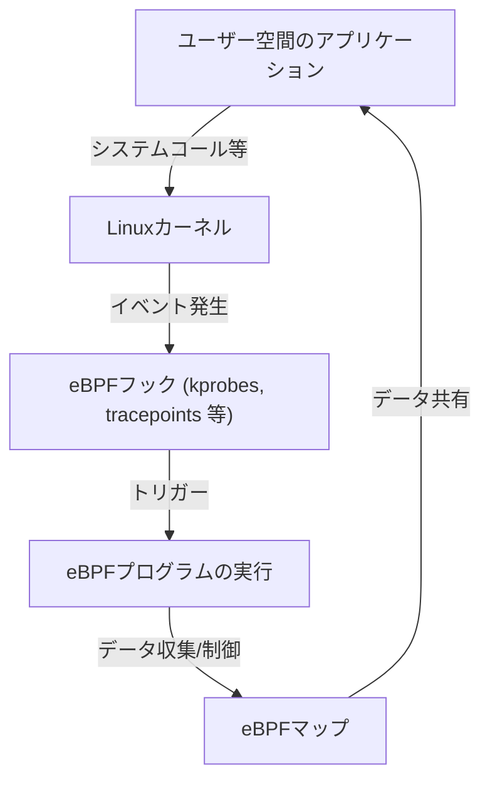

# eBPF入門：Linuxカーネルを変更せず観測・制御する仕組み

現代のクラウドネイティブ環境や複雑化するインフラストラクチャにおいて、システム内部で何が起きているのかを正確に把握することは極めて重要です。その中で近年、最も注目を集めている技術の一つが「eBPF（Extended Berkeley Packet Filter）」です。

本記事では、eBPFの基礎的な概念から、それがどのようにしてカーネルの安全性を保ちながら動的な機能拡張を実現しているのか、そしてオブザーバビリティ（可観測性）、ネットワーキング、セキュリティといった多岐にわたる領域でどのように活用されているのかについて、深く掘り下げて解説します。

## 1. 従来のLinuxカーネル拡張における課題

Linuxカーネルは、OSの中核としてハードウェアの管理、プロセスのスケジューリング、ネットワーク通信など、あらゆるシステム動作を司っています。システムの挙動を深く理解し、制御するためにはカーネル内部へのアクセスが不可欠です。しかし、従来の方法にはいくつかの大きな壁がありました。

### カーネルモジュールの問題点

かつて、カーネルの機能を拡張したり、深いレベルでのトレースを行ったりするための主要な手段は、カーネルモジュール（Loadable Kernel Module: LKM）を自作して組み込むことでした。しかし、このアプローチには以下の致命的なリスクと課題が伴います。

1. **クラッシュのリスク（カーネルパニック）**
   カーネル空間には、ユーザー空間のようなメモリ保護機構が存在しません。カーネルモジュール内にバグ（例：NULLポインタ参照、メモリリーク、無限ループ）があると、システム全体が即座にクラッシュし、カーネルパニックを引き起こします。本番環境でこれが発生した場合、サービスの完全な停止を意味します。
2. **セキュリティの脆弱性**
   悪意のあるコードや脆弱なコードをカーネル空間で実行してしまうと、システム全体の制御を奪われる危険性があります。Rootkitの多くはこの仕組みを悪用しています。
3. **メンテナンスの複雑さ**
   カーネルモジュールは、特定のカーネルバージョンに強く依存します。Linuxカーネルのバージョンが上がるたびに、APIやデータ構造が変更される可能性があり、それに追従してモジュールを更新・再コンパイルし続けるのは非常にコストがかかります。

これらの理由から、カーネルコードに直接手を加えることなく、安全かつ柔軟にカーネルの挙動を監視・制御する仕組みが強く求められていました。そこで登場したのがeBPFです。

## 2. eBPFとは何か？

eBPF（Extended Berkeley Packet Filter）は、Linuxカーネル内で安全にサンドボックス化されたプログラムを実行するための革新的な技術です。「LinuxにおけるJavaScript」と例えられることもあります。WebブラウザがJavaScriptを実行して静的なHTMLを動的なWebアプリケーションに変えるように、eBPFはLinuxカーネルを動的にプログラミング可能なプラットフォームへと変貌させます。

### BPFからeBPFへの進化

元々の「BPF（Berkeley Packet Filter）」は、1992年にネットワークパケットを効率的にフィルタリングする目的で設計されました（tcpdumpなどで使用されています）。
2014年頃、このBPFのアーキテクチャが大幅に拡張され（Extended）、パケットフィルタリングだけでなく、システムコール、カーネル関数、ユーザースペース関数など、システムのあらゆるイベントにアタッチして実行できるようになりました。現在では、単に「eBPF」または「BPF」と呼ぶ場合、この拡張されたバージョンを指すのが一般的です。



## 3. eBPFのアーキテクチャ：安全と高速の両立

eBPFが革新的なのは、**「絶対的な安全性」と「ネイティブコードに近い実行速度」を両立**させている点です。これを実現するための主要なコンポーネントを見ていきましょう。

### 3.1. バイトコードとサンドボックス

eBPFプログラムは、C言語のサブセットやRustなどで記述され、LLVM/Clangコンパイラによって専用の「eBPFバイトコード」にコンパイルされます。このバイトコードはユーザー空間からカーネル空間にロードされますが、直接実行されるわけではありません。カーネル内の隔離されたサンドボックス環境で実行されます。

### 3.2. Verifier（検証器）による厳格な審査

eBPFの安全性を担保する最も重要なコンポーネントが「Verifier（検証器）」です。プログラムがカーネルにロードされる際、Verifierはバイトコードを静的解析し、以下のような厳しい条件をクリアしているかをチェックします。

- **無限ループが存在しないこと**（システムをフリーズさせないため、必ず終了することが証明されなければならない。最近のカーネルでは有界ループが許可されています）
- **初期化されていないメモリへのアクセスがないこと**
- **許可されていないカーネルメモリ領域へのアクセスがないこと**
- **プログラムのサイズ制限を超えていないこと**

Verifierが「安全ではない」と判断したプログラムは、ロードが拒否されます。これにより、カーネルパニックを防ぎます。

### 3.3. JITコンパイラによる高速化

Verifierの審査を通過したバイトコードは、次にカーネル内の「JIT（Just-In-Time）コンパイラ」によって、ホストマシンのCPUアーキテクチャ（x86_64, ARM64など）のネイティブな機械語に変換されます。
インタプリタで実行されるのではなく、ネイティブコードとして実行されるため、カーネルモジュールに匹敵する非常に高いパフォーマンスを発揮します。

### 3.4. eBPF Mapsによるデータ共有

eBPFプログラム自体は状態を持たない短い処理ですが、収集したデータをユーザー空間のアプリケーションに渡したり、複数回の実行間で状態を保持したりする必要があります。そのために用意されているのが「eBPF Maps」です。
これはハッシュテーブル、配列、リングバッファなどのデータ構造を提供するキーバリュー型ストアであり、カーネル空間とユーザー空間の両方から非同期にアクセスできます。

## 4. オブザーバビリティ（可観測性）とトレース

eBPFの最もポピュラーなユースケースの一つが、システムのパフォーマンス解析やデバッグといったオブザーバビリティの向上です。カーネル関数やシステムコールに動的にアタッチして、リアルタイムに詳細なデータを取得できます。

### kprobes と uprobes

eBPFは主に以下の仕組みを使ってイベントをフックします。
- **kprobes (Kernel Probes):** カーネル空間の任意の関数呼び出し（エントリポイントとリターンポイント）に動的にアタッチします。
- **uprobes (User Probes):** ユーザー空間のアプリケーション内の関数（C, C++, Goなどのコンパイル言語で書かれたバイナリ）に動的にアタッチします。
- **Tracepoints:** カーネル開発者によって事前に定義された静的なフックポイントです。kprobesよりもABIの安定性が高いのが特徴です。

### BCC と bpftrace

eBPFプログラムをゼロからC言語で書き、ローダーを実装するのは非常に手間がかかります。そこで、フロントエンドツールとして「BCC（BPF Compiler Collection）」や「bpftrace」が広く使われています。

**bpftraceの例:**
例えば、システム全体で現在開かれているファイル（`openat`システムコール）を監視したい場合、bpftraceを使うと以下のような1行のスクリプトで実現できます。

```bash
sudo bpftrace -e 'tracepoint:syscalls:sys_enter_openat { printf("%s %s\n", comm, str(args->filename)); }'
```
このスクリプトは、内部でeBPFプログラムにコンパイルされ、カーネルにロードされて実行されます。プロセス名（`comm`）と開かれたファイル名がリアルタイムに出力されます。これだけの操作をカーネルモジュールなしで安全に行えるのがeBPFの威力です。

## 5. ネットワークとセキュリティにおける革命 (Ciliumなど)

オブザーバビリティに加えて、ネットワークとセキュリティの分野でもeBPFはパラダイムシフトを起こしています。特にKubernetesなどのコンテナ環境において、その真価が発揮されます。

### XDP (eXpress Data Path)

ネットワークスタックにおいて、eBPFプログラムを最も早い段階（ネットワークカードのドライバレベル）で実行する仕組みがXDPです。カーネルがパケットの解析やルーティング（sk_buffの割り当てなど）を行う前にパケットを処理できるため、驚異的なスループットを誇ります。
DDoS攻撃の防御や、超高速なロードバランサの開発に利用されています。パケットを破棄（DROP）、転送（TX）、または通常のネットワークスタックへパス（PASS）する制御をプログラマブルに行えます。

### サービスメッシュとCilium

従来のKubernetesにおけるコンテナ間通信は、iptablesを利用した複雑なルーティングルールによって実現されていました。しかし、サービスの規模が拡大すると、数万行にも及ぶiptablesのルールがパフォーマンスのボトルネックになり、管理も限界に達します。

ここで「Cilium」などのeBPFベースのCNI（Container Network Interface）プラグインが登場しました。Ciliumはiptablesを完全にバイパスし、eBPFを用いてカーネル内で直接パケットのルーティング、ロードバランシング、セキュリティポリシーの適用を行います。
また、TCP/IPレベルだけでなく、L7（HTTP, gRPC, Kafkaなど）の可視化や制御もサイドカープロキシ（Envoyなど）への透過的なトラフィック転送を通じて実現し、次世代のサービスメッシュの基盤技術となっています。

## 6. eBPFの未来とエコシステム

現在、eBPFのエコシステムは急速に拡大しています。Google, Meta, Netflixといった巨大テック企業が自社のインフラでeBPFを本番運用し、オープンソースコミュニティへの貢献を続けています。

- **Tetragon:** Ciliumプロジェクトから派生したセキュリティ監視ツール。カーネルレベルでのプロセスの実行やファイルアクセスをリアルタイムに監視し、ポリシーに違反する動作をブロックします。
- **Pixie:** 開発者向けのKubernetesオブザーバビリティプラットフォーム。コードを変更せずにアプリケーションのメトリクス、トレース、プロファイルを自動的に収集します。
- **Windowsへの移植:** eBPF Foundationのもと、「eBPF for Windows」プロジェクトが進行しており、将来的にはLinuxだけでなくWindowsカーネル上でも共通のeBPFプログラムが動くクロスプラットフォームな技術になることが期待されています。

## 7. まとめ

eBPFは、単なる機能追加ではなく、OSカーネルとユーザー空間との関わり方を根本から変えるプラットフォーム技術です。カーネルの安全性と安定性を損なうことなく、プログラムを動的に注入できる仕組みは、パフォーマンスチューニング、詳細なトラブルシューティング、高度なネットワーク制御、そしてゼロトラストセキュリティの実装において、今や欠かせないツールとなっています。

クラウドネイティブ技術の進化とともに、eBPFの応用範囲はさらに広がっていくことでしょう。Linuxの深い動作原理に興味があるエンジニアにとって、eBPFを学ぶことは、システムへの理解を一段高いレベルへと引き上げる非常に有意義な投資となるはずです。
