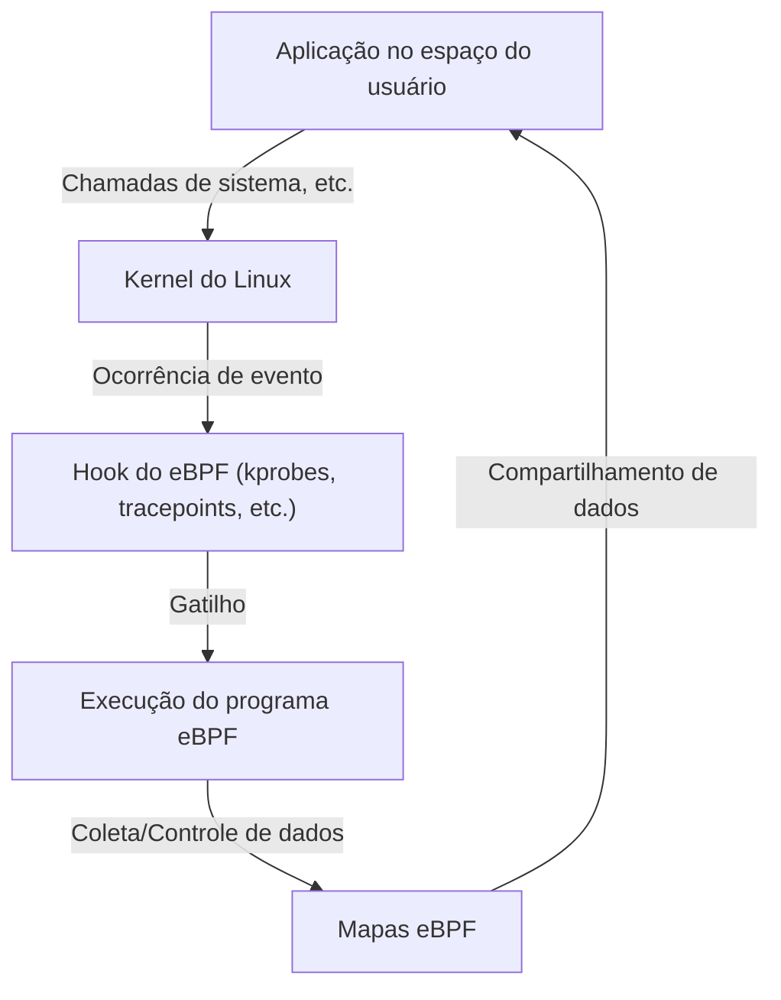

# Introdução ao eBPF: Como observar e controlar o kernel do Linux sem modificá-lo

Em ambientes cloud-native modernos e infraestruturas cada vez mais complexas, é extremamente importante entender exatamente o que está acontecendo dentro do sistema. Nesse contexto, uma das tecnologias que mais tem chamado a atenção nos últimos anos é o "eBPF (Extended Berkeley Packet Filter)".

Neste artigo, vamos nos aprofundar e explicar desde os conceitos básicos do eBPF, até como ele realiza a expansão dinâmica de funcionalidades mantendo a segurança do kernel, e como ele é utilizado em diversas áreas, como observabilidade (observability), redes e segurança.

## 1. Desafios na extensão tradicional do kernel do Linux

O kernel do Linux, como núcleo do SO, gerencia todo o comportamento do sistema, incluindo o gerenciamento de hardware, escalonamento de processos e comunicação de rede. Para entender e controlar profundamente o comportamento do sistema, o acesso aos componentes internos do kernel é essencial. No entanto, os métodos tradicionais apresentavam algumas barreiras significativas.

### Problemas com os Módulos do Kernel

No passado, o principal meio de estender as funções do kernel ou realizar rastreamentos (tracing) de baixo nível era criar e incorporar módulos do kernel (Loadable Kernel Module: LKM). No entanto, esta abordagem traz consigo os seguintes riscos e desafios fatais:

1. **Risco de Crash (Kernel Panic)**
   No espaço do kernel, não existe um mecanismo de proteção de memória como no espaço do usuário. Se houver um bug (ex: referência a ponteiro NULL, vazamento de memória, loop infinito) no módulo do kernel, todo o sistema trava imediatamente, causando um kernel panic. Se isso ocorrer em um ambiente de produção, significa a paralisação completa do serviço.
2. **Vulnerabilidades de Segurança**
   Executar códigos maliciosos ou vulneráveis no espaço do kernel traz o risco de perder o controle de todo o sistema. Muitos Rootkits abusam desse mecanismo.
3. **Complexidade de Manutenção**
   Os módulos do kernel dependem fortemente de uma versão específica do kernel. Sempre que a versão do kernel do Linux é atualizada, a API e as estruturas de dados podem mudar, e continuar atualizando e recompilando os módulos para acompanhar essas mudanças é muito custoso.

Por essas razões, havia uma forte demanda por um mecanismo que pudesse monitorar e controlar o comportamento do kernel de forma segura e flexível, sem modificar diretamente o código do kernel. Foi aí que surgiu o eBPF.

## 2. O que é o eBPF?

O eBPF (Extended Berkeley Packet Filter) é uma tecnologia inovadora para executar programas de forma segura e em sandbox dentro do kernel do Linux. Às vezes, é comparado ao "JavaScript no Linux". Assim como um navegador web executa JavaScript para transformar HTML estático em uma aplicação web dinâmica, o eBPF transforma o kernel do Linux em uma plataforma programável dinamicamente.

### A evolução do BPF para o eBPF

O "BPF (Berkeley Packet Filter)" original foi projetado em 1992 com o objetivo de filtrar pacotes de rede de forma eficiente (usado no tcpdump, por exemplo).
Por volta de 2014, a arquitetura deste BPF foi consideravelmente expandida (Extended), permitindo não apenas a filtragem de pacotes, mas também a vinculação e execução em qualquer evento do sistema, como chamadas de sistema, funções do kernel e funções do espaço do usuário. Atualmente, quando se diz simplesmente "eBPF" ou "BPF", geralmente se refere a esta versão estendida.



## 3. Arquitetura do eBPF: Equilibrando Segurança e Alta Velocidade

O que torna o eBPF inovador é o fato de ele **equilibrar "segurança absoluta" e "velocidade de execução próxima ao código nativo"**. Vamos ver os principais componentes para realizar isso.

### 3.1. Bytecode e Sandbox

Os programas eBPF são escritos em um subconjunto da linguagem C, Rust, entre outras, e compilados pelo compilador LLVM/Clang em um "bytecode eBPF" dedicado. Este bytecode é carregado do espaço do usuário para o espaço do kernel, mas não é executado diretamente. Ele é executado em um ambiente de sandbox isolado dentro do kernel.

### 3.2. Análise Rigorosa pelo Verifier (Verificador)

O componente mais importante que garante a segurança do eBPF é o "Verifier (Verificador)". Quando o programa é carregado no kernel, o Verifier realiza uma análise estática do bytecode e verifica se ele atende a condições rigorosas como as seguintes:

- **Não existência de loops infinitos** (deve ser comprovado que ele sempre terminará, para não congelar o sistema. Em kernels recentes, loops limitados são permitidos)
- **Não haver acesso a memórias não inicializadas**
- **Não haver acesso a áreas de memória do kernel não autorizadas**
- **Não exceder o limite de tamanho do programa**

Programas julgados "inseguros" pelo Verifier têm seu carregamento recusado. Isso previne kernel panics.

### 3.3. Aceleração pelo Compilador JIT

O bytecode que passou pela análise do Verifier é então convertido para o código de máquina nativo da arquitetura da CPU da máquina host (x86_64, ARM64, etc.) através de um "compilador JIT (Just-In-Time)" dentro do kernel.
Como não é executado por um interpretador, mas sim como código nativo, ele atinge uma performance extremamente alta, comparável à dos módulos do kernel.

### 3.4. Compartilhamento de Dados através de Mapas eBPF (eBPF Maps)

Os programas eBPF em si são processos curtos e sem estado, mas eles precisam passar os dados coletados para as aplicações no espaço do usuário ou manter o estado entre múltiplas execuções. Para isso, são fornecidos os "eBPF Maps".
Trata-se de um armazenamento do tipo chave-valor (key-value) que fornece estruturas de dados como tabelas de hash, arrays e ring buffers, e pode ser acessado de forma assíncrona tanto pelo espaço do kernel quanto pelo espaço do usuário.

## 4. Observabilidade (Observability) e Tracing

Um dos casos de uso mais populares do eBPF é a melhoria da observabilidade, como na análise de desempenho e debugging do sistema. É possível vincular-se dinamicamente a funções do kernel ou chamadas de sistema e obter dados detalhados em tempo real.

### kprobes e uprobes

O eBPF usa principalmente os seguintes mecanismos para capturar (hook) eventos:
- **kprobes (Kernel Probes):** Vincula-se dinamicamente a qualquer chamada de função (pontos de entrada e retorno) no espaço do kernel.
- **uprobes (User Probes):** Vincula-se dinamicamente a funções dentro de aplicações no espaço do usuário (binários escritos em linguagens compiladas como C, C++, Go, etc.).
- **Tracepoints:** São pontos de hook estáticos predefinidos pelos desenvolvedores do kernel. Eles se caracterizam por terem uma maior estabilidade de ABI do que os kprobes.

### BCC e bpftrace

Escrever um programa eBPF em C a partir do zero e implementar um loader dá muito trabalho. Portanto, ferramentas de frontend como "BCC (BPF Compiler Collection)" e "bpftrace" são amplamente utilizadas.

**Exemplo do bpftrace:**
Por exemplo, se você quiser monitorar os arquivos atualmente abertos em todo o sistema (a chamada de sistema `openat`), pode conseguir isso com um script de uma linha usando o bpftrace:

```bash
sudo bpftrace -e 'tracepoint:syscalls:sys_enter_openat { printf("%s %s\n", comm, str(args->filename)); }'
```
Este script é compilado internamente em um programa eBPF, carregado no kernel e executado. O nome do processo (`comm`) e o nome do arquivo aberto são exibidos em tempo real. O poder do eBPF é poder realizar uma operação desse tipo com segurança e sem módulos do kernel.

## 5. Revolução em Redes e Segurança (Cilium, etc.)

Além da observabilidade, o eBPF também está causando uma mudança de paradigma nas áreas de redes e segurança. Seu verdadeiro valor é especialmente demonstrado em ambientes de contêineres como o Kubernetes.

### XDP (eXpress Data Path)

Na stack de rede, o XDP é um mecanismo para executar programas eBPF na fase mais inicial (no nível do driver da placa de rede). Como os pacotes podem ser processados antes que o kernel realize a análise ou roteamento de pacotes (como alocação de sk_buff), ele apresenta um throughput (taxa de transferência) surpreendente.
É utilizado para defesa contra ataques DDoS e no desenvolvimento de balanceadores de carga ultrarrápidos. Ele permite controlar de forma programável se um pacote será descartado (DROP), transmitido (TX) ou passado (PASS) para a stack de rede normal.

### Service Mesh e Cilium

A comunicação tradicional entre contêineres no Kubernetes era realizada por meio de regras complexas de roteamento usando o iptables. No entanto, quando o tamanho do serviço se expande, dezenas de milhares de linhas de regras do iptables se tornam um gargalo de desempenho, e o gerenciamento atinge o seu limite.

Aí entraram os plugins de CNI (Container Network Interface) baseados em eBPF, como o "Cilium". O Cilium contorna completamente o iptables e usa o eBPF para realizar o roteamento de pacotes, balanceamento de carga e aplicação de políticas de segurança diretamente no kernel.
Além disso, ele realiza visibilidade e controle não apenas no nível de TCP/IP, mas também no L7 (HTTP, gRPC, Kafka, etc.) através do roteamento transparente de tráfego para proxies sidecar (como o Envoy), tornando-se uma tecnologia fundamental para os service meshes da próxima geração.

## 6. O Futuro e o Ecossistema do eBPF

Atualmente, o ecossistema do eBPF está se expandindo rapidamente. Gigantes da tecnologia como Google, Meta e Netflix executam o eBPF em produção em suas infraestruturas e continuam a contribuir com a comunidade de código aberto.

- **Tetragon:** Ferramenta de monitoramento de segurança derivada do projeto Cilium. Monitora a execução de processos e o acesso a arquivos em nível de kernel em tempo real e bloqueia ações que violem políticas.
- **Pixie:** Plataforma de observabilidade do Kubernetes para desenvolvedores. Coleta automaticamente métricas, rastreamentos e perfis de aplicações sem modificar o código.
- **Migração para Windows:** Sob o guarda-chuva da eBPF Foundation, o projeto "eBPF for Windows" está em andamento e, no futuro, espera-se que o eBPF se torne uma tecnologia multiplataforma onde os mesmos programas eBPF funcionarão não apenas no kernel do Linux, mas também no kernel do Windows.

## 7. Conclusão

O eBPF não é apenas a adição de funcionalidades; é uma tecnologia de plataforma que muda fundamentalmente como interagimos com o kernel do sistema operacional e o espaço do usuário. A capacidade de injetar programas dinamicamente sem comprometer a segurança e a estabilidade do kernel o tornou uma ferramenta essencial hoje em dia para o ajuste de desempenho, resolução de problemas detalhada, controle avançado de rede e a implementação de segurança zero trust.

Com a evolução das tecnologias cloud-native, a gama de aplicações do eBPF continuará se expandindo. Para os engenheiros interessados nos princípios de funcionamento profundo do Linux, aprender eBPF certamente será um investimento valioso que elevará a sua compreensão dos sistemas a um novo patamar.
