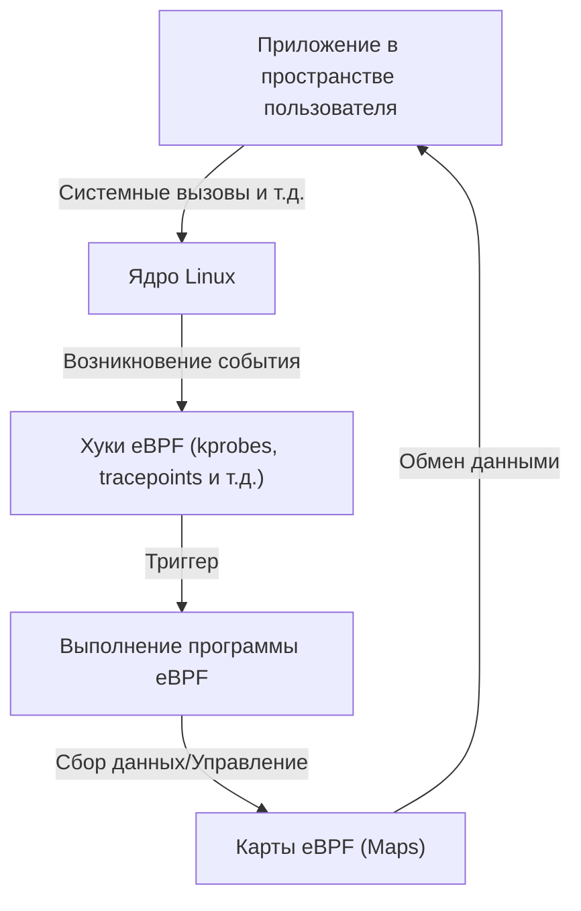

# Введение в eBPF: Механизм наблюдения и управления без изменения ядра Linux

В современных облачных средах (cloud-native) и усложняющейся инфраструктуре крайне важно точно понимать, что происходит внутри системы. В связи с этим одной из самых обсуждаемых технологий последних лет стал «eBPF» (Extended Berkeley Packet Filter).

В этой статье мы подробно рассмотрим базовые концепции eBPF: как он позволяет динамически расширять функции ядра, сохраняя его безопасность, и как эта технология применяется в самых разных областях, таких как наблюдаемость (observability), сети и безопасность.

## 1. Проблемы традиционного расширения ядра Linux

Ядро Linux, как центральная часть ОС, управляет всеми действиями системы: управлением оборудованием, планированием процессов, сетевым взаимодействием и т. д. Для глубокого понимания поведения системы и управления ею необходим доступ к внутренностям ядра. Однако традиционные методы имели несколько серьезных барьеров.

### Недостатки модулей ядра

В прошлом основным способом расширения функций ядра или выполнения глубокой трассировки было создание и загрузка собственных модулей ядра (Loadable Kernel Module: LKM). Но этот подход сопряжен со следующими критическими рисками и проблемами:

1. **Риск сбоя (Kernel Panic)**
   В пространстве ядра нет механизмов защиты памяти, как в пространстве пользователя. Наличие ошибки в модуле ядра (например, разыменование NULL-указателя, утечка памяти, бесконечный цикл) приведет к немедленному сбою всей системы и панике ядра. В рабочей (production) среде это означает полную остановку сервисов.
2. **Уязвимости безопасности**
   Выполнение вредоносного или уязвимого кода в пространстве ядра может привести к потере контроля над всей системой. Большинство руткитов (Rootkit) злоупотребляют именно этим механизмом.
3. **Сложность обслуживания**
   Модули ядра сильно зависят от конкретной версии ядра. При каждом обновлении версии ядра Linux могут измениться API и структуры данных, поэтому постоянное обновление и перекомпиляция модулей требуют больших затрат.

По этим причинам существовала сильная потребность в механизме безопасного и гибкого мониторинга и управления поведением ядра без прямого изменения его кода. Именно так и появился eBPF.

## 2. Что такое eBPF?

eBPF (Extended Berkeley Packet Filter) — это инновационная технология для выполнения изолированных (sandboxed) программ внутри ядра Linux. Иногда ее сравнивают с «JavaScript для Linux». Подобно тому, как веб-браузер выполняет JavaScript, чтобы превратить статический HTML в динамическое веб-приложение, eBPF превращает ядро Linux в динамически программируемую платформу.

### Эволюция от BPF к eBPF

Изначальный «BPF (Berkeley Packet Filter)» был разработан в 1992 году с целью эффективной фильтрации сетевых пакетов (используется в tcpdump и т. д.).
Около 2014 года архитектура BPF была значительно расширена (Extended), и появилась возможность прикрепляться не только к фильтрации пакетов, но и к любым событиям системы, таким как системные вызовы, функции ядра и функции пространства пользователя. Сегодня, когда говорят просто «eBPF» или «BPF», как правило, имеют в виду именно эту расширенную версию.



## 3. Архитектура eBPF: баланс безопасности и высокой скорости

Инновационность eBPF заключается в том, что он **сочетает «абсолютную безопасность» со «скоростью выполнения, близкой к нативному коду»**. Давайте рассмотрим основные компоненты, которые это обеспечивают.

### 3.1. Байт-код и песочница

Программы eBPF пишутся на подмножестве языка C, Rust и т. д. и компилируются с помощью компилятора LLVM/Clang в специальный «байт-код eBPF». Этот байт-код загружается из пользовательского пространства в пространство ядра, но не выполняется напрямую. Он выполняется в изолированной среде песочницы внутри ядра.

### 3.2. Строгая проверка с помощью Verifier (Верификатор)

Самым важным компонентом, гарантирующим безопасность eBPF, является «Verifier» (Верификатор). Когда программа загружается в ядро, Verifier выполняет статический анализ байт-кода и проверяет выполнение строгих условий, таких как:

- **Отсутствие бесконечных циклов** (должно быть доказано, что программа обязательно завершится, чтобы не вызвать зависание системы. В последних версиях ядра разрешены ограниченные циклы).
- **Отсутствие доступа к неинициализированной памяти.**
- **Отсутствие доступа к неразрешенным областям памяти ядра.**
- **Соблюдение ограничений на размер программы.**

Программа, которую Verifier признает «небезопасной», отклоняется при загрузке. Это предотвращает панику ядра.

### 3.3. Ускорение с помощью JIT-компилятора

Байт-код, прошедший проверку Verifier, затем преобразуется внутренним «JIT (Just-In-Time) компилятором» в нативный машинный код архитектуры процессора хост-машины (x86_64, ARM64 и т. д.).
Поскольку код выполняется как нативный, а не через интерпретатор, он обеспечивает высочайшую производительность, сопоставимую с модулями ядра.

### 3.4. Обмен данными через eBPF Maps

Сами программы eBPF — это короткие процессы, не сохраняющие состояния, но им необходимо передавать собранные данные приложениям в пространстве пользователя или сохранять состояние между несколькими запусками. Для этого предусмотрены «eBPF Maps» (карты eBPF).
Это хранилище типа «ключ-значение», предоставляющее такие структуры данных, как хеш-таблицы, массивы и кольцевые буферы, доступ к которым может осуществляться асинхронно как из пространства ядра, так и из пространства пользователя.

## 4. Наблюдаемость (Observability) и трассировка

Одним из самых популярных сценариев использования eBPF является повышение наблюдаемости, например, для анализа производительности системы и отладки. Динамически прикрепляясь к функциям ядра и системным вызовам, можно в реальном времени получать подробные данные.

### kprobes и uprobes

eBPF использует в основном следующие механизмы для перехвата событий:
- **kprobes (Kernel Probes):** Динамически прикрепляется к любым вызовам функций в пространстве ядра (точкам входа и возврата).
- **uprobes (User Probes):** Динамически прикрепляется к функциям внутри приложений в пользовательском пространстве (бинарным файлам, написанным на компилируемых языках, таких как C, C++, Go).
- **Tracepoints:** Статические точки перехвата, заранее определенные разработчиками ядра. Отличаются более высокой стабильностью ABI по сравнению с kprobes.

### BCC и bpftrace

Писать программу eBPF с нуля на C и реализовывать загрузчик очень трудоемко. Поэтому в качестве фронтенд-инструментов широко используются «BCC (BPF Compiler Collection)» и «bpftrace».

**Пример bpftrace:**
Например, если вы хотите отслеживать файлы, открываемые в настоящее время во всей системе (системный вызов `openat`), с помощью bpftrace это можно реализовать с помощью однострочного скрипта:

```bash
sudo bpftrace -e 'tracepoint:syscalls:sys_enter_openat { printf("%s %s\n", comm, str(args->filename)); }'
```
Этот скрипт внутренне компилируется в программу eBPF, загружается в ядро и выполняется. На экран в реальном времени выводятся имя процесса (`comm`) и имя открываемого файла. Возможность безопасно выполнять такие операции без модулей ядра — в этом и кроется мощь eBPF.

## 5. Революция в сетях и безопасности (Cilium и другие)

Помимо наблюдаемости, eBPF вызывает смену парадигмы в области сетей и безопасности. Особенно ярко это проявляется в контейнерных средах, таких как Kubernetes.

### XDP (eXpress Data Path)

XDP — это механизм, который выполняет программы eBPF на самом раннем этапе сетевого стека (на уровне драйвера сетевой карты). Поскольку пакеты могут обрабатываться до того, как ядро выполнит их парсинг или маршрутизацию (например, выделение `sk_buff`), это обеспечивает потрясающую пропускную способность.
Он используется для защиты от DDoS-атак и разработки сверхбыстрых балансировщиков нагрузки. Можно программно управлять пакетами: отбрасывать (DROP), пересылать (TX) или пропускать в обычный сетевой стек (PASS).

### Service Mesh и Cilium

В традиционном Kubernetes связь между контейнерами реализовывалась с помощью сложных правил маршрутизации с использованием iptables. Однако по мере роста масштаба сервисов десятки тысяч строк правил iptables становятся узким местом производительности, и управление ими достигает своего предела.

Здесь и появились CNI (Container Network Interface) плагины на базе eBPF, такие как «Cilium». Cilium полностью обходит iptables и использует eBPF для маршрутизации пакетов, балансировки нагрузки и применения политик безопасности непосредственно внутри ядра.
Кроме того, видимость и управление обеспечиваются не только на уровне TCP/IP, но и на уровне L7 (HTTP, gRPC, Kafka и т. д.) за счет прозрачной переадресации трафика в sidecar-прокси (например, Envoy), что делает его базовой технологией для Service Mesh следующего поколения.

## 6. Будущее eBPF и его экосистема

Сегодня экосистема eBPF стремительно расширяется. Крупнейшие технологические компании, такие как Google, Meta и Netflix, используют eBPF в своей производственной инфраструктуре и продолжают вносить свой вклад в open-source сообщество.

- **Tetragon:** Инструмент мониторинга безопасности, созданный на базе проекта Cilium. В реальном времени отслеживает выполнение процессов и доступ к файлам на уровне ядра, блокируя действия, нарушающие политики.
- **Pixie:** Платформа наблюдаемости Kubernetes для разработчиков. Автоматически собирает метрики, трассировки и профили приложений без изменения кода.
- **Портирование на Windows:** Под эгидой eBPF Foundation развивается проект «eBPF for Windows». Ожидается, что в будущем eBPF станет кроссплатформенной технологией, где общие программы eBPF смогут работать не только в Linux, но и в ядре Windows.

## 7. Заключение

eBPF — это не просто дополнительная функция, это платформенная технология, которая в корне меняет способ взаимодействия ядра ОС и пользовательского пространства. Механизм, позволяющий динамически внедрять программы без ущерба для безопасности и стабильности ядра, стал сегодня незаменимым инструментом для настройки производительности, детального устранения неполадок, продвинутого управления сетями и внедрения архитектуры Zero Trust (нулевого доверия).

С развитием cloud-native технологий область применения eBPF будет только расширяться. Для инженеров, интересующихся глубокими принципами работы Linux, изучение eBPF станет чрезвычайно полезной инвестицией, которая поднимет понимание систем на совершенно новый уровень.
