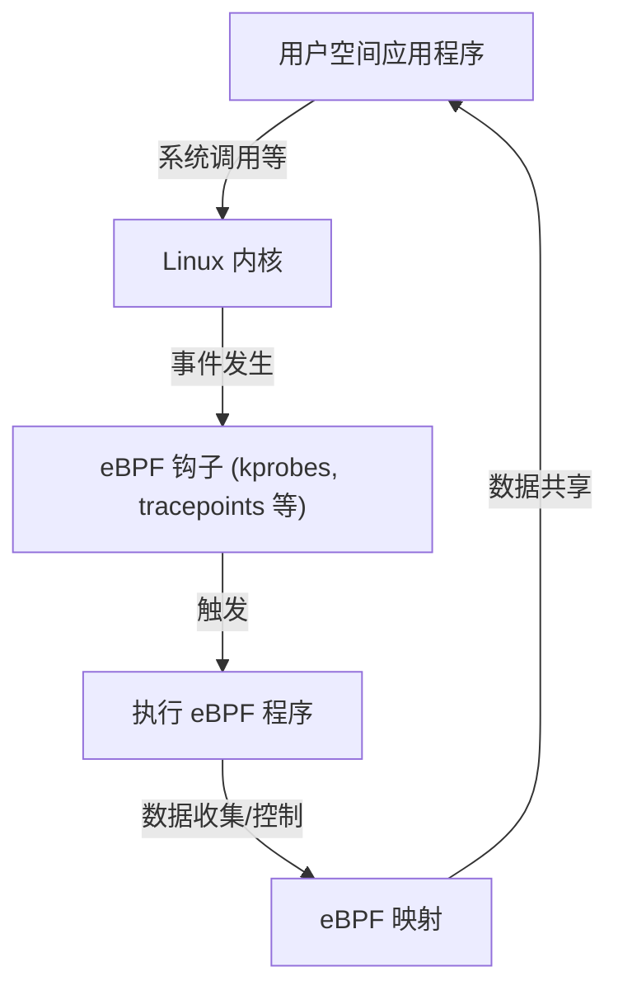

# eBPF 入门：在不修改 Linux 内核的情况下进行观察与控制的机制

在现代云原生环境及日益复杂的基础设施中，准确掌握系统内部正在发生的事情至关重要。近年来，在这一领域最受瞩目的技术之一就是“eBPF（Extended Berkeley Packet Filter）”。

本文将从 eBPF 的基础概念出发，深入探讨它如何在保持内核安全性的同时实现动态功能扩展，以及它如何在可观察性（Observability）、网络和安全等多个领域被广泛应用。

## 1. 传统 Linux 内核扩展面临的挑战

作为操作系统的核心，Linux 内核负责管理硬件、调度进程、处理网络通信等所有系统行为。为了深入理解并控制系统行为，访问内核内部是必不可少的。然而，传统方法存在几个巨大的障碍。

### 内核模块的问题

过去，扩展内核功能或进行深度追踪的主要手段是自行编写并加载内核模块（Loadable Kernel Module: LKM）。但这种方法伴随着以下致命的风险和挑战：

1. **崩溃风险（内核恐慌）**
   内核空间不存在像用户空间那样的内存保护机制。如果内核模块中存在错误（例如：空指针解引用、内存泄漏、无限循环），整个系统会立即崩溃，引发内核恐慌（Kernel Panic）。如果这发生在生产环境，就意味着服务的完全中断。
2. **安全漏洞**
   如果恶意或存在漏洞的代码在内核空间被执行，整个系统的控制权可能会被夺走。许多 Rootkit 正是利用这种机制进行破坏的。
3. **维护的复杂性**
   内核模块严重依赖于特定的内核版本。每次 Linux 内核升级时，API 和数据结构都可能发生变化，为了跟上这些变化而不断更新和重新编译模块的成本非常高昂。

基于这些原因，人们强烈渴望有一种机制，可以在不直接修改内核代码的情况下，安全且灵活地监控和控制内核行为。于是，eBPF 应运而生。

## 2. 什么是 eBPF？

eBPF（Extended Berkeley Packet Filter）是一项创新技术，用于在 Linux 内核中运行安全沙箱化的程序。它有时被比作“Linux 中的 JavaScript”。就像 Web 浏览器执行 JavaScript 将静态 HTML 变为动态 Web 应用一样，eBPF 将 Linux 内核变成了可动态编程的平台。

### 从 BPF 到 eBPF 的演进

最初的“BPF（Berkeley Packet Filter）”设计于 1992 年，目的是高效地过滤网络数据包（tcpdump 等工具就在使用它）。
大约在 2014 年，这个 BPF 的架构得到了大幅扩展（Extended），不仅能用于数据包过滤，还能附加到系统调用、内核函数、用户空间函数等系统中的任何事件并执行。现在，当我们简单地说“eBPF”或“BPF”时，通常指的就是这个扩展版本。



## 3. eBPF 的架构：安全与高速并存

eBPF 的创新之处在于，它实现了**“绝对的安全性”与“接近原生代码的执行速度”的结合**。让我们来看看实现这一目标的几个核心组件。

### 3.1. 字节码与沙箱

eBPF 程序通常使用 C 语言的子集或 Rust 等编写，并通过 LLVM/Clang 编译器编译成专用的“eBPF 字节码”。这个字节码从用户空间加载到内核空间，但并非直接执行。它会在内核中一个隔离的沙箱环境里运行。

### 3.2. 验证器（Verifier）的严格审查

确保 eBPF 安全性最重要的组件是“验证器（Verifier）”。当程序加载到内核时，验证器会对字节码进行静态分析，检查其是否满足以下严格条件：

- **不存在无限循环**（必须证明程序一定能结束，以防止系统冻结。最新的内核允许有界循环）
- **没有访问未初始化的内存**
- **没有访问未授权的内核内存区域**
- **没有超出程序的尺寸限制**

被验证器判定为“不安全”的程序将被拒绝加载。这有效地防止了内核恐慌的发生。

### 3.3. JIT 编译器的加速

通过验证器审查的字节码，接下来会由内核中的“JIT（Just-In-Time）编译器”转换为宿主机 CPU 架构（如 x86_64, ARM64）的原生机器码。
由于它是作为原生代码执行而非解释执行，因此可以发挥出媲美内核模块的极高声能。

### 3.4. 通过 eBPF 映射（Maps）共享数据

eBPF 程序本身是无状态的简短处理，但它需要将收集到的数据传递给用户空间的应用，或者在多次执行之间保持状态。为此提供了“eBPF 映射（Maps）”。
这是一种提供哈希表、数组、环形缓冲区等数据结构的键值存储，可以从内核空间和用户空间异步访问。

## 4. 可观察性与追踪

eBPF 最流行的用例之一是提升系统的可观察性，如进行性能分析和调试。通过动态附加到内核函数或系统调用上，可以实时获取详细数据。

### kprobes 与 uprobes

eBPF 主要使用以下机制来挂钩事件：
- **kprobes (Kernel Probes):** 动态附加到内核空间任意函数的调用（入口点和返回点）。
- **uprobes (User Probes):** 动态附加到用户空间应用程序内的函数（用 C、C++、Go 等编译语言编写的二进制文件）。
- **Tracepoints:** 由内核开发者预先定义的静态钩子点。与 kprobes 相比，其 ABI 稳定性更高。

### BCC 与 bpftrace

从零开始用 C 语言编写 eBPF 程序并实现加载器非常繁琐。因此，“BCC（BPF Compiler Collection）”和“bpftrace”等前端工具被广泛使用。

**bpftrace 示例:**
例如，如果想监控整个系统中当前打开的文件（`openat` 系统调用），使用 bpftrace 可以通过以下一行脚本实现：

```bash
sudo bpftrace -e 'tracepoint:syscalls:sys_enter_openat { printf("%s %s\n", comm, str(args->filename)); }'
```
该脚本在内部被编译为 eBPF 程序，加载到内核并执行。进程名（`comm`）和被打开的文件名会实时输出。能够不使用内核模块安全地完成这一操作，正是 eBPF 威力的体现。

## 5. 网络与安全领域的革命 (Cilium 等)

除了可观察性，eBPF 在网络和安全领域也引发了范式转换。特别是在 Kubernetes 等容器环境中，它的真正价值得到了展现。

### XDP (eXpress Data Path)

在网络协议栈中，XDP 是一种在最早阶段（网卡驱动程序级别）执行 eBPF 程序的机制。因为能够在内核解析数据包或进行路由（如分配 sk_buff）之前处理数据包，所以拥有惊人的吞吐量。
它被用于防御 DDoS 攻击或开发超高速负载均衡器。可以通过编程控制是丢弃（DROP）、转发（TX）还是将数据包传递给常规网络协议栈（PASS）。

### 服务网格与 Cilium

传统的 Kubernetes 容器间通信是通过基于 iptables 的复杂路由规则实现的。然而，随着服务规模的扩大，多达数万行的 iptables 规则成为性能瓶颈，管理也达到了极限。

此时，像“Cilium”这样的基于 eBPF 的 CNI（容器网络接口）插件出现了。Cilium 完全绕过 iptables，利用 eBPF 在内核中直接执行数据包路由、负载均衡和应用安全策略。
此外，不仅是 TCP/IP 层面，它还通过透明地将流量转发给 Sidecar 代理（如 Envoy），实现了对 L7（HTTP, gRPC, Kafka 等）的可见性与控制，成为下一代服务网格的基础技术。

## 6. eBPF 的未来与生态系统

目前，eBPF 的生态系统正在迅速扩张。Google、Meta、Netflix 等科技巨头都在自家的基础设施中将 eBPF 投入生产环境使用，并持续为开源社区做贡献。

- **Tetragon:** 派生自 Cilium 项目的安全监控工具。在内核层面实时监控进程执行和文件访问，并拦截违反策略的行为。
- **Pixie:** 面向开发者的 Kubernetes 可观察性平台。在不修改代码的情况下自动收集应用程序的指标、追踪和性能分析数据。
- **移植到 Windows:** 在 eBPF 基金会的领导下，“eBPF for Windows”项目正在进行中，期望未来它能成为一项跨平台技术，使得通用的 eBPF 程序不仅能在 Linux 上，也能在 Windows 内核上运行。

## 7. 总结

eBPF 不仅仅是添加了一项功能，它是一项从根本上改变了操作系统内核与用户空间交互方式的平台技术。这种在不破坏内核安全性与稳定性的前提下，动态注入程序的机制，现在已成为进行性能调优、详细故障排查、高级网络控制以及实施零信任安全时不可或缺的工具。

随着云原生技术的发展，eBPF 的应用范围必将进一步扩大。对于对 Linux 深度工作原理感兴趣的工程师来说，学习 eBPF 无疑是一项极具意义的投资，能够将对系统的理解提升到一个更高的层次。
