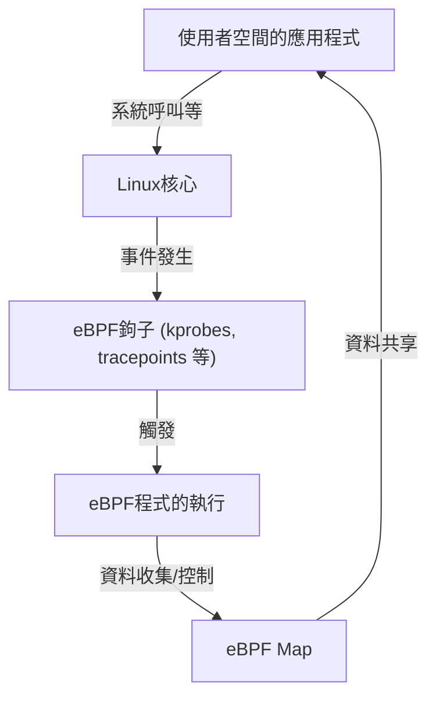

# eBPF入門：不修改Linux核心即可觀測與控制的機制

在現代的雲端原生環境與日益複雜的基礎架構中，精確掌握系統內部發生的事情是極為重要的。其中，近年來最受矚目的技術之一就是「eBPF（Extended Berkeley Packet Filter）」。

本文將從eBPF的基礎概念開始，深入探討它如何能在保持核心安全的同時實現動態的功能擴展，以及它是如何在可觀測性（Observability）、網路與安全等多個領域中被廣泛應用。

## 1. 傳統Linux核心擴展面臨的挑戰

Linux核心作為作業系統的中樞，負責管理硬體、行程排程、網路通訊等所有系統運作。為了深入了解並控制系統行為，存取核心內部是不可或缺的。然而，傳統的方法存在一些巨大的障礙。

### 核心模組的問題點

過去，擴展核心功能或進行底層追蹤的主要手段是自行編寫並載入核心模組（Loadable Kernel Module: LKM）。但這種方法伴隨著以下致命的風險與挑戰：

1. **崩潰風險（Kernel Panic）**
   核心空間不存在像使用者空間那樣的記憶體保護機制。只要核心模組內有Bug（例如：NULL指標參照、記憶體洩漏、無窮迴圈），系統整體就會立即崩潰，引發Kernel Panic。如果這發生在正式環境，就意味著服務完全停擺。
2. **安全漏洞**
   如果在核心空間執行了惡意或有漏洞的程式碼，就有可能被奪走整個系統的控制權。許多Rootkit就是利用這個機制進行破壞。
3. **維護的複雜性**
   核心模組強烈依賴於特定的核心版本。每次Linux核心升級時，API或資料結構都可能改變，為了跟上更新而不斷重新編譯與修改模組的成本非常高。

基於這些原因，業界強烈需要一種可以在不直接修改核心程式碼的情況下，安全且彈性地監控與控制核心行為的機制。於是eBPF應運而生。

## 2. 什麼是eBPF？

eBPF（Extended Berkeley Packet Filter）是一項革命性的技術，用於在Linux核心內安全地執行被沙盒化的程式。它有時被比喻為「Linux中的JavaScript」。就像網頁瀏覽器執行JavaScript將靜態HTML轉變為動態網頁應用程式一樣，eBPF將Linux核心轉變為一個可動態程式化的平台。

### 從BPF到eBPF的演進

最初的「BPF（Berkeley Packet Filter）」設計於1992年，目的是為高效過濾網路封包（被用於tcpdump等工具）。
大約在2014年，這個BPF架構被大幅擴充（Extended），不僅限於封包過濾，還可以附加到系統呼叫、核心函式、使用者空間函式等系統所有的事件上執行。現在，當我們單純稱呼「eBPF」或「BPF」時，通常指的就是這個擴充版本。



## 3. eBPF的架構：兼顧安全與高速

eBPF最具革命性的一點是，它**同時實現了「絕對的安全性」與「接近原生程式碼的執行速度」**。讓我們來看看實現這些的主要元件。

### 3.1. 位元組碼與沙盒

eBPF程式以C語言的子集或Rust等語言撰寫，並透過LLVM/Clang編譯器編譯為專用的「eBPF位元組碼（Bytecode）」。這個位元組碼會從使用者空間載入到核心空間，但不會被直接執行。它會在核心內隔離的沙盒環境中執行。

### 3.2. 透過驗證器（Verifier）進行嚴格審查

保障eBPF安全性的最重要元件是「驗證器（Verifier）」。當程式被載入到核心時，驗證器會對位元組碼進行靜態分析，檢查是否符合以下嚴格的條件：

- **不存在無窮迴圈**（為了不讓系統凍結，必須證明程式一定會結束。近期的核心已允許有界迴圈）
- **不會存取未初始化的記憶體**
- **不會存取未經許可的核心記憶體區域**
- **不超過程式的容量限制**

被驗證器判定為「不安全」的程式將會被拒絕載入。這樣就能防止Kernel Panic。

### 3.3. 透過JIT編譯器實現高速化

通過驗證器審查的位元組碼，接下來會由核心內的「JIT（Just-In-Time）編譯器」轉換為符合主機CPU架構（如x86_64、ARM64）的原生機器碼。
因為它不是透過直譯器執行，而是作為原生程式碼執行，所以能發揮媲美核心模組的極高效能。

### 3.4. 透過eBPF Maps共享資料

eBPF程式本身雖然是沒有狀態的短暫處理程序，但需要將收集到的資料傳遞給使用者空間的應用程式，或在多次執行之間保持狀態。為此提供的是「eBPF Maps」。
這是一個提供雜湊表、陣列、環狀緩衝區等資料結構的鍵值（Key-Value）儲存，可從核心空間和使用者空間非同步存取。

## 4. 可觀測性（Observability）與追蹤

eBPF最普及的使用案例之一是提升系統的可觀測性，如效能分析與除錯。它可以動態地附加到核心函式或系統呼叫上，即時取得詳細的資料。

### kprobes 與 uprobes

eBPF主要使用以下機制來掛載（Hook）事件：
- **kprobes (Kernel Probes):** 動態附加到核心空間的任何函式呼叫（進入點與返回點）。
- **uprobes (User Probes):** 動態附加到使用者空間應用程式內的函式（以C、C++、Go等編譯語言寫成的二進位檔）。
- **Tracepoints:** 由核心開發者預先定義好的靜態掛載點。其特點是ABI的穩定性比kprobes更高。

### BCC 與 bpftrace

從零開始用C語言編寫eBPF程式並實作載入器非常費時。因此，作為前端工具的「BCC（BPF Compiler Collection）」和「bpftrace」被廣泛使用。

**bpftrace的範例:**
例如，如果想監控整個系統目前正在開啟的檔案（`openat`系統呼叫），使用bpftrace只需以下一行的指令碼即可實現。

```bash
sudo bpftrace -e 'tracepoint:syscalls:sys_enter_openat { printf("%s %s\n", comm, str(args->filename)); }'
```
這個指令碼會在內部被編譯為eBPF程式，然後載入到核心執行。行程名稱（`comm`）與被開啟的檔案名稱會被即時輸出。能在不使用核心模組且安全的情況下進行這番操作，這就是eBPF的威力。

## 5. 網路與安全領域的革命 (如Cilium)

除了可觀測性，eBPF在網路與安全領域也引發了典範轉移。特別是在Kubernetes等容器環境中，更能發揮其真正的價值。

### XDP (eXpress Data Path)

在網路堆疊中，讓eBPF程式在最早階段（網路卡驅動程式層級）執行的機制就是XDP。因為它能在核心進行封包解析或路由（如分配sk_buff）之前處理封包，因此擁有驚人的吞吐量。
它被用於防禦DDoS攻擊或開發超高速的負載平衡器。我們能以程式化的方式控制封包丟棄（DROP）、轉發（TX），或傳遞給一般的網路堆疊（PASS）。

### 服務網格與Cilium

傳統Kubernetes中的容器間通訊，是利用iptables的複雜路由規則來實現的。然而，當服務規模擴大時，多達數萬行的iptables規則就會成為效能的瓶頸，管理也將達到極限。

這時，基於eBPF的CNI（Container Network Interface）外掛程式如「Cilium」就登場了。Cilium完全繞過iptables，利用eBPF在核心內直接進行封包的路由、負載平衡與安全策略的應用。
此外，不僅是TCP/IP層級，它還能透過對Sidecar代理（如Envoy）的透明流量轉發，實現對L7（HTTP, gRPC, Kafka等）的視覺化與控制，成為次世代服務網格的基礎技術。

## 6. eBPF的未來與生態系

目前，eBPF的生態系正在迅速擴大。Google、Meta、Netflix等科技巨頭都已在自家基礎架構中於正式環境部署eBPF，並持續對開源社群做出貢獻。

- **Tetragon:** 衍生自Cilium專案的安全監控工具。在核心層級即時監控行程的執行與檔案存取，並封鎖違反策略的行為。
- **Pixie:** 專為開發者設計的Kubernetes可觀測性平台。無需修改程式碼即可自動收集應用程式的指標、追蹤與設定檔。
- **移植到Windows:** 在eBPF基金會的主導下，「eBPF for Windows」專案正在進行中，未來有望成為不僅在Linux，甚至在Windows核心上也能執行通用eBPF程式的跨平台技術。

## 7. 總結

eBPF不僅僅是一項新增功能，而是從根本上改變了作業系統核心與使用者空間互動方式的平台技術。這種能在不損害核心安全性與穩定性的情況下動態注入程式的機制，如今已成為效能調校、詳細的問題排解、進階網路控制，以及實作零信任安全（Zero Trust Security）不可或缺的工具。

隨著雲端原生技術的演進，eBPF的應用範圍將會更加廣泛。對於對Linux底層運作原理感興趣的工程師而言，學習eBPF絕對是一項非常有意義的投資，能將對系統的理解提升到更高層次的境界。
