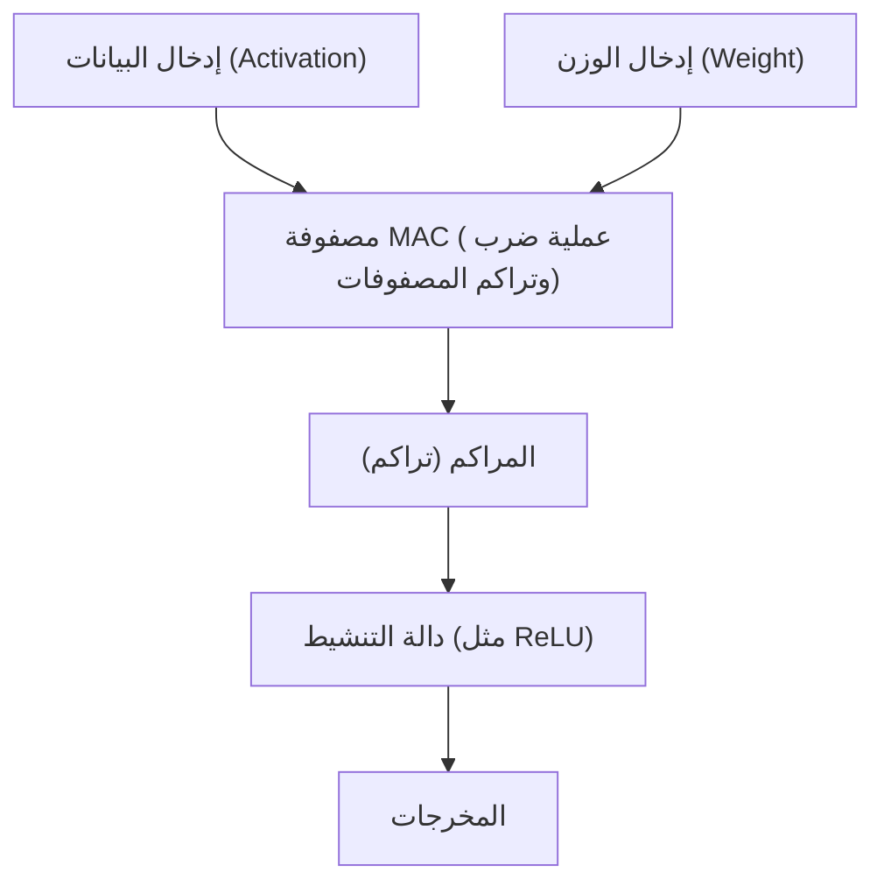

# بنية الذكاء الاصطناعي الطرفي (Edge AI) ووحدة المعالجة العصبية (NPU)

في السنوات الأخيرة، مع التطور السريع لتقنية الذكاء الاصطناعي (AI)، أصبح الذكاء الاصطناعي يُستخدم في كل جانب من جوانب حياتنا. ما قاد طفرة الذكاء الاصطناعي الأولية كان موارد الحوسبة الهائلة لمراكز البيانات الضخمة الموجودة على السحابة. ومع ذلك، فإن هذا النموذج يشهد الآن نقطة تحول رئيسية. إنه ظهور "الذكاء الاصطناعي الطرفي (Edge AI)" والأجهزة المخصصة التي تدعمه "وحدة المعالجة العصبية (NPU)".

في هذه المقالة، سنتعمق في التحديات التي يواجهها الذكاء الاصطناعي السحابي، والحاجة إلى الذكاء الاصطناعي الطرفي، وكيف تحقق وحدات المعالجة العصبية (NPU) سرعات استدلال مذهلة وتوفيراً في الطاقة، بالإضافة إلى بنيتها وأمثلة محددة وتقنيات تحسين النماذج.

## 1. حدود الذكاء الاصطناعي السحابي وظهور الذكاء الاصطناعي الطرفي

النهج التقليدي لإجراء استدلال الذكاء الاصطناعي على السحابة له العديد من التحديات الهيكلية.

### مشكلة زمن الوصول (الكمون)
في التطبيقات التي تتطلب قرارات فورية، مثل السيارات ذاتية القيادة، والروبوتات الصناعية، والترجمة الصوتية في الوقت الفعلي، يعد تأخير الاتصال (زمن الوصول) عبر الشبكة مشكلة قاتلة. يمكن أن يؤدي التأخير من عشرات إلى مئات الميلي ثانية بين إرسال البيانات إلى السحابة وتلقي نتائج المعالجة إلى حوادث خطيرة أو تدهور تجربة المستخدم.

### الخصوصية والأمان
تلتقط الهواتف الذكية وأجهزة المنزل الذكي باستمرار معلومات خاصة للغاية عن المستخدمين من خلال الكاميرات والميكروفونات. إن الاستمرار في إرسال هذه البيانات الأولية إلى السحابة يزيد من خطر تسرب المعلومات وانتهاك الخصوصية. باستخدام الذكاء الاصطناعي الطرفي، تتم معالجة البيانات داخل الجهاز (الطرف)، ويتم إخراج أو إرسال النتائج فقط، مما يجعله مفيدًا للغاية من منظور حماية الخصوصية.

### تكلفة الاتصال وعرض النطاق الترددي
يؤدي إرسال تدفقات الفيديو عالية الدقة وكميات هائلة من بيانات المستشعرات إلى السحابة إلى الضغط بشكل كبير على النطاق الترددي للشبكة وزيادة تكاليف الاتصال. من خلال المعالجة المسبقة للبيانات على الجانب الطرفي وإرسال المعلومات الضرورية فقط إلى السحابة، يمكن تقليل العبء على البنية التحتية للشبكة بشكل كبير.

لحل هذه المشكلات، أصبح "الذكاء الاصطناعي الطرفي (Edge AI)"، الذي يقوم بتشغيل نماذج الذكاء الاصطناعي مباشرة في الموقع (الطرف) حيث يتم إنشاء البيانات، مطلوبًا بشكل حتمي. ومع ذلك، بخلاف خوادم السحابة، تواجه الأجهزة الطرفية قيودًا صارمة على سعة البطارية، وتبديد الحرارة، والحجم المادي. وهنا يأتي دور "NPU"، وهو معالج عالي الكفاءة متخصص في معالجة الذكاء الاصطناعي.

## 2. ما هي وحدة المعالجة العصبية (NPU)؟

وحدة المعالجة العصبية (NPU) هي مسرّع أجهزة مصمم خصيصًا لتنفيذ معالجة الشبكات العصبية (الاستدلال والتدريب) مثل التعلم العميق بسرعات عالية للغاية واستهلاك منخفض للطاقة.

### الفرق بين CPU و GPU و NPU

لفهم تطور الأجهزة في معالجة الذكاء الاصطناعي، من الضروري تصنيف أدوار وبنى CPU و GPU و NPU.

*   **وحدة المعالجة المركزية (CPU)**:
    تتفوق في المعالجة الحسابية للأغراض العامة. يمكنها التعامل بمرونة مع المهام المتنوعة مثل التفرع الشرطي المعقد والتحكم في نظام التشغيل، ولكن نظرًا لأن عدد النوى محدود، فهي غير مناسبة للحوسبة المتوازية الضخمة مثل الشبكات العصبية.
*   **وحدة معالجة الرسومات (GPU)**:
    تم تجهيزها في الأصل بآلاف النوى الصغيرة لعرض الصور، وتتفوق في المعالجة المتوازية الفائقة للعمليات الحسابية البسيطة. كانت المحفز لطفرة الذكاء الاصطناعي ولا تزال تلعب دورًا رائدًا ساحقًا في تدريب النماذج على الجانب السحابي. ومع ذلك، فإنها تستهلك قدرًا كبيرًا من الطاقة، وهناك تحديات فيما يتعلق بالبطارية وتبديد الحرارة لتشغيلها بشكل مستمر على الأجهزة الطرفية مثل الهواتف المحمولة.
*   **وحدة المعالجة العصبية (NPU)**:
    معالج مخصص تم تحسين بنيته بالكامل لحسابات الشبكات العصبية (خاصة عمليات الضرب والتراكم للمصفوفات). في مقابل التضحية ببعض التنوع، فإنها تحقق كفاءة معالجة (TOPS/W: عدد العمليات لكل واط) تفوق وحدات معالجة الرسومات (GPU) في استدلال نماذج ذكاء اصطناعي محددة.

## 3. بنية NPU: لماذا هي سريعة وعالية الكفاءة؟

يكمن سر الأداء المذهل لوحدات المعالجة العصبية (NPU) في بنيتها الداخلية.

### تكامل وحدات الضرب والتراكم (MAC)
الجزء الأكبر من معالجة الشبكة العصبية هو "عملية الضرب والتراكم (MAC)"، والتي تضرب بيانات الإدخال والأوزان (Weight) وتجمعها معًا. تتبنى وحدات المعالجة العصبية (NPU) بنية تسمى "المصفوفة الانقباضية (Systolic Array)" أو "أنوية الموتر (Tensor Cores)"، حيث يتم حزم كمية كبيرة (الآلاف إلى عشرات الآلاف) من وحدات MAC هذه معًا. تتدفق البيانات عبر المصفوفة مثل سلسلة دلاء (bucket brigade)، مما يقلل من الوصول غير الضروري إلى السجلات ويزيد بشكل كبير من مقدار الحساب لكل دورة ساعة.

### تحسين التسلسل الهرمي للذاكرة (تقليل نقل البيانات)
ما يستهلك معظم الطاقة في المعالج ليس في الواقع "الحساب" نفسه، بل "قراءة وكتابة البيانات من الذاكرة (نقل البيانات)". استهلاك الطاقة عند استرداد البيانات من DRAM أعلى بعشرات إلى مئات المرات من الحساب في ALU (وحدة الحساب والمنطق).
تتبنى وحدات المعالجة العصبية (NPU) بنية تتضمن SRAM (ذاكرة على الشريحة) ضخمة داخل الشريحة وتحتفظ بأوزان الشبكة العصبية والبيانات الوسيطة داخل الشريحة قدر الإمكان. بالإضافة إلى ذلك، من خلال عدم كتابة البيانات بين الطبقات مرة أخرى إلى الذاكرة الرئيسية (DRAM) وتدفقها مباشرة إلى وحدة الحساب للطبقة التالية، فإنه يقلل بشكل كبير من النفقات العامة لنقل البيانات.

## 4. أمثلة واقعية لبنى NPU

حاليًا، يتم تطوير وتجهيز العديد من وحدات المعالجة العصبية (NPU) للهواتف الذكية وأجهزة الكمبيوتر الشخصية.

### محرك أبل العصبي (ANE)
المحرك العصبي، الذي بدأت شركة Apple في تضمينه من شريحة A11 Bionic، هو مصدر القدرة التنافسية لأجهزة iPhone و Mac (سلسلة M). فهو يقوم بمعالجة المصادقة بالوجه (Face ID)، والتجزئة الدلالية للصور، والتعرف على الصوت على الجهاز عبر Siri بسرعات عالية في الخلفية مع استهلاك قليل جدًا للبطارية. في أحدث شرائح M3 و A17 Pro، يتميز بأداء حسابي يبلغ عشرات التريليونات من العمليات في الثانية (TOPS).

### وحدة معالجة الموتر من جوجل (TPU)
تشتهر Google بوحدات TPU الضخمة للسحابة، ولكن بالنسبة لهواتف Pixel الذكية، فإنها تنشر شرائح "Google Tensor" التي تدمج وحدة معالجة عصبية (NPU) ترث سلالة "Edge TPU". وهو متخصص في تشغيل نماذج الذكاء الاصطناعي المتقدمة من Google على الحافة (الطرف)، مثل التصوير الحاسوبي للكاميرا (الممحاة السحرية ووضع الرؤية الليلية) والنسخ الصوتي في الوقت الفعلي.

### وحدة المعالجة العصبية Qualcomm Hexagon NPU
تم دمج Hexagon DSP/NPU في معالجات (SoC) Snapdragon الموجودة في العديد من الهواتف الذكية التي تعمل بنظام Android. من خلال دمج العمليات العددية والمتجهة والموترة، والعمل بشكل وثيق مع معالج إشارات الصور (ISP) للكاميرا ومحور المستشعر، فإنه يعمل على تحسين أداء الذكاء الاصطناعي للجهاز بأكمله. في الآونة الأخيرة، تم تزويد معالج أجهزة الكمبيوتر الشخصية لنظام التشغيل Windows، وهو Snapdragon X Elite، بوحدة معالجة عصبية (NPU) قوية لدفع تحقيق أجهزة كمبيوتر الذكاء الاصطناعي (Copilot+ PC).

## 5. البرمجيات وتقنيات التحسين التي تدعم الذكاء الاصطناعي الطرفي

حتى مع وجود أجهزة NPU ممتازة، لا يمكن تشغيل نماذج الذكاء الاصطناعي السحابية الضخمة كما هي على الحافة (الطرف). "تقنية تحسين النموذج" ضرورية لاستخراج إمكانات الأجهزة.

### التكميم (Quantization)
هذه تقنية لتقليل الأوزان ودقة الحساب لنموذج الذكاء الاصطناعي من النقطة العائمة القياسية 32 بت (FP32) إلى 16 بت (FP16)، أو عدد صحيح 8 بت (INT8)، أو 4 بت (INT4). هذا يقلل من حجم النموذج إلى جزء صغير من حجمه الأصلي ويوفر النطاق الترددي للذاكرة. تم تحسين العديد من وحدات المعالجة العصبية (NPU) على مستوى الأجهزة لعمليات INT8 و INT4، ويؤدي التكميم إلى تحسين سرعة الاستدلال بشكل كبير. لتقليل تدهور الدقة، يتم استخدام طرق مثل PTQ (التكميم بعد التدريب) و QAT (التدريب المدرك للتكميم).

### التقليم (Pruning)
ضمن الشبكة العصبية، هذه تقنية تحدد "الأوزان الأقل أهمية (القيم القريبة من الصفر)" التي ليس لها تأثير يذكر على نتائج الاستدلال وتحذفها من الشبكة (تثبتها عند الصفر). هذا يزيد من ندرة النموذج ويقلل من مقدار الحساب وحجم النموذج.

### تقطير المعرفة (Knowledge Distillation)
إنها طريقة لتدريب نموذج خفيف الوزن (نموذج الطالب) على سلوك نموذج كبير وعالي الأداء (نموذج المعلم). نظرًا لأن نموذج الطالب يتم تدريبه على تقليد التوزيع الاحتمالي لمخرجات نموذج المعلم، فيمكنه تحقيق دقة أعلى من تدريب نموذج صغير بمفرده، مع الحفاظ عليه ضمن حجم يمكن تشغيله على الأجهزة الطرفية.

## 6. مستقبل الذكاء الاصطناعي الطرفي والتوقعات المستقبلية

حاليًا، تجتاح نماذج اللغات الكبيرة (LLM) مثل ChatGPT العالم، لكن الاستدلال بهذه النماذج لا يزال يتطلب مجموعات GPU سحابية ضخمة. ومع ذلك، فإن التطورات التكنولوجية تجلب حتى نماذج LLM إلى الحافة (نماذج اللغات الطرفية، SLM: نموذج لغة صغير).

في المستقبل، من المتوقع حدوث الاتجاهات التالية.

*   **الذكاء الاصطناعي الهجين (Hybrid AI)**:
    سيصبح النهج الهجين هو السائد، حيث تتم معالجة الاستدلال الخفيف اليومي (تلخيص النص، التعرف على الصوت، إنشاء الصور البسيطة، وما إلى ذلك) على الفور بواسطة NPU للجهاز الطرفي، ويتم تفريغ الاستدلال الأكثر تقدمًا وتعقيدًا إلى السحابة فقط عند الضرورة.
*   **الانتشار إلى أجهزة طرفية متنوعة**:
    لن يقتصر الأمر على الهواتف الذكية وأجهزة الكمبيوتر الشخصية، بل سيتم تضمين وحدات المعالجة العصبية (NPU) الدقيقة (الذكاء الاصطناعي للمتحكمات الدقيقة) في كاميرات المراقبة والطائرات بدون طيار والأجهزة القابلة للارتداء، وحتى مستشعرات إنترنت الأشياء (IoT) نفسها، مما يمنح "الذكاء" لجميع الأشياء.
*   **توحيد NPU والنظام البيئي**:
    للتغلب على الوضع الحالي حيث يتطلب كل جهاز تحسينًا مختلفًا، تتطور أطر عمل مثل ONNX و OpenVINO و TensorFlow Lite و PyTorch ExecuTorch، ويتقدم تطوير بيئة يمكن للمطورين من خلالها "الكتابة مرة واحدة والتشغيل بشكل مثالي على أي NPU".

## خاتمة

لقد أدى تطور Edge AI و NPU إلى تحويل الذكاء الاصطناعي من كونه حكراً على بعض الباحثين والبنية التحتية السحابية إلى "وظيفة أساسية" لجميع الأجهزة الموجودة في متناول أيدينا. تعد هذه البنية، التي تزيل الكمون (زمن الوصول)، وتحمي الخصوصية، وتحقق تحسينات كبيرة في كفاءة استهلاك الطاقة، واحدة من أهم التقنيات التي ستقود الحوسبة في العقد القادم.

بالنسبة لمهندسي البرمجيات ومطوري الذكاء الاصطناعي، ليس فقط المهارات اللازمة للتعامل مع النماذج الضخمة على السحابة، ولكن أيضًا المعرفة حول "كيفية تنفيذ وتحسين الذكاء الاصطناعي من خلال الاستفادة من خصائص الأجهزة (NPU) في ظل موارد محدودة" ستصبح ذات أهمية متزايدة في المستقبل.
