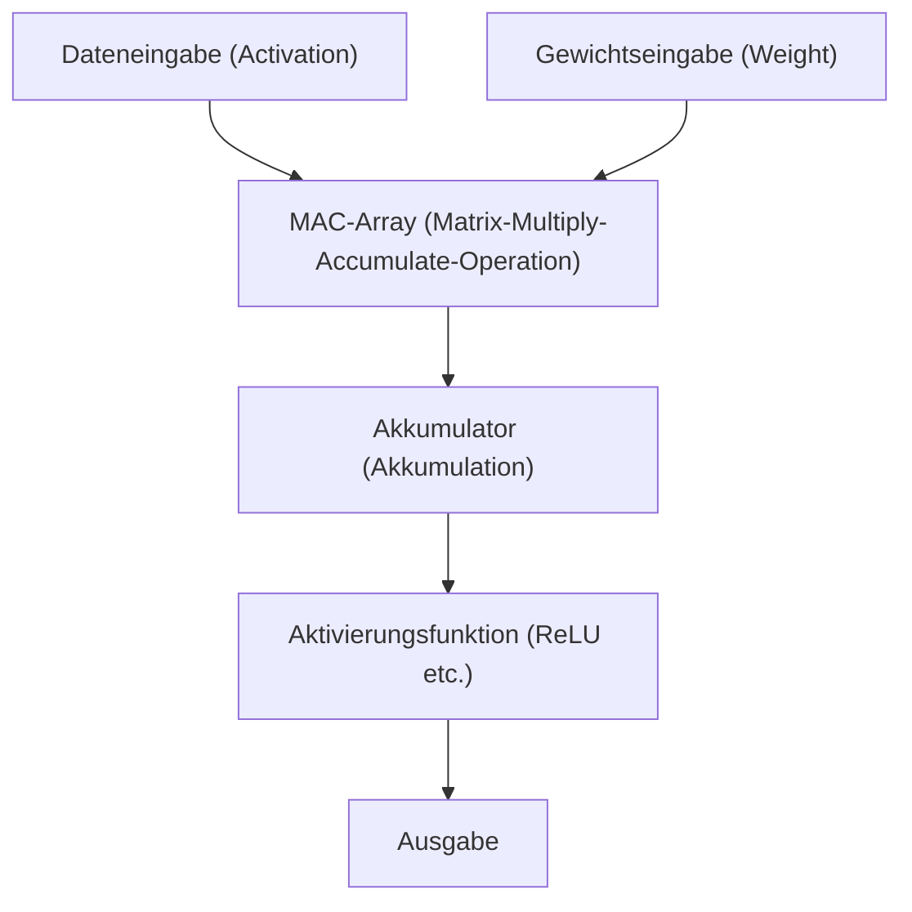

# Edge AI und NPU (Neural Processing Unit) Architektur

In den letzten Jahren ist Künstliche Intelligenz (KI) durch die rasante Entwicklung der Technologie zu einem integralen Bestandteil unseres Alltags geworden. Der anfängliche KI-Boom wurde von den massiven Rechenressourcen riesiger Rechenzentren in der Cloud angetrieben. Heute stehen wir jedoch an einem großen Wendepunkt in diesem Paradigma: dem Aufstieg von „Edge AI“ und der dafür entwickelten dedizierten Hardware, der „NPU (Neural Processing Unit)“.

Dieser Artikel geht detailliert auf die Herausforderungen von Cloud-KI, die Notwendigkeit von Edge-KI und die Frage ein, wie NPUs unglaubliche Inferenzgeschwindigkeiten und Energieeinsparungen erzielen, einschließlich ihrer Architektur, konkreter Beispiele und Modelloptimierungstechnologien.

## 1. Die Grenzen der Cloud-KI und der Aufstieg von Edge-KI

Der traditionelle Ansatz, KI-Inferenz in der Cloud durchzuführen, bringt mehrere strukturelle Herausforderungen mit sich.

### Das Latenzproblem
In Anwendungen, die sofortige Entscheidungen erfordern, wie z. B. autonomes Fahren, Industrieroboter und Echtzeit-Sprachübersetzung, ist die Kommunikationsverzögerung (Latenz) über das Netzwerk ein kritisches Problem. Eine Verzögerung von zehn bis hunderten von Millisekunden, um Daten an die Cloud zu senden und die Ergebnisse zu empfangen, kann zu schweren Unfällen oder einer Verschlechterung der Benutzererfahrung führen.

### Datenschutz und Sicherheit
Smartphones und Smart-Home-Geräte erfassen über ihre Kameras und Mikrofone ständig hochgradig private Informationen der Nutzer. Das ständige Senden dieser Rohdaten an die Cloud erhöht das Risiko von Datenlecks und Datenschutzverletzungen. Mit Edge-KI werden die Daten auf dem Gerät (der „Edge“) verarbeitet, und nur die Ergebnisse werden ausgegeben oder gesendet, was aus der Sicht des Datenschutzes äußerst vorteilhaft ist.

### Kommunikationskosten und Bandbreite
Das Senden von hochauflösenden Videostreams oder riesigen Sensordatenmengen an die Cloud belastet die Netzwerkbandbreite erheblich und treibt die Kommunikationskosten in die Höhe. Durch die Vorverarbeitung der Daten am Edge und das Senden nur der notwendigen Informationen an die Cloud kann die Belastung der Netzwerkinfrastruktur drastisch reduziert werden.

Um diese Herausforderungen zu meistern, ist "Edge AI", die KI-Modelle direkt dort ausführt, wo die Daten generiert werden (am Edge), unverzichtbar geworden. Im Gegensatz zu Cloud-Servern unterliegen Edge-Geräte jedoch strengen Einschränkungen in Bezug auf Akkukapazität, Wärmeableitung und physische Größe. Hier kommt die „NPU“ ins Spiel, ein hocheffizienter Prozessor, der speziell für KI-Aufgaben entwickelt wurde.

## 2. Was ist eine NPU (Neural Processing Unit)?

Eine NPU (Neural Processing Unit) ist ein Hardware-Beschleuniger, der speziell entwickelt wurde, um die Verarbeitung neuronaler Netze (Inferenz und Training) im Bereich Deep Learning extrem schnell und mit geringem Stromverbrauch auszuführen.

### Der Unterschied zwischen CPU, GPU und NPU

Um die Entwicklung der KI-Hardware zu verstehen, ist es wichtig, die Unterschiede in den Rollen und Architekturen von CPUs, GPUs und NPUs zu klären.

*   **CPU (Central Processing Unit)**:
    Ist auf allgemeine Rechenaufgaben spezialisiert. Sie kann flexibel eine Vielzahl von Aufgaben bewältigen, wie z. B. komplexe bedingte Verzweigungen und Betriebssystemsteuerungen, ist jedoch aufgrund ihrer begrenzten Kernanzahl nicht für die massive parallele Berechnung geeignet, die für neuronale Netze erforderlich ist.
*   **GPU (Graphics Processing Unit)**:
    Ursprünglich für das Rendern von Bildern entwickelt, ist sie mit Tausenden kleiner Kerne ausgestattet und zeichnet sich durch die massiv parallele Verarbeitung einfacher Berechnungen aus. Sie löste den KI-Boom aus und ist bis heute der dominierende Akteur beim Modelltraining (Training) in der Cloud. Allerdings hat sie einen hohen Stromverbrauch, was den Dauerbetrieb in Edge-Geräten wie Mobiltelefonen in Bezug auf Akku und Wärmeableitung problematisch macht.
*   **NPU (Neural Processing Unit)**:
    Ein spezieller Prozessor, dessen gesamte Architektur für die Berechnungen neuronaler Netze (insbesondere Multiply-Accumulate-Operationen) optimiert ist. Zwar wird eine gewisse Vielseitigkeit geopfert, doch bietet er eine höhere Verarbeitungseffizienz (TOPS/W: Operationen pro Watt) als GPUs bei der Inferenz (Inference) spezifischer KI-Modelle.

## 3. NPU-Architektur: Warum ist sie so schnell und effizient?

Das Geheimnis hinter der erstaunlichen Leistung einer NPU liegt in ihrer internen Architektur.

### Ansammlung von MAC-Einheiten (Multiply-Accumulate)
Der Großteil der Verarbeitung in neuronalen Netzen ist die „Multiply-Accumulate-Operation (MAC)“, bei der Eingabedaten mit Gewichten (Weights) multipliziert und anschließend addiert werden. NPUs verwenden eine Struktur, die als „Systolic Array“ oder „Tensor Core“ bezeichnet wird und in der diese MAC-Einheiten in großen Mengen (Tausende bis Zehntausende) angeordnet sind. Da die Daten wie in einer Eimerkette durch das Array fließen, wird unnötiger Zugriff auf Register reduziert, was die Rechenleistung pro Taktzyklus dramatisch erhöht.

### Optimierung der Speicherhierarchie (Minimierung von Datenbewegungen)
Was bei einem Prozessor den meisten Strom verbraucht, ist nicht die „Berechnung“ selbst, sondern das „Lesen und Schreiben von Daten aus dem Speicher (Datenbewegung)“. Der Stromverbrauch beim Abrufen von Daten aus dem DRAM ist zehn- bis hundertmal höher als bei der Berechnung in der ALU (Arithmetic Logic Unit).
NPUs verfügen über eine Architektur mit einem riesigen internen SRAM (On-Chip-Speicher), wodurch die Gewichte und Zwischenergebnisse des neuronalen Netzes so weit wie möglich auf dem Chip gehalten werden. Darüber hinaus wird der Overhead für die Datenbewegung drastisch reduziert, indem Daten zwischen Schichten nicht zurück in den Hauptspeicher (DRAM) geschrieben, sondern direkt in die Recheneinheiten der nächsten Schicht eingespeist werden.

## 4. Beispiele realer NPU-Architekturen

Heutzutage werden verschiedene NPUs für Smartphones und PCs entwickelt und eingesetzt.

### Apple Neural Engine (ANE)
Die Neural Engine, die Apple mit dem A11 Bionic-Chip einführte, ist die Quelle der Wettbewerbsfähigkeit des iPhones und der Macs (M-Serie). Sie verarbeitet Aufgaben wie die Face ID-Gesichtserkennung, die semantische Segmentierung von Fotos und die On-Device-Spracherkennung von Siri im Hintergrund mit hoher Geschwindigkeit und minimalem Akkuverbrauch. In den neuesten M3- und A17 Pro-Chips erreicht sie eine Rechenleistung von zig Billionen Operationen pro Sekunde (TOPS).

### Google Tensor Processing Unit (TPU)
Google ist zwar für seine riesigen Cloud-TPUs bekannt, entwickelt aber auch „Google Tensor“-Chips für Pixel-Smartphones, die eine NPU in der Tradition der „Edge TPU“ integrieren. Sie ist darauf spezialisiert, Googles fortschrittliche KI-Modelle am Edge auszuführen, z. B. für rechnergestützte Fotografie (Magischer Radierer, Nachtsicht-Modus) und Echtzeit-Transkription.

### Qualcomm Hexagon NPU
Der in vielen Android-Smartphones verwendete Snapdragon-SoC beinhaltet den Hexagon DSP/NPU. Durch die Integration von Skalar-, Vektor- und Tensorberechnungen und die enge Zusammenarbeit mit dem Kamera-ISP und dem Sensor-Hub optimiert er die gesamte KI-Leistung des Geräts. Kürzlich wurde auch eine leistungsstarke NPU in den Snapdragon X Elite, einen PC-Prozessor für Windows, integriert, um die Realisierung von KI-PCs (Copilot+ PC) voranzutreiben.

## 5. Software und Optimierungstechnologien, die Edge AI unterstützen

Selbst mit exzellenter NPU-Hardware können riesige Cloud-KI-Modelle nicht unverändert am Edge ausgeführt werden. „Modelloptimierungstechnologien“ sind unerlässlich, um das Potenzial der Hardware auszuschöpfen.

### Quantisierung (Quantization)
Eine Technologie, die die Gewichte und die Rechengenauigkeit eines KI-Modells von einer Standard-32-Bit-Fließkommazahl (FP32) auf eine 16-Bit-Fließkommazahl (FP16), eine 8-Bit-Ganzzahl (INT8) oder sogar eine 4-Bit-Ganzzahl (INT4) reduziert. Dies schrumpft die Größe des Modells auf einen Bruchteil und spart Speicherbandbreite. Viele NPUs sind auf Hardware-Ebene für INT8- oder INT4-Berechnungen optimiert, was die Inferenzgeschwindigkeit durch Quantisierung drastisch verbessert. Um Genauigkeitsverluste zu minimieren, werden Methoden wie PTQ (Post-Training Quantization) und QAT (Quantization-Aware Training) eingesetzt.

### Pruning (Beschneidung)
Eine Technologie, bei der „weniger wichtige Gewichte“ (Werte nahe Null), die das Inferenzergebnis im neuronalen Netz kaum beeinflussen, identifiziert und aus dem Netzwerk entfernt (auf Null gesetzt) werden. Dies erhöht die Sparsity (Dünnbesetztheit) des Modells und reduziert den Rechenaufwand sowie die Modellgröße.

### Wissensdestillation (Knowledge Distillation)
Ein Verfahren, bei dem ein leichtgewichtiges Modell (Schülermodell) trainiert wird, um das Verhalten eines hochleistungsfähigen, aber riesigen Modells (Lehrermodell) zu imitieren. Da das Schülermodell darauf trainiert wird, die Ausgabewahrscheinlichkeitsverteilung des Lehrermodells zu kopieren, kann es eine höhere Genauigkeit erreichen als beim isolierten Training eines kleinen Modells, während die Größe so gering gehalten wird, dass es auf Edge-Geräten ausgeführt werden kann.

## 6. Die Zukunft und die Aussichten von Edge AI

Derzeit dominieren Large Language Models (LLM) wie ChatGPT die Welt, deren Inferenz jedoch immer noch riesige GPU-Cluster in der Cloud erfordert. Der technologische Fortschritt ist jedoch dabei, selbst LLMs an den Edge zu bringen (Edge LLMs, SLMs: Small Language Models).

In Zukunft werden folgende Trends erwartet:

*   **Hybrid AI (Hybride KI)**:
    Ein hybrider Ansatz wird sich durchsetzen, bei dem leichte, alltägliche Inferenzen (Textzusammenfassungen, Spracherkennung, einfache Bildgenerierung usw.) sofort von der NPU auf dem Edge-Gerät verarbeitet werden und nur dann in die Cloud ausgelagert werden, wenn komplexere Inferenzen erforderlich sind.
*   **Ausweitung auf eine Vielzahl von Edge-Geräten**:
    Neben Smartphones und PCs werden winzige NPUs (KI für Mikrocontroller) in Überwachungskameras, Drohnen, Wearables und sogar in IoT-Sensoren eingebaut, sodass alle möglichen Dinge „Intelligenz“ erhalten.
*   **Standardisierung von NPUs und das Ökosystem**:
    Um die Situation zu überwinden, in der je nach Hardware unterschiedliche Optimierungen erforderlich sind, entwickeln sich Frameworks wie ONNX, OpenVINO, TensorFlow Lite und PyTorch ExecuTorch weiter. Dies schafft eine Umgebung, in der Entwickler „einmal schreiben und auf jeder NPU optimal ausführen“ können.

## Fazit

Die Entwicklung von Edge AI und NPUs hat KI von etwas, das einigen wenigen Forschern und der Cloud-Infrastruktur vorbehalten war, zu einer „grundlegenden Funktion“ aller Geräte in unseren Händen gemacht. Diese Architektur, die Latenzprobleme löst, den Datenschutz gewährleistet und die Energieeffizienz drastisch verbessert, ist eine der wichtigsten Technologien, die die Informatik des nächsten Jahrzehnts antreiben wird.

Für Softwareentwickler und KI-Entwickler wird nicht nur die Fähigkeit, riesige Modelle in der Cloud zu verwalten, sondern auch das Wissen, „wie man KI implementiert und optimiert, indem man die Eigenschaften der Hardware (NPU) unter begrenzten Ressourcen nutzt“, in Zukunft immer wichtiger werden.
