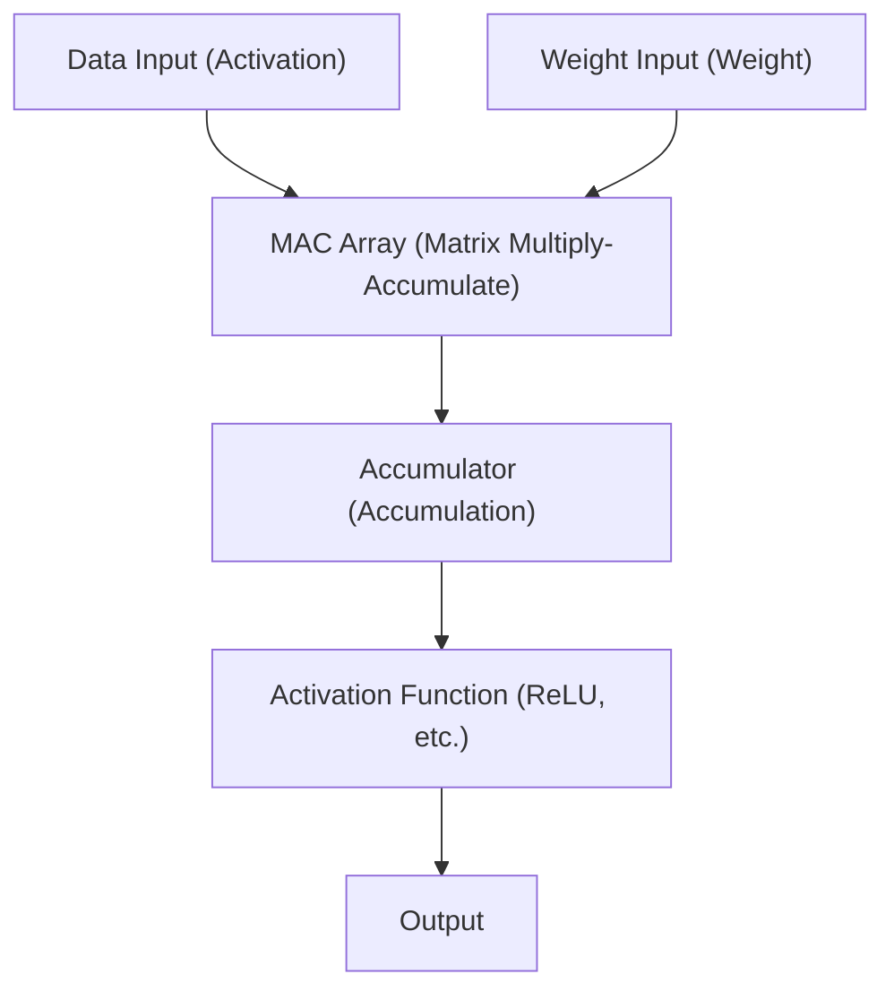

# Edge AI and NPU (Neural Processing Unit) Architecture

In recent years, with the rapid development of artificial intelligence (AI) technology, AI is now being utilized in every aspect of our lives. The initial AI boom was driven by the overwhelming computing resources of massive data centers in the cloud. However, that paradigm is currently reaching a major turning point: the rise of "Edge AI" and the dedicated hardware "NPU (Neural Processing Unit)" that supports it.

In this article, we will delve deep into the structural challenges of Cloud AI, the necessity for Edge AI, and how NPUs achieve incredible inference speeds and power efficiency. We will also explore its architecture, concrete examples, and model optimization technologies.

## 1. Limitations of Cloud AI and the Rise of Edge AI

The conventional approach of performing AI inference on the cloud side has several structural challenges.

### The Latency Problem
In applications that require instantaneous decision-making, such as self-driving cars, industrial robots, and real-time voice translation, network communication delay (latency) becomes a fatal issue. A delay of tens to hundreds of milliseconds between sending data to the cloud and receiving the processed results could lead to serious accidents or a degraded user experience.

### Privacy and Security
Smartphones and smart home devices constantly capture highly private user information through cameras and microphones. Continuously sending this raw data to the cloud increases the risk of information leaks and privacy violations. By using Edge AI, data is processed directly within the device (at the edge), and only the results are output or transmitted, making it highly advantageous from a privacy protection perspective.

### Communication Costs and Bandwidth
Sending all high-resolution video streams and massive amounts of sensor data to the cloud significantly strains network bandwidth and inflates communication costs. Pre-processing the data on the edge side and sending only necessary information to the cloud can drastically reduce the load on the network infrastructure.

To solve these challenges, there naturally arose a demand for "Edge AI," which runs AI models directly on the frontlines (the edge) where data is generated. However, unlike cloud servers, edge devices have strict constraints on battery capacity, heat dissipation, and physical size. This is where the highly efficient processor specialized for AI processing, the "NPU," makes its entrance.

## 2. What is an NPU (Neural Processing Unit)?

An NPU (Neural Processing Unit) is a hardware accelerator specially designed to execute deep learning and other neural network processing (inference and training) at extremely high speeds and low power consumption.

### Differences Between CPU, GPU, and NPU

To understand the evolution of hardware in AI processing, it's necessary to organize the differences in roles and architectures among CPU, GPU, and NPU.

*   **CPU (Central Processing Unit)**:
    Excels at general-purpose arithmetic processing. It can flexibly handle diverse tasks such as complex conditional branching and OS control. However, because its core count is limited, it is unsuited for massive parallel computations like neural networks.
*   **GPU (Graphics Processing Unit)**:
    Originally equipped with thousands of small-scale cores for graphics rendering, it excels at massive parallel processing of simple calculations. It sparked the AI boom and remains the undisputed star for model training on the cloud side. However, it consumes a large amount of power, presenting challenges in terms of battery and heat dissipation for continuous operation on edge devices like mobile terminals.
*   **NPU (Neural Processing Unit)**:
    A dedicated processor whose entire architecture is optimized for neural network calculations (especially matrix multiply-accumulate operations). While sacrificing some versatility, it delivers processing efficiency (TOPS/W: operations per watt) far exceeding that of GPUs for inference of specific AI models.

## 3. NPU Architecture: Why is it Fast and Highly Efficient?

The secret behind the NPU's incredible performance lies in its internal architecture.

### Integration of MAC (Multiply-Accumulate) Units
The vast majority of neural network processing consists of "Multiply-Accumulate (MAC)" operations, which multiply input data by weights and add them up. NPUs adopt structures called "Systolic Arrays" or "Tensor Cores," where massive numbers (thousands to tens of thousands) of these MAC units are laid out. By passing data through the array like a bucket brigade, it reduces wasteful access to registers and dramatically increases the amount of computation per clock cycle.

### Memory Hierarchy Optimization (Minimization of Data Movement)
The component that consumes the most power in a processor is actually not the "computation" itself, but the "data reading and writing from memory (data movement)." The power consumed when fetching data from DRAM can reach tens to hundreds of times that of the calculation within the ALU (Arithmetic Logic Unit).
NPUs adopt an architecture that incorporates massive SRAM (on-chip memory) within the chip, retaining neural network weights and intermediate data inside the chip as much as possible. Furthermore, instead of writing data back to main memory (DRAM) between layers, it streams directly into the arithmetic units of the next layer, completely eliminating the overhead of data movement.

## 4. Real-World NPU Architecture Examples

Currently, various NPUs are being developed and installed in smartphones and PCs.

### Apple Neural Engine (ANE)
Starting with the A11 Bionic chip, the Neural Engine is the source of competitiveness for iPhones and Macs (M series). It handles Face ID facial recognition, photographic semantic segmentation, and Siri's on-device voice recognition at high speed in the background, consuming almost no battery. The latest M3 and A17 Pro chips boast computational performance of tens of trillions of operations per second (TOPS).

### Google Tensor Processing Unit (TPU)
While Google is known for its massive TPUs for the cloud, it deploys the "Google Tensor" chip—which integrates an NPU inheriting the lineage of the "Edge TPU"—for Pixel smartphones. It specializes in running Google's advanced AI models on the edge, such as computational photography for cameras (Magic Eraser and Night Sight) and real-time transcription.

### Qualcomm Hexagon NPU
The Hexagon DSP/NPU is integrated into Snapdragon SoCs, which are found in many Android smartphones. By integrating scalar, vector, and tensor operations, and closely coordinating with the camera ISP and sensor hub, it optimizes the overall AI performance of the device. Recently, powerful NPUs have also been included in Snapdragon X Elite processors for Windows PCs, driving the realization of AI PCs (Copilot+ PCs).

## 5. Software and Optimization Technologies Supporting Edge AI

Even with excellent NPU hardware, massive AI models for the cloud cannot run directly on the edge as they are. "Model optimization technologies" are essential to unlock the hardware's potential.

### Quantization
A technology that reduces the weights and computational precision of AI models from the standard 32-bit floating point (FP32) to 16-bit (FP16), 8-bit integer (INT8), or even 4-bit (INT4). This shrinks the model size down to a fraction and saves memory bandwidth. Most NPUs are hardware-optimized for INT8 or INT4 operations, so quantization dramatically improves inference speed. Techniques such as PTQ (Post-Training Quantization) and QAT (Quantization-Aware Training) are used to minimize accuracy degradation.

### Pruning
A technique that identifies "low-importance weights (values close to zero)" in a neural network that have little impact on the inference results, and removes them (fixes them to zero) from the network. This increases the sparsity of the model, reducing computational complexity and model size.

### Knowledge Distillation
A method in which a lightweight model (student model) is trained to mimic the behavior of a high-performance but massive model (teacher model). Because the student model is trained to imitate the output probability distribution of the teacher model, it can achieve higher accuracy than training a small model independently, while keeping its size small enough to run on edge devices.

## 6. The Future and Prospects of Edge AI

Currently, Large Language Models (LLMs) like ChatGPT are taking the world by storm, but their inference still requires massive GPU clusters in the cloud. However, technological advancements are trying to bring even LLMs to the edge (Edge LLMs, SLMs: Small Language Models).

Looking ahead, we can expect the following trends:

*   **Hybrid AI**:
    A hybrid approach will become mainstream, where everyday light inference (text summarization, speech recognition, simple image generation, etc.) is processed instantly by the NPU on the edge device, while offloading to the cloud only when more advanced and complex inference is required.
*   **Expansion to Diverse Edge Devices**:
    Beyond smartphones and PCs, minuscule NPUs (AI for microcontrollers) will be embedded in surveillance cameras, drones, wearable devices, and even IoT sensors themselves, endowing all "things" with intelligence.
*   **NPU Standardization and Ecosystems**:
    To overcome the current situation where different hardware requires different optimization, frameworks like ONNX, OpenVINO, TensorFlow Lite, and PyTorch ExecuTorch are evolving, advancing an environment where developers can "write once, run optimally on any NPU."

## Conclusion

The evolution of Edge AI and NPUs has transformed AI from something belonging only to select researchers and cloud infrastructure into a "fundamental feature" of every device in our hands. This architecture, which eliminates latency, protects privacy, and dramatically improves power efficiency, is one of the most important technologies that will drive computing in the next decade.

For software engineers and AI developers, not only the skills to handle massive models in the cloud, but also the knowledge of "how to implement and optimize AI within limited resources by leveraging hardware (NPU) characteristics," will become increasingly important in the future.
