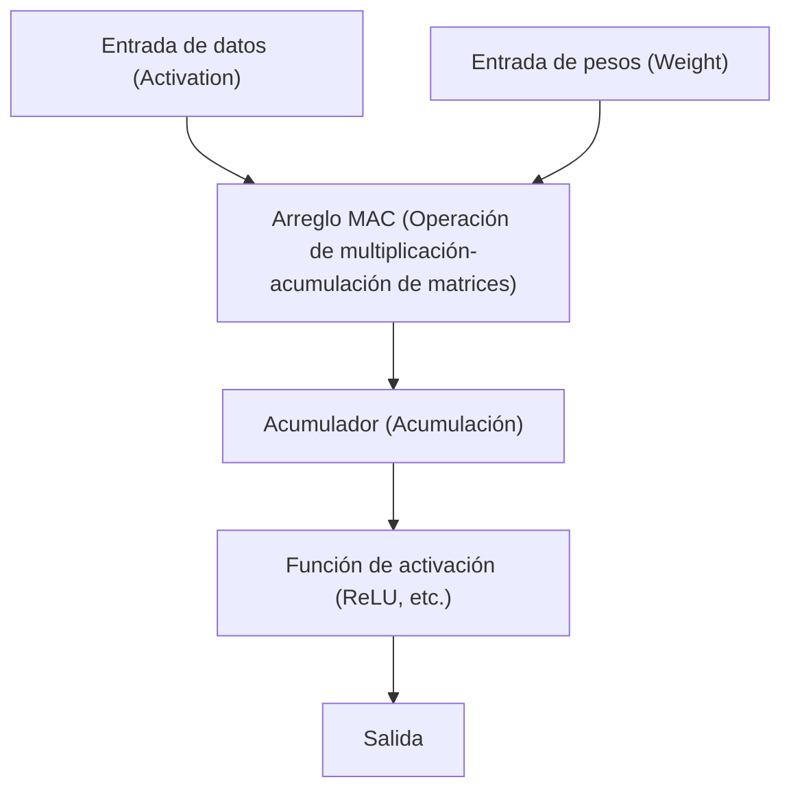

# Edge AI y la arquitectura NPU (Neural Processing Unit)

En los últimos años, con el rápido desarrollo de la tecnología de Inteligencia Artificial (IA), esta se ha comenzado a utilizar en todos los aspectos de nuestra vida. Lo que impulsó el auge inicial de la IA fueron los abrumadores recursos informáticos de los enormes centros de datos en la nube. Sin embargo, en la actualidad, ese paradigma se encuentra en un gran punto de inflexión con el surgimiento de "Edge AI" (IA en el borde) y el hardware dedicado que lo soporta, la "NPU" (Unidad de Procesamiento Neuronal).

En este artículo, exploraremos en profundidad los desafíos de la IA en la nube y la necesidad de Edge AI, y cómo las NPU logran increíbles velocidades de inferencia y ahorro de energía. Explicaremos su arquitectura, ejemplos específicos y técnicas de optimización de modelos.

## 1. Los límites de la IA en la nube y el surgimiento del Edge AI

El enfoque tradicional de realizar la inferencia de IA en el lado de la nube presenta varios desafíos estructurales.

### El problema de la latencia (retraso)
En aplicaciones que requieren decisiones instantáneas, como los vehículos autónomos, los robots industriales o la traducción de voz en tiempo real, el retraso en la comunicación (latencia) a través de la red es un problema fatal. Un retraso de decenas o cientos de milisegundos para enviar datos a la nube y recibir el resultado del procesamiento puede provocar accidentes graves o una mala experiencia para el usuario.

### Privacidad y seguridad
Los teléfonos inteligentes y los dispositivos domésticos inteligentes recopilan constantemente información muy privada de los usuarios a través de cámaras y micrófonos. Enviar continuamente estos datos en bruto a la nube aumenta el riesgo de fugas de información y violaciones a la privacidad. Con Edge AI, los datos se procesan dentro del dispositivo (borde) y solo se genera o envía el resultado, lo que resulta muy ventajoso desde el punto de vista de la protección de la privacidad.

### Costos de comunicación y ancho de banda
Enviar transmisiones de video de alta resolución y enormes cantidades de datos de sensores a la nube satura significativamente el ancho de banda de la red y dispara los costos de comunicación. Al preprocesar los datos en el borde y enviar solo la información necesaria a la nube, se puede reducir drásticamente la carga sobre la infraestructura de red.

Para resolver estos problemas, el "Edge AI", que ejecuta modelos de IA directamente en el lugar donde se generan los datos (el borde), se ha convertido en una necesidad. Sin embargo, a diferencia de los servidores en la nube, los dispositivos de borde tienen estrictas limitaciones en cuanto a capacidad de batería, disipación de calor y tamaño físico. Es aquí donde entran en juego las "NPU", procesadores de alta eficiencia especializados en el procesamiento de IA.

## 2. ¿Qué es una NPU (Neural Processing Unit)?

Una NPU (Unidad de Procesamiento Neuronal) es un acelerador de hardware diseñado específicamente para ejecutar el procesamiento de redes neuronales (inferencia y entrenamiento), como el aprendizaje profundo, a velocidades extremadamente altas y con un bajo consumo de energía.

### Diferencias entre CPU, GPU y NPU

Para comprender la evolución del hardware en el procesamiento de IA, es necesario aclarar los roles y las diferencias de arquitectura entre las CPU, GPU y NPU.

*   **CPU (Central Processing Unit)**:
    Se destaca en el procesamiento de operaciones de propósito general. Puede manejar de manera flexible diversas tareas, como ramificaciones condicionales complejas y el control del sistema operativo (OS), pero debido a su número limitado de núcleos, no es adecuada para cálculos paralelos masivos como los requeridos por las redes neuronales.
*   **GPU (Graphics Processing Unit)**:
    Originalmente equipada con miles de núcleos pequeños para renderizar imágenes, sobresale en el procesamiento paralelo masivo de cálculos simples. Fue el catalizador del auge de la IA y sigue siendo el actor dominante para el entrenamiento de modelos en la nube. Sin embargo, consume mucha energía, lo que plantea desafíos en términos de batería y disipación de calor para funcionar constantemente en dispositivos de borde como los teléfonos móviles.
*   **NPU (Neural Processing Unit)**:
    Es un procesador dedicado cuya arquitectura completa está optimizada para los cálculos de redes neuronales (especialmente las operaciones de multiplicación-acumulación de matrices). A cambio de sacrificar en parte su versatilidad, logra una eficiencia de procesamiento (TOPS/W: operaciones por vatio) superior a la de una GPU en la inferencia de modelos de IA específicos.

## 3. Arquitectura de las NPU: ¿Por qué son tan rápidas y eficientes?

El secreto del asombroso rendimiento de las NPU reside en su arquitectura interna.

### Integración de unidades MAC (Multiply-Accumulate)
La mayor parte del procesamiento en una red neuronal consiste en "operaciones de multiplicación-acumulación (MAC)", donde los datos de entrada se multiplican por los pesos (Weight) y luego se suman. Las NPU emplean estructuras llamadas "Arreglo Sistólico" (Systolic Array) o "Núcleos Tensoriales" (Tensor Cores), donde se empaquetan enormes cantidades de estas unidades MAC (miles o decenas de miles). Al hacer que los datos fluyan a través del arreglo como en una cadena humana, se reducen los accesos innecesarios a los registros y se aumenta drásticamente el volumen de cálculo por ciclo de reloj.

### Optimización de la jerarquía de memoria (minimización del movimiento de datos)
Lo que consume más energía en un procesador no es el "cálculo" en sí, sino "la lectura y escritura de datos desde la memoria (movimiento de datos)". El consumo de energía para recuperar datos de la DRAM es entre decenas y cientos de veces mayor que el cálculo en la ALU (unidad aritmética lógica).
Las NPU adoptan una arquitectura que incluye una enorme SRAM (memoria en el chip) para mantener los pesos y los datos intermedios de las redes neuronales tanto como sea posible dentro del propio chip. Además, los datos entre capas no se reescriben en la memoria principal (DRAM), sino que se envían directamente a las unidades de cálculo de la siguiente capa, lo que reduce radicalmente la sobrecarga del movimiento de datos.

## 4. Ejemplos de arquitecturas NPU en el mundo real

Actualmente, se desarrollan e integran diversas NPU en teléfonos inteligentes y computadoras personales.

### Apple Neural Engine (ANE)
Apple comenzó a integrarlo a partir del chip A11 Bionic, y el Neural Engine es la fuente de competitividad de los iPhone y las Mac (serie M). Realiza el reconocimiento facial de Face ID, la segmentación semántica de fotografías y el reconocimiento de voz en el dispositivo de Siri a alta velocidad en segundo plano, consumiendo casi nada de batería. En los últimos chips M3 y A17 Pro, presume de una capacidad de rendimiento de decenas de billones de operaciones por segundo (TOPS).

### Google Tensor Processing Unit (TPU)
Google es conocido por sus gigantescas TPU orientadas a la nube, pero para los teléfonos inteligentes Pixel, ha desplegado los chips "Google Tensor" que integran una NPU heredera del linaje de la "Edge TPU". Se especializan en ejecutar los modelos avanzados de IA de Google en el borde, como la fotografía computacional de la cámara (Borrador Mágico y Modo Visión Nocturna) y la transcripción en tiempo real.

### Qualcomm Hexagon NPU
El DSP/NPU Hexagon está incorporado en los SoC Snapdragon que se encuentran en muchos teléfonos inteligentes Android. Al integrar operaciones escalares, vectoriales y tensoriales, y colaborar estrechamente con el ISP de la cámara y el hub de sensores, optimiza el rendimiento general de la IA del dispositivo. Recientemente, el procesador Snapdragon X Elite para PC con Windows también incorpora una potente NPU, impulsando la realización de las "AI PC" (Copilot+ PC).

## 5. Software y tecnologías de optimización que sostienen Edge AI

Incluso con un excelente hardware NPU, no se pueden ejecutar enormes modelos de IA diseñados para la nube directamente en el borde. Las "tecnologías de optimización de modelos" son indispensables para aprovechar el potencial del hardware.

### Cuantización (Quantization)
Es una tecnología que reduce los pesos y la precisión del cálculo de los modelos de IA del estándar de punto flotante de 32 bits (FP32) a 16 bits (FP16), enteros de 8 bits (INT8) o incluso de 4 bits (INT4). Esto reduce el tamaño del modelo a una fracción y ahorra ancho de banda de memoria. La mayoría de las NPU están optimizadas a nivel de hardware para operaciones INT8 o INT4, por lo que la cuantización mejora dramáticamente la velocidad de inferencia. Para minimizar la degradación de la precisión, se utilizan técnicas como PTQ (Cuantización posterior al entrenamiento) y QAT (Entrenamiento consciente de la cuantización).

### Poda (Pruning)
Es una tecnología que identifica los "pesos de baja importancia (valores cercanos a cero)" dentro de una red neuronal que casi no afectan el resultado de la inferencia, y los elimina (los fija en cero) de la red. Esto aumenta la dispersión (sparsity) del modelo y reduce la cantidad de cálculos y el tamaño del modelo.

### Destilación de conocimiento (Knowledge Distillation)
Es un método donde el comportamiento de un modelo enorme pero de alto rendimiento (modelo profesor) se enseña a un modelo ligero (modelo estudiante). Dado que el modelo estudiante se entrena para imitar la distribución de probabilidad de salida del modelo profesor, puede alcanzar una mayor precisión que si se entrenara un modelo pequeño de forma aislada, manteniendo un tamaño que permite su ejecución en dispositivos de borde.

## 6. El futuro de Edge AI y perspectivas

Actualmente, los Modelos de Lenguaje Grande (LLM) como ChatGPT están tomando el mundo por asalto, pero su inferencia todavía requiere de los gigantescos clústeres de GPU en la nube. Sin embargo, la evolución tecnológica está intentando llevar incluso los LLM al borde (Edge LLM, SLM: Small Language Model).

En el futuro, se esperan las siguientes tendencias:

*   **Hybrid AI (IA Híbrida)**:
    Se volverá dominante un enfoque híbrido en el que las inferencias ligeras cotidianas (resumen de textos, reconocimiento de voz, generación de imágenes simples, etc.) se procesen instantáneamente en las NPU de los dispositivos de borde, y solo se delegue a la nube cuando se requieran inferencias más avanzadas y complejas.
*   **Expansión a diversos dispositivos de borde**:
    NPU diminutas (IA para microcontroladores) se integrarán no solo en teléfonos inteligentes y PC, sino también en cámaras de vigilancia, drones, dispositivos portátiles (wearables) y en los propios sensores IoT, dando a todo tipo de objetos su propia "inteligencia".
*   **Estandarización de las NPU y su ecosistema**:
    Para romper con la situación actual donde se necesita una optimización diferente para cada hardware, están evolucionando frameworks como ONNX, OpenVINO, TensorFlow Lite y PyTorch ExecuTorch, avanzando en un entorno donde los desarrolladores puedan "escribir una vez y ejecutar de manera óptima en cualquier NPU".

## Conclusión

La evolución de Edge AI y las NPU ha transformado a la IA, de ser algo exclusivo de un grupo de investigadores y de la infraestructura de la nube, a ser una "función básica" en todos los dispositivos que tenemos a nuestro alcance. Esta arquitectura, que resuelve la latencia, protege la privacidad y logra mejoras drásticas en la eficiencia energética, es una de las tecnologías más importantes que impulsarán la computación en la próxima década.

Para los ingenieros de software y los desarrolladores de IA, además de las habilidades para manejar modelos masivos en la nube, el conocimiento sobre "cómo implementar y optimizar la IA aprovechando las características del hardware (NPU) con recursos limitados" será cada vez más importante en el futuro.
