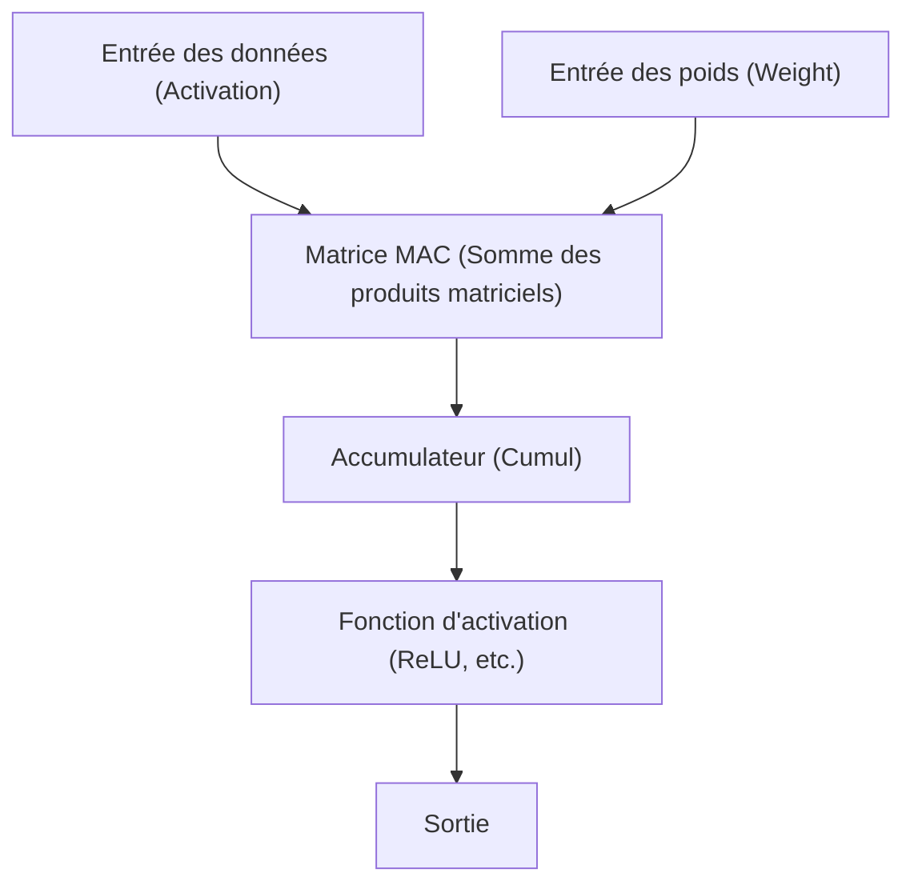

# Edge AI et architecture NPU (Neural Processing Unit)

Ces dernières années, avec le développement rapide des technologies d'intelligence artificielle (IA), l'IA est désormais utilisée dans tous les aspects de notre vie. Le premier boom de l'IA a été stimulé par les ressources de calcul écrasantes des immenses centres de données situés dans le cloud. Cependant, aujourd'hui, ce paradigme a atteint un point d'inflexion majeur. Il s'agit de l'émergence de l'« Edge AI » (l'IA en périphérie) et du matériel dédié qui la soutient, le « NPU (Neural Processing Unit) ».

Dans cet article, nous allons explorer en profondeur et expliquer la nécessité de l'Edge AI face aux défis de l'IA dans le cloud, comment le NPU parvient à réaliser une vitesse d'inférence incroyable et des économies d'énergie, son architecture, des exemples concrets et les techniques d'optimisation des modèles.

## 1. Les limites de l'IA cloud et l'essor de l'Edge AI

L'approche traditionnelle consistant à effectuer l'inférence de l'IA du côté du cloud présente plusieurs défis structurels.

### Le problème de latence (délai)
Dans les applications exigeant des prises de décision instantanées, telles que les voitures autonomes, les robots industriels ou la traduction vocale en temps réel, le retard de communication (latence) via le réseau constitue un problème fatal. Le délai de plusieurs dizaines à centaines de millisecondes pour envoyer les données au cloud et recevoir le résultat du traitement peut entraîner des accidents graves ou dégrader l'expérience utilisateur.

### Confidentialité et sécurité
Les smartphones et les appareils domestiques intelligents capturent en permanence des informations extrêmement privées sur les utilisateurs via leurs caméras et leurs microphones. Continuer à envoyer ces données brutes vers le cloud augmente les risques de fuites d'informations et de violation de la vie privée. En utilisant l'Edge AI, les données sont traitées directement au sein du terminal (edge) et seuls les résultats sont générés ou transmis, ce qui est très avantageux du point de vue de la protection de la vie privée.

### Coût de communication et bande passante
L'envoi de flux vidéo en haute résolution ou de quantités massives de données de capteurs vers le cloud pèse lourdement sur la bande passante du réseau et fait exploser les coûts de communication. En prétraitant les données du côté de l'edge et en n'envoyant que les informations nécessaires au cloud, la charge sur l'infrastructure réseau peut être considérablement réduite.

Afin de résoudre ces problèmes, l'« Edge AI », qui exécute les modèles d'IA directement sur le site (edge) où les données sont générées, est inévitablement devenue nécessaire. Cependant, contrairement aux serveurs cloud, les appareils edge ont des contraintes strictes en matière de capacité de batterie, de dissipation thermique et de taille physique. C'est là qu'intervient le « NPU », un processeur hautement efficace spécialisé dans le traitement de l'IA.

## 2. Qu'est-ce qu'un NPU (Neural Processing Unit) ?

Un NPU (Neural Processing Unit) est un accélérateur matériel spécialement conçu pour exécuter des traitements de réseaux de neurones (tels que l'apprentissage en profondeur ou deep learning) avec une vitesse extrêmement élevée et une faible consommation d'énergie.

### Différences entre CPU, GPU et NPU

Pour comprendre l'évolution du matériel dans le traitement de l'IA, il est nécessaire de clarifier les rôles et les différences d'architecture entre le CPU, le GPU et le NPU.

*   **CPU (Central Processing Unit)** :
    Il excelle dans les traitements de calcul d'ordre général. Bien qu'il puisse gérer de manière flexible diverses tâches telles que les branchements conditionnels complexes et le contrôle du système d'exploitation, son nombre limité de cœurs le rend inadapté aux calculs parallèles massifs comme ceux requis par les réseaux de neurones.
*   **GPU (Graphics Processing Unit)** :
    Initialement doté de milliers de petits cœurs pour le rendu d'images, il excelle dans le traitement hautement parallèle de calculs simples. Il a déclenché le boom de l'IA et reste aujourd'hui l'acteur dominant pour l'apprentissage de modèles (Training) côté cloud. Cependant, sa forte consommation d'énergie pose des défis en termes de batterie et de dissipation thermique pour fonctionner en permanence sur des appareils edge tels que les terminaux mobiles.
*   **NPU (Neural Processing Unit)** :
    Il s'agit d'un processeur dédié dont l'architecture entière est optimisée pour les calculs des réseaux de neurones (en particulier les opérations de somme des produits matriciels). Bien qu'il sacrifie une certaine polyvalence, il atteint une efficacité de traitement (TOPS/W : nombre d'opérations par watt) supérieure à celle des GPU pour l'inférence (Inference) de modèles d'IA spécifiques.

## 3. L'architecture du NPU : Pourquoi est-il si rapide et efficace ?

Le secret des performances incroyables du NPU réside dans son architecture interne.

### Intégration des unités MAC (Multiply-Accumulate)
La majeure partie du traitement des réseaux de neurones consiste en une « opération de multiplication-accumulation (MAC) » qui multiplie les données d'entrée par les poids (Weight) et les additionne. Le NPU adopte une structure appelée « matrice systolique (Systolic Array) » ou « cœur tensoriel (Tensor Core) », qui rassemble un très grand nombre (des milliers, voire des dizaines de milliers) de ces unités MAC. Les données circulent dans la matrice comme dans une chaîne de seaux, ce qui réduit les accès inutiles aux registres et augmente considérablement le nombre d'opérations par cycle d'horloge.

### Optimisation de la hiérarchie de la mémoire (minimisation du déplacement des données)
Ce qui consomme le plus d'énergie dans un processeur, ce n'est pas le « calcul » lui-même, mais la « lecture et l'écriture des données depuis la mémoire (déplacement des données) ». La consommation d'énergie lors de la récupération des données de la DRAM peut être des dizaines à des centaines de fois supérieure à celle du calcul dans l'ALU (unité arithmétique et logique).
Le NPU intègre une énorme SRAM (mémoire sur puce) et adopte une architecture qui conserve autant que possible les poids et les données intermédiaires du réseau de neurones sur la puce. De plus, il réduit drastiquement les frais généraux liés au déplacement des données en transmettant directement les données entre les couches vers les unités de calcul de la couche suivante, sans les réécrire dans la mémoire principale (DRAM).

## 4. Exemples réels d'architectures NPU

Aujourd'hui, divers NPU sont développés et intégrés dans les smartphones et les PC.

### Apple Neural Engine (ANE)
Le Neural Engine, introduit par Apple à partir de la puce A11 Bionic, est la source de la compétitivité des iPhone et des Mac (série M). Il traite rapidement en arrière-plan la reconnaissance faciale Face ID, la segmentation sémantique des photos et la reconnaissance vocale de Siri sur l'appareil, tout en consommant très peu de batterie. Les puces récentes M3 et A17 Pro affichent des performances de calcul de plusieurs dizaines de billions d'opérations par seconde (TOPS).

### Google Tensor Processing Unit (TPU)
Bien que Google soit connu pour ses immenses TPU destinés au cloud, l'entreprise déploie la puce « Google Tensor », qui intègre un NPU dans la lignée des « Edge TPU », pour ses smartphones Pixel. Elle est spécialisée dans l'exécution de modèles d'IA avancés de Google sur l'edge, comme la photographie computationnelle de l'appareil photo (Gomme magique, mode Vision de nuit) ou la transcription en temps réel.

### Qualcomm Hexagon NPU
Le processeur de signal numérique (DSP) / NPU Hexagon est intégré aux SoC Snapdragon, que l'on retrouve dans de nombreux smartphones Android. En intégrant des calculs scalaires, vectoriels et tensoriels et en collaborant étroitement avec le processeur de signal d'image (ISP) de l'appareil photo et le hub de capteurs, il optimise les performances globales de l'IA de l'appareil. Récemment, le processeur Snapdragon X Elite, destiné aux PC Windows, a également été doté d'un puissant NPU, favorisant la réalisation de PC IA (Copilot+ PC).

## 5. Logiciels et techniques d'optimisation soutenant l'Edge AI

Même avec un excellent matériel NPU, les modèles d'IA massifs pour le cloud ne peuvent pas être exécutés tels quels sur l'edge. Les « techniques d'optimisation des modèles » sont indispensables pour exploiter le potentiel du matériel.

### Quantification (Quantization)
Il s'agit d'une technologie qui réduit le poids et la précision de calcul des modèles d'IA du format standard en virgule flottante 32 bits (FP32) vers des formats 16 bits (FP16), des entiers 8 bits (INT8) ou 4 bits (INT4). Cela réduit la taille du modèle à une fraction de son volume initial et permet d'économiser la bande passante de la mémoire. De nombreux NPU sont optimisés au niveau matériel pour les opérations INT8 ou INT4, ce qui accélère considérablement la vitesse d'inférence grâce à la quantification. Pour minimiser la dégradation de la précision, des techniques telles que la PTQ (Quantification Post-Entraînement) ou la QAT (Entraînement Sensible à la Quantification) sont utilisées.

### Élagage (Pruning)
C'est une technique permettant d'identifier et de supprimer (fixer à zéro) les « poids de faible importance (valeurs proches de zéro) » dans le réseau de neurones, qui n'affectent pratiquement pas le résultat de l'inférence. Cela augmente la rareté (sparsité) du modèle et permet de réduire la charge de calcul et la taille du modèle.

### Distillation des connaissances (Knowledge Distillation)
C'est une méthode permettant à un modèle léger (modèle élève) d'apprendre le comportement d'un modèle performant mais volumineux (modèle enseignant). Étant donné que le modèle élève est formé pour imiter la distribution de probabilité des sorties du modèle enseignant, il peut atteindre une précision supérieure à celle d'un petit modèle formé de manière isolée, tout en conservant une taille lui permettant de fonctionner sur des appareils edge.

## 6. L'avenir et les perspectives de l'Edge AI

Aujourd'hui, les grands modèles de langage (LLM) comme ChatGPT dominent le monde, mais leur inférence nécessite encore d'immenses clusters de GPU dans le cloud. Cependant, l'évolution technologique tente d'apporter même les LLM sur l'edge (Edge LLM, SLM : Small Language Model).

À l'avenir, les tendances suivantes sont attendues :

*   **Hybrid AI (IA hybride)** :
    L'approche hybride, qui consiste à traiter immédiatement les inférences légères du quotidien (résumé de texte, reconnaissance vocale, génération d'images simples, etc.) avec le NPU de l'appareil edge, et de ne décharger sur le cloud que lorsque des inférences plus complexes et avancées sont requises, deviendra la norme.
*   **L'expansion vers divers appareils edge** :
    De minuscules NPU (IA pour microcontrôleurs) seront intégrés non seulement dans les smartphones et les PC, mais aussi dans les caméras de sécurité, les drones, les appareils portables (wearables) et même dans les capteurs IoT eux-mêmes, dotant ainsi tous les objets d'une certaine « intelligence ».
*   **Standardisation et écosystème des NPU** :
    Afin de surmonter la situation actuelle où chaque matériel nécessite une optimisation différente, l'évolution de frameworks tels que ONNX, OpenVINO, TensorFlow Lite et PyTorch ExecuTorch favorise le développement d'environnements permettant aux développeurs d'écrire du code une seule fois, pour qu'il s'exécute de manière optimale sur n'importe quel NPU (« Write once, run anywhere »).

## Conclusion

L'évolution de l'Edge AI et du NPU a transformé l'IA, la faisant passer d'un outil réservé à quelques chercheurs et infrastructures cloud à une « fonctionnalité fondamentale » pour tous les appareils que nous avons entre nos mains. Cette architecture, qui permet d'éliminer la latence, de protéger la vie privée et d'améliorer considérablement l'efficacité énergétique, est l'une des technologies les plus importantes pour propulser l'informatique de la prochaine décennie.

Pour les ingénieurs logiciels et les développeurs en IA, l'acquisition des compétences permettant non seulement de manipuler des modèles massifs dans le cloud, mais aussi de savoir « comment implémenter et optimiser l'IA dans un environnement aux ressources limitées, en tirant parti des caractéristiques du matériel (NPU) », deviendra de plus en plus cruciale à l'avenir.
