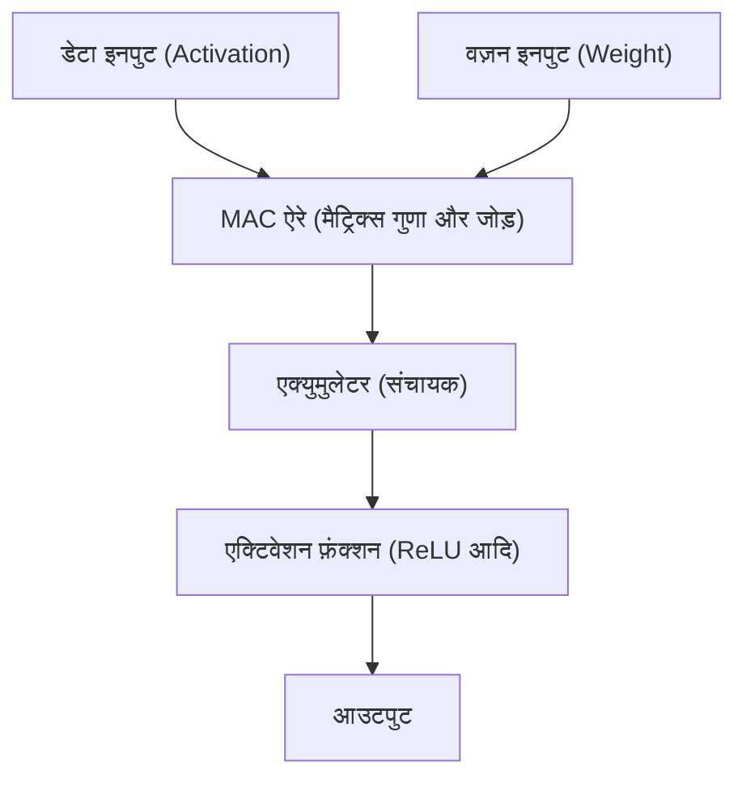

# Edge AI और NPU (Neural Processing Unit) आर्किटेक्चर

हाल के वर्षों में, आर्टिफिशियल इंटेलिजेंस (AI) तकनीक के तेजी से विकास के साथ, AI का उपयोग हमारे जीवन के हर पहलू में किया जाने लगा है। प्रारंभिक AI बूम को क्लाउड में मौजूद विशाल डेटा सेंटर्स के जबरदस्त कंप्यूटिंग संसाधनों ने संचालित किया था। लेकिन अब, यह प्रतिमान (paradigm) एक बड़े टर्निंग पॉइंट पर पहुंच गया है। वह है "Edge AI (एज AI)" और इसका समर्थन करने वाले विशेष हार्डवेयर "NPU (Neural Processing Unit)" का उदय।

इस लेख में, हम क्लाउड AI की चुनौतियों से लेकर Edge AI की आवश्यकता तक, और NPU कैसे आश्चर्यजनक इन्फ्रेंस गति और ऊर्जा बचत (पावर सेविंग) प्राप्त करता है, इसके आर्किटेक्चर, विशिष्ट उदाहरणों और मॉडल ऑप्टिमाइज़ेशन (अनुकूलन) तकनीकों पर गहराई से चर्चा करेंगे।

## 1. क्लाउड AI की सीमाएं और Edge AI का उदय

क्लाउड साइड पर AI इन्फ्रेंस (अनुमान) करने के पारंपरिक दृष्टिकोण में कुछ संरचनात्मक चुनौतियाँ मौजूद हैं।

### लेटेंसी (विलंब) की समस्या
ऑटोमैटिक ड्राइविंग (स्व-चालित) कारों, औद्योगिक रोबोटों और रीयल-टाइम वॉइस ट्रांसलेशन जैसे एप्लिकेशंस, जहाँ तुरंत निर्णय लेने की आवश्यकता होती है, नेटवर्क पर कम्यूनिकेशन लेटेंसी (विलंब) एक घातक समस्या बन जाती है। डेटा को क्लाउड पर भेजने और प्रोसेसिंग रिज़ल्ट प्राप्त करने में होने वाला दसियों से लेकर सैकड़ों मिलीसेकंड का विलंब, गंभीर दुर्घटनाओं या यूजर एक्सपीरियंस में गिरावट का कारण बन सकता है।

### प्राइवेसी (गोपनीयता) और सिक्योरिटी
स्मार्टफोन और स्मार्ट होम डिवाइसेज लगातार कैमरे और माइक्रोफ़ोन के माध्यम से यूजर्स की अत्यधिक निजी जानकारी प्राप्त कर रहे हैं। इन कच्चे (raw) डेटा को लगातार क्लाउड पर भेजने से इन्फॉर्मेशन लीक (सूचना रिसाव) और प्राइवेसी के उल्लंघन का जोखिम बढ़ जाता है। Edge AI का उपयोग करके, डेटा को डिवाइस (एज) के भीतर प्रोसेस किया जाता है और केवल परिणाम आउटपुट या भेजा जाता है, जो गोपनीयता सुरक्षा के दृष्टिकोण से बहुत फायदेमंद है।

### कम्यूनिकेशन लागत और बैंडविड्थ
सभी हाई-रिज़ॉल्यूशन वीडियो स्ट्रीम और भारी मात्रा में सेंसर डेटा को क्लाउड पर भेजने से नेटवर्क बैंडविड्थ पर गंभीर दबाव पड़ता है और कम्यूनिकेशन लागत बढ़ जाती है। डेटा को एज साइड पर प्री-प्रोसेस करने और केवल आवश्यक जानकारी को क्लाउड पर भेजने से, नेटवर्क इन्फ्रास्ट्रक्चर पर लोड को काफी कम किया जा सकता है।

इन चुनौतियों को हल करने के लिए, "Edge AI" की अनिवार्य रूप से आवश्यकता हो गई है, जो AI मॉडल को सीधे उसी साइट (एज) पर चलाता है जहाँ डेटा उत्पन्न होता है। हालाँकि, क्लाउड सर्वर के विपरीत, एज डिवाइसेस में बैटरी क्षमता, हीट डिसिपेशन (उष्मा अपव्यय) और भौतिक आकार के संदर्भ में सख्त सीमाएँ (Constraints) होती हैं। इसलिए, AI प्रोसेसिंग के लिए विशेष रूप से डिज़ाइन किया गया अत्यधिक कुशल प्रोसेसर "NPU" पेश किया गया।

## 2. NPU (Neural Processing Unit) क्या है?

NPU (Neural Processing Unit) एक हार्डवेयर एक्सेलेरेटर है जिसे डीप लर्निंग जैसे न्यूरल नेटवर्क की प्रोसेसिंग (इन्फ्रेंस और ट्रेनिंग) को अत्यधिक उच्च गति और कम बिजली की खपत पर निष्पादित (Execute) करने के लिए विशेष रूप से डिज़ाइन किया गया है।

### CPU, GPU और NPU के बीच अंतर

AI प्रोसेसिंग में हार्डवेयर के विकास को समझने के लिए, CPU, GPU और NPU की भूमिकाओं और आर्किटेक्चर में अंतर को स्पष्ट करना आवश्यक है।

*   **CPU (Central Processing Unit)**:
    सामान्य प्रयोजन (General-purpose) की कंप्यूटिंग प्रोसेसिंग में उत्कृष्ट है। यह जटिल कंडीशनल ब्रांचिंग और OS नियंत्रण जैसे विभिन्न कार्यों को लचीले ढंग से संभाल सकता है, लेकिन क्योंकि कोर की संख्या सीमित है, यह न्यूरल नेटवर्क जैसी भारी पैरेलल कंप्यूटिंग (समानांतर गणना) के लिए उपयुक्त नहीं है।
*   **GPU (Graphics Processing Unit)**:
    मूल रूप से इमेज रेंडरिंग के लिए हजारों छोटे कोर से सुसज्जित, यह साधारण गणनाओं की सुपर पैरेलल प्रोसेसिंग में उत्कृष्ट है। यह AI बूम का उत्प्रेरक बन गया और आज भी क्लाउड साइड पर मॉडल ट्रेनिंग में इसकी प्रमुख भूमिका है। हालाँकि, इसकी बिजली की खपत बहुत अधिक है, जिससे बैटरी और हीट के कारण इसे मोबाइल डिवाइसेस जैसे एज डिवाइस में लगातार चालू रखना चुनौतीपूर्ण हो जाता है।
*   **NPU (Neural Processing Unit)**:
    यह एक समर्पित प्रोसेसर है जिसका पूरा आर्किटेक्चर न्यूरल नेटवर्क गणनाओं (विशेष रूप से मैट्रिक्स के गुणा और जोड़ ऑपरेशंस - MAC) के लिए अनुकूलित (Optimized) है। कुछ हद तक बहुमुखी प्रतिभा (Generality) का बलिदान करके, यह विशिष्ट AI मॉडलों के इन्फ्रेंस में GPU से अधिक प्रोसेसिंग दक्षता (TOPS/W: ऑपरेशंस प्रति वॉट) प्राप्त करता है।

## 3. NPU का आर्किटेक्चर: यह तेज़ और उच्च दक्षता वाला क्यों है?

NPU द्वारा आश्चर्यजनक प्रदर्शन प्रदान करने का रहस्य इसके आंतरिक आर्किटेक्चर में निहित है।

### MAC (Multiply-Accumulate) यूनिट्स का एकीकरण
न्यूरल नेटवर्क प्रोसेसिंग का अधिकांश भाग "MAC (Multiply-Accumulate) ऑपरेशन" है, जो इनपुट डेटा और वज़न (Weight) को गुणा करता है और फिर उन्हें जोड़ता है। NPU में "Systolic Array (सिस्टोलिक ऐरे)" या "Tensor Core (टेंसर कोर)" नामक संरचना का उपयोग किया जाता है, जहाँ इन MAC यूनिट्स को बड़ी मात्रा में (हजारों से लेकर दसियों हज़ार तक) एक साथ रखा जाता है। डेटा इस ऐरे के माध्यम से बकेट ब्रिगेड (बाल्टी श्रृंखला) की तरह प्रवाहित होता है, जो रजिस्टर्स तक अनावश्यक पहुँच को कम करता है और प्रति क्लॉक साइकिल में गणना की मात्रा को नाटकीय रूप से बढ़ाता है।

### मेमोरी पदानुक्रम (Hierarchy) का अनुकूलन (डेटा मूवमेंट को कम करना)
प्रोसेसर में, जो सबसे अधिक बिजली की खपत करता है वह वास्तव में "गणना" नहीं है, बल्कि "मेमोरी से डेटा को पढ़ना/लिखना (डेटा मूवमेंट)" है। DRAM से डेटा प्राप्त करने के लिए बिजली की खपत ALU (एरिथमेटिक लॉजिक यूनिट) में गणना करने की तुलना में दसियों से सैकड़ों गुना अधिक होती है।
NPU एक आर्किटेक्चर को अपनाता है जिसमें चिप के भीतर एक विशाल SRAM (ऑन-चिप मेमोरी) होता है, और न्यूरल नेटवर्क के वज़न और मध्यवर्ती डेटा को जितना संभव हो चिप के भीतर ही रखता है। इसके अतिरिक्त, लेयर्स (स्तरों) के बीच डेटा को मुख्य मेमोरी (DRAM) में वापस लिखने के बजाय, इसे सीधे अगली लेयर की गणना इकाई में भेजकर, डेटा मूवमेंट के ओवरहेड को काफी हद तक कम कर दिया जाता है।

## 4. वास्तविक दुनिया में NPU आर्किटेक्चर के उदाहरण

वर्तमान में, स्मार्टफोन और पीसी के लिए विभिन्न NPU विकसित और उपयोग किए जा रहे हैं।

### Apple Neural Engine (ANE)
Apple ने इसे A11 Bionic चिप के साथ पेश करना शुरू किया, और Neural Engine, iPhone और Mac (M सीरीज) की प्रतिस्पर्धात्मक बढ़त का स्रोत है। यह Face ID फेशियल रिकग्निशन, तस्वीरों के सिमेंटिक सेगमेंटेशन, और Siri की ऑन-डिवाइस वॉयस रिकग्निशन आदि को बैकग्राउंड में बहुत तेजी से प्रोसेस करता है, और इसमें लगभग न के बराबर बैटरी की खपत होती है। नवीनतम M3 और A17 Pro चिप्स में, यह प्रति सेकंड दसियों ट्रिलियन ऑपरेशंस (TOPS) की गणना शक्ति का दावा करता है।

### Google Tensor Processing Unit (TPU)
क्लाउड के लिए विशाल TPU के लिए जाने जाने वाला Google, Pixel स्मार्टफ़ोन्स के लिए "Google Tensor" चिप्स प्रदान करता है, जिसमें एक NPU एकीकृत होता है जो "Edge TPU" की वंशावली को आगे बढ़ाता है। यह कैमरे की कंप्यूटेशनल फ़ोटोग्राफ़ी (जैसे मैजिक इरेज़र और नाइट मोड) और रीयल-टाइम ट्रांसक्रिप्शन जैसे Google के एडवांस AI मॉडलों को एज पर चलाने में माहिर है।

### Qualcomm Hexagon NPU
Hexagon DSP/NPU, Android स्मार्टफ़ोन में उपयोग किए जाने वाले अधिकांश Snapdragon SoCs में अंतर्निहित है। यह स्केलर, वेक्टर और टेंसर ऑपरेशंस को एकीकृत करता है, और पूरे डिवाइस के AI प्रदर्शन को अनुकूलित करने के लिए कैमरा ISP और सेंसर हब के साथ मिलकर काम करता है। हाल ही में, Windows पीसी प्रोसेसर, Snapdragon X Elite में भी एक शक्तिशाली NPU शामिल किया गया है, जो AI PC (Copilot+ PC) के कार्यान्वयन को बढ़ावा दे रहा है।

## 5. Edge AI का समर्थन करने वाले सॉफ्टवेयर और अनुकूलन तकनीकें

भले ही आपके पास उत्कृष्ट NPU हार्डवेयर हो, आप क्लाउड के लिए डिज़ाइन किए गए विशाल AI मॉडल को सीधे एज पर नहीं चला सकते। हार्डवेयर की क्षमता को उजागर करने के लिए "मॉडल ऑप्टिमाइज़ेशन तकनीक (मॉडल अनुकूलन तकनीक)" अनिवार्य है।

### क्वांटाइजेशन (Quantization)
यह AI मॉडल के वज़न और गणना सटीकता को मानक 32-बिट फ़्लोटिंग-पॉइंट (FP32) से 16-बिट (FP16), 8-बिट इंटीजर (INT8), या 4-बिट (INT4) तक कम करने की एक तकनीक है। इसके परिणामस्वरूप, मॉडल का आकार कई गुना कम हो जाता है, और मेमोरी बैंडविड्थ की बचत होती है। अधिकांश NPU को हार्डवेयर स्तर पर INT8 या INT4 ऑपरेशंस के लिए अनुकूलित किया जाता है, और क्वांटाइजेशन इन्फ्रेंस की गति में नाटकीय रूप से सुधार करता है। सटीकता के नुकसान को कम करने के लिए, PTQ (पोस्ट-ट्रेनिंग क्वांटाइजेशन) और QAT (क्वांटाइजेशन-अवेयर ट्रेनिंग) जैसी विधियों का उपयोग किया जाता है।

### प्रूनिंग (Pruning - छंटाई)
यह न्यूरल नेटवर्क में ऐसे "कम महत्वपूर्ण वज़न (शून्य के करीब के मान)" की पहचान करने और उन्हें नेटवर्क से हटाने (शून्य पर फिक्स करने) की एक तकनीक है, जिनका इन्फ्रेंस के परिणामों पर बहुत कम प्रभाव पड़ता है। इससे मॉडल की स्पार्सिटी (विरलता) बढ़ जाती है, और गणना की मात्रा और मॉडल का आकार कम हो जाता है।

### नॉलेज डिस्टिलेशन (Knowledge Distillation - ज्ञान आसवन)
यह एक ऐसी विधि है जिसमें एक हल्का मॉडल (छात्र मॉडल), एक उच्च-प्रदर्शन वाले लेकिन विशाल मॉडल (शिक्षक मॉडल) के व्यवहार को सीखता है। चूँकि छात्र मॉडल को शिक्षक मॉडल के आउटपुट प्रायिकता वितरण (प्रोबेबिलिटी डिस्ट्रीब्यूशन) की नकल करने के लिए प्रशिक्षित किया जाता है, इसलिए यह अकेले एक छोटे मॉडल को प्रशिक्षित करने की तुलना में उच्च सटीकता प्राप्त करते हुए एज डिवाइस पर चलने लायक आकार में फिट हो सकता है।

## 6. Edge AI का भविष्य और आगे की संभावनाएं

वर्तमान में, ChatGPT सहित लार्ज लैंग्वेज मॉडल (LLM) दुनिया पर राज कर रहे हैं, लेकिन इनके इन्फ्रेंस के लिए अभी भी क्लाउड में विशाल GPU क्लस्टर्स की आवश्यकता होती है। हालांकि, तकनीकी प्रगति ने LLM को भी एज में लाने का प्रयास शुरू कर दिया है (Edge LLM, SLM: Small Language Model)।

भविष्य में निम्नलिखित प्रवृत्तियों की उम्मीद की जा सकती है:

*   **Hybrid AI (हाइब्रिड AI)**:
    एक हाइब्रिड दृष्टिकोण मुख्यधारा बन जाएगा जहां रोज़मर्रा के हल्के इन्फ्रेंस (जैसे टेक्स्ट समरी, वॉइस रिकग्निशन, और साधारण इमेज जनरेशन) को एज डिवाइस के NPU पर तुरंत प्रोसेस किया जाएगा, और केवल तभी क्लाउड पर ऑफलोड किया जाएगा जब अधिक उन्नत और जटिल इन्फ्रेंस की आवश्यकता हो।
*   **विविध एज डिवाइसेस में फैलाव**:
    न केवल स्मार्टफोन और पीसी, बल्कि सर्विलांस कैमरे, ड्रोन, वियरेबल डिवाइसेस, और यहाँ तक कि IoT सेंसर्स में भी अत्यंत छोटे NPU (माइक्रोकंट्रोलर्स के लिए AI) शामिल किए जाएंगे, जिससे हर चीज़ में "बुद्धिमत्ता (इंटेलीजेंस)" आ जाएगी।
*   **NPU का मानकीकरण (स्टैंडर्डाइजेशन) और इकोसिस्टम**:
    वर्तमान स्थिति को तोड़ने के लिए जहां प्रत्येक हार्डवेयर को अलग अनुकूलन (ऑप्टिमाइजेशन) की आवश्यकता होती है, ONNX, OpenVINO, TensorFlow Lite, और PyTorch ExecuTorch जैसे फ्रेमवर्क्स विकसित हो रहे हैं, जो डेवलपर्स के लिए ऐसा वातावरण तैयार कर रहे हैं जहाँ वे "एक बार लिखें, और किसी भी NPU पर अनुकूल रूप से चलाएं"।

## निष्कर्ष

Edge AI और NPU के विकास ने AI को कुछ शोधकर्ताओं और क्लाउड इंफ्रास्ट्रक्चर की चीज़ से बदलकर हमारे हाथ में मौजूद सभी उपकरणों के "बुनियादी फंक्शन" में बदल दिया है। यह आर्किटेक्चर, जो लेटेंसी को समाप्त करता है, गोपनीयता की रक्षा करता है, और नाटकीय रूप से ऊर्जा दक्षता में सुधार करता है, अगले दशक की कंप्यूटिंग को चलाने वाली सबसे महत्वपूर्ण तकनीकों में से एक है।

सॉफ्टवेयर इंजीनियर्स और AI डेवलपर्स के लिए, न केवल क्लाउड पर विशाल मॉडल को संभालने का कौशल, बल्कि "सीमित संसाधनों के भीतर, हार्डवेयर (NPU) की विशेषताओं का उपयोग करते हुए AI को कैसे लागू और अनुकूलित करें" का ज्ञान भविष्य में और भी महत्वपूर्ण हो जाएगा।
