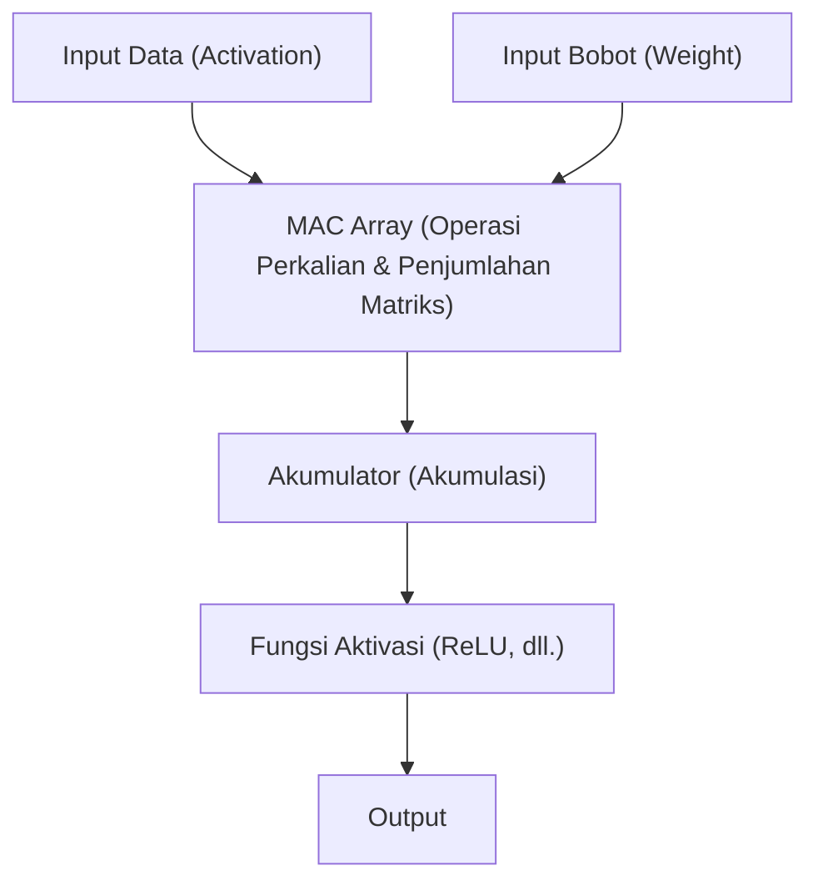

# Arsitektur Edge AI dan NPU (Neural Processing Unit)

Dalam beberapa tahun terakhir, dengan perkembangan pesat teknologi kecerdasan buatan (AI), AI telah dimanfaatkan di setiap aspek kehidupan kita. Yang mendorong ledakan AI awal adalah sumber daya komputasi yang luar biasa dari pusat data raksasa yang berada di komputasi awan (cloud). Namun saat ini, paradigma tersebut sedang menghadapi titik balik yang besar. Yaitu munculnya "Edge AI" dan perangkat keras khusus yang mendukungnya, "NPU (Neural Processing Unit)".

Dalam artikel ini, kita akan membahas secara mendalam dari tantangan yang dihadapi cloud AI hingga perlunya Edge AI, dan bagaimana NPU mewujudkan kecepatan inferensi dan penghematan daya yang luar biasa, beserta arsitekturnya, contoh konkret, dan teknologi optimasi model.

## 1. Batasan Cloud AI dan Munculnya Edge AI

Pendekatan konvensional yang melakukan inferensi AI di sisi cloud memiliki beberapa tantangan struktural.

### Masalah Latensi (Keterlambatan)
Pada aplikasi yang membutuhkan penilaian instan seperti mobil otonom, robot industri, atau terjemahan suara waktu nyata (real-time), keterlambatan komunikasi (latensi) melalui jaringan menjadi masalah yang fatal. Keterlambatan puluhan hingga ratusan milidetik antara mengirim data ke cloud dan menerima hasil pemrosesan dapat menyebabkan kecelakaan fatal atau penurunan pengalaman pengguna.

### Privasi dan Keamanan
Ponsel pintar (smartphone) dan perangkat rumah pintar terus-menerus mengambil informasi pengguna yang sangat pribadi melalui kamera dan mikrofon. Terus mengirimkan data mentah ini ke cloud akan meningkatkan risiko kebocoran informasi dan pelanggaran privasi. Jika menggunakan Edge AI, data diproses di dalam perangkat (edge) dan hanya mengirimkan atau mengeluarkan hasilnya saja, yang mana sangat menguntungkan dari perspektif perlindungan privasi.

### Biaya Komunikasi dan Bandwidth
Mengirimkan semua streaming video beresolusi tinggi dan data sensor yang sangat besar ke cloud akan sangat menekan bandwidth jaringan dan membuat biaya komunikasi membengkak. Dengan melakukan pra-pemrosesan data di sisi edge dan hanya mengirimkan informasi yang diperlukan ke cloud, beban pada infrastruktur jaringan dapat dikurangi secara signifikan.

Untuk menyelesaikan masalah-masalah ini, "Edge AI" yang menjalankan model AI secara langsung di lokasi di mana data dihasilkan (edge) secara tak terelakkan menjadi sangat dibutuhkan. Namun, berbeda dengan server cloud, perangkat edge memiliki batasan yang ketat pada kapasitas baterai, pembuangan panas, dan ukuran fisik. Di sinilah muncul "NPU", sebuah prosesor berefisiensi tinggi yang dikhususkan untuk pemrosesan AI.

## 2. Apa itu NPU (Neural Processing Unit)?

NPU (Neural Processing Unit) adalah akselerator perangkat keras (hardware accelerator) yang dirancang secara khusus untuk mengeksekusi pemrosesan jaringan saraf tiruan (neural network) seperti deep learning (untuk inferensi dan pelatihan) dengan sangat cepat dan konsumsi daya yang rendah.

### Perbedaan CPU, GPU, dan NPU

Untuk memahami evolusi perangkat keras dalam pemrosesan AI, kita perlu menyusun perbedaan peran dan arsitektur dari CPU, GPU, dan NPU.

*   **CPU (Central Processing Unit)**:
    Unggul dalam pemrosesan komputasi tujuan umum (general-purpose). Dapat menangani berbagai macam tugas dengan fleksibel, seperti percabangan kondisi yang kompleks dan kontrol OS, tetapi karena jumlah intinya (core) terbatas, prosesor ini tidak cocok untuk perhitungan paralel masif seperti jaringan saraf.
*   **GPU (Graphics Processing Unit)**:
    Awalnya dilengkapi dengan ribuan inti berskala kecil untuk rendering gambar, dan unggul dalam pemrosesan komputasi paralel super untuk perhitungan sederhana. Merupakan pemicu ledakan AI, dan hingga saat ini masih menjadi aktor utama yang mendominasi dalam pelatihan (training) model di sisi cloud. Namun, konsumsi dayanya besar, dan terdapat tantangan dari segi baterai dan pembuangan panas jika dijalankan secara terus-menerus pada perangkat edge seperti perangkat seluler.
*   **NPU (Neural Processing Unit)**:
    Prosesor khusus yang seluruh arsitekturnya dioptimalkan untuk perhitungan jaringan saraf (terutama operasi perkalian dan penjumlahan matriks). Sebagai gantinya dengan mengorbankan fleksibilitas (general-purpose) sampai tingkat tertentu, prosesor ini menghasilkan efisiensi pemrosesan (TOPS/W: jumlah operasi per 1 Watt) yang melebihi GPU dalam inferensi (inference) model AI tertentu.

## 3. Arsitektur NPU: Mengapa Begitu Cepat dan Efisien?

Rahasia NPU dapat menunjukkan performa yang luar biasa terletak pada arsitektur internalnya.

### Akumulasi Unit MAC (Multiply-Accumulate)
Sebagian besar pemrosesan jaringan saraf adalah "operasi perkalian dan penjumlahan (MAC)", yaitu mengalikan data input dengan bobot (weight) dan kemudian menjumlahkannya. NPU mengadopsi struktur yang disebut "Systolic Array" atau "Tensor Core", di mana sejumlah besar unit MAC ini (ribuan hingga puluhan ribu) disusun secara rapat. Data mengalir di dalam array layaknya estafet ember (bucket brigade), mengurangi akses sia-sia ke register dan secara dramatis meningkatkan jumlah komputasi per siklus clock.

### Optimasi Hierarki Memori (Meminimalkan Perpindahan Data)
Hal yang paling banyak mengonsumsi daya dalam sebuah prosesor sebenarnya bukanlah "perhitungan" itu sendiri, melainkan "membaca dan menulis data dari memori (perpindahan data)". Konsumsi daya saat mengambil data dari DRAM mencapai puluhan hingga ratusan kali lipat dibandingkan dengan perhitungan pada ALU (unit aritmetika dan logika).
NPU mengambil arsitektur yang melengkapi SRAM raksasa (on-chip memory) di dalam chip dan mempertahankan bobot serta data menengah jaringan saraf di dalam chip semaksimal mungkin. Selain itu, alih-alih menulis kembali data antar lapisan (layer) ke memori utama (DRAM), NPU mengalirkannya langsung ke unit komputasi lapisan berikutnya, yang secara drastis mengurangi overhead perpindahan data.

## 4. Contoh Nyata Arsitektur NPU di Dunia Nyata

Saat ini, berbagai NPU sedang dikembangkan dan dipasang pada ponsel pintar dan PC.

### Apple Neural Engine (ANE)
Neural Engine, yang mulai disematkan oleh Apple sejak chip A11 Bionic dan menjadi sumber daya saing iPhone dan Mac (M-series). Prosesor ini memproses pengenalan wajah Face ID, segmentasi semantik foto, dan pengenalan suara pada perangkat (on-device) Siri dengan kecepatan tinggi di latar belakang dengan nyaris tanpa mengonsumsi baterai. Pada chip M3 dan A17 Pro terbaru, prosesor ini membanggakan performa komputasi hingga puluhan triliun operasi per detik (TOPS).

### Google Tensor Processing Unit (TPU)
Google dikenal dengan TPU raksasanya untuk cloud, tetapi untuk ponsel pintar Pixel, mereka menggelar chip "Google Tensor" yang mengintegrasikan NPU yang mewarisi silsilah "Edge TPU". Chip ini difokuskan pada menjalankan model AI canggih Google di edge, seperti fotografi komputasional pada kamera (Magic Eraser dan mode Night Sight) serta transkripsi waktu nyata.

### Qualcomm Hexagon NPU
Hexagon DSP/NPU yang terintegrasi pada SoC Snapdragon digunakan di banyak ponsel pintar Android. Prosesor ini mengoptimalkan performa AI seluruh perangkat dengan mengintegrasikan komputasi skalar, vektor, dan tensor, serta bekerja sama erat dengan ISP kamera dan hub sensor. Baru-baru ini, prosesor PC untuk Windows, Snapdragon X Elite, juga telah dilengkapi dengan NPU yang kuat, mendorong perwujudan AI PC (Copilot+ PC).

## 5. Perangkat Lunak dan Teknologi Optimasi yang Mendukung Edge AI

Meskipun memiliki perangkat keras NPU yang luar biasa, tidak mungkin untuk langsung menjalankan model AI berukuran raksasa yang diperuntukkan bagi cloud di perangkat edge. "Teknologi optimasi model" sangat diperlukan untuk mengeluarkan potensi penuh dari perangkat keras.

### Kuantisasi (Quantization)
Teknologi untuk mengurangi bobot dan presisi komputasi model AI dari standar floating-point 32-bit (FP32) menjadi 16-bit (FP16), integer 8-bit (INT8), atau bahkan 4-bit (INT4). Dengan ini, ukuran model dapat menyusut menjadi sebagian kecil dari aslinya dan menghemat bandwidth memori. Sebagian besar NPU dioptimalkan pada tingkat perangkat keras untuk operasi INT8 atau INT4, dan kuantisasi secara dramatis meningkatkan kecepatan inferensi. Untuk meminimalkan degradasi akurasi, metode seperti PTQ (Post-Training Quantization) dan QAT (Quantization-Aware Training) digunakan.

### Pemangkasan (Pruning)
Teknologi untuk mengidentifikasi "bobot dengan tingkat kepentingan rendah (nilai mendekati nol)" di dalam jaringan saraf yang hampir tidak mempengaruhi hasil inferensi, lalu menghapusnya dari jaringan (ditetapkan menjadi nol). Dengan ini, sparsitas (ketersebaran) model meningkat, mengurangi beban komputasi dan ukuran model.

### Penyulingan Pengetahuan (Knowledge Distillation)
Sebuah metode yang membuat model berkinerja tinggi namun berukuran raksasa (model guru) untuk melatih perilakunya ke model yang ringan (model murid). Karena model murid dilatih untuk meniru distribusi probabilitas output dari model guru, model tersebut dapat mencapai akurasi yang lebih tinggi dibandingkan melatih model kecil secara mandiri, sekaligus dapat menjaga ukurannya agar bisa dijalankan pada perangkat edge.

## 6. Masa Depan dan Prospek Edge AI

Saat ini, Model Bahasa Besar (Large Language Models/LLM) seperti ChatGPT sedang mendominasi dunia, namun inferensinya masih memerlukan klaster GPU raksasa di cloud. Namun, evolusi teknologi mencoba membawa bahkan LLM ke edge (Edge LLM, SLM: Small Language Model).

Ke depannya, tren berikut ini dapat diperkirakan:

*   **Hybrid AI (AI Hibrida)**:
    Pendekatan hibrida akan menjadi arus utama, di mana inferensi ringan sehari-hari (meringkas teks, pengenalan suara, pembuatan gambar sederhana, dll.) diproses secara instan oleh NPU perangkat edge, dan hanya dipindah (offload) ke cloud jika diperlukan inferensi yang lebih canggih dan kompleks.
*   **Meluas ke Berbagai Perangkat Edge**:
    Tidak hanya pada ponsel pintar dan PC, NPU ultra-kecil (AI untuk mikrokontroler) juga akan disematkan pada kamera pengawas, drone, perangkat yang dapat dikenakan (wearable device), dan bahkan pada sensor IoT itu sendiri, membuat setiap benda memiliki "kecerdasan".
*   **Standardisasi dan Ekosistem NPU**:
    Untuk memecahkan kondisi saat ini di mana setiap perangkat keras memerlukan optimasi yang berbeda, kerangka kerja (framework) seperti ONNX, OpenVINO, TensorFlow Lite, dan PyTorch ExecuTorch terus berkembang, memajukan penyediaan lingkungan bagi pengembang sehingga "sekali ditulis, dapat berjalan optimal di NPU mana pun".

## Penutup

Evolusi Edge AI dan NPU telah mengubah AI dari yang dulunya hanya milik sebagian peneliti dan infrastruktur cloud, menjadi "fungsi dasar" dari setiap perangkat yang ada di tangan kita. Arsitektur yang mewujudkan penghapusan latensi, perlindungan privasi, dan peningkatan dramatis pada efisiensi daya ini, adalah salah satu teknologi terpenting yang akan mendorong komputasi pada dekade berikutnya.

Bagi insinyur perangkat lunak dan pengembang AI, tidak hanya keterampilan menangani model raksasa di cloud, tetapi pengetahuan tentang "bagaimana mengimplementasikan dan mengoptimalkan AI dalam sumber daya yang terbatas dengan memanfaatkan karakteristik perangkat keras (NPU)" akan menjadi semakin penting di masa mendatang.
