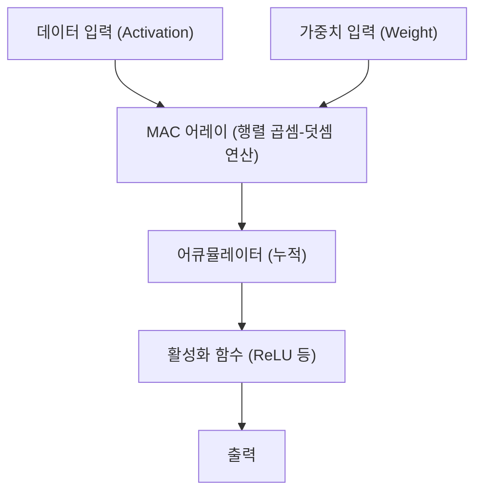

# Edge AI와 NPU(Neural Processing Unit) 아키텍처

최근 인공지능(AI) 기술의 급속한 발전으로 인해, 우리 생활의 모든 분야에서 AI가 활용되고 있습니다. 초기 AI 붐을 견인한 것은 클라우드에 있는 거대한 데이터 센터의 압도적인 컴퓨팅 리소스였습니다. 하지만 현재 그 패러다임은 큰 전환점을 맞이하고 있습니다. 'Edge AI(엣지 AI)'와 이를 뒷받침하는 전용 하드웨어 'NPU(Neural Processing Unit)'의 대두입니다.

본 기사에서는 클라우드 AI가 안고 있는 과제부터 Edge AI의 필요성, 그리고 NPU가 어떻게 경이적인 추론 속도와 전력 절감을 실현하고 있는지 그 아키텍처와 구체적인 예, 모델 최적화 기술에 대해 깊이 파고들어 해설합니다.

## 1. 클라우드 AI의 한계와 Edge AI의 대두

AI 추론을 클라우드 측에서 수행하는 기존의 접근 방식에는 몇 가지 구조적인 과제가 존재합니다.

### 레이턴시(지연) 문제
자율주행차나 산업용 로봇, 실시간 음성 번역 등 즉각적인 판단이 요구되는 애플리케이션에서, 네트워크를 통한 통신 지연(레이턴시)은 치명적인 문제가 됩니다. 데이터를 클라우드로 전송하고 처리 결과를 받기까지 수십~수백 밀리초의 지연이 중대한 사고나 사용자 경험의 저하를 초래할 수 있습니다.

### 프라이버시와 보안
스마트폰이나 스마트홈 기기는 카메라나 마이크를 통해 사용자의 지극히 사적인 정보를 항상 수집하고 있습니다. 이러한 원시 데이터를 클라우드로 계속 전송하는 것은 정보 유출이나 프라이버시 침해의 위험을 증대시킵니다. Edge AI를 사용하면 데이터는 단말기(엣지) 내에서 처리되고 결과만 출력되거나 전송되므로 프라이버시 보호 관점에서 매우 유리합니다.

### 통신 비용과 대역폭
고해상도 비디오 스트림이나 방대한 센서 데이터를 모두 클라우드로 전송하면 네트워크 대역폭을 심하게 압박하여 통신 비용이 부풀어 오릅니다. 엣지 측에서 데이터를 사전 처리하고 필요한 정보만 클라우드로 보냄으로써 네트워크 인프라에 대한 부하를 크게 줄일 수 있습니다.

이러한 과제를 해결하기 위해 데이터가 생성되는 현장(엣지)에서 직접 AI 모델을 구동하는 'Edge AI'가 필연적으로 요구되었습니다. 하지만 엣지 디바이스는 클라우드 서버와 달리 배터리 용량, 발열, 물리적인 크기에 엄격한 제약이 있습니다. 그래서 등장한 것이 AI 처리에 특화된 고효율 프로세서 'NPU'입니다.

## 2. NPU(Neural Processing Unit)란 무엇인가?

NPU(Neural Processing Unit)는 딥러닝 등 신경망 처리(추론이나 학습)를 극도로 빠르고 낮은 소비전력으로 실행하기 위해 특별히 설계된 하드웨어 가속기입니다.

### CPU, GPU, NPU의 차이

AI 처리에서 하드웨어의 진화를 이해하려면 CPU, GPU, NPU의 역할과 아키텍처의 차이를 정리할 필요가 있습니다.

*   **CPU(Central Processing Unit)**:
    범용적인 연산 처리에 능합니다. 복잡한 조건 분기나 OS 제어 등 다양한 작업을 유연하게 처리할 수 있지만, 코어 수가 제한되어 있어 신경망과 같은 방대한 병렬 계산에는 적합하지 않습니다.
*   **GPU(Graphics Processing Unit)**:
    원래는 그래픽 렌더링을 위해 수천 개의 소규모 코어를 탑재하여 단순한 계산의 초병렬 처리에 능합니다. AI 붐을 일으켰으며 현재도 클라우드 측의 모델 학습(Training)에서는 압도적인 주역입니다. 하지만 소비 전력이 커서 모바일 기기 등 엣지 디바이스에서 항상 가동하기에는 배터리나 발열 측면에서 과제가 있습니다.
*   **NPU(Neural Processing Unit)**:
    신경망 계산(특히 행렬의 곱셈-덧셈 연산)에 아키텍처 전체를 최적화한 전용 프로세서입니다. 범용성을 어느 정도 희생하는 대신, 특정 AI 모델의 추론(Inference)에서 GPU 이상의 처리 효율(TOPS/W: 1와트당 연산 횟수)을 발휘합니다.

## 3. NPU의 아키텍처: 왜 빠르고 고효율인가?

NPU가 놀라운 성능을 발휘하는 비밀은 그 내부 아키텍처에 있습니다.

### MAC(Multiply-Accumulate) 유닛의 집적
신경망 처리의 대부분은 입력 데이터와 가중치(Weight)를 곱하고 이를 더하는 '곱셈-덧셈 연산(MAC)'입니다. NPU는 이 MAC 유닛을 대량(수천~수만 개)으로 배열한 '시스톨릭 어레이(Systolic Array)'나 '텐서 코어'라고 불리는 구조를 채택하고 있습니다. 데이터가 어레이 내부를 양동이 릴레이처럼 흐르게 함으로써 레지스터에 대한 불필요한 접근을 줄이고 클럭 사이클당 연산량을 획기적으로 끌어올립니다.

### 메모리 계층 최적화(데이터 이동의 최소화)
프로세서에서 가장 전력을 많이 소비하는 것은 사실 '계산' 자체가 아니라 '메모리로부터의 데이터 읽기/쓰기(데이터 이동)'입니다. DRAM에서 데이터를 가져올 때의 소비 전력은 ALU(연산기)에서의 계산보다 수십 배에서 수백 배에 달합니다.
NPU는 칩 내부에 거대한 SRAM(온칩 메모리)을 탑재하여 신경망의 가중치나 중간 데이터를 최대한 칩 내부에 유지하는 아키텍처를 취합니다. 또한 레이어 간의 데이터를 메인 메모리(DRAM)에 다시 쓰지 않고 직접 다음 레이어의 연산기로 흘려보냄으로써 데이터 이동의 오버헤드를 철저하게 줄입니다.

## 4. 현실 세계의 NPU 아키텍처 실제 사례

현재 스마트폰이나 PC를 위해 다양한 NPU가 개발 및 탑재되고 있습니다.

### Apple Neural Engine (ANE)
Apple이 A11 Bionic 칩부터 탑재를 시작하여 iPhone이나 Mac(M 시리즈)의 경쟁력의 원천이 되고 있는 것이 Neural Engine입니다. Face ID의 얼굴 인식, 사진의 시맨틱 세그멘테이션, Siri의 온디바이스 음성 인식 등을 배터리를 거의 소비하지 않고 백그라운드에서 고속으로 처리합니다. 최신 M3나 A17 Pro 칩에서는 초당 수십 조 번(TOPS)의 연산 성능을 자랑합니다.

### Google Tensor Processing Unit (TPU)
클라우드용 거대한 TPU로 알려진 Google이지만, Pixel 스마트폰용으로는 'Edge TPU'의 계보를 잇는 NPU를 통합한 'Google Tensor' 칩을 전개하고 있습니다. 카메라의 컴퓨테이셔널 포토그래피(지우개 매직이나 야간 모드)나 실시간 텍스트 변환 등 Google의 고도화된 AI 모델을 엣지에서 구동하는 데 특화되어 있습니다.

### Qualcomm Hexagon NPU
안드로이드 스마트폰의 대부분에 탑재되어 있는 Snapdragon SoC에 내장된 것이 Hexagon DSP/NPU입니다. 스칼라, 벡터, 텐서 연산을 통합하고 카메라 ISP나 센서 허브와 밀접하게 연계함으로써 기기 전체의 AI 성능을 최적화하고 있습니다. 최근에는 Windows용 PC 프로세서인 Snapdragon X Elite에도 강력한 NPU가 탑재되어 AI PC(Copilot+ PC)의 실현을 추진하고 있습니다.

## 5. 엣지 AI를 뒷받침하는 소프트웨어・최적화 기술

뛰어난 NPU 하드웨어가 있어도 클라우드용 거대한 AI 모델을 그대로 엣지에서 구동할 수는 없습니다. 하드웨어의 잠재력을 끌어내기 위한 '모델 최적화 기술'이 필수적입니다.

### 양자화 (Quantization)
AI 모델의 가중치나 계산 정밀도를 표준적인 32비트 부동소수점(FP32)에서 16비트(FP16), 8비트 정수(INT8) 또는 4비트(INT4)로 줄이는 기술입니다. 이를 통해 모델의 크기가 몇 분의 일로 축소되어 메모리 대역폭을 절약할 수 있습니다. NPU의 대부분은 INT8이나 INT4 연산에 하드웨어 수준에서 최적화되어 있어 양자화를 통해 추론 속도가 획기적으로 향상됩니다. 정밀도 저하를 최소화하기 위해 PTQ(훈련 후 양자화)나 QAT(양자화를 고려한 훈련)와 같은 기법이 사용됩니다.

### 가지치기 (Pruning)
신경망 내에서 추론 결과에 거의 영향을 주지 않는 '중요도가 낮은 가중치(0에 가까운 값)'를 찾아내어 네트워크에서 삭제(0으로 고정)하는 기술입니다. 이를 통해 모델의 희소성(Sparsity)이 높아져 계산량과 모델 크기를 줄일 수 있습니다.

### 지식 증류 (Knowledge Distillation)
고성능이지만 거대한 모델(교사 모델)의 동작을 경량 모델(학생 모델)에 학습시키는 기법입니다. 학생 모델은 교사 모델의 출력 확률 분포를 모방하도록 훈련되므로, 단독으로 작은 모델을 훈련시키는 것보다 높은 정확도를 달성하면서 엣지 디바이스에서 동작할 수 있는 크기로 맞출 수 있습니다.

## 6. Edge AI의 미래와 향후 전망

현재 ChatGPT를 비롯한 대규모 언어 모델(LLM)이 세계를 휩쓸고 있지만, 이러한 추론에는 여전히 클라우드의 거대한 GPU 클러스터가 필요합니다. 그러나 기술의 진화는 LLM조차도 엣지로 가져오려 하고 있습니다(엣지 LLM, SLM: Small Language Model).

앞으로는 다음과 같은 트렌드가 예상됩니다.

*   **Hybrid AI(하이브리드 AI)**:
    일상적인 가벼운 추론(텍스트 요약, 음성 인식, 간단한 이미지 생성 등)은 엣지 디바이스의 NPU에서 즉시 처리하고, 더 고도화되고 복잡한 추론이 필요한 경우에만 클라우드로 오프로드하는 하이브리드 접근 방식이 주류가 될 것입니다.
*   **다양한 엣지 디바이스로의 파급**:
    스마트폰이나 PC뿐만 아니라 감시 카메라, 드론, 웨어러블 디바이스, 나아가 IoT 센서 자체에 극소형 NPU(마이크로컨트롤러용 AI)가 내장되어, 모든 사물이 '지능'을 가지게 될 것입니다.
*   **NPU의 표준화와 생태계**:
    하드웨어마다 다른 최적화가 필요한 현재 상황을 타파하기 위해 ONNX나 OpenVINO, TensorFlow Lite, PyTorch ExecuTorch 등의 프레임워크가 진화하여, 개발자가 '한 번 작성하면 어떤 NPU에서든 최적으로 동작하는' 환경이 구축되고 있습니다.

## 맺음말

Edge AI와 NPU의 진화는 AI를 일부 연구자나 클라우드 인프라의 전유물에서 우리 손에 있는 모든 디바이스의 '기초적인 기능'으로 변모시켰습니다. 레이턴시 해소, 프라이버시 보호, 그리고 전력 효율의 극적인 향상을 실현하는 이 아키텍처는 향후 10년의 컴퓨팅을 견인할 가장 중요한 기술 중 하나입니다.

소프트웨어 엔지니어나 AI 개발자에게 있어, 클라우드의 거대한 모델을 다루는 기술뿐만 아니라 '어떻게 제한된 리소스 안에서 하드웨어(NPU)의 특성을 살려 AI를 구현하고 최적화할 것인가'라는 지식이 앞으로 점점 더 중요해질 것입니다.
