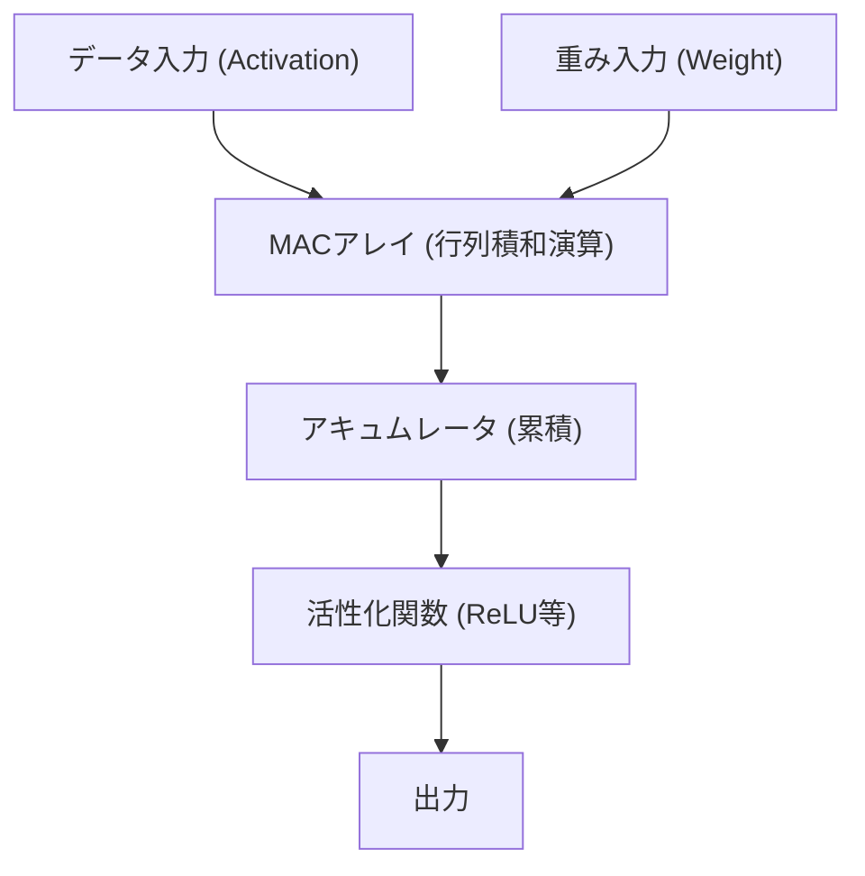

# Edge AIとNPU（Neural Processing Unit）アーキテクチャ

近年、人工知能（AI）技術の急速な発展により、私たちの生活のあらゆる場面でAIが活用されるようになりました。初期のAIブームを牽引したのは、クラウド上にある巨大なデータセンターの圧倒的なコンピューティングリソースでした。しかし現在、そのパラダイムは大きな転換点を迎えています。「Edge AI（エッジAI）」と、それを支える専用ハードウェア「NPU（Neural Processing Unit）」の台頭です。

本記事では、クラウドAIの抱える課題からEdge AIの必要性、そしてNPUがどのようにして驚異的な推論速度と省電力を実現しているのか、そのアーキテクチャや具体例、モデル最適化技術について深く掘り下げて解説します。

## 1. クラウドAIの限界とEdge AIの台頭

AIの推論をクラウド側で行う従来のアプローチには、いくつかの構造的な課題が存在します。

### レイテンシ（遅延）の問題
自動運転車や産業用ロボット、リアルタイムの音声翻訳など、瞬時の判断が求められるアプリケーションにおいて、ネットワークを介した通信遅延（レイテンシ）は致命的な問題となります。データをクラウドに送信し、処理結果を受け取るまでの数十〜数百ミリ秒の遅延が、重大な事故やユーザー体験の低下を招く可能性があります。

### プライバシーとセキュリティ
スマートフォンやスマートホームデバイスは、カメラやマイクを通じてユーザーの極めてプライベートな情報を常に取得しています。これらの生データをクラウドに送信し続けることは、情報漏洩やプライバシー侵害のリスクを増大させます。Edge AIを用いれば、データは端末（エッジ）内で処理され、結果だけを出力または送信するため、プライバシー保護の観点から非常に有利です。

### 通信コストと帯域幅
高解像度のビデオストリームや膨大なセンサーデータをすべてクラウドに送信すると、ネットワーク帯域を著しく圧迫し、通信コストが膨れ上がります。エッジ側でデータを事前処理し、必要な情報のみをクラウドに送ることで、ネットワークインフラへの負荷を大幅に削減できます。

これらの課題を解決するため、データが生成される現場（エッジ）で直接AIモデルを動かす「Edge AI」が必然的に求められるようになりました。しかし、エッジデバイスはクラウドのサーバーとは異なり、バッテリー容量や排熱、物理的なサイズに厳しい制約があります。そこで登場したのが、AI処理に特化した高効率プロセッサ「NPU」です。

## 2. NPU（Neural Processing Unit）とは何か？

NPU（Neural Processing Unit）は、ディープラーニングなどのニューラルネットワークの処理（推論や学習）を極めて高速かつ低消費電力で実行するために特別に設計されたハードウェア・アクセラレータです。

### CPU、GPU、NPUの違い

AI処理におけるハードウェアの進化を理解するためには、CPU、GPU、NPUの役割とアーキテクチャの違いを整理する必要があります。

*   **CPU（Central Processing Unit）**:
    汎用的な演算処理を得意とします。複雑な条件分岐やOSの制御など、多様なタスクを柔軟にこなせますが、コア数が限られているため、ニューラルネットワークのような膨大な並列計算には不向きです。
*   **GPU（Graphics Processing Unit）**:
    元々は画像描画のために数千個の小規模なコアを搭載し、単純な計算の超並列処理を得意とします。AIブームの火付け役となり、現在でもクラウド側でのモデル学習（Training）においては圧倒的な主役です。しかし、消費電力が大きく、モバイル端末などのエッジデバイスで常時稼働させるにはバッテリーや排熱の面で課題があります。
*   **NPU（Neural Processing Unit）**:
    ニューラルネットワークの計算（特に行列の積和演算）にアーキテクチャ全体を最適化した専用プロセッサです。汎用性をある程度犠牲にする代わりに、特定のAIモデルの推論（Inference）においてGPU以上の処理効率（TOPS/W：1ワットあたりの演算回数）を叩き出します。

## 3. NPUのアーキテクチャ：なぜ高速・高効率なのか？

NPUが驚異的なパフォーマンスを発揮する秘密は、その内部アーキテクチャにあります。

### MAC（Multiply-Accumulate）ユニットの集積
ニューラルネットワークの処理の大部分は、入力データと重み（Weight）を掛け合わせ、それを足し合わせる「積和演算（MAC）」です。NPUは、このMACユニットを大量（数千〜数万個）に敷き詰めた「シストリック・アレイ（Systolic Array）」や「テンソル・コア」と呼ばれる構造を採用しています。データがアレイ内をバケツリレーのように流れていくことで、レジスタへの無駄なアクセスを減らし、クロックサイクルあたりの演算量を劇的に引き上げます。

### メモリ階層の最適化（データ移動の最小化）
プロセッサにおいて最も電力を消費するのは、実は「計算」そのものではなく、「メモリからのデータ読み書き（データ移動）」です。DRAMからデータを取得する際の消費電力は、ALU（演算器）での計算の数十倍から数百倍に達します。
NPUは、チップ内に巨大なSRAM（オンチップメモリ）を搭載し、ニューラルネットワークの重みや中間データを極力チップ内に保持するアーキテクチャを取ります。また、レイヤー間のデータをメインメモリ（DRAM）に書き戻さず、直接次のレイヤーの演算器に流し込むことで、データ移動のオーバーヘッドを徹底的に削減しています。

## 4. 現実世界のNPUアーキテクチャ実例

現在、スマートフォンやPC向けに様々なNPUが開発・搭載されています。

### Apple Neural Engine (ANE)
AppleがA11 Bionicチップから搭載を開始し、iPhoneやMac（Mシリーズ）の競争力の源泉となっているのがNeural Engineです。Face IDの顔認証、写真のセマンティックセグメンテーション、Siriのオンデバイス音声認識などを、バッテリーをほとんど消費せずに背後で高速処理します。最新のM3やA17 Proチップでは、毎秒数十兆回（TOPS）の演算性能を誇ります。

### Google Tensor Processing Unit (TPU)
クラウド向けの巨大なTPUで知られるGoogleですが、Pixelスマートフォン向けには「Edge TPU」の系譜を継ぐNPUを統合した「Google Tensor」チップを展開しています。カメラのコンピュテーショナル・フォトグラフィー（消しゴムマジックや夜景モード）や、リアルタイムの文字起こしなど、Googleの高度なAIモデルをエッジで動かすことに特化しています。

### Qualcomm Hexagon NPU
Androidスマートフォンの多くに搭載されているSnapdragon SoCに組み込まれているのが、Hexagon DSP/NPUです。スカラー、ベクター、テンソル演算を統合し、カメラISPやセンサーハブと密接に連携することで、デバイス全体のAIパフォーマンスを最適化しています。最近では、Windows向けPCプロセッサであるSnapdragon X Eliteにも強力なNPUが搭載され、AI PC（Copilot+ PC）の実現を推進しています。

## 5. エッジAIを支えるソフトウェア・最適化技術

優れたNPUハードウェアがあっても、クラウド用の巨大なAIモデルをそのままエッジで動かすことはできません。ハードウェアのポテンシャルを引き出すための「モデル最適化技術」が不可欠です。

### 量子化 (Quantization)
AIモデルの重みや計算精度を、標準的な32ビット浮動小数点（FP32）から、16ビット（FP16）、8ビット整数（INT8）、あるいは4ビット（INT4）へと削減する技術です。これにより、モデルのサイズが数分の一に縮小され、メモリ帯域幅を節約できます。NPUの多くはINT8やINT4演算にハードウェアレベルで最適化されており、量子化によって推論速度が劇的に向上します。精度の劣化を最小限に抑えるため、PTQ（訓練後量子化）やQAT（量子化を考慮した訓練）といった手法が用いられます。

### 枝刈り (Pruning)
ニューラルネットワークの中で、推論結果にほとんど影響を与えない「重要度の低い重み（ゼロに近い値）」を特定し、ネットワークから削除（ゼロに固定）する技術です。これにより、モデルのスパース性（疎性）が高まり、計算量とモデルサイズを削減できます。

### 知識蒸留 (Knowledge Distillation)
高性能だが巨大なモデル（教師モデル）の振る舞いを、軽量なモデル（生徒モデル）に学習させる手法です。生徒モデルは、教師モデルの出力確率分布を模倣するように訓練されるため、単独で小さなモデルを訓練するよりも高い精度を達成しながら、エッジデバイスで動作するサイズに収めることができます。

## 6. Edge AIの未来と今後の展望

現在、ChatGPTをはじめとする大規模言語モデル（LLM）が世界を席巻していますが、これらの推論には依然としてクラウドの巨大なGPUクラスターが必要です。しかし、技術の進化はLLMすらもエッジに持ち込もうとしています（エッジLLM、SLM: Small Language Model）。

今後は、以下のようなトレンドが予想されます。

*   **Hybrid AI（ハイブリッドAI）**:
    日常的な軽い推論（テキスト要約、音声認識、簡単な画像生成など）はエッジデバイスのNPUで即座に処理し、より高度で複雑な推論が必要な場合のみクラウドにオフロードする、というハイブリッドアプローチが主流になるでしょう。
*   **多様なエッジデバイスへの波及**:
    スマートフォンやPCだけでなく、監視カメラ、ドローン、ウェアラブルデバイス、さらにはIoTセンサーそのものに極小のNPU（マイクロコントローラ向けAI）が組み込まれ、あらゆるモノが「知能」を持つようになります。
*   **NPUの標準化とエコシステム**:
    ハードウェアごとに異なる最適化が必要な現状を打破するため、ONNXやOpenVINO、TensorFlow Lite、PyTorch ExecuTorchなどのフレームワークが進化し、開発者が「一度書けばどのNPUでも最適に動く」環境の整備が進んでいます。

## おわりに

Edge AIとNPUの進化は、AIを一部の研究者やクラウドインフラのものから、我々の手元にあるすべてのデバイスの「基礎的な機能」へと変容させました。レイテンシの解消、プライバシーの保護、そして電力効率の劇的な向上を実現するこのアーキテクチャは、次の10年のコンピューティングを牽引する最も重要な技術の一つです。

ソフトウェアエンジニアやAI開発者にとって、クラウド上の巨大モデルを扱うスキルだけでなく、「いかに限られたリソースの中で、ハードウェア（NPU）の特性を生かしてAIを実装・最適化するか」という知識が、今後ますます重要になってくるでしょう。
