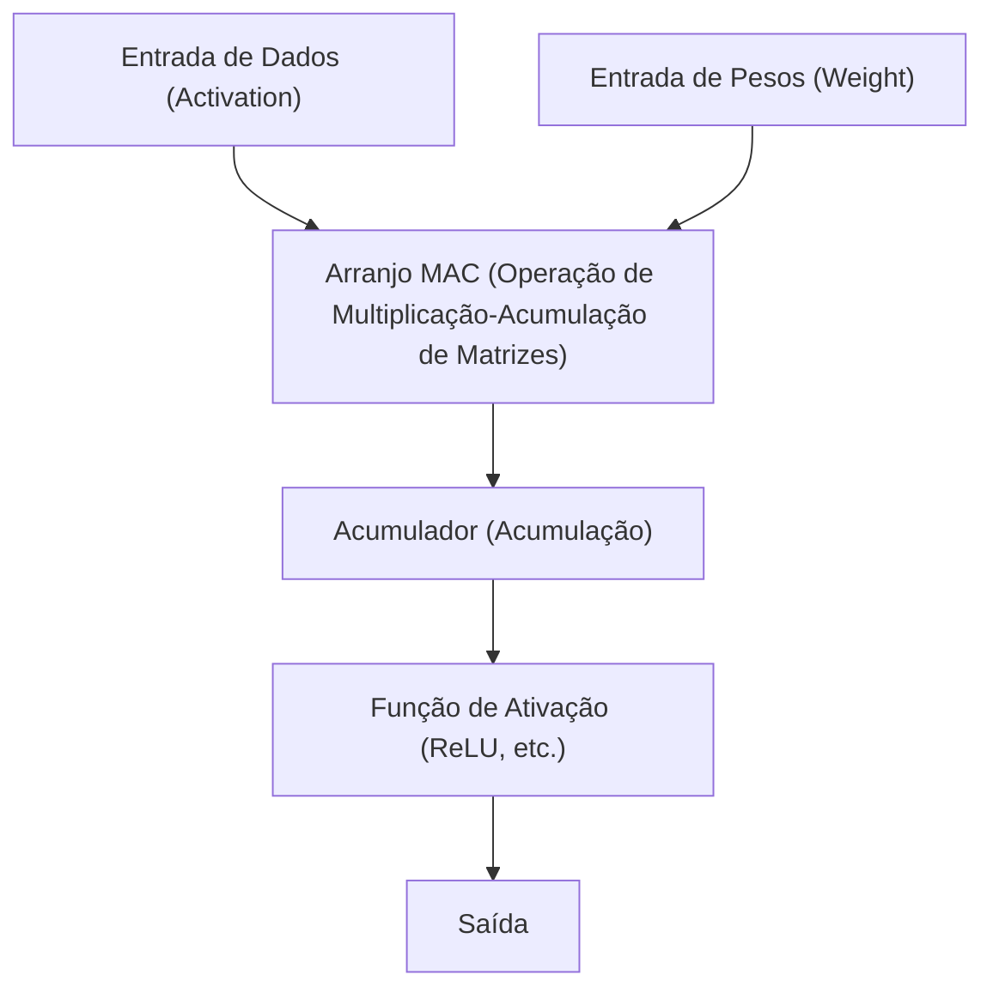

# Edge AI e Arquitetura NPU (Neural Processing Unit)

Nos últimos anos, com o rápido desenvolvimento da tecnologia de Inteligência Artificial (IA), a IA passou a ser utilizada em todas as situações das nossas vidas. O que impulsionou o boom inicial da IA foram os esmagadores recursos de computação de enormes data centers na nuvem. No entanto, atualmente, esse paradigma está chegando a um grande ponto de virada: a ascensão da "Edge AI (IA de Borda)" e do hardware dedicado "NPU (Neural Processing Unit)" que a sustenta.

Neste artigo, aprofundaremos nas questões da IA na nuvem e a necessidade da Edge AI, e em como a NPU alcança velocidades de inferência surpreendentes e economia de energia, explicando sua arquitetura, exemplos concretos e técnicas de otimização de modelos.

## 1. Os Limites da IA na Nuvem e a Ascensão da Edge AI

A abordagem tradicional de realizar a inferência de IA na nuvem apresenta vários desafios estruturais.

### O Problema da Latência (Atraso)
Em aplicações que exigem decisões instantâneas, como carros autônomos, robôs industriais e tradução de voz em tempo real, o atraso de comunicação (latência) através da rede torna-se um problema fatal. Atrasos de dezenas a centenas de milissegundos para enviar dados à nuvem e receber os resultados processados podem causar acidentes graves ou uma degradação da experiência do usuário.

### Privacidade e Segurança
Smartphones e dispositivos de casa inteligente estão constantemente adquirindo informações extremamente privadas dos usuários através de câmeras e microfones. O envio contínuo desses dados brutos para a nuvem aumenta o risco de vazamento de informações e violações de privacidade. Com a Edge AI, os dados são processados localmente no dispositivo (borda) e apenas os resultados são gerados ou enviados, o que é altamente vantajoso do ponto de vista da proteção de privacidade.

### Custos de Comunicação e Largura de Banda
Enviar todos os fluxos de vídeo de alta resolução e as imensas quantidades de dados de sensores para a nuvem pressiona severamente a largura de banda da rede e aumenta os custos de comunicação. Ao pré-processar os dados na borda e enviar apenas as informações necessárias para a nuvem, a carga na infraestrutura de rede pode ser significativamente reduzida.

Para resolver esses desafios, a "Edge AI", que executa modelos de IA diretamente no local onde os dados são gerados (borda), tornou-se uma necessidade inevitável. No entanto, diferentemente dos servidores na nuvem, os dispositivos de borda têm restrições severas em relação à capacidade da bateria, dissipação de calor e tamanho físico. Foi aí que surgiu a "NPU", um processador de alta eficiência especializado em processamento de IA.

## 2. O Que é uma NPU (Neural Processing Unit)?

A NPU (Neural Processing Unit) é um acelerador de hardware projetado especificamente para executar processos de redes neurais, como deep learning (inferência e treinamento), com extrema velocidade e baixo consumo de energia.

### Diferenças entre CPU, GPU e NPU

Para entender a evolução do hardware no processamento de IA, é necessário organizar as diferenças de arquitetura e os papéis da CPU, GPU e NPU.

*   **CPU (Central Processing Unit)**:
    Destaca-se no processamento computacional de propósito geral. Ela pode lidar com uma variedade de tarefas de forma flexível, como ramificações condicionais complexas e controle do sistema operacional, mas devido ao número limitado de núcleos, é inadequada para os cálculos massivos e paralelos como os de redes neurais.
*   **GPU (Graphics Processing Unit)**:
    Originalmente equipada com milhares de núcleos de pequena escala para renderização de imagens, destaca-se no processamento ultraparalelo de cálculos simples. Ela foi o estopim para o boom da IA e, mesmo hoje, é a protagonista absoluta no treinamento (Training) de modelos na nuvem. No entanto, o consumo de energia é alto, apresentando desafios em termos de bateria e dissipação de calor para operá-la constantemente em dispositivos de borda como terminais móveis.
*   **NPU (Neural Processing Unit)**:
    Um processador dedicado cuja arquitetura inteira é otimizada para cálculos de redes neurais (especialmente a operação de multiplicação-acumulação de matrizes). Em troca de sacrificar certa versatilidade, ela atinge uma eficiência de processamento (TOPS/W: operações por watt) superior à da GPU na inferência (Inference) de modelos de IA específicos.

## 3. A Arquitetura da NPU: Por Que Ela é Tão Rápida e Eficiente?

O segredo do desempenho surpreendente da NPU reside na sua arquitetura interna.

### Integração de Unidades MAC (Multiply-Accumulate)
A maior parte do processamento em uma rede neural é a "operação de multiplicação-acumulação (MAC)", que multiplica os dados de entrada pelos pesos (Weight) e os soma. A NPU adota estruturas chamadas de "Arranjo Sistólico (Systolic Array)" ou "Tensor Core", nas quais uma grande quantidade (milhares a dezenas de milhares) dessas unidades MAC estão dispostas. À medida que os dados fluem pela matriz como uma linha de montagem (bucket brigade), o acesso desnecessário aos registradores é reduzido, aumentando dramaticamente a quantidade de cálculos por ciclo de clock.

### Otimização da Hierarquia de Memória (Minimização da Movimentação de Dados)
O que mais consome energia num processador não é propriamente o "cálculo", mas sim a "leitura e escrita de dados da memória (movimentação de dados)". O consumo de energia para obter dados da DRAM atinge de dezenas a centenas de vezes o cálculo na ALU (Unidade Lógica Aritmética).
A NPU adota uma arquitetura em que integra uma enorme SRAM (memória no chip) para reter os pesos e os dados intermediários da rede neural dentro do chip, o máximo possível. Além disso, ela elimina exaustivamente a sobrecarga de movimentação de dados ao não escrever de volta na memória principal (DRAM) os dados entre as camadas, mas em vez disso, passando-os diretamente para a unidade de cálculo da camada seguinte.

## 4. Exemplos Reais de Arquitetura de NPU

Atualmente, várias NPUs estão sendo desenvolvidas e integradas em smartphones e PCs.

### Apple Neural Engine (ANE)
O Neural Engine é a fonte de competitividade para o iPhone e o Mac (Série M), sendo introduzido pela Apple a partir do chip A11 Bionic. Ele realiza o processamento rápido em segundo plano, como o reconhecimento facial Face ID, a segmentação semântica de fotos e o reconhecimento de voz do dispositivo da Siri, quase sem consumir bateria. Nos modelos mais recentes como M3 e A17 Pro, ele ostenta um desempenho de dezenas de trilhões de operações por segundo (TOPS).

### Google Tensor Processing Unit (TPU)
Embora o Google seja conhecido pelas enormes TPUs para nuvem, a empresa lançou o chip "Google Tensor" para os smartphones Pixel, integrando uma NPU que segue a linhagem da "Edge TPU". Ela é especializada na execução de modelos avançados de IA do Google na borda, como a fotografia computacional da câmera (Borracha Mágica, Modo Noturno) e a transcrição em tempo real.

### Qualcomm Hexagon NPU
Incorporada ao SoC Snapdragon equipado em muitos smartphones Android, encontra-se a Hexagon DSP/NPU. Ela otimiza o desempenho geral da IA do dispositivo ao integrar operações escalares, vetoriais e tensoriais, colaborando estreitamente com o ISP da câmera e o hub de sensores. Recentemente, potentes NPUs também foram equipadas no Snapdragon X Elite, um processador para PCs Windows, impulsionando a concretização dos AI PCs (Copilot+ PC).

## 5. Software e Técnicas de Otimização que Sustentam a Edge AI

Mesmo com um hardware NPU excelente, não é possível executar enormes modelos de IA feitos para nuvem diretamente na borda. Técnicas de "otimização de modelo" são essenciais para extrair o máximo do potencial do hardware.

### Quantização (Quantization)
É a tecnologia que reduz os pesos e a precisão computacional dos modelos de IA do padrão de ponto flutuante de 32 bits (FP32) para 16 bits (FP16), inteiros de 8 bits (INT8) ou até 4 bits (INT4). Isso reduz o tamanho do modelo a uma fração do original, economizando largura de banda de memória. Muitas NPUs são otimizadas a nível de hardware para operações INT8 ou INT4, resultando numa aceleração dramática na velocidade de inferência devido à quantização. Para minimizar a degradação da precisão, métodos como PTQ (Quantização Pós-Treinamento) ou QAT (Treinamento Ciente de Quantização) são usados.

### Poda (Pruning)
Em uma rede neural, é a técnica que identifica os "pesos de baixa importância (valores próximos a zero)" que quase não afetam o resultado da inferência e os remove (fixando-os em zero) da rede. Isso aumenta a esparsidade do modelo e reduz a quantidade computacional e o tamanho do modelo.

### Destilação de Conhecimento (Knowledge Distillation)
Um método de ensinar o comportamento de um modelo enorme de alto desempenho (modelo professor) a um modelo mais leve (modelo aluno). O modelo aluno é treinado para imitar a distribuição de probabilidade da saída do modelo professor. Desta forma, pode-se obter uma maior precisão do que treinando um modelo pequeno independentemente, enquanto o mantém num tamanho viável para execução em dispositivos de borda.

## 6. O Futuro da Edge AI e Perspectivas

Atualmente, Grandes Modelos de Linguagem (LLMs), como o ChatGPT, estão a dominar o mundo, mas estas inferências ainda requerem enormes clusters de GPUs na nuvem. Contudo, a evolução da tecnologia está tentando trazer até os LLMs para a borda (Edge LLM, SLM: Small Language Model).

No futuro, são esperadas as seguintes tendências:

*   **IA Híbrida (Hybrid AI)**:
    A abordagem híbrida se tornará dominante, onde inferências leves do cotidiano (resumo de textos, reconhecimento de voz, geração simples de imagens) são processadas instantaneamente pela NPU do dispositivo de borda, repassando para a nuvem apenas quando uma inferência mais avançada e complexa for necessária.
*   **Expansão para Diversos Dispositivos de Borda**:
    Pequenas NPUs (IA para microcontroladores) serão integradas não apenas em smartphones e PCs, mas em câmeras de segurança, drones, dispositivos vestíveis e até nos próprios sensores IoT, permitindo que todos os objetos tenham "inteligência".
*   **Padronização das NPUs e Ecossistema**:
    Para contornar a situação atual, onde diferentes hardwares requerem otimizações distintas, frameworks como ONNX, OpenVINO, TensorFlow Lite, PyTorch ExecuTorch estão a evoluir, avançando para um ambiente onde "escreve uma vez, funciona otimizado em qualquer NPU".

## Conclusão

A evolução da Edge AI e da NPU transformou a IA de algo pertencente apenas a pesquisadores e infraestruturas na nuvem para uma "funcionalidade básica" em todos os dispositivos em nossas mãos. A arquitetura que elimina a latência, protege a privacidade e melhora drasticamente a eficiência energética é uma das tecnologias mais importantes a conduzir a computação na próxima década.

Para engenheiros de software e desenvolvedores de IA, não bastará apenas a habilidade de lidar com enormes modelos na nuvem. O conhecimento de "como implementar e otimizar IA dentro de recursos limitados, aproveitando as características do hardware (NPU)" será cada vez mais crucial no futuro.
