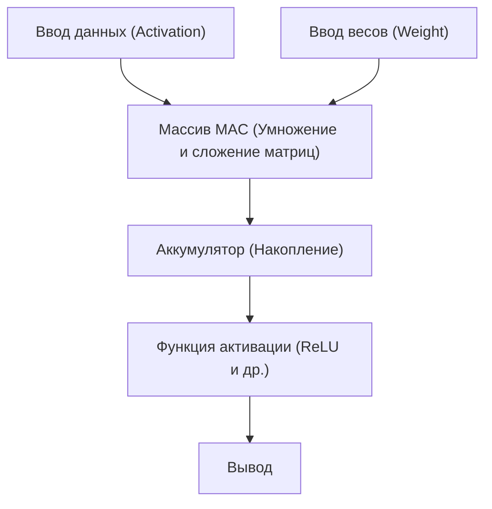

# Edge AI и архитектура NPU (Neural Processing Unit)

В последние годы, благодаря стремительному развитию технологий искусственного интеллекта (ИИ), ИИ стал использоваться во всех сферах нашей жизни. Первоначальный бум ИИ был обусловлен подавляющими вычислительными ресурсами гигантских центров обработки данных, расположенных в облаке. Однако сейчас эта парадигма переживает серьезный поворотный момент. Это появление «Edge AI (Граничный ИИ)» и поддерживающего его специализированного аппаратного обеспечения «NPU (Neural Processing Unit)».

В этой статье мы подробно рассмотрим проблемы облачного ИИ, необходимость в Edge AI, а также то, как NPU достигает поразительной скорости вычислений и энергосбережения, его архитектуру, конкретные примеры и технологии оптимизации моделей.

## 1. Ограничения облачного ИИ и появление Edge AI

Традиционный подход, при котором вычисления ИИ выполняются на стороне облака, имеет несколько структурных проблем.

### Проблема задержки (Latency)
В приложениях, требующих мгновенного принятия решений, таких как беспилотные автомобили, промышленные роботы и голосовой перевод в реальном времени, задержка связи через сеть (latency) становится фатальной проблемой. Задержка в десятки или сотни миллисекунд между отправкой данных в облако и получением результатов обработки может привести к серьезным авариям и ухудшению пользовательского опыта.

### Конфиденциальность и безопасность
Смартфоны и устройства умного дома постоянно собирают крайне личную информацию пользователей через камеры и микрофоны. Постоянная отправка этих необработанных данных в облако увеличивает риск утечки информации и нарушения конфиденциальности. Использование Edge AI очень выгодно с точки зрения защиты конфиденциальности, поскольку данные обрабатываются внутри устройства (на границе сети), а выводится или передается только результат.

### Затраты на связь и пропускная способность
Отправка всех видеопотоков высокого разрешения и огромных объемов данных с датчиков в облако сильно нагружает пропускную способность сети и приводит к резкому росту затрат на связь. Предварительная обработка данных на стороне устройства и отправка в облако только необходимой информации может значительно снизить нагрузку на сетевую инфраструктуру.

Для решения этих проблем возникла неизбежная потребность в «Edge AI», который запускает модели ИИ непосредственно на месте генерации данных (на границе). Однако устройства Edge, в отличие от облачных серверов, имеют строгие ограничения по емкости батареи, тепловыделению и физическому размеру. Именно здесь на сцену выходит «NPU» — высокоэффективный процессор, специализирующийся на обработке ИИ.

## 2. Что такое NPU (Neural Processing Unit)?

NPU (Neural Processing Unit) — это аппаратный ускоритель, специально разработанный для выполнения процессов нейронных сетей, таких как глубокое обучение (вывод и обучение), на чрезвычайно высоких скоростях и с низким энергопотреблением.

### Различия между CPU, GPU и NPU

Чтобы понять эволюцию аппаратного обеспечения для обработки ИИ, необходимо разобрать различия в ролях и архитектуре CPU, GPU и NPU.

*   **CPU (Central Processing Unit)**:
    Специализируется на вычислениях общего назначения. Он может гибко справляться с различными задачами, такими как сложные условные переходы и управление ОС, но из-за ограниченного количества ядер он не подходит для масштабных параллельных вычислений, таких как нейронные сети.
*   **GPU (Graphics Processing Unit)**:
    Изначально оснащен тысячами небольших ядер для отрисовки изображений, специализируется на сверхпараллельной обработке простых вычислений. Он стал катализатором бума ИИ и до сих пор играет ведущую роль в обучении моделей (Training) на стороне облака. Однако он потребляет много энергии, что создает проблемы с батареей и тепловыделением при постоянной работе на устройствах Edge, таких как мобильные терминалы.
*   **NPU (Neural Processing Unit)**:
    Специализированный процессор, вся архитектура которого оптимизирована для вычислений нейронных сетей (особенно операций умножения и сложения матриц). Жертвуя до некоторой степени универсальностью, он обеспечивает эффективность обработки (TOPS/W: количество операций на ватт), превышающую GPU, при логическом выводе (Inference) конкретных моделей ИИ.

## 3. Архитектура NPU: почему она быстрая и высокоэффективная?

Секрет поразительной производительности NPU кроется в его внутренней архитектуре.

### Интеграция блоков MAC (Multiply-Accumulate)
Большая часть обработки нейронных сетей — это «операция умножения с накоплением (MAC)», при которой входные данные умножаются на веса (Weight) и суммируются. NPU использует структуру, называемую «систолический массив (Systolic Array)» или «тензорные ядра», в которой плотно упаковано огромное количество (от тысяч до десятков тысяч) этих блоков MAC. Данные передаются внутри массива по принципу пожарной цепочки, что сокращает ненужный доступ к регистрам и резко увеличивает объем вычислений за тактовый цикл.

### Оптимизация иерархии памяти (минимизация перемещения данных)
Больше всего энергии в процессоре потребляют на самом деле не «вычисления», а «чтение и запись данных из памяти (перемещение данных)». Энергопотребление при получении данных из DRAM в десятки и сотни раз превышает энергопотребление при вычислениях в ALU (арифметико-логическом устройстве).
Архитектура NPU включает в себя огромную SRAM (внутрикристальную память) на чипе и сохраняет веса нейронной сети и промежуточные данные внутри чипа, насколько это возможно. Кроме того, накладные расходы на перемещение данных радикально снижаются за счет передачи данных между слоями непосредственно в вычислительные блоки следующего слоя без их обратной записи в основную память (DRAM).

## 4. Примеры архитектуры NPU в реальном мире

В настоящее время разрабатываются и устанавливаются различные NPU для смартфонов и ПК.

### Apple Neural Engine (ANE)
Neural Engine, который Apple начала устанавливать начиная с чипа A11 Bionic, является источником конкурентоспособности iPhone и Mac (серия M). Он выполняет такие функции, как распознавание лиц Face ID, семантическая сегментация фотографий и распознавание голоса Siri на устройстве в фоновом режиме на высокой скорости, почти не потребляя заряд батареи. В новейших чипах M3 и A17 Pro его вычислительная производительность достигает десятков триллионов операций в секунду (TOPS).

### Google Tensor Processing Unit (TPU)
Компания Google, известная своими гигантскими TPU для облака, внедряет чипы «Google Tensor» со встроенным NPU, являющимся преемником «Edge TPU», для смартфонов Pixel. Он специализируется на выполнении продвинутых моделей ИИ от Google на устройстве, таких как вычислительная фотография камеры (Magic Eraser и ночной режим) и транскрипция в реальном времени.

### Qualcomm Hexagon NPU
Hexagon DSP/NPU встроен в SoC Snapdragon, которые устанавливаются во многие смартфоны на базе Android. Интегрируя скалярные, векторные и тензорные вычисления и тесно взаимодействуя с ISP камеры и концентратором датчиков, он оптимизирует общую производительность ИИ устройства. Недавно в процессоры для ПК под управлением Windows, Snapdragon X Elite, также был интегрирован мощный NPU, что способствует реализации ПК с ИИ (Copilot+ PC).

## 5. Программное обеспечение и технологии оптимизации, поддерживающие Edge AI

Даже при наличии отличного аппаратного обеспечения NPU гигантские модели ИИ для облака нельзя запустить на устройствах Edge как есть. Необходимы «технологии оптимизации моделей», чтобы раскрыть потенциал аппаратного обеспечения.

### Квантование (Quantization)
Это технология, которая снижает точность вычислений и весов модели ИИ со стандартной 32-битной плавающей запятой (FP32) до 16-битной (FP16), 8-битной целочисленной (INT8) или даже 4-битной (INT4). Это уменьшает размер модели в несколько раз и экономит пропускную способность памяти. Многие NPU оптимизированы на аппаратном уровне для операций INT8 или INT4, и квантование резко увеличивает скорость вычислений. Для минимизации ухудшения точности используются такие методы, как PTQ (постобучающее квантование) и QAT (обучение с учетом квантования).

### Обрезка (Pruning)
Это технология, которая идентифицирует «менее важные веса (значения, близкие к нулю)» в нейронной сети, которые практически не влияют на результаты вывода, и удаляет их из сети (фиксирует на нуле). Это повышает разреженность (sparsity) модели и позволяет сократить объем вычислений и размер модели.

### Дистилляция знаний (Knowledge Distillation)
Это метод, при котором легкая модель (модель-ученик) обучается поведению высокопроизводительной, но огромной модели (модель-учитель). Модель-ученик обучается имитировать распределение вероятностей на выходе модели-учителя, что позволяет достичь более высокой точности, чем при обучении небольшой модели в одиночку, сохраняя при этом размер, подходящий для работы на устройствах Edge.

## 6. Будущее Edge AI и дальнейшие перспективы

В настоящее время большие языковые модели (LLM), такие как ChatGPT, захватывают мир, но для их работы по-прежнему требуются гигантские кластеры GPU в облаке. Однако развитие технологий позволяет перенести на устройства Edge даже LLM (Edge LLM, SLM: Small Language Model).

В будущем ожидаются следующие тенденции:

*   **Hybrid AI (Гибридный ИИ)**:
    Гибридный подход станет мейнстримом, при котором повседневные легкие выводы (обобщение текста, распознавание голоса, простая генерация изображений и т.д.) будут мгновенно обрабатываться на NPU устройства Edge, и только когда потребуются более сложные и продвинутые выводы, они будут перенаправляться в облако.
*   **Распространение на различные устройства Edge**:
    Крошечные NPU (ИИ для микроконтроллеров) будут встроены не только в смартфоны и ПК, но и в камеры наблюдения, дроны, носимые устройства и даже в сами датчики IoT, что наделит «интеллектом» все вещи.
*   **Стандартизация NPU и экосистема**:
    Чтобы преодолеть текущую ситуацию, когда для каждого оборудования требуется разная оптимизация, развиваются такие фреймворки, как ONNX, OpenVINO, TensorFlow Lite, PyTorch ExecuTorch, и создается среда, в которой разработчики могут написать код один раз, и он будет оптимально работать на любом NPU.

## Заключение

Эволюция Edge AI и NPU превратила ИИ из инструмента для избранных исследователей и облачной инфраструктуры в «базовую функцию» всех устройств, которые находятся у нас под рукой. Эта архитектура, обеспечивающая устранение задержек, защиту конфиденциальности и резкое повышение энергоэффективности, является одной из важнейших технологий, которые будут определять развитие вычислительной техники в ближайшее десятилетие.

Для инженеров-программистов и разработчиков ИИ в будущем будут все более важными не только навыки работы с гигантскими моделями в облаке, но и знания о том, «как реализовывать и оптимизировать ИИ в условиях ограниченных ресурсов, используя характеристики аппаратного обеспечения (NPU)».
