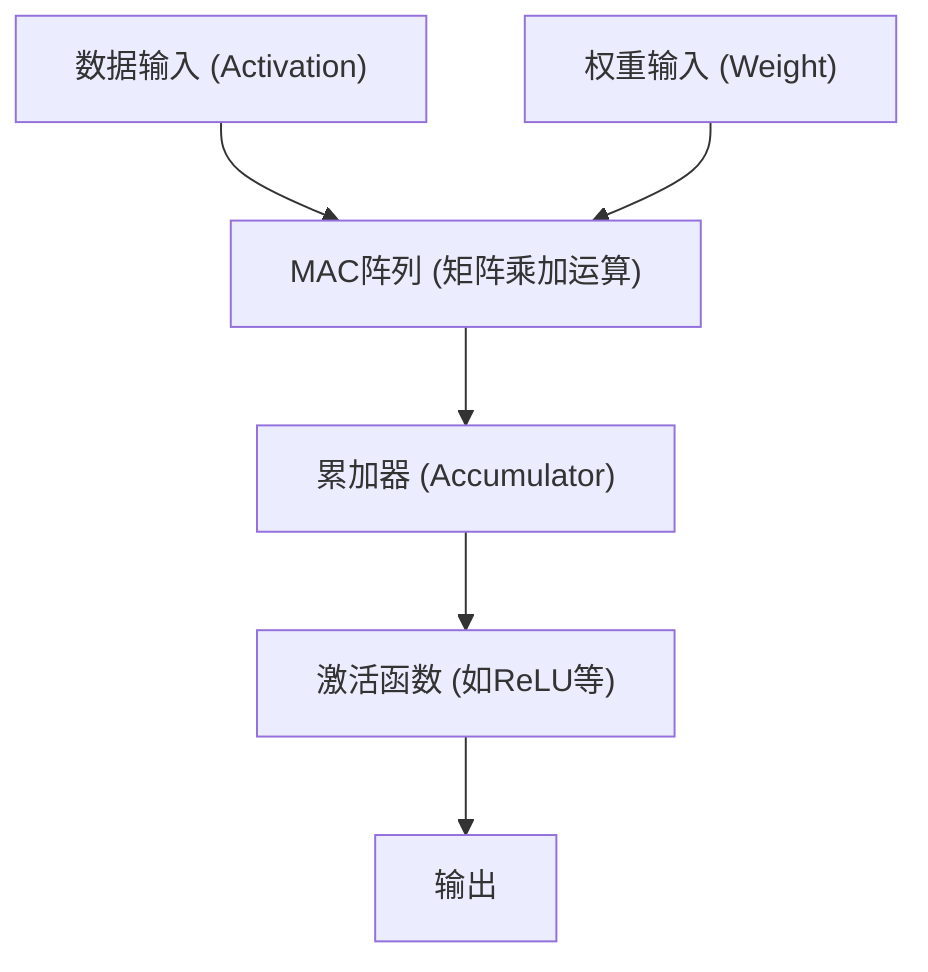

# 边缘AI与NPU（神经网络处理单元）架构

近年来，随着人工智能（AI）技术的飞速发展，AI已经渗透到我们生活的方方面面。引领初期AI热潮的，是云端庞大数据中心所提供的压倒性计算资源。然而，如今这一范式正迎来重大转折点，那就是“边缘AI（Edge AI）”以及支撑它的专用硬件“NPU（神经网络处理单元）”的崛起。

本文将深入探讨云端AI面临的挑战、边缘AI的必要性，以及NPU是如何实现惊人的推理速度和低功耗的。我们将详细解析其架构、具体实例以及模型优化技术。

## 1. 云端AI的局限性与边缘AI的崛起

传统上在云端进行AI推理的方法，存在一些结构性的问题。

### 延迟（Latency）问题
在自动驾驶汽车、工业机器人、实时语音翻译等需要瞬间做出判断的应用中，通过网络传输带来的通信延迟（Latency）是一个致命问题。将数据发送到云端并接收处理结果所需的数十至数百毫秒延迟，可能会导致严重事故或用户体验下降。

### 隐私与安全
智能手机和智能家居设备通过摄像头和麦克风，时刻在获取用户极其隐私的信息。如果不断将这些原始数据发送到云端，会增加信息泄露和侵犯隐私的风险。而使用边缘AI，数据在终端（边缘）内部进行处理，仅输出或发送结果，因此从隐私保护的角度来看具有极大的优势。

### 通信成本与带宽
将高分辨率视频流或庞大的传感器数据全部发送到云端，会严重挤压网络带宽，导致通信成本急剧膨胀。在边缘侧对数据进行预处理，仅将必要的信息发送到云端，可以大幅减轻网络基础设施的负担。

为了解决这些问题，在数据生成的现场（边缘）直接运行AI模型的“边缘AI”成为了必然需求。然而，与云端服务器不同，边缘设备在电池容量、散热和物理尺寸上受到严格限制。于是，专门用于高效AI处理的处理器“NPU”应运而生。

## 2. 什么是NPU（神经网络处理单元）？

NPU（Neural Processing Unit，神经网络处理单元）是为了以极高的速度和极低的功耗执行深度学习等神经网络处理（推理和训练）而专门设计的硬件加速器。

### CPU、GPU、NPU的区别

为了理解AI处理硬件的演进，我们需要理清CPU、GPU和NPU在作用与架构上的区别。

*   **CPU（中央处理器）**:
    擅长通用运算处理。能够灵活应对复杂的条件分支和操作系统控制等多样的任务，但由于核心数量有限，不适合像神经网络这样海量的并行计算。
*   **GPU（图形处理器）**:
    最初为了绘制图像而搭载了数千个小型核心，擅长简单计算的超大规模并行处理。它是引爆AI热潮的关键，至今在云端模型训练（Training）方面依然占据着绝对的主导地位。然而，其功耗较大，如果在移动终端等边缘设备上常态化运行，会面临电池和散热方面的挑战。
*   **NPU（神经网络处理单元）**:
    是将整体架构针对神经网络计算（尤其是矩阵的乘加运算）进行优化的专用处理器。通过牺牲一定的通用性，在特定AI模型的推理（Inference）上，能够展现出超越GPU的处理效率（TOPS/W：每瓦特运算次数）。

## 3. NPU的架构：为什么能实现高速与高效？

NPU能够发挥出惊人性能的秘密，在于其内部架构。

### MAC（乘加）单元的密集集成
神经网络处理的绝大部分，是将输入数据与权重（Weight）相乘并进行累加的“乘加运算（MAC）”。NPU采用了将大量（数千至数万个）MAC单元密集排列的“脉动阵列（Systolic Array）”或“张量核心（Tensor Core）”结构。数据像流水线传递一样在阵列中流动，从而减少了对寄存器的无效访问，大幅提升了每个时钟周期的运算量。

### 存储层次结构的优化（数据移动最小化）
实际上，处理器中最耗电的环节并非“计算”本身，而是“内存数据的读写（数据移动）”。从DRAM中获取数据时的功耗，可达ALU（算术逻辑单元）计算功耗的数十到数百倍。
NPU芯片内部集成了巨大的SRAM（片上内存），采取了尽量将神经网络的权重和中间数据保留在芯片内部的架构。此外，它不在主存（DRAM）中写回层与层之间的数据，而是直接将其输入到下一层的运算器中，从而彻底减少了数据移动的开销。

## 4. 现实世界中的NPU架构实例

目前，针对智能手机和PC，厂商们开发并搭载了各种各样的NPU。

### Apple Neural Engine (ANE)
苹果从A11 Bionic芯片开始搭载Neural Engine（神经网络引擎），它是iPhone和Mac（M系列）竞争力的源泉。Face ID的面部识别、照片的语义分割、Siri的端侧语音识别等功能，都在极低功耗下由其在后台高速处理。在最新的M3或A17 Pro芯片中，其运算性能高达每秒数十万亿次（TOPS）。

### Google Tensor Processing Unit (TPU)
谷歌虽以云端庞大的TPU闻名，但其面向Pixel智能手机推出了集成NPU（继承了“Edge TPU”血脉）的“Google Tensor”芯片。它专门针对边缘端运行谷歌高级AI模型进行了优化，例如相机的计算摄影（魔术橡皮擦或夜景模式）以及实时语音转文字等功能。

### Qualcomm Hexagon NPU
在大多安卓智能手机搭载的骁龙（Snapdragon）SoC中，内置了Hexagon DSP/NPU。它集成了标量、向量和张量运算，并与相机ISP和传感器中枢密切配合，从而优化了设备整体的AI性能。最近，在面向Windows PC的处理器Snapdragon X Elite中也搭载了强大的NPU，推动了AI PC（Copilot+ PC）的实现。

## 5. 支撑边缘AI的软件与优化技术

即使拥有出色的NPU硬件，也无法将云端庞大的AI模型直接运行在边缘设备上。为了释放硬件的潜力，“模型优化技术”不可或缺。

### 量化 (Quantization)
该技术将AI模型的权重和计算精度，从标准的32位浮点数（FP32）缩减为16位（FP16）、8位整数（INT8）甚至4位（INT4）。这不仅能将模型体积缩小至原来的几分之一，还能节省内存带宽。许多NPU在硬件层面针对INT8或INT4运算进行了优化，因此量化能够显著提升推理速度。为了将精度损失降至最低，通常会使用PTQ（训练后量化）和QAT（量化感知训练）等方法。

### 剪枝 (Pruning)
在神经网络中，找出对推理结果几乎没有影响的“低重要度权重（接近于零的值）”，并将其从网络中删除（固定为零）的技术。这能够提高模型的稀疏性（Sparsity），从而减少计算量和模型体积。

### 知识蒸馏 (Knowledge Distillation)
这是一种让轻量化模型（学生模型）学习高性能但庞大的模型（教师模型）行为的方法。由于学生模型被训练为模仿教师模型的输出概率分布，与单独训练小模型相比，它能达到更高的精度，同时保持能够运行在边缘设备上的尺寸。

## 6. 边缘AI的未来与展望

目前，以ChatGPT为代表的大型语言模型（LLM）席卷全球，但它们的推理依然需要云端庞大的GPU集群。不过，技术的发展也正试图将LLM引入边缘端（边缘LLM，SLM: 小型语言模型）。

未来预计将出现以下趋势：

*   **混合AI（Hybrid AI）**:
    日常的轻量级推理（文本摘要、语音识别、简单的图像生成等）由边缘设备的NPU即时处理，只有在需要更高级、复杂的推理时才卸载到云端，这种混合模式将成为主流。
*   **向多种边缘设备普及**:
    不仅是智能手机和PC，监控摄像头、无人机、可穿戴设备，甚至物联网（IoT）传感器本身也将内置极小的NPU（微控制器AI），从而让所有万物都拥有“智能”。
*   **NPU的标准化与生态系统**:
    为了打破目前不同硬件需要不同优化的现状，ONNX、OpenVINO、TensorFlow Lite、PyTorch ExecuTorch等框架正在不断发展，旨在为开发者构建“一次编写，处处最优运行”的环境。

## 结语

边缘AI和NPU的演进，使AI从少数研究人员和云端基础设施的专属，蜕变为我们手中所有设备的“基础功能”。这一架构实现了零延迟、隐私保护以及功耗效率的急剧提升，将成为引领未来十年计算领域最重要技术之一。

对于软件工程师和AI开发者而言，不仅需要掌握处理云端庞大模型的技能，未来“如何在有限的资源下，发挥硬件（NPU）特性来实现和优化AI”的知识也将变得越来越重要。
