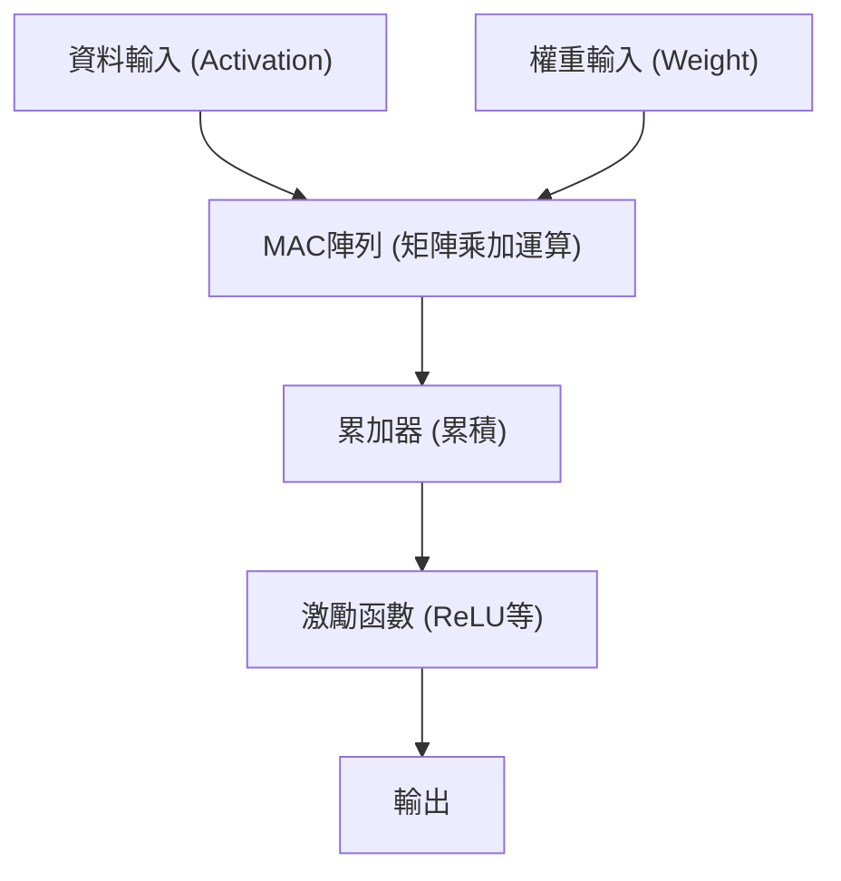

# Edge AI與NPU（Neural Processing Unit）架構

近年來，隨著人工智慧（AI）技術的快速發展，我們的生活各個層面都開始應用AI。引領早期AI熱潮的，是位於雲端的巨大資料中心所擁有的壓倒性運算資源。然而，現在這個典範正面臨著重大的轉捩點，那就是「Edge AI（邊緣AI）」以及支撐它的專用硬體「NPU（Neural Processing Unit）」的崛起。

本篇文章將從雲端AI面臨的課題出發，探討Edge AI的必要性，並深入解說NPU是如何實現驚人的推論速度與省電效果，包含其架構、具體實例以及模型最佳化技術。

## 1. 雲端AI的極限與Edge AI的崛起

將AI推論放在雲端進行的傳統方法，存在著幾個結構性的課題。

### 延遲（Latency）的問題
在自動駕駛車、工業用機器人、即時語音翻譯等需要瞬間判斷的應用程式中，透過網路的通訊延遲（Latency）將成為致命的問題。將資料傳送到雲端，直到接收到處理結果為止的數十至數百毫秒延遲，有可能會導致重大事故或使用者體驗的下降。

### 隱私與安全性
智慧型手機或智慧家庭裝置透過相機與麥克風，隨時都在取得使用者極為隱私的資訊。持續將這些原始資料傳送至雲端，會增加資訊外洩或侵犯隱私的風險。如果使用Edge AI，資料會在終端（邊緣）內進行處理，且只輸出或傳送結果，因此在隱私保護的觀點上非常有利。

### 通訊成本與頻寬
如果將高解析度的影片串流或龐大的感測器資料全部傳送到雲端，將會顯著壓迫網路頻寬，並使通訊成本暴增。透過在邊緣端預先處理資料，只將必要的資訊傳送到雲端，可以大幅減少網路基礎設施的負載。

為了解決這些課題，在資料產生的現場（邊緣）直接運行AI模型的「Edge AI」便成了必然的需求。然而，邊緣裝置與雲端伺服器不同，在電池容量、散熱及實體尺寸上都有著嚴格的限制。於是，專門針對AI處理的高效能處理器「NPU」便應運而生。

## 2. 什麼是NPU（Neural Processing Unit）？

NPU（Neural Processing Unit）是為了以極高的速度與低功耗執行深度學習等神經網路的處理（推論與訓練），而特別設計的硬體加速器。

### CPU、GPU、NPU的差異

為了理解AI處理中硬體的演進，我們需要釐清CPU、GPU與NPU在作用與架構上的差異。

*   **CPU（Central Processing Unit）**:
    擅長通用型的運算處理。雖然能靈活處理複雜的條件分支或作業系統控制等多樣化任務，但由於核心數量有限，不適合像神經網路這種龐大的平行運算。
*   **GPU（Graphics Processing Unit）**:
    原本是為了影像繪圖而搭載了數千個小規模核心，擅長簡單計算的超平行處理。它是引爆AI熱潮的推手，至今在雲端側的模型訓練（Training）上仍是壓倒性的主角。然而，它的耗電量很大，若要在行動裝置等邊緣裝置上持續運作，在電池與散熱方面會有課題。
*   **NPU（Neural Processing Unit）**:
    是將整體架構針對神經網路運算（特別是矩陣的乘加運算）進行最佳化的專用處理器。雖然犧牲了某種程度的通用性，但在特定AI模型的推論（Inference）上，能展現出超越GPU的處理效率（TOPS/W：每瓦特的運算次數）。

## 3. NPU的架構：為什麼能做到高速與高效能？

NPU能發揮驚人效能的秘密，就在於其內部架構。

### MAC（Multiply-Accumulate）單元的整合
神經網路處理的絕大部分，是將輸入資料與權重（Weight）相乘並加總的「乘加運算（MAC）」。NPU採用了將這種MAC單元大量（數千至數萬個）排列在一起的「脈動陣列（Systolic Array）」或「張量核心（Tensor Core）」結構。資料在陣列內像傳水桶一樣流動，減少了對暫存器不必要的存取，大幅提升了每個時脈週期的運算量。

### 記憶體階層的最佳化（資料移動的最小化）
在處理器中，最耗電的其實不是「計算」本身，而是「從記憶體讀寫資料（資料移動）」。從DRAM取得資料時的耗電量，會達到ALU（算術邏輯單元）計算時的數十倍至數百倍。
NPU採取在晶片內搭載巨大的SRAM（晶片內建記憶體），並盡可能將神經網路的權重與中間資料保留在晶片內的架構。此外，它不將各層間的資料寫回主記憶體（DRAM），而是直接將其送入下一層的運算器中，徹底減少了資料移動的負擔。

## 4. 現實世界中的NPU架構實例

目前，已經有各種NPU被開發並搭載於智慧型手機與PC中。

### Apple Neural Engine (ANE)
Apple從A11 Bionic晶片開始搭載，並成為iPhone與Mac（M系列）競爭力泉源的，就是Neural Engine。它能在背後高速處理Face ID的臉部辨識、照片的語意分割、Siri的裝置端語音辨識等，且幾乎不消耗電池。在最新的M3或A17 Pro晶片中，號稱擁有每秒數十兆次（TOPS）的運算效能。

### Google Tensor Processing Unit (TPU)
Google以雲端用的巨大TPU聞名，但在針對Pixel智慧型手機上，則是推出了整合繼承「Edge TPU」譜系之NPU的「Google Tensor」晶片。它專注於在邊緣端運行Google高度的AI模型，例如相機的運算攝影（魔術橡皮擦或夜視模式）以及即時語音轉文字等。

### Qualcomm Hexagon NPU
內建於多數Android智慧型手機所搭載之Snapdragon SoC中的，就是Hexagon DSP/NPU。它整合了純量、向量與張量運算，並與相機ISP及感測器中樞密切合作，將裝置整體的AI效能最佳化。最近，在針對Windows PC的處理器Snapdragon X Elite中，也搭載了強大的NPU，正推動著AI PC（Copilot+ PC）的實現。

## 5. 支撐邊緣AI的軟體與最佳化技術

即使擁有優秀的NPU硬體，也無法將雲端用的巨大AI模型直接在邊緣端運行。為了發揮硬體的潛力，「模型最佳化技術」是不可或缺的。

### 量化 (Quantization)
這是將AI模型的權重或計算精度，從標準的32位元浮點數（FP32）縮減至16位元（FP16）、8位元整數（INT8），甚至4位元（INT4）的技術。藉此可以將模型大小縮小至幾分之一，並節省記憶體頻寬。大多數的NPU在硬體層面上已針對INT8或INT4運算進行了最佳化，透過量化可大幅提升推論速度。為了將精度的劣化降到最低，會使用PTQ（訓練後量化）或QAT（量化感知訓練）等手法。

### 剪枝 (Pruning)
這是在神經網路中找出對推論結果幾乎沒有影響的「重要度低的權重（接近零的值）」，並將其從網路中刪除（固定為零）的技術。這能提高模型的稀疏性（Sparsity），進而減少計算量與模型大小。

### 知識蒸餾 (Knowledge Distillation)
這是讓輕量級模型（學生模型）學習高效能但巨大模型（教師模型）行為的手法。由於學生模型會被訓練來模仿教師模型的輸出機率分佈，因此比起單獨訓練一個小模型，這種方法能達成更高的精確度，同時又可以將大小控制在能在邊緣裝置上運作的範圍。

## 6. Edge AI的未來與後續展望

目前，以ChatGPT為首的大型語言模型（LLM）正席捲全球，但這些推論依然需要雲端龐大的GPU叢集。然而，技術的演進甚至也想將LLM帶入邊緣端（邊緣LLM，SLM: Small Language Model）。

未來，預期會有以下幾種趨勢：

*   **Hybrid AI（混合式AI）**:
    日常輕量的推論（文字摘要、語音辨識、簡單的圖像生成等）交由邊緣裝置的NPU即時處理，只有在需要更高度且複雜的推論時才卸載給雲端，這種混合式方法將成為主流。
*   **擴及多樣化的邊緣裝置**:
    不僅限於智慧型手機或PC，監視攝影機、無人機、穿戴式裝置，甚至IoT感測器本身都會內建極小的NPU（微控制器專用AI），讓所有物品都擁有「智慧」。
*   **NPU的標準化與生態系統**:
    為了打破目前不同硬體需要不同最佳化方式的現狀，ONNX、OpenVINO、TensorFlow Lite、PyTorch ExecuTorch等框架正在不斷演進，為開發者打造出「寫一次就能在任何NPU上最佳化執行」的環境。

## 結語

Edge AI與NPU的演進，已經將AI從少數研究者與雲端基礎設施的專利，轉變為我們手邊所有裝置的「基礎功能」。這項能夠消除延遲、保護隱私，並大幅提升能源效率的架構，將會是引領下一個十年運算發展的最重要技術之一。

對於軟體工程師或AI開發者來說，不僅僅是處理雲端上巨大模型的技能，未來「如何在有限的資源中，活用硬體（NPU）特性來實作並最佳化AI」的知識將變得越來越重要。
