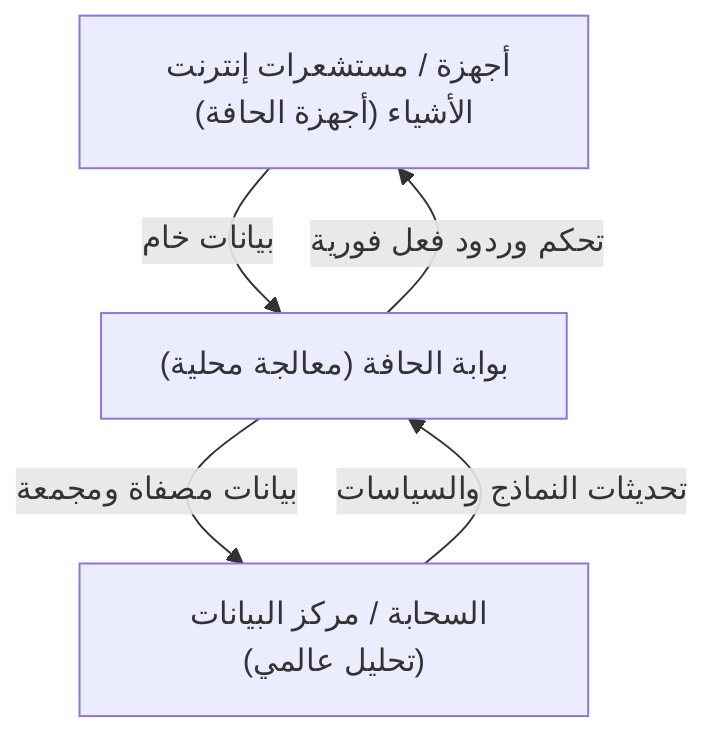

## 1. مقدمة: الابتعاد عن التركيز المفرط على السحابة

على مدى العقود القليلة الماضية، رسخت الحوسبة السحابية مكانتها كمعيار للبنية التحتية لتكنولوجيا المعلومات. لقد غيرت السحابة نموذج تطوير البرمجيات بشكل جذري، حيث توفر موارد حوسبة قابلة للتوسع بشكل غير محدود، وقواعد بيانات مُدارة، وواجهات برمجة تطبيقات متقدمة للتعلم الآلي عند الطلب. ولكن مع دخولنا عصر إنترنت الأشياء (IoT) حيث كل شيء متصل بالإنترنت، والانفجار الهائل في عدد المستشعرات والأجهزة، فإن بنية 'إرسال كل البيانات إلى السحابة' بدأت تصل إلى حدودها القصوى.

هناك مليارات الأجهزة الموزعة في جميع أنحاء العالم والتي تولد بيانات استشعار آلاف المرات في الثانية. السيارات ذاتية القيادة، والآلات الذكية في المصانع، والأجهزة الطبية القابلة للارتداء تنتج باستمرار كميات هائلة من البيانات. إن إرسال كل هذه البيانات إلى الخوادم المركزية السحابية لمعالجتها ثم إرسال النتائج مرة أخرى إلى الأجهزة أصبح غير عملي من الناحية الفيزيائية والاقتصادية والأمنية. في هذه المقالة، سنتعمق في قيود المعالجة المركزية السحابية ونشرح بالتفصيل، من منظور البنية، حتمية حوسبة الحافة (Edge Computing) التي تعالج البيانات بالقرب من مصدر إنشائها.

## 2. ثلاث قيود تواجه البنية المركزية السحابية

يواجه نهج إرسال كل البيانات إلى السحابة ثلاث مشاكل قاتلة بشكل رئيسي: 'استنفاد النطاق الترددي'، 'زيادة وقت الاستجابة (الكمون)'، و'تحديات الخصوصية والأمان'.

### 2.1 استنفاد النطاق الترددي (Bandwidth Exhaustion)

النطاق الترددي للشبكة ليس غير محدود. على سبيل المثال، تولد سيارة واحدة ذاتية القيادة عدة تيرابايتات (TB) من البيانات يوميًا من الكاميرات، وليدار (LIDAR)، والرادار وغيرها من المستشعرات. إذا حاولت ملايين السيارات ذاتية القيادة على الطرق حول العالم إرسال كل هذه البيانات الخام إلى السحابة، فإن الشبكات الخلوية مثل 4G و5G ستنهار على الفور.

هناك حدود فيزيائية لكمية البيانات التي يمكن إرسالها عبر الشبكة، كما تمثله نظرية شانون لتشفير القناة. من الممكن ترقية البنية التحتية لضمان عرض النطاق الترددي، لكن ذلك يكلف مبالغ طائلة. علاوة على ذلك، لا يمكن تجاهل رسوم نقل البيانات وتكاليف التخزين المدفوعة لموفري الخدمات السحابية. إرسال كل شيء إلى السحابة، بما في ذلك 'بيانات الضوضاء عديمة القيمة'، هو غير فعال تمامًا من منظور اقتصادي.

### 2.2 مشكلة وقت الاستجابة (الكمون)

تبلغ سرعة الضوء حوالي 300,000 كم/ثانية، ولا يمكن لسرعة نقل البيانات أن تتجاوز هذا القانون الفيزيائي. عندما تكون الخوادم السحابية في مراكز بيانات تبعد مئات أو آلاف الكيلومترات، يحدث زمن انتقال (كمون) يتراوح بين عشرات إلى مئات الملي ثانية لرحلة البيانات ذهابًا وإيابًا (Round Trip).

في العديد من التطبيقات، قد يكون هذا التأخير مقبولاً. ومع ذلك، في الأنظمة الحرجة (Mission-Critical) التالية، يمكن أن يكون التأخير الطفيف مميتًا:

*   **السيارات ذاتية القيادة:** إذا تم الاعتماد على السحابة لاتخاذ قرار اكتشاف العوائق وتطبيق المكابح، فهناك خطر التسبب في حادث بسبب تأخير الاتصال.
*   **الروبوتات الصناعية:** يتطلب التحكم في الروبوتات التي تعمل بسرعات عالية في خطوط إنتاج المصانع استجابة في أجزاء من الملي ثانية.
*   **الأجهزة الطبية:** ردود الفعل في الوقت الفعلي ضرورية للمعدات المستخدمة في الجراحة عن بُعد وغيرها.

بهذه الطريقة، في السيناريوهات التي 'يجب فيها اتخاذ قرارات فورية'، فإن بنية إرسال البيانات إلى السحابة وانتظار الرد غير قابلة للتطبيق.

### 2.3 الخصوصية والأمان

إرسال البيانات عبر الشبكة بحد ذاته يزيد من المخاطر الأمنية. على وجه الخصوص، البيانات الحساسة المرتبطة مباشرة بالخصوصية، مثل لقطات الكاميرات الذكية المنزلية والبيانات الحيوية التي تجمعها الأجهزة الطبية القابلة للارتداء، لا ينبغي إرسالها إلى الخارج قدر الإمكان.

عندما يتم تجميع كل البيانات في السحابة، تصبح الخوادم السحابية أهدافًا جذابة للهجمات. تأثير حدوث اختراق للبيانات لا يمكن قياسه. بالإضافة إلى ذلك، تقيد قوانين حماية البيانات في مختلف البلدان، مثل القانون العام لحماية البيانات (GDPR)، بشدة النقل عبر الحدود للبيانات، مع التركيز على الموقع الفعلي لتخزين البيانات (Data Residency). لقد أصبح من المحتم معالجة البيانات محليًا وإرسال النتائج المجهولة والمجمعة فقط إلى السحابة.

## 3. حتمية وبنية حوسبة الحافة

لحل هذه التحديات، ظهرت 'حوسبة الحافة (Edge Computing)'. حوسبة الحافة هي نموذج حوسبة موزعة حيث تتم معالجة البيانات، ليس في الخوادم المركزية في السحابة، بل في الأجهزة أو الخوادم المحلية الأقرب إلى مكان إنشاء البيانات (حافة الشبكة).

### 3.1 إدخال البنية الهرمية

في أنظمة إنترنت الأشياء، عادة ما تمتلك البنية التي تطبق حوسبة الحافة الهيكل الهرمي التالي:

1.  **طبقة أجهزة الحافة (حافة الجهاز):** الأجهزة الطرفية مثل المستشعرات والمحركات والكاميرات الذكية. هنا يتم جمع البيانات وإجراء تصفية (فلترة) بسيطة جدًا.
2.  **طبقة بوابة/عقدة الحافة (حافة الشبكة):** أجهزة التوجيه (رواتر) أو أجهزة البوابة المخصصة، أو المحطات الأساسية (MEC: Multi-access Edge Computing). تمتلك هذه الطبقة قدرة حسابية معينة وتقوم بتحليل البيانات في الوقت الفعلي، والتصفية، واكتشاف الحالات الشاذة، وما إلى ذلك.
3.  **الطبقة السحابية:** النظام المركزي الذي يتولى تخزين البيانات على المدى الطويل، وتدريب نماذج التعلم الآلي واسعة النطاق، وإدارة العمليات الشاملة.

إن **فصل المسؤوليات (Separation of Concerns)** هو مفتاح البنية: حيث يتم معالجة ما يجب تحديده فورًا عند الحافة في الحافة (النطاق المحلي)، وتوجيه المهام التي تتطلب تحليلاً للاتجاهات طويلة المدى أو معالجة واسعة النطاق (النطاق العالمي) إلى السحابة.

## 4. قيود أجهزة إنترنت الأشياء والواقع

على الرغم من أن حوسبة الحافة مثالية، إلا أن هناك قيودًا صارمة على أجهزة إنترنت الأشياء الطرفية التي تولد البيانات. يجب على مهندسي البنية فهم هذه القيود بالكامل عند تصميم النظام.

### 4.1 قيود عمر البطارية

لا تكون العديد من أجهزة إنترنت الأشياء متصلة دائمًا بمصدر طاقة، بل يتم تشغيلها بواسطة البطاريات أو تجميع الطاقة (Energy Harvesting). أداء عمليات الحوسبة يستهلك الطاقة، ولكن في الواقع **تستهلك الاتصالات اللاسلكية (إرسال البيانات عبر Wi-Fi أو LTE) طاقة أكبر بكثير من الحسابات على المعالج**. لذلك، بدلاً من 'إرسال كل البيانات'، فإن 'الحساب محليًا وتجاهل البيانات غير الضرورية وإرسال النتائج المهمة فقط' يقلل من الاستهلاك الإجمالي للطاقة للجهاز ويطيل عمر البطارية في كثير من الحالات.

### 4.2 قيود القدرة الحسابية والذاكرة

تعمل العديد من أجهزة إنترنت الأشياء على وحدات تحكم دقيقة (MCU) رخيصة ومنخفضة استهلاك الطاقة. الأجهزة التي تمتلك بضع مئات من الكيلوبايت من ذاكرة الوصول العشوائي (RAM) لا يمكنها تشغيل أنظمة تشغيل معقدة أو حزم برمجيات ضخمة. لذلك، إذا كانت هناك حاجة لمعالجة متقدمة، يلزم تصميم يقوم بنقل عبء المعالجة (Offload) ليس على حافة الجهاز المقيدة بشدة، ولكن إلى حافة الشبكة (مثل البوابة) التي لديها مساحة أكبر قليلاً في الموارد.

## 5. حوسبة الحافة مقابل حوسبة الضباب (Fog Computing)

مفهوم مشابه لحوسبة الحافة هو 'حوسبة الضباب (Fog Computing)'. هذا المفهوم، الذي اقترحته شركة سيسكو سيستمز، يحمل معنى الضباب الذي يطفو بالقرب من الأرض (الحافة) بدلاً من السحابة.

المفهومان قريبان جدًا، لكن هناك اختلاف في التركيز البنيوي.

*   **حوسبة الحافة:** تركز على المعالجة في 'المكان' الفعلي الذي تُنشأ فيه البيانات (الأجهزة أو المناطق المجاورة لها مباشرة). الهدف الرئيسي هو تحسين قدرات المعالجة في النقاط الطرفية (الأجهزة نفسها).
*   **حوسبة الضباب:** هو إطار عمل معماري يضع في طبقات مسار الشبكة من الحافة إلى السحابة (أجهزة التوجيه والمحولات والبوابات وما إلى ذلك) ويتعامل مع البنية التحتية بأكملها كمنصة معالجة موزعة. لديها منظور أكثر مركزية على الشبكة.

من الناحية العملية، هذان المفهومان ليسا متنافيين، بل يتم دمجهما واستخدامهما لتحسين النظام بأكمله.

## 6. المستقبل الذي يجلبه الذكاء الاصطناعي على الحافة (Edge AI) و TinyML

التطور الذي يسرع تقدم حوسبة الحافة بشكل كبير هو ظهور 'الذكاء الاصطناعي على الحافة (Edge AI)'. في الماضي، كان الاستدلال (التنبؤ) في نماذج التعلم الآلي يتطلب موارد حوسبة كبيرة وعادة ما يتم إجراؤه على الجانب السحابي. ومع ذلك، وبسبب تطور الأجهزة وتقنيات ضغط النماذج، أصبح الاستدلال في الوقت الفعلي ممكنًا على جانب الحافة.

ما يجذب الانتباه بشكل خاص هو **TinyML (التعلم الآلي المصغر)**. TinyML هي تقنية تعمل على تشغيل نماذج التعلم الآلي على وحدات التحكم الدقيقة (MCUs) التي تعمل ببضع مللي واط من الطاقة. وقد أدى ذلك إلى حالات استخدام مبتكرة لم يكن من الممكن تصورها من قبل.

*   **اكتشاف الكلمات الرئيسية الصوتية (Voice Keyword Detection):** العملية التي من خلالها تتعرف مكبرات الصوت الذكية على كلمات التنبيه مثل 'Hey, Siri' أو 'OK, Google' تعمل دائمًا على الجهاز (الحافة) بدلاً من السحابة. هذا يمنع إرسال المحادثات غير ذات الصلة إلى السحابة.
*   **الصيانة التنبؤية (Predictive Maintenance):** تقوم أجهزة الحافة بتحليل اهتزاز المحرك والبيانات الصوتية في الوقت الفعلي للكشف عن علامات الفشل المبكرة. ليست هناك حاجة للاستمرار في إرسال بيانات طبيعية لعدة أيام إلى السحابة.
*   **الذكاء الاصطناعي للرؤية (Vision AI):** تقوم الكاميرات الذكية بتحليل مقاطع الفيديو محليًا ولا ترسل اللقطات إلى السحابة إلا عندما تكتشف شخصًا مشبوهًا أو حدثًا معينًا.

يتم تدريب النماذج (Training) في السحابة حيث يتم تجميع كميات هائلة من البيانات، بينما يتم نشر النماذج خفيفة الوزن والمُحسَّنة والمُكمَّمة (Quantized) على الحافة لإجراء الاستدلال (Inference). دورة التدريب والاستدلال الهجينة هذه هي الشكل النهائي لبنية إنترنت الأشياء الحديثة.

## 7. الخلاصة: نحو التوازن الأمثل بين السحابة والحافة

الإجابة على السؤال 'لماذا يجب ألا نرسل كل البيانات إلى السحابة؟' واضحة. قوانين الفيزياء، والاقتصاد، والأمن كلها تجعل ذلك مستحيلاً.

حوسبة الحافة لا تستبدل السحابة. بل هي شريك لا غنى عنه لتعظيم قيمة السحابة. يتم تصفية كميات هائلة من البيانات الخام منخفضة القيمة في الحافة، ويتم اتخاذ القرارات التي تتطلب وقتًا حقيقيًا محليًا. وتتولى السحابة مسؤولية استخراج الرؤى طويلة المدى وتنظيم (Orchestration) النظام بأكمله.

إن 'توزيع المسؤولية' هذا هو البنية المستدامة الوحيدة التي ستدعم مجتمع إنترنت الأشياء المستقبلي حيث ترتبط مئات المليارات من الأجهزة. يُطلب بقوة من مهندسي البرمجيات ومهندسي البنية في العصر القادم التخلي عن التفكير الذي يعتمد حصريًا على السحابة، وامتلاك منظور لتصميم تدفق البيانات الأمثل وتخصيص المعالجة عبر النظام بأكمله.
