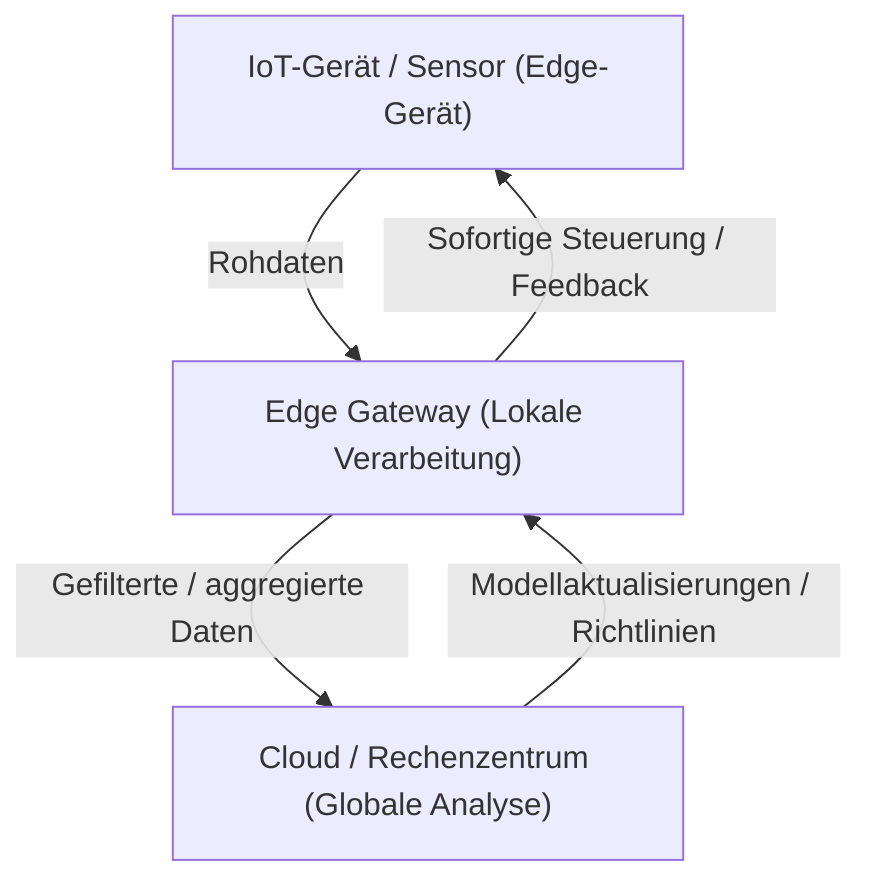

## 1. Einführung: Abkehr von der Cloud-Zentrierung

In den letzten Jahrzehnten hat sich Cloud Computing als Standard für IT-Infrastrukturen etabliert. Die Cloud, mit unendlich skalierbaren Rechenressourcen, verwalteten Datenbanken und fortschrittlichen Machine-Learning-APIs auf Abruf, hat das Paradigma der Softwareentwicklung grundlegend verändert. Da wir jedoch in das Zeitalter des IoT (Internet of Things) eintreten, in dem alles mit dem Internet verbunden ist und Sensoren und Geräte explosionsartig zunehmen, stößt die Architektur, 'alle Daten in die Cloud zu senden', an ihre Grenzen.

Milliarden von Geräten auf der ganzen Welt generieren Tausende von Sensordaten pro Sekunde. Autonome Fahrzeuge, intelligente Maschinen in Fabriken und medizinische Wearables produzieren ununterbrochen riesige Datenmengen. All diese Daten an einen zentralen Server in der Cloud zu senden, sie dort zu verarbeiten und die Ergebnisse an die Geräte zurückzusenden, wird aus physischer, wirtschaftlicher und sicherheitstechnischer Sicht zunehmend unrealistisch. In diesem Artikel werden die Grenzen der zentralisierten Cloud-Verarbeitung vertieft und die Notwendigkeit von Edge Computing, bei dem die Verarbeitung in der Nähe der Datenquelle stattfindet, aus architektonischer Sicht detailliert erläutert.

## 2. Drei Grenzen der Cloud-zentrierten Architektur

Der Ansatz, alle Daten in die Cloud zu senden, bringt drei fatale Hauptprobleme mit sich: 'Erschöpfung der Bandbreite', 'Erhöhte Latenz' und 'Herausforderungen bei Datenschutz und Sicherheit'.

### 2.1 Erschöpfung der Bandbreite (Bandwidth Exhaustion)

Die Netzwerkbandbreite ist nicht unendlich. Beispielsweise generiert ein einzelnes autonomes Fahrzeug täglich mehrere Terabyte (TB) an Daten von Sensoren wie Kameras, LIDAR und Radar. Wenn Millionen von autonomen Fahrzeugen auf den Straßen der Welt versuchen würden, all diese Rohdaten in die Cloud zu senden, würden Mobilfunknetze wie 4G oder 5G augenblicklich zusammenbrechen.

Es gibt physikalische Grenzen für die Datenmenge, die über ein Netzwerk übertragen werden kann, wie sie durch das Shannon-Hartley-Gesetz repräsentiert werden. Obwohl es möglich ist, die Infrastruktur zu erweitern, um mehr Bandbreite zu sichern, ist dies mit enormen Kosten verbunden. Zudem können die Datenübertragungs- und Speicherkosten, die an Cloud-Anbieter gezahlt werden müssen, nicht ignoriert werden. Das Senden von allem in die Cloud, einschließlich 'wertloser Rauschdaten', ist auch aus wirtschaftlicher Sicht völlig ineffizient.

### 2.2 Das Problem der Latenz (Verzögerung)

Die Lichtgeschwindigkeit beträgt etwa 300.000 km/s, und die Datenübertragungsgeschwindigkeit kann dieses physikalische Gesetz nicht überschreiten. Wenn sich Cloud-Server in Rechenzentren Hunderte oder Tausende Kilometer entfernt befinden, entsteht bei der Datenrückkehr (Round Trip) eine Latenz von zig bis Hunderten von Millisekunden.

In vielen Anwendungen mag diese Verzögerung akzeptabel sein. In den folgenden geschäftskritischen Systemen kann jedoch schon eine geringe Verzögerung tödlich sein:

*   **Autonome Fahrzeuge:** Wenn man sich bei der Entscheidung, ein Hindernis zu erkennen und zu bremsen, auf die Cloud verlässt, besteht aufgrund von Kommunikationsverzögerungen die Gefahr, dass es zu einem Unfall kommt.
*   **Industrieroboter:** Die Steuerung von Robotern, die in Fabrikproduktionslinien mit hoher Geschwindigkeit arbeiten, erfordert eine Reaktionsfähigkeit im Millisekundenbereich.
*   **Medizinische Geräte:** Bei Geräten für Fernoperationen ist Echtzeit-Feedback unerlässlich.

In Szenarien, in denen 'sofortige Entscheidungen getroffen werden müssen', ist die Architektur, Daten in die Cloud zu senden und auf eine Antwort zu warten, somit nicht praktikabel.

### 2.3 Datenschutz und Sicherheit

Das Senden von Daten über ein Netzwerk erhöht das Sicherheitsrisiko per se. Insbesondere hochsensible Daten, die direkt mit der Privatsphäre zusammenhängen, wie etwa Aufnahmen von Smart-Kameras im eigenen Zuhause oder Vitaldaten, die von medizinischen Wearables erfasst werden, sollten möglichst nicht nach außen gelangen.

Wenn alle Daten in der Cloud zentralisiert sind, werden Cloud-Server zu einem attraktiven Angriffsziel. Die Auswirkungen eines Datenlecks sind unermesslich. Darüber hinaus schränken nationale Datenschutzgesetze wie die DSGVO (Datenschutz-Grundverordnung der EU) den grenzüberschreitenden Datentransfer stark ein, was die Bedeutung des physischen Speicherorts von Daten (Data Residency) unterstreicht. Der Ansatz, Daten lokal zu verarbeiten und nur anonymisierte und aggregierte Ergebnisse in die Cloud zu senden, ist unvermeidlich geworden.

## 3. Die Notwendigkeit und Architektur von Edge Computing

Um diese Herausforderungen zu lösen, entstand das 'Edge Computing'. Edge Computing ist ein verteiltes Computerparadigma, bei dem Daten nicht in einem zentralen Cloud-Server, sondern auf Geräten oder lokalen Servern in der Nähe des Ortes ihrer Entstehung (dem Netzwerk-Edge = Peripherie) verarbeitet werden.

### 3.1 Einführung einer hierarchischen Architektur

In IoT-Systemen hat eine Architektur, die Edge Computing einführt, typischerweise die folgende hierarchische Struktur:

1.  **Edge-Geräte-Ebene (Device Edge):** Endgeräte wie Sensoren, Aktoren und Smart-Kameras. Hier findet die Datenerfassung und sehr einfache Filterung statt.
2.  **Edge-Gateway-/Knoten-Ebene (Network Edge):** Router, dedizierte Gateway-Geräte oder Basisstationen (MEC: Multi-access Edge Computing). Diese verfügen über ein gewisses Maß an Rechenleistung zur Durchführung von Echtzeit-Datenanalysen, Filterungen, Anomalieerkennungen usw.
3.  **Cloud-Ebene:** Das zentrale System, das die langfristige Datenspeicherung, das Training umfangreicher Machine-Learning-Modelle und die gesamte Betriebsverwaltung übernimmt.

Die Trennung der Verantwortlichkeiten (**Separation of Concerns**), bei der Dinge, die sofortige Entscheidungen am Edge erfordern (lokaler Bereich), am Edge verarbeitet werden, und Dinge, die langfristige Trendanalysen oder groß angelegte Verarbeitungen erfordern (globaler Bereich), in die Cloud ausgelagert werden, ist der Schlüssel zur Architektur.

## 4. Einschränkungen und Realitäten von IoT-Geräten

Obwohl Edge Computing ideal ist, unterliegen die Endgeräte (IoT-Geräte), die die Daten generieren, strengen Einschränkungen. Architekten müssen diese Einschränkungen beim Systemdesign vollständig verstehen.

### 4.1 Einschränkungen der Batterielebensdauer

Viele IoT-Geräte sind nicht ständig an eine Stromquelle angeschlossen, sondern werden über Batterien oder Energy Harvesting (Energiegewinnung aus der Umgebung) betrieben. Das Ausführen Berechnungen verbraucht Strom, aber in Wirklichkeit **verbraucht die drahtlose Kommunikation (Datenübertragung über Wi-Fi oder LTE) weitaus mehr Strom als Berechnungen auf dem Prozessor**. Daher ist es oft besser, 'lokal zu rechnen, unwichtige Daten zu verwerfen und nur wichtige Ergebnisse zu senden', anstatt 'alle Daten zu senden', um den Gesamtstromverbrauch des Geräts zu senken und die Batterielebensdauer zu verlängern.

### 4.2 Einschränkungen bei Rechenleistung und Speicher

Die meisten IoT-Geräte laufen auf kostengünstigen Mikrocontrollern (MCUs) mit geringem Stromverbrauch. Ein Gerät mit nur wenigen hundert Kilobyte RAM kann kein komplexes Betriebssystem oder einen riesigen Software-Stack ausführen. Wenn Sie also erweiterte Verarbeitungen durchführen möchten, benötigen Sie ein Design, das die Verarbeitung auf den Netzwerk-Edge (z. B. ein Gateway) verlagert, der etwas mehr Ressourcen bietet, anstatt auf den Device-Edge mit seinen strengen Einschränkungen.

## 5. Edge Computing vs. Fog Computing

Ein dem Edge Computing ähnliches Konzept ist das 'Fog Computing'. Dieses von Cisco Systems propagierte Konzept impliziert einen Nebel (Fog), der näher am Boden (Edge) schwebt als die Wolke (Cloud).

Beide sind sehr ähnliche Konzepte, aber es gibt einen Unterschied im architektonischen Fokus.

*   **Edge Computing:** Konzentriert sich auf die Verarbeitung am physischen 'Ort (Gerät oder in seiner unmittelbaren Nähe)', an dem die Daten generiert werden. Das Hauptziel ist die Verbesserung der Verarbeitungskapazität am Endpunkt (dem Gerät selbst).
*   **Fog Computing:** Ein architektonisches Framework, das den Netzwerkpfad vom Edge zur Cloud (Router, Switches, Gateways usw.) hierarchisch strukturiert und die gesamte Infrastruktur als Plattform für verteilte Verarbeitung behandelt. Es hat eine eher netzwerkzentrierte Perspektive.

In der Praxis schließen sich diese beiden Ansätze nicht aus, sondern werden miteinander verschmolzen eingesetzt, um das Gesamtsystem zu optimieren.

## 6. Die durch Edge AI und TinyML gebrachte Zukunft

Das Aufkommen von 'Edge AI' beschleunigt die Entwicklung von Edge Computing am stärksten. Bisher erforderte die Inferenz (Vorhersage) von Machine-Learning-Modellen große Rechenressourcen und wurde üblicherweise in der Cloud durchgeführt. Fortschritte in der Hardware und Technologien zur Modellkomprimierung haben jedoch eine Echtzeit-Inferenz auf der Edge-Seite möglich gemacht.

Besondere Aufmerksamkeit wird **TinyML (Tiny Machine Learning)** zuteil. TinyML ist eine Technologie, die Machine-Learning-Modelle auf Mikrocontrollern (MCUs) ausführt, die nur wenige Milliwatt an Leistung verbrauchen. Dies bringt innovative Anwendungsfälle hervor, die bisher undenkbar waren.

*   **Sprach-Keyword-Erkennung:** Die Verarbeitung, bei der Smart Speaker Wake-Words wie 'Hey, Siri' oder 'OK, Google' erkennen, läuft immer auf dem Gerät (Edge) und nicht in der Cloud. Dies verhindert, dass irrelevante Gespräche in die Cloud gesendet werden.
*   **Vorausschauende Wartung (Predictive Maintenance):** Edge-Geräte analysieren in Echtzeit Vibrations- und Akustikdaten von Motoren, um Anzeichen für Ausfälle zu erkennen. Es ist nicht erforderlich, tagelang normale Daten in die Cloud zu senden.
*   **Vision AI:** Eine Smart-Kamera analysiert Videos lokal und sendet nur dann einen Schnappschuss in die Cloud, wenn sie eine verdächtige Person oder ein bestimmtes Ereignis erkennt.

Das Trainieren (Training) von Modellen erfolgt in der Cloud, wo riesige Datenmengen aggregiert werden, und optimierte, quantisierte, leichtgewichtige Modelle werden am Edge eingesetzt, um Inferenzen (Inference) durchzuführen. Dieser hybride Zyklus aus Training und Inferenz kann als die perfekte Form der modernen IoT-Architektur angesehen werden.

## 7. Fazit: Das optimale Gleichgewicht zwischen Cloud und Edge finden

Die Antwort auf die Frage 'Warum sollte man nicht alle Daten in die Cloud senden?' ist klar: Die Gesetze der Physik, die Wirtschaftlichkeit und die Sicherheit machen es unmöglich.

Edge Computing ist kein Ersatz für die Cloud. Vielmehr ist es ein unverzichtbarer Partner zur Maximierung des Wertes der Cloud. Das Filtern großer Mengen minderwertiger Rohdaten am Edge und das Treffen lokaler Entscheidungen, die Echtzeitreaktionen erfordern. Und die Cloud ist verantwortlich für die Gewinnung langfristiger Erkenntnisse und die Orchestrierung des gesamten Systems.

Diese 'Verteilung von Verantwortlichkeiten' ist die einzige nachhaltige Architektur, die die zukünftige IoT-Gesellschaft unterstützen wird, in der Hunderte von Milliarden von Geräten verbunden sind. Von Software-Ingenieuren und Architekten wird in der heutigen Zeit dringend gefordert, sich vom reinen Cloud-Denken zu lösen und die Perspektive zu entwickeln, den Datenfluss und die optimale Platzierung der Verarbeitung über das gesamte System hinweg zu entwerfen.
