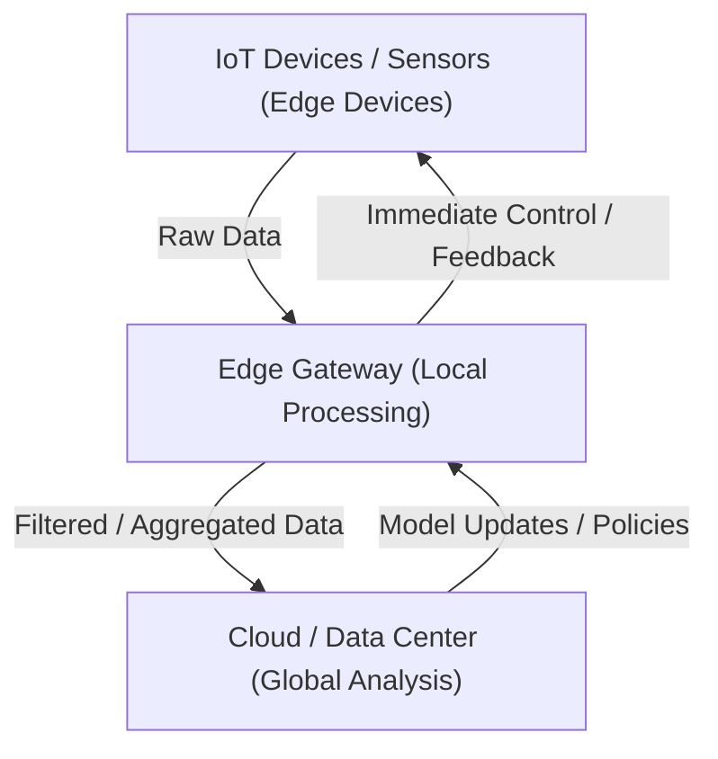

## 1. Introduction: Breaking Away from Cloud Overreliance

For decades, cloud computing has established itself as the standard for IT infrastructure. With infinitely scalable compute resources, managed databases, and advanced machine learning APIs available on demand, the cloud fundamentally transformed the software development paradigm. However, as we enter the era of IoT (Internet of Things), where everything connects to the internet and sensors and devices explode in number, the architecture of "sending all data to the cloud" is reaching its limits.

Billions of devices scattered worldwide generate thousands of sensing data points per second. Autonomous vehicles, smart machines in factories, and medical wearable devices continuously produce massive amounts of data. Sending all this data to central cloud servers, processing it, and sending the results back to devices is becoming unrealistic from physical, economic, and security perspectives. This article delves into the limitations of centralized cloud processing and explains in detail, from an architectural viewpoint, the necessity of edge computing, which processes data closer to its source.

## 2. Three Limitations of Cloud-Centralized Architecture

The approach of sending all data to the cloud inherently suffers from three fatal problems: "bandwidth exhaustion," "increased latency," and "privacy and security challenges."

### 2.1 Bandwidth Exhaustion

Network bandwidth is not infinite. For example, a single autonomous vehicle generates several terabytes (TB) of data a day from sensors like cameras, LIDAR, and radar. If millions of autonomous vehicles driving on roads worldwide tried to send all this raw data to the cloud, cellular networks like 4G and 5G would instantly collapse.

There is a physical limit to the amount of data that can be transmitted over a network, represented by Shannon's noisy-channel coding theorem. While it is possible to reinforce infrastructure to secure bandwidth, it costs a massive amount of money. Also, data transfer fees and storage costs paid to cloud providers cannot be ignored. Sending everything, including "valueless noise data," to the cloud is completely inefficient from an economic standpoint as well.

### 2.2 Latency Problems

The speed of light is about 300,000 km/s, and data transmission speeds cannot exceed this law of physics. When cloud servers are located in data centers hundreds or thousands of kilometers away, data round trips take tens to hundreds of milliseconds in latency.

In many applications, this delay might be acceptable. However, in mission-critical systems like the following, even a slight delay can be fatal:

*   **Autonomous vehicles:** If relying on the cloud to make decisions to detect obstacles and apply brakes, communication delays risk causing accidents.
*   **Industrial robots:** Controlling high-speed robots on factory production lines requires millisecond-level responsiveness.
*   **Medical equipment:** Real-time feedback is essential for devices used in remote surgery and other applications.

Thus, in scenarios where "decisions must be made instantly," an architecture of sending data to the cloud and waiting for a response does not hold up.

### 2.3 Privacy and Security

Sending data across networks inherently increases security risks. Highly sensitive data directly tied to privacy, such as video from home smart cameras or vital data collected by medical wearable devices, should not be exposed externally if possible.

Centralizing all data in the cloud makes cloud servers prime targets for attacks. The impact of a data breach would be immeasurable. Furthermore, data protection regulations in various countries, such as GDPR (General Data Protection Regulation in the EU), strictly limit the cross-border transfer of data, placing great importance on the physical storage location of data (data residency). An approach that processes data locally and only sends anonymized and aggregated results to the cloud has become inevitable.

## 3. The Necessity and Architecture of Edge Computing

To solve these challenges, "Edge Computing" emerged. Edge computing is a distributed computing paradigm where data is processed not on central cloud servers, but on devices or local servers close to where the data is generated (the edge/periphery of the network).

### 3.1 Introduction of Tiered Architecture

In IoT systems, an architecture incorporating edge computing typically has a tiered structure like the following:

1.  **Edge Device Tier (Device Edge):** End devices such as sensors, actuators, and smart cameras. Data collection and very simple filtering occur here.
2.  **Edge Gateway / Node Tier (Network Edge):** Routers, dedicated gateway devices, or base stations (MEC: Multi-access Edge Computing). These possess some computational power and perform real-time data analysis, filtering, and anomaly detection.
3.  **Cloud Tier:** A central system that handles long-term data storage, the training of large-scale machine learning models, and overall operations management.

Processing things that require immediate local decisions at the edge (local scope) and delegating long-term trend analysis and heavy processing to the cloud (global scope) is the key to the architecture: **Separation of Concerns**.

## 4. Constraints and Realities of IoT Devices

Although edge computing is ideal, the end IoT devices generating the data face severe constraints. Architects must design systems with a full understanding of these constraints.

### 4.1 Battery Life Constraints

Many IoT devices are not constantly connected to a power source, but are driven by batteries or energy harvesting. Performing computational processing consumes power, but actually, **wireless communication (data transmission via Wi-Fi or LTE) consumes much more power than computation on a processor**. Therefore, rather than "sending all data," it is often better to "calculate locally, discard unnecessary data, and send only important results" to reduce the overall power consumption of the device and extend battery life.

### 4.2 Computational Power and Memory Constraints

Many IoT devices operate on cheap, low-power microcontrollers (MCUs). Devices with only hundreds of kilobytes of RAM cannot run complex OSs or massive software stacks. Therefore, if advanced processing is desired, designs are required to offload processing to the network edge (such as gateways) which has slightly more resources, rather than the heavily constrained device edge.

## 5. Edge Computing vs. Fog Computing

A concept similar to edge computing is "Fog Computing." Proposed by Cisco Systems, this concept implies a fog drifting closer to the ground (the edge) than the cloud.

While they are very similar concepts, there are differences in architectural focus.

*   **Edge Computing:** Focuses on processing at the physical "location" (the device or its immediate vicinity) where data is generated. Its primary goal is improving processing capability at the endpoint (the device itself).
*   **Fog Computing:** An architectural framework that tiers the network paths from the edge to the cloud (routers, switches, gateways, etc.) and treats the entire infrastructure as a distributed processing platform. It takes a more network-centric perspective.

In reality, these two are not mutually exclusive; they are used in combination to optimize the entire system.

## 6. The Future Brought by Edge AI and TinyML

What accelerates the evolution of edge computing the most is the rise of "Edge AI." Traditionally, inference (prediction) with machine learning models required massive computational resources and was generally performed on the cloud side. However, hardware evolution and model lightweighting technologies have made real-time inference on the edge possible.

Particularly gaining attention is **TinyML (Tiny Machine Learning)**. TinyML is a technology that runs machine learning models on microcontrollers (MCUs) operating on mere milliwatts of power. This has created innovative use cases that were previously unimaginable.

*   **Voice Keyword Detection:** The process where smart speakers recognize wake words like "Hey, Siri" or "OK, Google" is constantly running on the device (edge), not the cloud. This prevents unrelated conversations from being sent to the cloud.
*   **Predictive Maintenance:** Edge devices analyze vibration and acoustic data from motors in real-time to detect signs of failure. There is no need to keep sending days of normal data to the cloud.
*   **Vision AI:** Smart cameras analyze video locally and send snapshots to the cloud only when they detect suspicious persons or specific events.

Model training is done in the cloud, aggregating massive amounts of data, while optimized, quantized lightweight models are deployed to the edge for inference. This hybrid cycle of learning and inference is exactly the completed form of modern IoT architecture.

## 7. Conclusion: Towards an Optimal Balance of Cloud and Edge

The answer to the question "Why shouldn't we send all data to the cloud?" is clear. Physics, economics, and security all make it impossible.

Edge computing does not replace the cloud. Rather, it is an essential partner for maximizing the value of the cloud. The edge filters massive amounts of low-value raw data and makes local decisions requiring real-time responsiveness. Then, the cloud takes on the extraction of long-term insights and the orchestration of the entire system.

This "distribution of responsibility" is the only sustainable architecture that can support the future IoT society where hundreds of billions of devices are connected. Software engineers and architects are strongly required in the coming era to break away from cloud-only thinking and have the perspective to design the optimal flow and processing placement of data throughout the entire system.
