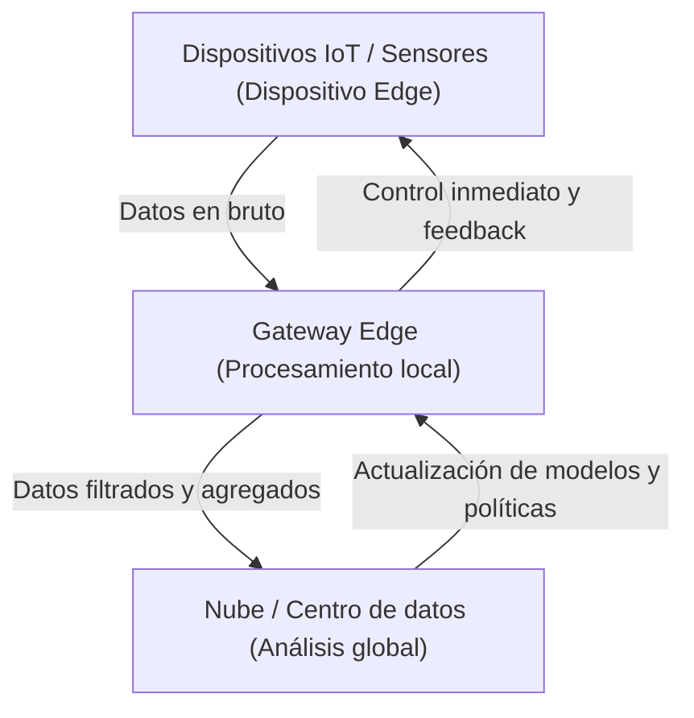

## 1. Introducción: Alejándose de la dependencia de la nube

Durante las últimas décadas, la computación en la nube se ha establecido como el estándar para la infraestructura de TI. La nube, con sus recursos de cómputo infinitamente escalables, bases de datos administradas y API avanzadas de aprendizaje automático disponibles bajo demanda, ha transformado fundamentalmente el paradigma del desarrollo de software. Sin embargo, al entrar en la era del IoT (Internet de las Cosas), donde todo está conectado a Internet y los sensores y dispositivos han aumentado explosivamente, la arquitectura de 'enviar todos los datos a la nube' está llegando a su límite.

Miles de millones de dispositivos repartidos por todo el mundo generan miles de datos de sensores por segundo. Los coches autónomos, las máquinas inteligentes en las fábricas y los dispositivos portátiles médicos generan una gran cantidad de datos sin cesar. Enviar todos estos datos a un servidor central en la nube, procesarlos y devolver los resultados al dispositivo se está volviendo poco realista desde una perspectiva física, económica y de seguridad. Este artículo profundizará en las limitaciones del procesamiento centralizado en la nube y explicará en detalle la necesidad del edge computing (computación en el borde), que procesa los datos cerca de su fuente, desde el punto de vista de la arquitectura.

## 2. Las 3 limitaciones de la arquitectura centralizada en la nube

El enfoque de enviar todos los datos a la nube tiene tres problemas fatales principales: agotamiento del ancho de banda, aumento de la latencia y problemas de privacidad y seguridad.

### 2.1 Agotamiento del ancho de banda (Bandwidth Exhaustion)

El ancho de banda de la red no es infinito. Por ejemplo, un solo coche autónomo genera varios terabytes (TB) de datos al día a partir de sensores como cámaras, LIDAR y radares. Si millones de coches autónomos que circulan por las carreteras de todo el mundo intentaran enviar todos estos datos sin procesar a la nube, las redes celulares como 4G o 5G colapsarían al instante.

Existe un límite físico para la cantidad de datos que se pueden transmitir por una red, representado por el teorema de codificación de canales de Shannon. Aunque es posible mejorar la infraestructura para asegurar el ancho de banda, esto conlleva enormes costes. Además, no se pueden ignorar las tarifas de transferencia de datos y los costes de almacenamiento que se pagan a los proveedores de la nube. Enviar todo a la nube, incluidos los 'datos de ruido sin valor', es completamente ineficiente también desde el punto de vista económico.

### 2.2 El problema de la latencia (Retardo)

La velocidad de la luz es de unos 300.000 km/s, y la velocidad de transmisión de datos no puede superar esta ley física. Si el servidor de la nube está en un centro de datos a cientos o miles de kilómetros de distancia, el viaje de ida y vuelta (round-trip) de los datos experimentará una latencia de decenas a cientos de milisegundos.

En muchas aplicaciones, este retardo puede ser aceptable. Sin embargo, en los siguientes sistemas de misión crítica, un ligero retardo puede ser fatal.

*   **Coches autónomos:** Si se depende de la nube para tomar la decisión de frenar tras detectar un obstáculo, el retardo de comunicación corre el riesgo de causar un accidente.
*   **Robots industriales:** El control de robots que operan a alta velocidad en líneas de producción de fábricas requiere una capacidad de respuesta en el rango de milisegundos.
*   **Equipos médicos:** El feedback en tiempo real es esencial para los equipos utilizados en cirugía a distancia y similares.

De esta manera, en escenarios donde 'se deben tomar decisiones de inmediato', la arquitectura de enviar datos a la nube y esperar una respuesta no es viable.

### 2.3 Privacidad y seguridad

El mero hecho de transmitir datos a través de una red aumenta el riesgo de seguridad. En particular, los datos confidenciales directamente relacionados con la privacidad, como las imágenes de las cámaras inteligentes domésticas y los datos vitales recopilados por dispositivos portátiles médicos, deben mantenerse fuera del alcance externo en la medida de lo posible.

Al concentrar todos los datos en la nube, los servidores de la nube se convierten en un objetivo de ataque atractivo. El impacto de una violación de datos es incalculable. Además, las regulaciones de protección de datos en varios países, como el RGPD (Reglamento General de Protección de Datos de la UE), restringen estrictamente la transferencia transfronteriza de datos, dando importancia a la ubicación del almacenamiento físico de datos (residencia de datos). El enfoque de procesar los datos localmente y enviar solo resultados agregados y anonimizados a la nube se ha vuelto inevitable.

## 3. La necesidad del Edge Computing y su Arquitectura

El 'Edge Computing' surgió para resolver estos problemas. El edge computing es un paradigma de computación distribuida que procesa los datos no en un servidor central en la nube, sino en dispositivos o servidores locales cercanos a donde se generan los datos (el borde de la red).

### 3.1 Introducción a la arquitectura en niveles

En los sistemas IoT, la arquitectura que incorpora el edge computing suele tener la siguiente estructura jerárquica.

1.  **Capa de dispositivos edge (Device Edge):** Dispositivos finales como sensores, actuadores y cámaras inteligentes. Aquí se lleva a cabo la recolección de datos y un filtrado muy simple.
2.  **Capa de nodos/gateway edge (Network Edge):** Enrutadores, dispositivos de puerta de enlace dedicados, o estaciones base (MEC: Multi-access Edge Computing), etc. Esta capa tiene cierto poder de cómputo y realiza análisis de datos en tiempo real, filtrado, detección de anomalías, etc.
3.  **Capa de la nube:** Un sistema central que realiza almacenamiento de datos a largo plazo, entrenamiento de modelos de aprendizaje automático a gran escala y gestión general de operaciones.

La **separación de responsabilidades (Separation of Concerns)** es la clave de la arquitectura, donde las decisiones inmediatas (alcance local) se procesan en el borde, mientras que los análisis de tendencias a largo plazo y el procesamiento a gran escala (alcance global) se envían a la nube.

## 4. Restricciones y realidades de los dispositivos IoT

Aunque el edge computing es ideal, los dispositivos finales del IoT que generan los datos tienen limitaciones severas. Los arquitectos deben comprender completamente estas limitaciones al diseñar los sistemas.

### 4.1 Limitaciones de la duración de la batería

Muchos dispositivos IoT no están conectados constantemente a una fuente de alimentación, sino que funcionan con baterías o recolección de energía (energy harvesting). El procesamiento informático consume energía, pero en realidad, **la comunicación inalámbrica (transmisión de datos a través de Wi-Fi o LTE) consume mucha más energía que el cálculo en el procesador**. Por lo tanto, en lugar de 'enviar todos los datos', calcular localmente, descartar los datos innecesarios y enviar solo los resultados importantes a menudo reduce el consumo de energía general del dispositivo y prolonga la vida útil de la batería.

### 4.2 Limitaciones de capacidad de cómputo y memoria

Muchos dispositivos IoT funcionan con microcontroladores (MCU) económicos y de bajo consumo. En dispositivos con solo unos cientos de kilobytes de RAM, no se pueden ejecutar sistemas operativos complejos ni grandes pilas de software. Por lo tanto, si se desea un procesamiento avanzado, se requiere un diseño que descargue el procesamiento a un borde de red (como un gateway) con un poco más de recursos, en lugar de al borde del dispositivo severamente restringido.

## 5. Edge Computing frente a Fog Computing

Un concepto similar al edge computing es el 'Fog Computing' (Computación en la niebla). Acuñado por Cisco Systems, este concepto implica una niebla que se desplaza más cerca del suelo (el borde) que la nube.

Ambos conceptos son muy cercanos, pero tienen enfoques arquitectónicos diferentes.

*   **Edge Computing:** Se centra en el procesamiento en el 'lugar' físico donde se generan los datos (el dispositivo o sus inmediaciones). El objetivo principal es mejorar la capacidad de procesamiento en el punto final (el propio dispositivo).
*   **Fog Computing:** Es un marco de arquitectura que jerarquiza las rutas de red desde el borde hasta la nube (enrutadores, conmutadores, gateways, etc.) y trata toda la infraestructura como una plataforma de procesamiento distribuido. Tiene una perspectiva más centrada en la red.

En la práctica, estos dos conceptos no son mutuamente excluyentes, sino que se integran y utilizan juntos para optimizar todo el sistema.

## 6. El futuro impulsado por Edge AI y TinyML

La evolución del edge computing se está acelerando en gran medida por el auge de 'Edge AI'. Tradicionalmente, la inferencia (predicción) en los modelos de aprendizaje automático requería grandes recursos computacionales y generalmente se realizaba en la nube. Sin embargo, la evolución del hardware y las técnicas de compresión de modelos han hecho posible la inferencia en tiempo real en el borde.

De particular interés es **TinyML (Tiny Machine Learning)**. TinyML es una tecnología que ejecuta modelos de aprendizaje automático en microcontroladores (MCU) que operan con unos pocos milivatios de potencia. Esto está creando casos de uso innovadores antes inimaginables.

*   **Detección de palabras clave de voz:** El procesamiento mediante el cual los altavoces inteligentes reconocen palabras de activación como 'Hey, Siri' u 'OK, Google' siempre se ejecuta en el dispositivo (borde), no en la nube. Esto evita que se envíen conversaciones irrelevantes a la nube.
*   **Mantenimiento predictivo (Predictive Maintenance):** Los dispositivos edge analizan en tiempo real los datos acústicos y de vibración de los motores para detectar signos de fallos. No hay necesidad de seguir enviando días de datos normales a la nube.
*   **Visión AI:** Las cámaras inteligentes analizan el video localmente y envían una captura de pantalla a la nube solo cuando detectan personas sospechosas o eventos específicos.

El entrenamiento (Training) del modelo se realiza en la nube, donde se agregan cantidades masivas de datos, y los modelos livianos optimizados y cuantificados se implementan en el borde para la inferencia (Inference). Este ciclo híbrido de aprendizaje e inferencia es verdaderamente la forma completa de la arquitectura moderna de IoT.

## 7. Conclusión: Hacia el equilibrio óptimo entre la nube y el borde

La respuesta a la pregunta '¿Por qué no se deben enviar todos los datos a la nube?' es clara. La física, la economía y la seguridad hacen que sea imposible.

El edge computing no reemplaza a la nube. Por el contrario, es un socio indispensable para maximizar el valor de la nube. El borde filtra grandes cantidades de datos sin procesar de bajo valor y toma decisiones que requieren inmediatez a nivel local. Mientras tanto, la nube se encarga de extraer información a largo plazo y orquestar todo el sistema.

Esta 'distribución de responsabilidades' es la única arquitectura sostenible que apoyará a la futura sociedad de IoT, conectando cientos de miles de millones de dispositivos. A medida que avanzamos, los ingenieros y arquitectos de software deben alejarse de la mentalidad centrada exclusivamente en la nube y adoptar una perspectiva de diseño para el flujo de datos y la ubicación óptima del procesamiento en todo el sistema.
