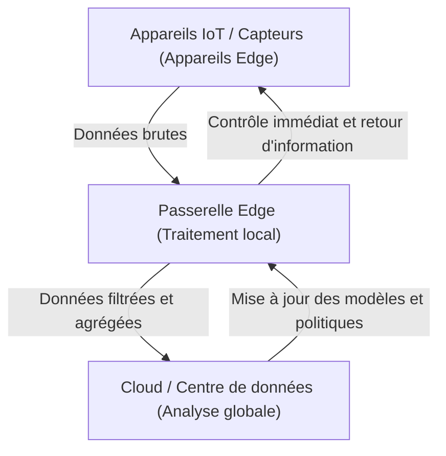

## 1. Introduction : S'éloigner de l'obsession du cloud

Au cours des dernières décennies, le cloud computing s'est imposé comme la norme en matière d'infrastructure informatique. Avec des ressources de calcul infiniment évolutives, des bases de données gérées et des API d'apprentissage automatique avancées disponibles à la demande, le cloud a fondamentalement transformé le paradigme du développement logiciel. Cependant, alors que nous entrons dans l'ère de l'IoT (Internet des objets) où tout est connecté à Internet et où le nombre de capteurs et d'appareils a explosé, l'architecture consistant à « envoyer toutes les données vers le cloud » atteint ses limites.

Des milliards d'appareils dispersés à travers le monde génèrent des données de détection des milliers de fois par seconde. Les voitures autonomes, les machines intelligentes dans les usines et les appareils portables médicaux produisent d'énormes quantités de données en permanence. Envoyer toutes ces données aux serveurs centraux du cloud pour les traiter, puis renvoyer les résultats aux appareils, devient irréaliste d'un point de vue physique, économique et sécuritaire. Cet article explore en profondeur les limites du traitement centralisé dans le cloud et explique de manière détaillée, du point de vue de l'architecture, la nécessité de l'edge computing, qui effectue le traitement à proximité de la source des données.

## 2. Les 3 limites de l'architecture centralisée dans le cloud

L'approche consistant à envoyer toutes les données vers le cloud présente trois problèmes fatals majeurs : « l'épuisement de la bande passante », « l'augmentation de la latence » et « les problèmes de confidentialité et de sécurité ».

### 2.1 L'épuisement de la bande passante (Bandwidth Exhaustion)

La bande passante du réseau n'est pas infinie. Par exemple, une seule voiture autonome génère plusieurs téraoctets (To) de données par jour à partir de capteurs tels que des caméras, des LIDAR et des radars. Si des millions de voitures autonomes circulant sur les routes du monde entier tentaient d'envoyer toutes ces données brutes vers le cloud, les réseaux cellulaires comme la 4G et la 5G s'effondreraient instantanément.

La quantité de données pouvant être transmise sur un réseau a des limites physiques, comme le décrit le théorème de Shannon-Hartley. Bien qu'il soit possible d'améliorer l'infrastructure pour garantir la bande passante, cela entraîne des coûts énormes. De plus, les frais de transfert de données et de stockage payés aux fournisseurs de cloud ne peuvent être ignorés. L'envoi de tout, y compris des « données parasites sans valeur », vers le cloud est totalement inefficace d'un point de vue économique.

### 2.2 Le problème de la latence (Retard)

La vitesse de la lumière est d'environ 300 000 km/s, et la vitesse de transmission des données ne peut pas dépasser cette loi de la physique. Si un serveur cloud est situé dans un centre de données à des centaines, voire des milliers de kilomètres, le temps d'aller-retour des données engendre une latence allant de plusieurs dizaines à plusieurs centaines de millisecondes.

Pour de nombreuses applications, ce retard peut être acceptable. Cependant, dans les systèmes critiques suivants, un léger retard peut s'avérer fatal :

*   **Voitures autonomes :** Si la décision de détecter un obstacle et de freiner dépend du cloud, les retards de communication risquent de provoquer un accident.
*   **Robots industriels :** Le contrôle de robots fonctionnant à grande vitesse sur les chaînes de production des usines exige une réactivité de l'ordre de la milliseconde.
*   **Dispositifs médicaux :** Les équipements utilisés dans les chirurgies à distance, par exemple, nécessitent un retour d'information en temps réel.

Ainsi, dans les scénarios où « des décisions doivent être prises instantanément », l'architecture consistant à envoyer des données au cloud et à attendre une réponse n'est pas viable.

### 2.3 Confidentialité et sécurité

La transmission de données sur un réseau augmente intrinsèquement les risques de sécurité. En particulier, les données sensibles directement liées à la vie privée, telles que les images de caméras intelligentes domestiques et les données vitales collectées par des appareils portables médicaux, ne devraient pas être envoyées à l'extérieur dans la mesure du possible.

Si toutes les données sont centralisées dans le cloud, les serveurs cloud deviennent une cible de choix pour les attaques. L'impact d'une violation de données serait incalculable. De plus, les réglementations nationales sur la protection des données telles que le RGPD (Règlement général sur la protection des données de l'UE) restreignent strictement le transfert transfrontalier de données, et l'emplacement physique de stockage des données (résidence des données) est considéré comme important. Une approche consistant à traiter les données localement et à n'envoyer que des résultats anonymisés et agrégés vers le cloud devient inévitable.

## 3. La nécessité de l'Edge Computing et son architecture

Pour résoudre ces problèmes, l'« Edge Computing » (informatique en périphérie) a fait son apparition. L'edge computing est un paradigme informatique distribué dans lequel les données sont traitées non pas sur des serveurs centraux dans le cloud, mais sur des appareils ou des serveurs locaux proches du lieu où les données sont générées (le bord/périphérie du réseau).

### 3.1 Introduction d'une architecture hiérarchique

Dans les systèmes IoT, une architecture qui intègre l'edge computing a généralement une structure hiérarchique comme suit :

1.  **Couche d'appareils Edge (Device Edge) :** Appareils finaux tels que des capteurs, actionneurs et caméras intelligentes. Ici, la collecte des données et un filtrage très simple sont effectués.
2.  **Couche de nœuds/passerelles Edge (Network Edge) :** Routeurs, appareils de passerelle dédiés ou stations de base (MEC : Multi-access Edge Computing). Disposant d'une certaine puissance de calcul, ils effectuent une analyse des données en temps réel, un filtrage, une détection d'anomalies, etc.
3.  **Couche Cloud :** Le système central qui gère le stockage des données à long terme, l'entraînement de modèles d'apprentissage automatique à grande échelle et la gestion globale des opérations.

La **séparation des responsabilités (Separation of Concerns)** est la clé de l'architecture : ce qui doit être jugé immédiatement à la périphérie (portée locale) est traité à la périphérie, et ce qui nécessite une analyse de tendance à long terme ou un traitement à grande échelle (portée globale) est envoyé vers le cloud.

## 4. Les contraintes et réalités des appareils IoT

Bien que l'edge computing soit idéal, les terminaux IoT qui génèrent les données sont soumis à de sévères contraintes. Les architectes doivent concevoir des systèmes en comprenant parfaitement ces limites.

### 4.1 Contraintes de durée de vie de la batterie

De nombreux appareils IoT ne sont pas constamment connectés à une source d'alimentation, mais fonctionnent sur batterie ou par récupération d'énergie (energy harvesting). Le traitement informatique consomme de l'énergie, mais en réalité, **les communications sans fil (transmission de données via Wi-Fi ou LTE) consomment beaucoup plus d'énergie que les calculs par le processeur**. Par conséquent, plutôt que d'« envoyer toutes les données », « calculer localement pour éliminer les données inutiles et n'envoyer que les résultats importants » réduit souvent la consommation globale d'énergie de l'appareil et prolonge la durée de vie de sa batterie.

### 4.2 Contraintes de puissance de calcul et de mémoire

La plupart des appareils IoT fonctionnent avec des microcontrôleurs (MCU) bon marché et à faible consommation d'énergie. Les appareils dotés de quelques centaines de kilo-octets de RAM ne peuvent pas faire fonctionner de systèmes d'exploitation complexes ni d'énormes piles logicielles. Par conséquent, si un traitement avancé est requis, il est nécessaire de concevoir un système qui décharge le traitement non pas sur le device edge aux contraintes strictes, mais sur le network edge (comme une passerelle) qui dispose d'un peu plus de ressources.

## 5. Edge Computing vs. Fog Computing

Un concept similaire à l'edge computing est le « Fog Computing » (informatique en brouillard). Ce concept, proposé par Cisco Systems, implique l'idée de brouillard qui flotte plus près du sol (le bord) que des nuages (le cloud).

Les deux concepts sont très similaires, mais diffèrent par leur orientation architecturale.

*   **Edge Computing :** Se concentre sur le traitement au « lieu » physique où les données sont générées (les appareils ou leur voisinage immédiat). L'objectif principal est d'améliorer la capacité de traitement aux terminaux (les appareils eux-mêmes).
*   **Fog Computing :** Il s'agit d'un cadre architectural qui hiérarchise le chemin réseau de la périphérie vers le cloud (routeurs, commutateurs, passerelles, etc.) et traite l'ensemble de l'infrastructure comme une plateforme de traitement distribuée. Il adopte un point de vue plus centré sur le réseau.

En réalité, ces deux concepts ne s'excluent pas mutuellement, mais sont fusionnés et utilisés pour optimiser l'ensemble du système.

## 6. L'avenir apporté par l'Edge AI et TinyML

Ce qui accélère le plus l'évolution de l'edge computing, c'est l'essor de l'« Edge AI ». Traditionnellement, l'inférence (prédiction) des modèles d'apprentissage automatique nécessitait d'importantes ressources de calcul et était généralement effectuée du côté du cloud. Cependant, grâce aux avancées matérielles et aux technologies d'allègement des modèles, l'inférence en temps réel côté périphérique est devenue possible.

Ce qui attire particulièrement l'attention, c'est **TinyML (Tiny Machine Learning)**. TinyML est une technologie qui permet d'exécuter des modèles d'apprentissage automatique sur des microcontrôleurs (MCU) fonctionnant avec quelques milliwatts de puissance. Cela a donné naissance à des cas d'utilisation innovants qui étaient auparavant inconcevables.

*   **Détection de mots-clés vocaux :** Le processus par lequel un haut-parleur intelligent reconnaît les mots de réveil tels que « Dis Siri » ou « OK Google » s'exécute en permanence sur l'appareil (à la périphérie), et non dans le cloud. Cela empêche l'envoi de conversations non pertinentes vers le cloud.
*   **Maintenance prédictive :** L'appareil périphérique analyse en temps réel les vibrations et les données acoustiques d'un moteur pour détecter les signes de panne. Il n'est pas nécessaire d'envoyer en continu plusieurs jours de données normales vers le cloud.
*   **IA de vision :** Une caméra intelligente analyse les images localement et n'envoie un instantané vers le cloud que lorsqu'elle détecte une personne suspecte ou un événement spécifique.

L'entraînement (Training) des modèles s'effectue dans le cloud, où de grandes quantités de données sont agrégées, et des modèles légers, optimisés et quantifiés sont déployés vers la périphérie pour l'inférence (Inference). Ce cycle hybride d'apprentissage et d'inférence est l'état achevé de l'architecture IoT moderne.

## 7. Conclusion : Vers un équilibre optimal entre le Cloud et l'Edge

La réponse à la question « Pourquoi ne pas envoyer toutes les données vers le cloud ? » est claire. Parce que les lois de la physique, l'économie et la sécurité rendent cela impossible.

L'edge computing n'est pas destiné à remplacer le cloud. Il s'agit plutôt d'un partenaire indispensable pour maximiser la valeur du cloud. D'énormes quantités de données brutes de faible valeur sont filtrées à la périphérie, et les décisions nécessitant une réactivité en temps réel sont prises localement. Le cloud est chargé de l'extraction d'informations à long terme et de l'orchestration de l'ensemble du système.

Cette « distribution des responsabilités » est la seule architecture durable qui soutiendra la société IoT de demain, où des centaines de milliards d'appareils seront connectés. Il est fortement demandé aux ingénieurs logiciels et aux architectes de s'éloigner d'une réflexion centrée uniquement sur le cloud et d'adopter une perspective consistant à concevoir un flux de données et une répartition optimale des traitements dans l'ensemble du système.
