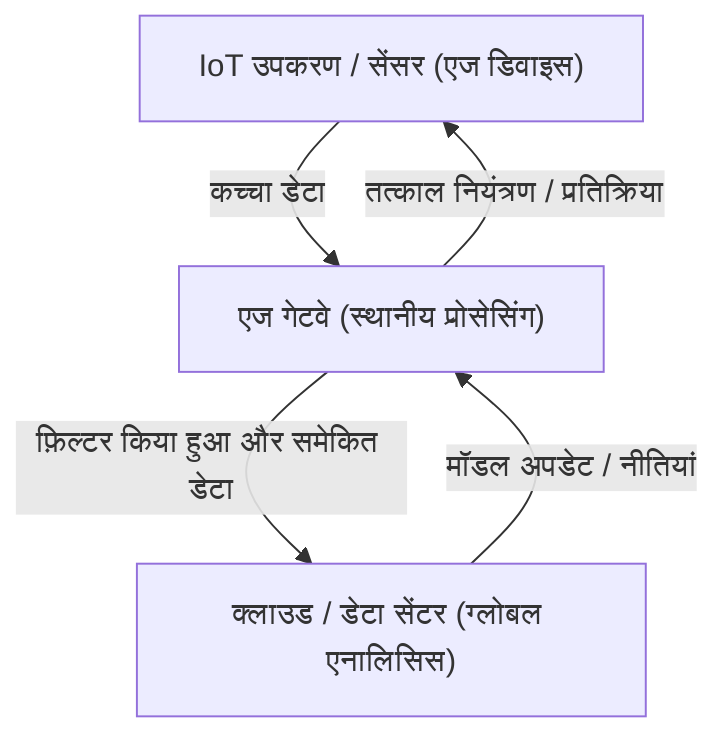

## 1. परिचय: क्लाउड-सेंट्रिक दृष्टिकोण से परे

पिछले कुछ दशकों में, क्लाउड कंप्यूटिंग ने IT इंफ्रास्ट्रक्चर के मानक के रूप में अपनी जगह पक्की कर ली है। असीमित स्केलेबल कंप्यूट संसाधन, मैनेज्ड डेटाबेस और एडवांस मशीन लर्निंग API की ऑन-डिमांड उपलब्धता के साथ, क्लाउड ने सॉफ्टवेयर डेवलपमेंट प्रतिमान (पैराडाइम) को मौलिक रूप से बदल दिया है। हालाँकि, अब हम IoT (इंटरनेट ऑफ थिंग्स) के युग में प्रवेश कर चुके हैं, जहाँ हर चीज़ इंटरनेट से जुड़ी है। ऐसे में, जब सेंसर और उपकरणों की संख्या में भारी वृद्धि हुई है, तो 'सारा डेटा क्लाउड पर भेजने' का आर्किटेक्चर अब अपनी सीमा तक पहुँच रहा है।

दुनिया भर में फैले हुए अरबों उपकरण प्रति सेकंड हजारों सेंसिंग डेटा उत्पन्न कर रहे हैं। ऑटोनॉमस (स्वचालित) वाहन, कारखानों में स्मार्ट मशीनें और मेडिकल वियरेबल्स लगातार भारी मात्रा में डेटा पैदा कर रहे हैं। इस सारे डेटा को क्लाउड के केंद्रीय सर्वर पर भेजना, उसे प्रोसेस करना और परिणामों को वापस उपकरणों पर भेजना अब भौतिक, आर्थिक और सुरक्षा के दृष्टिकोण से अव्यावहारिक होता जा रहा है। इस लेख में, हम केंद्रीकृत क्लाउड प्रोसेसिंग की सीमाओं की गहराई से जांच करेंगे और आर्किटेक्चर के दृष्टिकोण से एज कंप्यूटिंग—जो डेटा स्रोत के करीब प्रोसेसिंग करता है—की आवश्यकता के बारे में विस्तार से बताएंगे।

## 2. केंद्रीकृत क्लाउड आर्किटेक्चर की 3 सीमाएँ

सारा डेटा क्लाउड पर भेजने के दृष्टिकोण में मुख्य रूप से तीन गंभीर समस्याएं हैं: 'बैंडविड्थ की कमी', 'लेटेंसी (देरी) में वृद्धि', और 'गोपनीयता और सुरक्षा चुनौतियां'।

### 2.1 बैंडविड्थ की कमी (Bandwidth Exhaustion)

नेटवर्क बैंडविड्थ असीमित नहीं है। उदाहरण के लिए, एक स्वचालित वाहन कैमरा, LiDAR, और रडार जैसे सेंसर से प्रति दिन कई टेराबाइट (TB) डेटा उत्पन्न करता है। अगर दुनिया भर की सड़कों पर चलने वाले लाखों स्वचालित वाहन अपना सारा कच्चा डेटा क्लाउड पर भेजने लगें, तो 4G या 5G जैसे सेलुलर नेटवर्क पल भर में क्रैश हो जाएंगे।

नेटवर्क पर भेजे जा सकने वाले डेटा की मात्रा की भौतिक सीमाएँ हैं, जैसा कि शैनन के चैनल कोडिंग थ्योरम में बताया गया है। बैंडविड्थ सुरक्षित करने के लिए इंफ्रास्ट्रक्चर को बढ़ाना संभव है, लेकिन इसकी लागत बहुत अधिक होगी। साथ ही, क्लाउड प्रदाताओं को चुकाई जाने वाली डेटा ट्रांसफर फीस और स्टोरेज की लागत को नज़रअंदाज़ नहीं किया जा सकता है। 'बिना मूल्य वाले शोर वाले डेटा' (नॉयज़ डेटा) सहित सब कुछ क्लाउड पर भेजना आर्थिक दृष्टिकोण से पूरी तरह से अप्रभावी है।

### 2.2 लेटेंसी (देरी) की समस्या

प्रकाश की गति लगभग 300,000 किमी/सेकंड है, और डेटा ट्रांसमिशन की गति इस भौतिक नियम को पार नहीं कर सकती। यदि क्लाउड सर्वर सैकड़ों या हजारों किलोमीटर दूर किसी डेटा सेंटर में स्थित है, तो डेटा की राउंड-ट्रिप में दसियों से लेकर सैकड़ों मिलीसेकंड तक की लेटेंसी (देरी) हो सकती है।

कई एप्लिकेशनों में, यह देरी स्वीकार्य हो सकती है। हालाँकि, निम्नलिखित जैसे मिशन-क्रिटिकल सिस्टम में, थोड़ी सी देरी भी घातक हो सकती है:

*   **स्वचालित वाहन:** यदि बाधाओं का पता लगाने और ब्रेक लगाने का निर्णय क्लाउड पर निर्भर करता है, तो संचार में देरी के कारण दुर्घटनाओं का खतरा होता है।
*   **औद्योगिक रोबोट:** कारखाने की उत्पादन लाइनों पर तेज गति से काम करने वाले रोबोट को नियंत्रित करने के लिए मिलीसेकंड स्तर की प्रतिक्रिया आवश्यक है।
*   **चिकित्सा उपकरण:** रिमोट सर्जरी आदि में इस्तेमाल होने वाले उपकरणों के लिए रीयल-टाइम फीडबैक अति आवश्यक है।

इस प्रकार, उन परिदृश्यों में जहाँ 'तत्काल निर्णय लेने की आवश्यकता होती है', डेटा को क्लाउड पर भेजने और प्रतिक्रिया की प्रतीक्षा करने का आर्किटेक्चर काम नहीं कर सकता।

### 2.3 गोपनीयता और सुरक्षा

नेटवर्क पर डेटा ट्रांसमिट करना अपने आप में सुरक्षा जोखिम बढ़ाता है। विशेष रूप से, घर के अंदर स्मार्ट कैमरों से वीडियो या मेडिकल वियरेबल्स द्वारा एकत्र किए गए महत्वपूर्ण स्वास्थ्य डेटा जैसे संवेदनशील डेटा, जो सीधे गोपनीयता से जुड़े होते हैं, उन्हें जितना हो सके बाहर नहीं भेजा जाना चाहिए।

जब सभी डेटा क्लाउड में केंद्रीकृत हो जाता है, तो क्लाउड सर्वर हमलों के लिए एक मुख्य लक्ष्य बन जाता है। यदि डेटा उल्लंघन होता है, तो उसका प्रभाव अकल्पनीय हो सकता है। इसके अलावा, GDPR (EU जनरल डेटा प्रोटेक्शन रेगुलेशन) जैसे विभिन्न देशों के डेटा सुरक्षा कानून, सीमाओं के पार डेटा ट्रांसफर को सख्ती से सीमित करते हैं, और डेटा का भौतिक संग्रहण स्थान (डेटा रेजिडेंसी) महत्वपूर्ण माना जाता है। इसलिए, स्थानीय स्तर पर डेटा को प्रोसेस करना और क्लाउड पर केवल गुमनाम (अनाम) और समेकित परिणाम भेजने का दृष्टिकोण अपरिहार्य हो गया है।

## 3. एज कंप्यूटिंग की आवश्यकता और आर्किटेक्चर

इन चुनौतियों का समाधान करने के लिए 'एज कंप्यूटिंग' (Edge Computing) का उदय हुआ है। एज कंप्यूटिंग एक वितरित कंप्यूटिंग प्रतिमान (डिस्ट्रीब्यूटेड कंप्यूटिंग पैराडाइम) जहाँ डेटा को क्लाउड के केंद्रीय सर्वर के बजाय, डेटा उत्पन्न होने वाले स्थान (नेटवर्क के एज = परिधि) के करीब उपकरणों या स्थानीय सर्वरों पर संसाधित किया जाता है।

### 3.1 श्रेणीबद्ध (हाइरार्किकल) आर्किटेक्चर का परिचय

IoT सिस्टम में, एज कंप्यूटिंग को अपनाने वाले आर्किटेक्चर में आम तौर पर निम्नलिखित जैसी श्रेणीबद्ध (हाइरार्किकल) संरचना होती है:

1.  **एज डिवाइस लेयर (डिवाइस एज):** सेंसर, एक्ट्यूएटर और स्मार्ट कैमरे जैसे अंतिम (एंडपॉइंट) उपकरण। यहाँ डेटा संग्रह और बहुत ही बुनियादी फ़िल्टरिंग की जाती है।
2.  **एज गेटवे/नोड लेयर (नेटवर्क एज):** राउटर, समर्पित गेटवे उपकरण, या बेस स्टेशन (MEC: मल्टी-एक्सेस एज कंप्यूटिंग)। इनके पास कुछ कंप्यूटिंग शक्ति होती है और ये रीयल-टाइम डेटा विश्लेषण, फ़िल्टरिंग, और विसंगति का पता लगाने (अनोमली डिटेक्शन) का काम करते हैं।
3.  **क्लाउड लेयर:** एक केंद्रीय प्रणाली जो दीर्घकालिक डेटा स्टोरेज, बड़े पैमाने पर मशीन लर्निंग मॉडल प्रशिक्षण, और समग्र परिचालन प्रबंधन को संभालती है।

जो तत्काल निर्णय एज पर लिए जाने चाहिए (लोकल स्कोप) उन्हें एज पर संसाधित किया जाता है, और जो दीर्घकालिक प्रवृत्ति विश्लेषण या बड़े पैमाने पर प्रोसेसिंग (ग्लोबल स्कोप) की आवश्यकता होती है, उन्हें क्लाउड पर भेजा जाता है। यह **जिम्मेदारियों का पृथक्करण (Separation of Concerns)** आर्किटेक्चर की कुंजी है।

## 4. IoT उपकरणों की सीमाएँ और वास्तविकता

हालाँकि एज कंप्यूटिंग आदर्श है, लेकिन डेटा उत्पन्न करने वाले अंतिम IoT उपकरणों में गंभीर सीमाएँ (कन्स्ट्रेंट्स) होती हैं। आर्किटेक्ट्स को सिस्टम डिज़ाइन करते समय इन सीमाओं को अच्छी तरह से समझना चाहिए।

### 4.1 बैटरी लाइफ की सीमाएँ

कई IoT उपकरण लगातार पावर स्रोत से नहीं जुड़े होते हैं; वे बैटरी या एनर्जी हार्वेस्टिंग पर चलते हैं। जबकि गणना (कंप्यूटेशन) करने में बिजली की खपत होती है, वास्तव में **वायरलेस संचार (Wi-Fi या LTE के माध्यम से डेटा ट्रांसमिट करना) प्रोसेसर गणना की तुलना में कहीं अधिक बिजली की खपत करता है**। इसलिए, 'सभी डेटा ट्रांसमिट करने' के बजाय 'स्थानीय रूप से गणना करना, अनावश्यक डेटा को छोड़ना और केवल महत्वपूर्ण परिणाम भेजना' अक्सर डिवाइस की कुल बिजली खपत को कम करता है और बैटरी लाइफ बढ़ाता है।

### 4.2 कंप्यूटिंग शक्ति और मेमोरी की सीमाएँ

अधिकांश IoT उपकरण सस्ते, कम-पावर वाले माइक्रोकंट्रोलर (MCU) पर चलते हैं। केवल कुछ सौ किलोबाइट RAM वाले उपकरणों पर जटिल OS या बड़े सॉफ्टवेयर स्टैक को नहीं चलाया जा सकता है। इसलिए, यदि उन्नत प्रोसेसिंग की आवश्यकता है, तो डिज़ाइन को अधिक सीमित डिवाइस एज के बजाय थोड़ा अधिक संसाधन वाले नेटवर्क एज (जैसे गेटवे) पर प्रोसेसिंग को ऑफलोड करना चाहिए।

## 5. एज कंप्यूटिंग बनाम फॉग कंप्यूटिंग

एज कंप्यूटिंग के समान एक अवधारणा 'फॉग कंप्यूटिंग' (Fog Computing) है। सिस्को सिस्टम्स (Cisco Systems) द्वारा प्रस्तावित इस अवधारणा का अर्थ है कोहरा (फॉग) जो बादलों (क्लाउड) की तुलना में जमीन (एज) के ज्यादा करीब होता है।

दोनों अवधारणाएं बहुत समान हैं, लेकिन उनके आर्किटेक्चरल फोकस में अंतर है:

*   **एज कंप्यूटिंग:** यह उस भौतिक 'स्थान (डिवाइस या उसके तत्काल आसपास)' पर प्रोसेसिंग पर ध्यान केंद्रित करता है जहाँ डेटा उत्पन्न होता है। इसका मुख्य लक्ष्य एंडपॉइंट्स (स्वयं डिवाइस) पर प्रोसेसिंग क्षमता में सुधार करना है।
*   **फॉग कंप्यूटिंग:** यह एक आर्किटेक्चरल फ्रेमवर्क है जो एज से क्लाउड तक (राउटर, स्विच, गेटवे, आदि) नेटवर्क पथ को पदानुक्रमित (हाइरार्किकल) बनाता है, और संपूर्ण इंफ्रास्ट्रक्चर को एक वितरित प्रोसेसिंग प्लेटफॉर्म के रूप में मानता है। यह अधिक नेटवर्क-केंद्रित दृष्टिकोण रखता है।

व्यवहार में, ये दोनों परस्पर अनन्य (म्युचुअली एक्सक्लूसिव) नहीं हैं, और पूरे सिस्टम को अनुकूलित करने के लिए अक्सर इन्हें मिलाकर उपयोग किया जाता है।

## 6. एज AI और TinyML का भविष्य

एज कंप्यूटिंग के विकास को सबसे ज्यादा गति देने वाली चीज 'एज AI (Edge AI)' का उदय है। परंपरागत रूप से, मशीन लर्निंग मॉडल अनुमान (अनुमान लगाना या प्रेडिक्शन) के लिए काफी कंप्यूटिंग संसाधनों की आवश्यकता होती थी, और यह आमतौर पर क्लाउड पर किया जाता था। हालाँकि, हार्डवेयर में प्रगति और मॉडल कम्प्रेशन (हल्का करने की) तकनीकों ने एज पर रीयल-टाइम अनुमान को संभव बना दिया है।

विशेष रूप से ध्यान आकर्षित करने वाली तकनीक **TinyML (टिनी मशीन लर्निंग)** है। TinyML कुछ ही मिलीवाट पावर पर चलने वाले माइक्रोकंट्रोलर (MCU) पर मशीन लर्निंग मॉडल चलाने की तकनीक है। इससे अभूतपूर्व और अभिनव उपयोग के मामले (यूज़ केस) सामने आए हैं।

*   **वॉयस कीवर्ड डिटेक्शन:** स्मार्ट स्पीकर द्वारा 'हे सिरी' या 'ओके गूगल' जैसे वेक वर्ड को पहचानने की प्रक्रिया हमेशा क्लाउड के बजाय डिवाइस (एज) पर चलती रहती है। यह असंबंधित वार्तालापों को क्लाउड पर भेजे जाने से रोकता है।
*   **प्रिडिक्टिव मेंटेनेंस:** एज डिवाइस रीयल-टाइम में मोटर कंपन और ध्वनिक (एकॉस्टिक) डेटा का विश्लेषण करते हैं ताकि खराबी के संकेतों का पता लगाया जा सके। सामान्य डेटा को कई दिनों तक लगातार क्लाउड पर भेजने की आवश्यकता नहीं होती है।
*   **विज़न AI:** स्मार्ट कैमरे स्थानीय रूप से वीडियो का विश्लेषण करते हैं और संदिग्ध व्यक्तियों या विशिष्ट घटनाओं का पता चलने पर ही स्नैपशॉट क्लाउड पर भेजते हैं।

मॉडल प्रशिक्षण (ट्रेनिंग) क्लाउड में विशाल मात्रा में डेटा एकत्र करके किया जाता है, और अनुकूलित (ऑप्टिमाइज़्ड), मात्राबद्ध (क्वांटाइज़्ड), और हल्के मॉडल को अनुमान (इन्फेरेंस) के लिए एज पर तैनात किया जाता है। प्रशिक्षण और अनुमान का यह हाइब्रिड चक्र आधुनिक IoT आर्किटेक्चर का आदर्श रूप है।

## 7. निष्कर्ष: क्लाउड और एज के बीच इष्टतम संतुलन की ओर

इस सवाल का जवाब कि 'हमें सारा डेटा क्लाउड पर क्यों नहीं भेजना चाहिए' बहुत स्पष्ट है। भौतिकी, अर्थशास्त्र और सुरक्षा के नियम मिलकर इसे असंभव बना देते हैं।

एज कंप्यूटिंग क्लाउड की जगह नहीं ले रहा है; बल्कि, क्लाउड के मूल्य को अधिकतम करने के लिए यह एक अनिवार्य भागीदार है। बड़ी मात्रा में कम मूल्य वाले कच्चे डेटा को एज पर फ़िल्टर किया जाता है, और रीयल-टाइम निर्णय स्थानीय रूप से लिए जाते हैं। फिर, क्लाउड दीर्घकालिक अंतर्दृष्टि (इनसाइट्स) निकालने और संपूर्ण सिस्टम को ऑर्केस्ट्रेट करने की जिम्मेदारी लेता है।

यह 'जिम्मेदारियों का वितरण' एकमात्र ऐसा टिकाऊ (सस्टेनेबल) आर्किटेक्चर है जो भविष्य के उस IoT समाज का समर्थन करेगा जहाँ सैकड़ों अरबों उपकरण जुड़े होंगे। आने वाले युग में, सॉफ्टवेयर इंजीनियरों और आर्किटेक्ट्स के लिए यह अत्यधिक आवश्यक है कि वे क्लाउड-ओनली (केवल क्लाउड) मानसिकता से बाहर आएं और पूरे सिस्टम में इष्टतम डेटा प्रवाह और प्रोसेसिंग प्लेसमेंट को डिज़ाइन करने का दृष्टिकोण अपनाएं।
