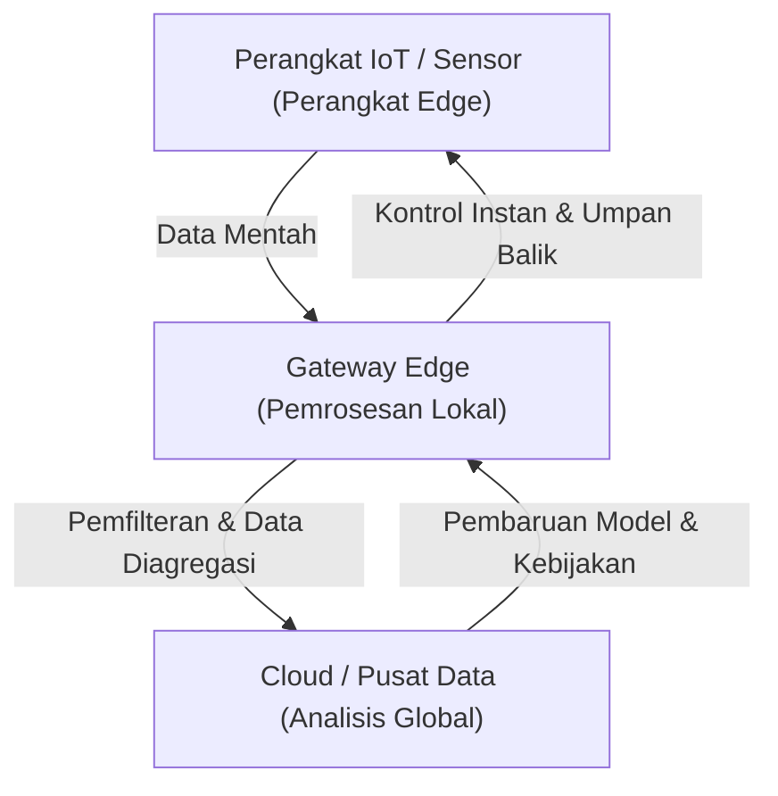

## 1. Pendahuluan: Melepaskan Diri dari Ketergantungan pada Cloud

Selama beberapa dekade terakhir, komputasi cloud telah mengukuhkan posisinya sebagai standar untuk infrastruktur TI. Dengan sumber daya komputasi yang dapat diskalakan tanpa batas, database terkelola, dan API machine learning canggih yang tersedia sesuai permintaan, cloud telah secara fundamental mengubah paradigma pengembangan perangkat lunak. Namun, saat kita memasuki era IoT (Internet of Things) di mana segala sesuatu terhubung ke internet, dan jumlah sensor serta perangkat meledak, arsitektur "mengirim semua data ke cloud" mulai mencapai batasnya.

Miliaran perangkat yang tersebar di seluruh dunia menghasilkan ribuan data penginderaan per detik. Mobil otonom, mesin pintar di pabrik, dan perangkat medis yang dapat dikenakan (wearable) secara terus-menerus menghasilkan jumlah data yang sangat besar. Mengirimkan semua data ini ke server pusat di cloud, memprosesnya, dan mengirimkan kembali hasilnya ke perangkat menjadi tidak realistis dari perspektif fisik, ekonomi, dan keamanan. Artikel ini akan menggali lebih dalam batas-batas pemrosesan terpusat di cloud dan menjelaskan secara rinci perlunya komputasi edge, yang memproses data di dekat sumbernya, dari perspektif arsitektur.

## 2. Tiga Batasan Arsitektur Terpusat pada Cloud

Pendekatan mengirimkan semua data ke cloud memiliki tiga masalah fatal utama: "Kehabisan Bandwidth", "Peningkatan Latensi", dan "Masalah Privasi dan Keamanan".

### 2.1 Kehabisan Bandwidth (Bandwidth Exhaustion)

Bandwidth jaringan tidak terbatas. Misalnya, sebuah mobil otonom tunggal menghasilkan beberapa terabyte (TB) data per hari dari sensor seperti kamera, LIDAR, dan radar. Jika jutaan mobil otonom di jalanan seluruh dunia mencoba mengirimkan semua data mentah ini ke cloud, jaringan seluler seperti 4G atau 5G akan runtuh dalam sekejap.

Ada batas fisik untuk jumlah data yang dapat dikirim melalui jaringan, yang diwakili oleh Teorema Pengkodean Saluran Shannon (Shannon's channel coding theorem). Memang mungkin untuk meningkatkan infrastruktur demi mengamankan bandwidth, tetapi hal ini membutuhkan biaya yang sangat besar. Selain itu, biaya transfer data dan biaya penyimpanan yang dibayarkan ke penyedia cloud juga tidak dapat diabaikan. Mengirimkan segalanya ke cloud, termasuk "data noise yang tidak bernilai", benar-benar tidak efisien dari sudut pandang ekonomi.

### 2.2 Masalah Latensi (Keterlambatan)

Kecepatan cahaya adalah sekitar 300.000 km/s, dan kecepatan transmisi data tidak dapat melampaui hukum fisika ini. Jika server cloud berada di pusat data yang jaraknya ratusan atau ribuan kilometer, perjalanan bolak-balik (round trip) data akan menghasilkan latensi mulai dari puluhan hingga ratusan milidetik.

Untuk banyak aplikasi, keterlambatan ini mungkin dapat ditoleransi. Namun, dalam sistem misi-kritis berikut, keterlambatan kecil bisa berakibat fatal.

*   **Mobil Otonom:** Jika mengandalkan cloud untuk membuat keputusan antara mendeteksi rintangan dan mengerem, ada risiko menyebabkan kecelakaan karena keterlambatan komunikasi.
*   **Robot Industri:** Kontrol robot yang beroperasi dengan kecepatan tinggi di jalur produksi pabrik membutuhkan respons tingkat milidetik.
*   **Perangkat Medis:** Peralatan yang digunakan dalam operasi jarak jauh dan sejenisnya membutuhkan umpan balik real-time mutlak.

Dengan cara ini, dalam skenario di mana "keputusan harus dibuat secara instan", arsitektur mengirim data ke cloud dan menunggu respons tidak dapat diterapkan.

### 2.3 Privasi dan Keamanan

Mengirim data melalui jaringan dengan sendirinya meningkatkan risiko keamanan. Secara khusus, data sensitif yang terhubung langsung dengan privasi, seperti rekaman kamera pintar di rumah dan data vital yang dikumpulkan oleh perangkat medis yang dapat dikenakan, seharusnya tidak diekspos ke luar sebanyak mungkin.

Jika semua data dipusatkan di cloud, server cloud menjadi target serangan utama. Dampak jika terjadi pelanggaran data (data breach) tidak dapat diukur. Selain itu, regulasi perlindungan data di berbagai negara, seperti GDPR (Peraturan Perlindungan Data Umum UE), secara ketat membatasi transfer data lintas batas, dan lokasi penyimpanan data fisik (residensial data) sangat ditekankan. Pendekatan untuk memproses data secara lokal dan hanya mengirimkan hasil yang dianonimkan serta diagregasi ke cloud menjadi tidak terhindarkan.

## 3. Kebutuhan Akan Komputasi Edge dan Arsitektur

"Komputasi Edge" (Edge Computing) muncul untuk menyelesaikan masalah-masalah ini. Komputasi Edge adalah paradigma komputasi terdistribusi di mana data diproses bukan di server pusat cloud, tetapi di perangkat atau server lokal yang dekat dengan tempat data dihasilkan (tepi jaringan = edge).

### 3.1 Pengenalan Arsitektur Berlapis (Hierarchical Architecture)

Dalam sistem IoT, arsitektur yang mengadopsi komputasi edge biasanya memiliki struktur berlapis sebagai berikut:

1.  **Lapisan Perangkat Edge (Device Edge):** Perangkat terminal seperti sensor, aktuator, dan kamera pintar. Pengumpulan data dan pemfilteran sangat sederhana dilakukan di sini.
2.  **Lapisan Gateway/Node Edge (Network Edge):** Router, perangkat gateway khusus, atau stasiun pangkalan (MEC: Multi-access Edge Computing). Ini memiliki beberapa tingkat kemampuan komputasi dan melakukan analisis data real-time, pemfilteran, deteksi anomali, dll.
3.  **Lapisan Cloud:** Sistem pusat yang melakukan penyimpanan data jangka panjang, pelatihan model machine learning skala besar, dan manajemen operasi secara keseluruhan.

Kunci arsitekturnya adalah **Pemisahan Tanggung Jawab (Separation of Concerns)**: hal-hal yang perlu diputuskan secara instan di edge (cakupan lokal) diproses di edge, sedangkan analisis tren jangka panjang dan hal-hal yang membutuhkan pemrosesan skala besar (cakupan global) dialihkan ke cloud.

## 4. Keterbatasan dan Realitas Perangkat IoT

Meskipun komputasi edge ideal, perangkat IoT terminal yang menghasilkan data memiliki batasan yang ketat. Arsitek harus sepenuhnya memahami batasan ini ketika merancang sistem.

### 4.1 Keterbatasan Umur Baterai

Banyak perangkat IoT yang tidak terhubung secara permanen ke sumber daya, melainkan digerakkan oleh baterai atau pemanenan energi (energy harvesting). Melakukan perhitungan mengonsumsi daya, tetapi pada kenyataannya, **komunikasi nirkabel (pengiriman data melalui Wi-Fi atau LTE) mengonsumsi daya jauh lebih besar daripada perhitungan pada prosesor**. Oleh karena itu, dalam banyak kasus, daripada "mengirimkan semua data", pendekatan "menghitung secara lokal, membuang data yang tidak perlu, dan hanya mengirimkan hasil penting" akan menekan konsumsi daya seluruh perangkat dan memperpanjang umur baterai.

### 4.2 Keterbatasan Daya Komputasi dan Memori

Sebagian besar perangkat IoT beroperasi dengan mikrokontroler (MCU) yang murah dan berdaya rendah. Pada perangkat dengan RAM hanya beberapa ratus kilobyte, tidak mungkin untuk menjalankan OS yang kompleks atau tumpukan perangkat lunak (software stack) yang besar. Akibatnya, jika Anda ingin melakukan pemrosesan lanjutan, Anda harus merancang sistem untuk melepaskan (offload) pemrosesan dari perangkat edge yang sangat terbatas ke jaringan edge (seperti gateway) yang memiliki sedikit lebih banyak sumber daya.

## 5. Komputasi Edge vs. Komputasi Fog

Konsep yang mirip dengan komputasi edge adalah "Komputasi Fog" (Fog Computing). Konsep yang diajukan oleh Cisco Systems ini memiliki arti kabut (fog) yang melayang lebih dekat ke tanah (edge) daripada awan (cloud).

Keduanya adalah konsep yang sangat mirip, tetapi ada perbedaan fokus arsitektur.

*   **Komputasi Edge:** Berfokus pada pemrosesan di "tempat" fisik (perangkat atau di dekatnya) di mana data dihasilkan. Tujuan utamanya adalah untuk meningkatkan daya pemrosesan di titik akhir (perangkat itu sendiri).
*   **Komputasi Fog:** Sebuah kerangka arsitektur yang membuat lapisan jalur jaringan dari edge ke cloud (router, switch, gateway, dll.) dan memperlakukan seluruh infrastruktur sebagai platform pemrosesan terdistribusi. Ia memiliki perspektif yang lebih berpusat pada jaringan.

Pada kenyataannya, keduanya tidak saling eksklusif, melainkan menyatu dan digunakan untuk mengoptimalkan seluruh sistem.

## 6. Masa Depan yang Dihadirkan oleh Edge AI dan TinyML

Hal yang paling mempercepat evolusi komputasi edge adalah kebangkitan "Edge AI". Di masa lalu, menyimpulkan (memprediksi) model machine learning membutuhkan sumber daya komputasi yang besar, yang umumnya dilakukan di cloud. Namun, dengan kemajuan perangkat keras dan teknik peringanan model, inferensi real-time di sisi edge telah menjadi mungkin.

Yang menarik perhatian khusus adalah **TinyML (Tiny Machine Learning)**. TinyML adalah teknologi yang menjalankan model machine learning pada mikrokontroler (MCU) yang beroperasi hanya dengan beberapa miliwatt daya. Hal ini telah menciptakan kasus penggunaan inovatif yang sebelumnya tidak terbayangkan.

*   **Deteksi Kata Kunci Suara:** Proses pengenalan kata bangun (wake word) seperti "Hey, Siri" atau "OK, Google" oleh speaker pintar selalu berjalan pada perangkat (edge), bukan di cloud. Ini mencegah percakapan yang tidak relevan dikirim ke cloud.
*   **Pemeliharaan Prediktif (Predictive Maintenance):** Perangkat edge secara real-time menganalisis getaran motor dan data akustik untuk mendeteksi tanda-tanda kerusakan. Tidak perlu terus mengirimkan data normal selama berhari-hari ke cloud.
*   **Vision AI:** Kamera pintar menganalisis video secara lokal dan hanya mengirimkan snapshot ke cloud ketika mendeteksi orang yang mencurigakan atau peristiwa tertentu.

Melatih model (Training) dilakukan di cloud di mana jumlah data yang sangat besar diagregasi, sementara model ringan yang dioptimalkan dan dikuantisasi disebarkan (deploy) ke edge untuk inferensi (Inference). Siklus hybrid pelatihan dan inferensi ini dapat dikatakan sebagai bentuk akhir dari arsitektur IoT modern.

## 7. Kesimpulan: Menuju Keseimbangan Optimal Antara Cloud dan Edge

Jawaban atas pertanyaan "mengapa Anda tidak boleh mengirim semua data ke cloud" sangat jelas. Hukum fisika, ekonomi, dan keamanan membuat semuanya menjadi tidak mungkin.

Komputasi edge tidak menggantikan cloud. Sebaliknya, ia adalah mitra esensial untuk memaksimalkan nilai cloud. Memfilter sejumlah besar data mentah bernilai rendah di edge dan membuat keputusan yang membutuhkan tindakan real-time secara lokal. Kemudian, cloud bertanggung jawab untuk mengekstraksi wawasan (insights) jangka panjang dan mengatur (orchestrate) keseluruhan sistem.

"Pemisahan tanggung jawab" inilah satu-satunya arsitektur berkelanjutan yang akan mendukung masyarakat IoT masa depan di mana ratusan miliar perangkat terhubung. Insinyur perangkat lunak dan arsitek dituntut untuk membebaskan diri dari pola pikir yang hanya berpusat pada cloud dan memiliki perspektif untuk merancang aliran data yang melintasi seluruh sistem dan penempatan pemrosesan yang optimal di era mendatang ini.
