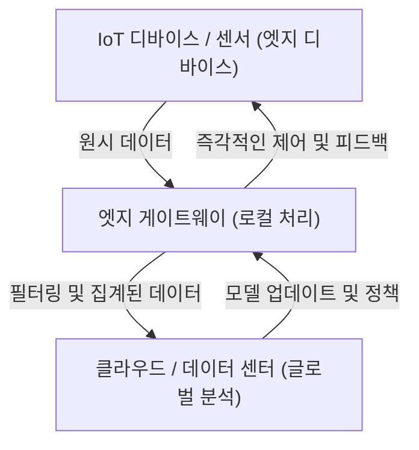

## 1. 서론: 클라우드 편중에서 벗어나기

지난 수십 년 동안, 클라우드 컴퓨팅은 IT 인프라의 표준으로 자리 잡았습니다. 무한히 확장 가능한 컴퓨팅 리소스, 매니지드 데이터베이스, 그리고 고도화된 머신러닝 API를 온디맨드로 이용할 수 있는 클라우드는 소프트웨어 개발의 패러다임을 근본적으로 변화시켰습니다. 그러나 모든 사물이 인터넷에 연결되는 IoT(Internet of Things) 시대에 접어들고, 센서와 디바이스가 폭발적으로 증가한 현재, "모든 데이터를 클라우드로 보낸다"는 아키텍처는 한계에 다다르고 있습니다.

전 세계에 흩어져 있는 수십억 개의 디바이스가 1초에 수천 번의 센싱 데이터를 생성하고 있습니다. 자율주행차, 공장의 스마트 머신, 의료용 웨어러블 디바이스 등은 방대한 양의 데이터를 끊임없이 만들어내고 있습니다. 이 데이터를 모두 클라우드의 중앙 서버로 전송하여 처리하고, 그 결과를 다시 디바이스로 돌려보내는 것은 물리적, 경제적, 그리고 보안 관점에서 비현실적이 되어가고 있습니다. 이 글에서는 클라우드 집중형 처리의 한계를 깊이 파고들어, 데이터 발생원 근처에서 처리를 수행하는 엣지 컴퓨팅의 필연성에 대해 아키텍처 관점에서 상세히 해설합니다.

## 2. 클라우드 집중형 아키텍처가 안고 있는 3가지 한계

모든 데이터를 클라우드로 전송하는 접근 방식에는 주로 "대역폭 고갈", "지연 시간(레이턴시) 증가", "개인정보 보호 및 보안 문제"라는 3가지 치명적인 문제가 존재합니다.

### 2.1 대역폭 고갈 (Bandwidth Exhaustion)

네트워크의 대역폭은 무한하지 않습니다. 예를 들어, 1대의 자율주행차는 카메라, LIDAR, 레이더 등의 센서로부터 하루에 수 테라바이트(TB)에 달하는 데이터를 생성합니다. 만약 전 세계 도로를 달리는 수백만 대의 자율주행차가 이 원시 데이터를 모두 클라우드로 전송하려고 한다면, 4G나 5G 등의 셀룰러 네트워크는 순식간에 붕괴될 것입니다.

네트워크 상에서 전송할 수 있는 데이터 양에는 섀넌의 채널 코딩 정리로 대표되는 물리적인 한계가 있습니다. 대역폭을 확보하기 위해 인프라를 증설하는 것은 가능하지만, 거기에는 막대한 비용이 듭니다. 또한, 클라우드 사업자에게 지불하는 데이터 전송 요금이나 스토리지 비용도 무시할 수 없습니다. "가치 없는 노이즈 데이터"까지 포함하여 모든 것을 클라우드로 전송하는 것은 경제적인 관점에서도 완전히 비효율적입니다.

### 2.2 지연 시간(레이턴시) 문제

빛의 속도는 약 30만 km/s이며, 데이터 전송 속도는 이 물리 법칙을 뛰어넘을 수 없습니다. 클라우드 서버가 수백 km, 혹은 수천 km 떨어진 데이터 센터에 있는 경우, 데이터의 왕복(라운드 트립)에는 수십 밀리초에서 수백 밀리초의 지연 시간이 발생합니다.

많은 애플리케이션에서 이러한 지연은 허용될 수 있습니다. 그러나 다음과 같은 미션 크리티컬한 시스템에서는 아주 작은 지연이 치명적인 결과를 초래할 수 있습니다.

*   **자율주행차:** 장애물을 감지하고 브레이크를 밟기까지의 판단을 클라우드에 의존할 경우, 통신 지연으로 인해 사고를 유발할 위험이 있습니다.
*   **산업용 로봇:** 공장의 생산 라인에서 고속으로 동작하는 로봇 제어에는 밀리초 단위의 응답성이 요구됩니다.
*   **의료 기기:** 원격 수술 등에서 사용되는 기기는 실시간 피드백이 필수적입니다.

이처럼 "즉각적인 판단을 내려야 하는" 시나리오에서는 클라우드에 데이터를 보내고 응답을 기다리는 아키텍처가 성립되지 않습니다.

### 2.3 개인정보 보호 및 보안

데이터를 네트워크를 통해 전송하는 것 자체가 보안 위험을 높입니다. 특히, 가정 내 스마트 카메라 영상이나 의료용 웨어러블 디바이스가 수집하는 생체 데이터 등 개인정보와 직결되는 민감한 데이터는 가급적 외부로 유출해서는 안 됩니다.

모든 데이터를 클라우드에 집중시키면, 클라우드 서버는 훌륭한 공격 목표가 됩니다. 데이터 유출이 발생할 경우 그 영향은 헤아릴 수 없습니다. 또한, GDPR(EU 일반 데이터 보호 규칙) 등 각국의 데이터 보호 규제는 데이터의 국경 간 이전을 엄격하게 제한하고 있으며, 물리적인 데이터 저장 위치(데이터 레지던시)가 중요하게 여겨지고 있습니다. 로컬에서 데이터를 처리하고, 익명화 및 집계된 결과만 클라우드로 보내는 접근 방식이 불가피해지고 있는 것입니다.

## 3. 엣지 컴퓨팅의 필연성과 아키텍처

이러한 과제들을 해결하기 위해 등장한 것이 "엣지 컴퓨팅(Edge Computing)"입니다. 엣지 컴퓨팅이란 데이터를 클라우드의 중앙 서버가 아니라, 데이터가 생성되는 장소(네트워크의 엣지 = 주변부)에 가까운 디바이스나 로컬 서버에서 처리하는 분산 컴퓨팅 패러다임입니다.

### 3.1 계층형 아키텍처 도입

IoT 시스템에서 엣지 컴퓨팅을 도입한 아키텍처는 통상적으로 다음과 같은 계층 구조를 갖습니다.

1.  **엣지 디바이스 계층 (디바이스 엣지):** 센서, 액추에이터, 스마트 카메라 등의 말단 디바이스. 이곳에서는 데이터 수집과 아주 간단한 필터링이 이루어집니다.
2.  **엣지 게이트웨이/노드 계층 (네트워크 엣지):** 라우터나 전용 게이트웨이 디바이스, 혹은 기지국(MEC: Multi-access Edge Computing) 등. 여기서 어느 정도의 연산 능력을 갖추고 실시간 데이터 분석, 필터링, 이상 탐지 등을 수행합니다.
3.  **클라우드 계층:** 장기적인 데이터 저장, 대규모 머신러닝 모델 훈련, 전체적인 운영 관리를 수행하는 중앙 시스템.

엣지에서 즉시 판단해야 할 것(로컬 스코프)은 엣지에서 처리하고, 장기적인 추세 분석이나 대규모 처리가 필요한 것(글로벌 스코프)은 클라우드로 넘기는 **책임의 분리(Separation of Concerns)**가 아키텍처의 핵심이 됩니다.

## 4. IoT 디바이스의 제약과 현실

엣지 컴퓨팅이 이상적이긴 하지만, 데이터를 생성하는 말단 IoT 디바이스에는 엄격한 제약이 존재합니다. 아키텍트는 이러한 제약 사항을 충분히 이해하고 시스템을 설계해야 합니다.

### 4.1 배터리 수명 제약

많은 IoT 디바이스는 전원에 상시 연결되어 있는 것이 아니라 배터리나 환경 발전(에너지 하베스팅)으로 구동됩니다. 연산 처리를 수행하는 것은 전력을 소비하지만, 사실 **무선 통신(Wi-Fi나 LTE를 통한 데이터 전송)이 프로세서에서 연산하는 것보다 훨씬 더 많은 전력을 소비합니다**. 따라서 "모든 데이터를 전송하는" 것보다 "로컬에서 계산하여 불필요한 데이터를 버리고, 중요한 결과만 전송하는" 것이 디바이스 전체의 소비 전력을 낮추고 배터리 수명을 연장하는 데 도움이 되는 경우가 많습니다.

### 4.2 연산 능력과 메모리 제약

IoT 디바이스의 대부분은 저렴하고 소비 전력이 낮은 마이크로컨트롤러(MCU)로 동작합니다. 수백 킬로바이트의 RAM밖에 없는 디바이스에서는 복잡한 OS나 거대한 소프트웨어 스택을 구동할 수 없습니다. 따라서 고도화된 처리를 수행하고 싶다면, 제약이 엄격한 디바이스 엣지가 아니라 리소스에 약간의 여유가 있는 네트워크 엣지(게이트웨이 등)로 처리를 오프로드하는 설계가 요구됩니다.

## 5. 엣지 컴퓨팅 vs. 포그 컴퓨팅

엣지 컴퓨팅과 유사한 개념으로 "포그 컴퓨팅(Fog Computing)"이 있습니다. 시스코 시스템즈(Cisco Systems)에 의해 제창된 이 개념은 클라우드(구름)보다 지면(엣지)에 가까운 곳에 떠 있는 포그(안개)라는 의미를 담고 있습니다.

양쪽은 매우 비슷한 개념이지만, 아키텍처 상의 초점에 차이가 있습니다.

*   **엣지 컴퓨팅:** 데이터가 생성되는 물리적인 "장소(디바이스나 그 직근)"에서의 처리에 중점을 둡니다. 엔드포인트(디바이스 자체)에서의 처리 능력 향상이 주된 목적입니다.
*   **포그 컴퓨팅:** 엣지에서 클라우드에 이르기까지의 네트워크 상 경로(라우터, 스위치, 게이트웨이 등)를 계층화하고, 인프라 전체를 분산 처리 플랫폼으로 다루는 아키텍처 프레임워크입니다. 좀 더 네트워크 중심적인 시각을 갖고 있습니다.

실제로는 이 둘이 배타적인 것이 아니며, 시스템 전체를 최적화하기 위해 융합되어 사용되고 있습니다.

## 6. 엣지 AI와 TinyML이 가져올 미래

엣지 컴퓨팅의 진화를 가장 가속화하고 있는 것이 "엣지 AI(Edge AI)"의 대두입니다. 기존에는 머신러닝 모델의 추론(예측)에 큰 계산 자원이 필요하여 클라우드 측에서 수행하는 것이 일반적이었습니다. 그러나 하드웨어의 발전과 모델 경량화 기술 덕분에 엣지 측에서의 실시간 추론이 가능해졌습니다.

특히 주목받고 있는 것이 **TinyML (Tiny Machine Learning)**입니다. TinyML은 수 밀리와트의 전력으로 동작하는 마이크로컨트롤러(MCU) 상에서 머신러닝 모델을 구동하는 기술입니다. 이를 통해 이전에는 생각하지 못했던 혁신적인 활용 사례들이 생겨나고 있습니다.

*   **음성 키워드 감지:** 스마트 스피커가 "Hey, Siri"나 "OK, Google"이라는 웨이크워드를 인식하는 처리는 클라우드가 아닌 디바이스(엣지) 상에서 항상 동작하고 있습니다. 이를 통해 무관한 대화가 클라우드로 전송되는 것을 방지합니다.
*   **예지 보전 (Predictive Maintenance):** 모터의 진동이나 음향 데이터를 엣지 디바이스가 실시간으로 분석하여 고장 징후를 감지합니다. 며칠 치의 정상적인 데이터를 클라우드로 계속 보낼 필요가 없습니다.
*   **비전 AI:** 스마트 카메라가 로컬에서 영상을 분석하고, 수상한 사람이나 특정 이벤트를 감지한 경우에만 해당 스냅샷을 클라우드로 전송합니다.

모델 학습(Training)은 방대한 데이터를 집계한 클라우드에서 수행하고, 최적화 및 양자화된 경량 모델을 엣지에 배포하여 추론(Inference)을 수행합니다. 이러한 학습과 추론의 하이브리드 사이클이야말로 현대 IoT 아키텍처의 완성형이라고 할 수 있습니다.

## 7. 결론: 클라우드와 엣지의 최적의 균형을 향해

"왜 모든 데이터를 클라우드로 보내면 안 되는가"라는 질문에 대한 답은 명확합니다. 물리 법칙, 경제성, 그리고 보안 등 모든 요소가 이를 불가능하게 만들기 때문입니다.

엣지 컴퓨팅은 클라우드를 대체하는 것이 아닙니다. 오히려 클라우드의 가치를 극대화하기 위한 필수불가결한 파트너입니다. 가치가 낮은 대량의 원시 데이터를 엣지에서 필터링하고, 실시간성이 요구되는 판단을 로컬에서 내립니다. 그리고 장기적인 인사이트 도출이나 시스템 전체의 오케스트레이션은 클라우드가 담당합니다.

이러한 "책임의 분산"이야말로 수천억 개의 디바이스가 연결될 미래의 IoT 사회를 지탱하는 유일한 지속 가능한 아키텍처입니다. 소프트웨어 엔지니어나 아키텍트는 클라우드 일변도의 사고에서 벗어나, 시스템 전체에 걸친 데이터의 흐름과 처리의 최적 배치를 설계하는 시각을 갖는 것이 앞으로의 시대에서 강력히 요구됩니다.
