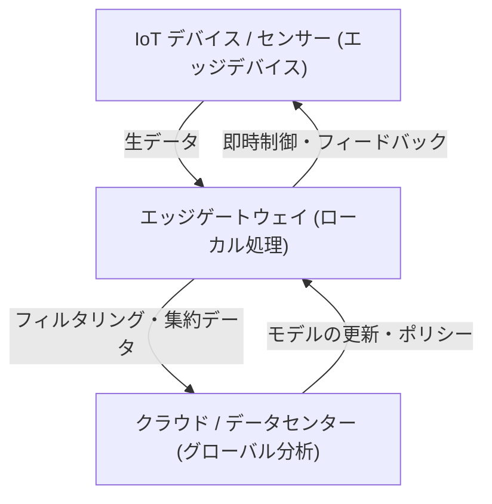

## 1. はじめに：クラウド偏重からの脱却

過去数十年間にわたり、クラウドコンピューティングはITインフラの標準としての地位を確立してきました。無限にスケーラブルなコンピュートリソース、マネージドデータベース、そして高度な機械学習APIをオンデマンドで利用できるクラウドは、ソフトウェア開発のパラダイムを根本から変革しました。しかし、あらゆるモノがインターネットにつながるIoT（Internet of Things）の時代に突入し、センサーやデバイスが爆発的に増加した現在、「すべてのデータをクラウドに送る」というアーキテクチャは限界を迎えつつあります。

世界中に散らばる数十億のデバイスが、1秒間に何千回ものセンシングデータを生成しています。自動運転車、工場のスマートマシン、医療用のウェアラブルデバイスなどは、膨大な量のデータを絶え間なく生み出しています。これらのデータをすべてクラウドの中央サーバーに送信し、処理し、その結果をデバイスに送り返すことは、物理的・経済的・そしてセキュリティの観点から非現実的になりつつあります。本記事では、クラウド集中型処理の限界を深掘りし、データ発生源の近くで処理を行うエッジコンピューティングの必然性について、アーキテクチャの観点から詳細に解説します。

## 2. クラウド集中型アーキテクチャが抱える3つの限界

すべてのデータをクラウドに送信するアプローチには、主に「帯域幅の枯渇」「レイテンシの増大」「プライバシーとセキュリティの課題」という3つの致命的な問題が存在します。

### 2.1 帯域幅の枯渇（Bandwidth Exhaustion）

ネットワークの帯域幅は無限ではありません。たとえば、1台の自動運転車は、カメラ、LIDAR、レーダーなどのセンサーから1日に数テラバイト（TB）ものデータを生成します。もし世界中の道路を走る数百万台の自動運転車がこの生データをすべてクラウドに送信しようとすれば、4Gや5Gなどのセルラーネットワークは瞬時に崩壊するでしょう。

ネットワーク上で送信できるデータ量には、シャノンの通信路符号化定理に代表される物理的な限界があります。帯域幅を確保するためにインフラを増強することは可能ですが、それには莫大なコストがかかります。また、クラウド事業者へ支払うデータ転送料金やストレージコストも無視できません。「価値のないノイズデータ」まで含めてすべてをクラウドに送信することは、経済的な観点からも完全に非効率なのです。

### 2.2 レイテンシ（遅延）の問題

光の速度は約30万km/sであり、データの伝送速度はこの物理法則を超えることはできません。クラウドサーバーが数百km、あるいは数千km離れたデータセンターにある場合、データの往復（ラウンドトリップ）には数十ミリ秒から数百ミリ秒のレイテンシが生じます。

多くのアプリケーションにおいて、この遅延は許容されるかもしれません。しかし、以下のようなミッションクリティカルなシステムでは、わずかな遅延が命取りになります。

*   **自動運転車:** 障害物を検知してブレーキをかけるまでの判断をクラウドに依存した場合、通信遅延によって事故を引き起こすリスクがあります。
*   **産業用ロボット:** 工場の生産ラインで高速に動作するロボットの制御には、ミリ秒単位の応答性が求められます。
*   **医療機器:** 遠隔手術などで使用される機器は、リアルタイムのフィードバックが不可欠です。

このように、「即座に判断を下さなければならない」シナリオにおいては、クラウドにデータを送って返答を待つというアーキテクチャは成立しません。

### 2.3 プライバシーとセキュリティ

データをネットワーク越しに送信すること自体が、セキュリティリスクを高めます。特に、家庭内のスマートカメラの映像や、医療用ウェアラブルデバイスが収集するバイタルデータなど、プライバシーに直結する機密データは、極力外部に出すべきではありません。

すべてのデータをクラウドに集約すると、クラウドサーバーは格好の攻撃目標となります。データ侵害が発生した場合の影響は計り知れません。また、GDPR（EU一般データ保護規則）などの各国のデータ保護法規制は、データの越境移転を厳しく制限しており、物理的なデータの保存場所（データレジデンシー）が重要視されています。ローカルでデータを処理し、匿名化・集約化された結果だけをクラウドに送るアプローチが不可避となっているのです。

## 3. エッジコンピューティングの必然性とアーキテクチャ

これらの課題を解決するために登場したのが「エッジコンピューティング（Edge Computing）」です。エッジコンピューティングとは、データをクラウドの中央サーバーではなく、データが生成される場所（ネットワークのエッジ＝周縁部）に近いデバイスやローカルサーバーで処理する分散コンピューティングパラダイムです。

### 3.1 階層型アーキテクチャの導入

IoTシステムにおいて、エッジコンピューティングを導入したアーキテクチャは通常、以下のような階層構造を持ちます。

1.  **エッジデバイス層（デバイスエッジ）:** センサー、アクチュエータ、スマートカメラなどの末端デバイス。ここではデータの収集と、ごく簡単なフィルタリングが行われます。
2.  **エッジゲートウェイ/ノード層（ネットワークエッジ）:** ルーターや専用のゲートウェイデバイス、あるいは基地局（MEC: Multi-access Edge Computing）など。ここである程度の計算能力を持ち、リアルタイムのデータ分析、フィルタリング、異常検知などを行います。
3.  **クラウド層:** 長期的なデータ保存、大規模な機械学習モデルのトレーニング、全体の運用管理を行う中央システム。

エッジで即座に判断すべきもの（ローカルスコープ）はエッジで処理し、長期的な傾向分析や大規模な処理が必要なもの（グローバルスコープ）はクラウドに回すという、**責任の分離（Separation of Concerns）**がアーキテクチャの鍵となります。

## 4. IoTデバイスの制約と現実

エッジコンピューティングが理想的であるとはいえ、データを生成する末端のIoTデバイスには厳しい制約が存在します。アーキテクトはこれらの制約を十分に理解してシステムを設計しなければなりません。

### 4.1 バッテリー寿命の制約

多くのIoTデバイスは、電源に常時接続されているわけではなく、バッテリーや環境発電（エナジーハーベスティング）で駆動しています。計算処理を行うことは電力を消費しますが、実は**無線通信（Wi-FiやLTE経由でのデータ送信）の方が、プロセッサでの計算よりもはるかに多くの電力を消費します**。したがって、「すべてのデータを送信する」よりも「ローカルで計算して不要なデータを捨て、重要な結果だけを送信する」ほうが、デバイス全体の消費電力を抑え、バッテリー寿命を延ばすことにつながるケースが多いのです。

### 4.2 計算能力とメモリの制約

IoTデバイスの多くは、安価で低消費電力のマイクロコントローラ（MCU）で動作しています。数百キロバイトのRAMしか持たないデバイスでは、複雑なOSや巨大なソフトウェアスタックを動かすことはできません。したがって、高度な処理を行いたい場合は、制約の厳しいデバイスエッジではなく、少しだけリソースに余裕のあるネットワークエッジ（ゲートウェイなど）に処理をオフロードする設計が求められます。

## 5. エッジコンピューティング vs. フォグコンピューティング

エッジコンピューティングと似た概念として「フォグコンピューティング（Fog Computing）」があります。シスコシステムズによって提唱されたこの概念は、クラウド（雲）よりも地面（エッジ）に近いところに漂うフォグ（霧）という意味合いを持っています。

両者は非常に近い概念ですが、アーキテクチャ上のフォーカスに違いがあります。

*   **エッジコンピューティング:** データが生成される物理的な「場所（デバイスやその直近）」での処理に重点を置いています。エンドポイント（デバイスそのもの）での処理能力の向上が主眼です。
*   **フォグコンピューティング:** エッジからクラウドに至るまでのネットワーク上の経路（ルーター、スイッチ、ゲートウェイなど）を階層化し、インフラ全体を分散処理のプラットフォームとして扱うアーキテクチャフレームワークです。よりネットワーク中心の視点を持っています。

実際には、この2つは排他的なものではなく、システム全体を最適化するために融合して用いられています。

## 6. エッジAIとTinyMLがもたらす未来

エッジコンピューティングの進化を最も加速させているのが「エッジAI（Edge AI）」の台頭です。従来、機械学習モデルの推論（予測）には大きな計算資源が必要とされ、クラウド側で行うのが一般的でした。しかし、ハードウェアの進化とモデルの軽量化技術により、エッジ側でのリアルタイム推論が可能になりました。

特に注目されているのが**TinyML（Tiny Machine Learning）**です。TinyMLは、数ミリワットの電力で動作するマイコン（MCU）上で機械学習モデルを動かす技術です。これにより、これまで考えられなかったような革新的なユースケースが生まれています。

*   **音声キーワード検出:** スマートスピーカーが「Hey, Siri」や「OK, Google」というウェイクワードを認識する処理は、クラウドではなくデバイス（エッジ）上で常に動作しています。これにより、無関係な会話がクラウドに送信されるのを防いでいます。
*   **予知保全（Predictive Maintenance）:** モーターの振動や音響データをエッジデバイスがリアルタイムに分析し、故障の予兆を検知します。数日分の正常なデータをクラウドに送り続ける必要はありません。
*   **ビジョンAI:** スマートカメラがローカルで映像を解析し、不審者や特定のイベントを検知した場合のみ、そのスナップショットをクラウドに送信します。

モデルの学習（Training）は膨大なデータを集約したクラウドで行い、最適化・量子化された軽量なモデルをエッジにデプロイして推論（Inference）を行う。この学習と推論のハイブリッドサイクルこそが、現代のIoTアーキテクチャの完成形と言えます。

## 7. 結論：クラウドとエッジの最適なバランスへ

「なぜすべてのデータをクラウドに送ってはいけないのか」という問いに対する答えは明確です。物理法則、経済性、そしてセキュリティのすべてが、それを不可能にしているからです。

エッジコンピューティングはクラウドを置き換えるものではありません。むしろ、クラウドの価値を最大化するための不可欠なパートナーです。価値の低い大量の生データをエッジでフィルタリングし、リアルタイム性が求められる判断をローカルで下す。そして、長期的なインサイトの抽出やシステム全体のオーケストレーションはクラウドが担う。

この「責任の分散」こそが、数千億のデバイスがつながる未来のIoT社会を支える唯一の持続可能なアーキテクチャなのです。ソフトウェアエンジニアやアーキテクトは、クラウド一辺倒の思考から脱却し、システム全体を通じたデータの流れと処理の最適な配置を設計する視点を持つことが、これからの時代において強く求められています。
