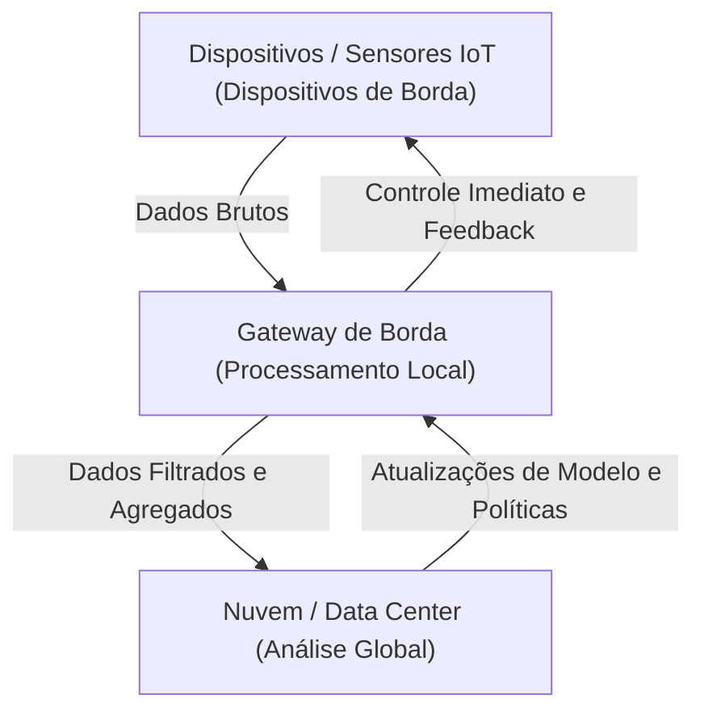

## 1. Introdução: Rompendo com o Foco Exclusivo na Nuvem

Nas últimas décadas, a computação em nuvem estabeleceu-se como o padrão para infraestrutura de TI. A nuvem, com seus recursos de computação infinitamente escaláveis, bancos de dados gerenciados e APIs avançadas de aprendizado de máquina disponíveis sob demanda, transformou fundamentalmente o paradigma do desenvolvimento de software. No entanto, à medida que entramos na era da IoT (Internet das Coisas), onde tudo está conectado à internet, e com a explosão de sensores e dispositivos, a arquitetura de 'enviar todos os dados para a nuvem' está atingindo seus limites.

Biliões de dispositivos espalhados pelo mundo estão gerando dados de detecção milhares de vezes por segundo. Carros autônomos, máquinas inteligentes de fábricas e dispositivos médicos vestíveis estão constantemente produzindo enormes quantidades de dados. Enviar todos esses dados para um servidor central na nuvem, processá-los e enviar os resultados de volta para o dispositivo está se tornando irrealista do ponto de vista físico, econômico e de segurança. Este artigo aprofunda os limites do processamento centralizado na nuvem e explica detalhadamente, do ponto de vista arquitetônico, a necessidade da computação de borda (edge computing), que processa os dados perto da sua fonte.

## 2. Os Três Limites da Arquitetura Centralizada na Nuvem

A abordagem de enviar todos os dados para a nuvem tem três problemas fatais principais: 'esgotamento da largura de banda', 'aumento da latência' e 'desafios de privacidade e segurança'.

### 2.1 Esgotamento da Largura de Banda (Bandwidth Exhaustion)

A largura de banda da rede não é infinita. Por exemplo, um único carro autônomo gera vários terabytes (TB) de dados por dia a partir de sensores como câmeras, LIDAR e radares. Se milhões de carros autônomos nas estradas de todo o mundo tentassem enviar todos esses dados brutos para a nuvem, as redes celulares, como 4G e 5G, entrariam em colapso instantaneamente.

Há limites físicos para a quantidade de dados que podem ser transmitidos através de uma rede, como representado pelo teorema de codificação de canal de Shannon. Embora seja possível aumentar a infraestrutura para garantir a largura de banda, isso tem um custo enorme. Além disso, as taxas de transferência de dados e os custos de armazenamento pagos aos provedores de nuvem não podem ser ignorados. Enviar tudo para a nuvem, incluindo 'dados de ruído sem valor', é completamente ineficiente do ponto de vista econômico.

### 2.2 O Problema da Latência (Atraso)

A velocidade da luz é de aproximadamente 300.000 km/s, e a velocidade de transmissão de dados não pode exceder essa lei física. Se um servidor em nuvem estiver em um data center a centenas ou milhares de quilômetros de distância, os dados levarão de dezenas a centenas de milissegundos de latência de ida e volta (round trip).

Em muitas aplicações, esse atraso pode ser aceitável. No entanto, nos sistemas de missão crítica abaixo, até mesmo um pequeno atraso pode ser fatal:

*   **Carros Autônomos:** Se você depender da nuvem para decidir quando frear após detectar um obstáculo, o atraso na comunicação pode causar um acidente.
*   **Robôs Industriais:** O controle de robôs operando em alta velocidade nas linhas de produção de uma fábrica requer capacidade de resposta na faixa dos milissegundos.
*   **Equipamentos Médicos:** O feedback em tempo real é essencial para equipamentos usados em cirurgias remotas, por exemplo.

Assim, em cenários em que 'decisões precisam ser tomadas imediatamente', uma arquitetura baseada no envio de dados para a nuvem e na espera de uma resposta simplesmente não funciona.

### 2.3 Privacidade e Segurança

A transmissão de dados pela rede, por si só, aumenta os riscos de segurança. Dados confidenciais diretamente ligados à privacidade, como imagens de câmeras inteligentes residenciais e dados vitais coletados por dispositivos médicos vestíveis, não devem ser enviados para o exterior, a menos que seja absolutamente necessário.

Consolidar todos os dados na nuvem torna os servidores em nuvem um alvo atraente para ataques. O impacto de uma violação de dados é incalculável. Além disso, leis de proteção de dados, como o GDPR (Regulamento Geral sobre a Proteção de Dados da UE), restringem severamente a transferência internacional de dados, e o local físico de armazenamento de dados (residência de dados) está recebendo grande ênfase. A abordagem de processar dados localmente e enviar apenas os resultados anonimizados e agregados para a nuvem tornou-se inevitável.

## 3. A Necessidade e Arquitetura do Edge Computing

A 'computação de borda' (Edge Computing) surgiu para resolver esses desafios. O Edge Computing é um paradigma de computação distribuída que processa dados perto de onde são gerados (na borda da rede), em dispositivos ou servidores locais, em vez de servidores centrais na nuvem.

### 3.1 Introdução da Arquitetura em Camadas

Em sistemas IoT, uma arquitetura que incorpora edge computing normalmente tem uma estrutura hierárquica da seguinte forma:

1.  **Camada de Dispositivos de Borda (Device Edge):** Dispositivos finais, como sensores, atuadores e câmeras inteligentes. A coleta de dados e filtragem muito básica ocorrem aqui.
2.  **Camada de Gateway/Nó de Borda (Network Edge):** Roteadores, dispositivos de gateway dedicados ou estações base (MEC: Multi-access Edge Computing). Possuem algum poder computacional para realizar análise de dados em tempo real, filtragem e detecção de anomalias.
3.  **Camada de Nuvem (Cloud):** O sistema central responsável pelo armazenamento de dados a longo prazo, treinamento de modelos de aprendizado de máquina em larga escala e gerenciamento geral das operações.

O que deve ser decidido imediatamente na borda (escopo local) é processado na borda, e a análise de tendências de longo prazo ou coisas que exigem processamento em larga escala (escopo global) são enviadas para a nuvem. Essa **separação de responsabilidades (Separation of Concerns)** é a chave da arquitetura.

## 4. Restrições e Realidades dos Dispositivos IoT

Embora a computação de borda seja ideal, existem restrições severas nos dispositivos IoT finais que geram os dados. Os arquitetos devem projetar sistemas com total compreensão dessas restrições.

### 4.1 Restrições de Vida Útil da Bateria

Muitos dispositivos IoT não estão constantemente conectados a uma fonte de alimentação; eles funcionam com baterias ou coleta de energia (energy harvesting). Executar o processamento computacional consome energia, mas, na verdade, **a comunicação sem fio (envio de dados via Wi-Fi ou LTE) consome muito mais energia do que a computação no processador**. Portanto, 'calcular localmente para descartar dados desnecessários e enviar apenas resultados importantes' em vez de 'enviar todos os dados', muitas vezes ajuda a reduzir o consumo geral de energia do dispositivo e prolongar a vida útil da bateria.

### 4.2 Restrições de Poder Computacional e Memória

Muitos dispositivos IoT operam em microcontroladores (MCUs) de baixo custo e baixo consumo de energia. Dispositivos com apenas algumas centenas de kilobytes de RAM não podem executar sistemas operacionais complexos ou pilhas de software massivas. Portanto, se for necessário processamento avançado, é necessário um design que descarregue (offload) o processamento para a borda da rede (como um gateway) com um pouco mais de recursos, em vez da borda do dispositivo severamente restrita.

## 5. Edge Computing vs. Fog Computing

Um conceito semelhante à computação de borda é a 'computação em névoa' (Fog Computing). Esse conceito, defendido pela Cisco Systems, implica 'névoa' (fog) flutuando mais perto do solo (edge) do que da 'nuvem' (cloud).

Ambos são conceitos muito próximos, mas há diferenças em seu foco arquitetônico:

*   **Edge Computing:** Concentra-se no processamento no 'local' físico (o dispositivo ou seu entorno imediato) onde os dados são gerados. O foco principal é melhorar a capacidade de processamento nos endpoints (os próprios dispositivos).
*   **Fog Computing:** É uma estrutura arquitetônica que hierarquiza o caminho da rede da borda à nuvem (roteadores, switches, gateways, etc.) e trata toda a infraestrutura como uma plataforma de processamento distribuído. Possui uma visão mais centrada na rede.

Na prática, os dois não são mutuamente exclusivos e costumam ser usados juntos para otimizar todo o sistema.

## 6. O Futuro Trazido por Edge AI e TinyML

A evolução da computação de borda está sendo mais acelerada pela ascensão da 'IA de borda' (Edge AI). Tradicionalmente, inferir (prever) com modelos de aprendizado de máquina exigia recursos de computação significativos e geralmente era feito no lado da nuvem. No entanto, avanços no hardware e técnicas de otimização de modelos tornaram possível a inferência em tempo real no lado da borda.

O que está atraindo atenção especial é o **TinyML (Tiny Machine Learning)**. O TinyML é uma tecnologia que executa modelos de aprendizado de máquina em microcontroladores (MCUs) operando com apenas alguns miliwatts de potência. Isso está dando origem a casos de uso inovadores que eram impensáveis até agora.

*   **Detecção de Palavras-Chave de Voz:** O processamento para que os alto-falantes inteligentes reconheçam wake words como 'Hey, Siri' ou 'OK, Google' está sempre em execução no dispositivo (borda), e não na nuvem. Isso impede que conversas irrelevantes sejam enviadas para a nuvem.
*   **Manutenção Preditiva (Predictive Maintenance):** Os dispositivos de borda analisam dados acústicos e de vibração do motor em tempo real para detectar sinais de falha. Não há necessidade de enviar dados normais de vários dias para a nuvem.
*   **IA de Visão (Vision AI):** As câmeras inteligentes analisam imagens de vídeo localmente e enviam fotos para a nuvem apenas quando detectam uma pessoa suspeita ou um evento específico.

O treinamento do modelo ocorre na nuvem, onde grandes quantidades de dados são agregadas, enquanto a inferência (Inference) é realizada com a implantação de modelos leves e otimizados na borda. Esse ciclo híbrido de aprendizado e inferência é a forma definitiva da arquitetura moderna da IoT.

## 7. Conclusão: Em Direção ao Equilíbrio Ideal Entre Nuvem e Borda

A resposta para a pergunta 'Por que não devemos enviar todos os dados para a nuvem?' é clara. As leis da física, da economia e da segurança impossibilitam isso.

A computação de borda não substitui a nuvem. Em vez disso, é um parceiro indispensável para maximizar o valor da nuvem. Grandes volumes de dados brutos de baixo valor são filtrados na borda, e as decisões que requerem respostas em tempo real são tomadas localmente. A nuvem, então, cuida da extração de insights de longo prazo e da orquestração de todo o sistema.

Essa 'distribuição de responsabilidades' é a única arquitetura sustentável que suportará o futuro da sociedade IoT, onde centenas de bilhões de dispositivos estarão conectados. Exige-se que engenheiros e arquitetos de software se afastem do pensamento exclusivo em nuvem e adotem a perspectiva de projetar o fluxo ideal de dados e o posicionamento do processamento em todo o sistema.
