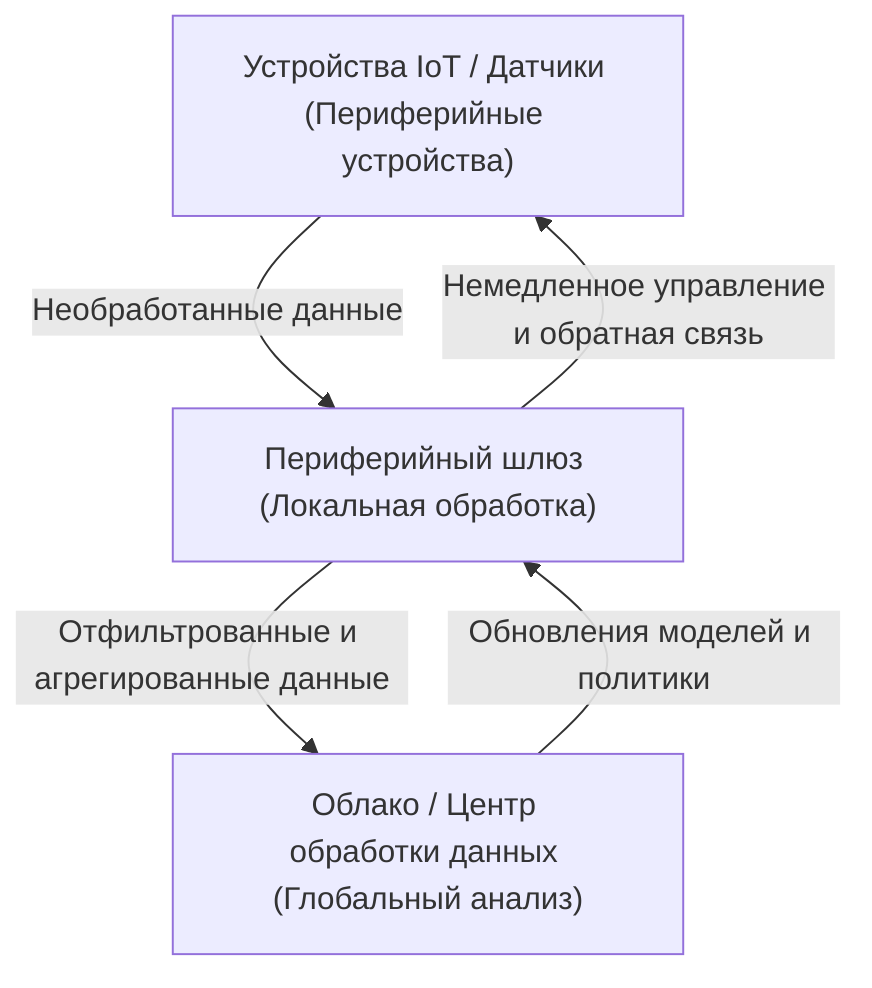

## 1. Введение: отход от чрезмерной зависимости от облака

В последние десятилетия облачные вычисления утвердились в качестве стандарта для ИТ-инфраструктуры. Бесконечно масштабируемые вычислительные ресурсы, управляемые базы данных и передовые API машинного обучения по запросу фундаментально изменили парадигму разработки программного обеспечения. Однако по мере того как мы вступаем в эпоху IoT (Интернета вещей), когда всё подключено к интернету, а количество датчиков и устройств стремительно растет, архитектура 'отправки всех данных в облако' достигает своих пределов.

Миллиарды устройств по всему миру генерируют сенсорные данные тысячи раз в секунду. Автономные автомобили, умные машины на заводах и медицинские носимые устройства постоянно производят огромные объемы данных. Отправка всех этих данных на центральные облачные серверы для обработки и отправки результатов обратно на устройства становится нереалистичной с физической, экономической точек зрения и с точки зрения безопасности. В этой статье подробно рассматриваются ограничения централизованной облачной обработки и необходимость периферийных вычислений (edge computing) — обработки данных вблизи их источника — с архитектурной точки зрения.

## 2. Три ограничения централизованной облачной архитектуры

Подход, при котором все данные отправляются в облако, имеет три фатальные проблемы: 'исчерпание пропускной способности', 'увеличение задержки' и 'проблемы конфиденциальности и безопасности'.

### 2.1 Исчерпание пропускной способности (Bandwidth Exhaustion)

Пропускная способность сети не бесконечна. Например, один автономный автомобиль генерирует несколько терабайт (ТБ) данных в день с помощью таких датчиков, как камеры, LIDAR и радары. Если бы миллионы автономных автомобилей, движущихся по дорогам по всему миру, попытались отправить все эти необработанные данные в облако, сотовые сети, такие как 4G или 5G, мгновенно бы рухнули.

Существуют физические ограничения на объем данных, которые могут быть переданы по сети, примером которых является теорема Шеннона-Хартли (теорема о пропускной способности канала). Можно модернизировать инфраструктуру для обеспечения пропускной способности, но это стоит огромных денег. Кроме того, нельзя игнорировать плату за передачу данных и стоимость хранения, выплачиваемые облачным провайдерам. Отправка абсолютно всего в облако, включая 'бесполезные шумовые данные', совершенно неэффективна с экономической точки зрения.

### 2.2 Проблема задержки (Latency)

Скорость света составляет около 300 000 км/с, и скорость передачи данных не может превышать этот физический закон. Когда облачный сервер находится в центре обработки данных на расстоянии сотен или тысяч километров, задержка приема-передачи (round-trip) данных составляет от десятков до сотен миллисекунд.

Для многих приложений эта задержка может быть приемлемой. Однако для критически важных систем (mission-critical systems), таких как перечисленные ниже, малейшая задержка может стать фатальной.

*   **Автономные автомобили:** Если полагаться на облако в вопросе принятия решения о торможении при обнаружении препятствия, существует риск возникновения аварии из-за задержки связи.
*   **Промышленные роботы:** Управление роботами, работающими на высоких скоростях на заводских производственных линиях, требует времени отклика порядка миллисекунд.
*   **Медицинское оборудование:** Оборудование, используемое для дистанционных операций, требует обратной связи в реальном времени.

В таких сценариях, где решения должны приниматься мгновенно, архитектура отправки данных в облако и ожидания ответа не работает.

### 2.3 Конфиденциальность и безопасность

Передача данных по сети сама по себе повышает риски безопасности. Конфиденциальные данные, напрямую связанные с частной жизнью, такие как видео с домашних умных камер или жизненно важные показатели, собираемые медицинскими носимыми устройствами, в идеале не должны передаваться вовне.

Когда все данные централизуются в облаке, облачные серверы становятся главной мишенью для атак. Последствия утечки данных неизмеримы. Кроме того, национальные законы о защите данных, такие как GDPR (Общий регламент по защите данных ЕС), строго ограничивают трансграничную передачу данных, и большое значение придается месту физического хранения данных (data residency). Неизбежным становится подход, при котором данные обрабатываются локально, а в облако отправляются только анонимизированные и агрегированные результаты.

## 3. Неизбежность и архитектура периферийных вычислений

Для решения этих проблем появились 'периферийные вычисления' (Edge Computing). Периферийные вычисления — это парадигма распределенных вычислений, в которой данные обрабатываются не на центральном сервере в облаке, а на устройствах или локальных серверах, близких к месту генерации данных (периферия сети).

### 3.1 Внедрение многоуровневой архитектуры

В системах IoT архитектура, внедряющая периферийные вычисления, обычно имеет следующую иерархическую структуру.

1.  **Уровень периферийных устройств (Device Edge):** Конечные устройства, такие как датчики, исполнительные механизмы (actuators) и умные камеры. Здесь собираются данные и выполняется очень базовая фильтрация.
2.  **Уровень периферийных шлюзов/узлов (Network Edge):** Маршрутизаторы, выделенные шлюзовые устройства или базовые станции (MEC: Multi-access Edge Computing). Они обладают определенной вычислительной мощностью и выполняют анализ данных в реальном времени, фильтрацию, обнаружение аномалий и т. д.
3.  **Облачный уровень (Cloud Tier):** Центральная система для долгосрочного хранения данных, обучения крупномасштабных моделей машинного обучения и общего операционного управления.

Ключом к архитектуре является **разделение ответственности (Separation of Concerns)**: то, что требует немедленного принятия решений (локальный масштаб), обрабатывается на периферии, а то, что требует долгосрочного анализа тенденций или крупномасштабной обработки (глобальный масштаб), перенаправляется в облако.

## 4. Ограничения и реалии устройств IoT

Несмотря на то, что периферийные вычисления идеальны, существуют строгие ограничения для конечных устройств IoT, генерирующих данные. Архитекторы должны проектировать системы с полным пониманием этих ограничений.

### 4.1 Ограничения срока службы батареи

Многие устройства IoT не подключены постоянно к источнику питания и работают от батарей или используют сбор энергии из окружающей среды (energy harvesting). Вычислительная обработка потребляет энергию, но на самом деле **беспроводная связь (передача данных через Wi-Fi или LTE) потребляет гораздо больше энергии, чем вычисления в процессоре**. Поэтому во многих случаях подход 'вычислять локально, отбрасывать ненужные данные и передавать только важные результаты' вместо 'передавать все данные' снижает общее энергопотребление устройства и продлевает срок службы батареи.

### 4.2 Ограничения вычислительной мощности и памяти

Многие устройства IoT работают на дешевых микроконтроллерах (MCU) с низким энергопотреблением. Устройства с всего лишь сотнями килобайт оперативной памяти не могут запускать сложные ОС или огромные стеки программного обеспечения. Таким образом, когда требуется расширенная обработка, необходим дизайн, при котором обработка переносится с периферийного устройства с жесткими ограничениями на сетевую периферию (например, шлюзы), где есть немного больше свободных ресурсов.

## 5. Периферийные вычисления vs. Туманные вычисления

Концепция, похожая на периферийные вычисления (Edge Computing) — это 'туманные вычисления' (Fog Computing). Эта концепция, предложенная Cisco Systems, несет в себе смысл тумана (fog), который висит ближе к земле (edge), чем облака (cloud).

Обе концепции очень похожи, но различаются в фокусе архитектуры.

*   **Периферийные вычисления (Edge Computing):** Фокусируется на обработке в физическом 'месте' генерации данных (устройство или его непосредственная близость). Основное внимание уделяется улучшению возможностей обработки на конечных точках (на самих устройствах).
*   **Туманные вычисления (Fog Computing):** Архитектурный фреймворк, который стратифицирует (распределяет по уровням) сетевой путь от периферии до облака (маршрутизаторы, коммутаторы, шлюзы и т. д.) и рассматривает всю инфраструктуру как платформу распределенной обработки. Имеет более сетецентричный взгляд.

На практике эти два понятия не исключают друг друга и используются совместно для оптимизации системы в целом.

## 6. Будущее, принесенное Edge AI и TinyML

Что больше всего ускоряет эволюцию периферийных вычислений, так это появление 'Edge AI' (периферийного ИИ). Традиционно вывод (прогнозирование) моделей машинного обучения требовал значительных вычислительных ресурсов и обычно выполнялся на стороне облака. Однако достижения в области аппаратного обеспечения и технологии уменьшения веса (облегчения) моделей сделали возможным вывод в реальном времени на периферии.

Особое внимание привлекает **TinyML (Tiny Machine Learning)**. TinyML — это технология запуска моделей машинного обучения на микроконтроллерах (MCU), которые работают на мощности в несколько милливатт. Это создает инновационные сценарии использования, которые ранее были немыслимы.

*   **Обнаружение ключевых слов по голосу:** Обработка того, как умные динамики распознают слова пробуждения, такие как 'Привет, Siri' или 'ОК, Google', постоянно работает на устройстве (периферии), а не в облаке. Это предотвращает отправку нерелевантных разговоров в облако.
*   **Прогнозное обслуживание (Predictive Maintenance):** Периферийные устройства в реальном времени анализируют вибрацию двигателя или акустические данные для выявления признаков поломки. Нет необходимости постоянно отправлять в облако нормальные данные за несколько дней.
*   **Vision AI (Машинное зрение):** Умные камеры локально анализируют видео и отправляют снимки в облако только в том случае, если обнаруживают подозрительных лиц или определенные события.

Обучение моделей (Training) выполняется в облаке, где агрегируются огромные объемы данных, а оптимизированные и квантованные (quantized) облегченные модели развертываются на периферии для вывода (Inference). Этот гибридный цикл обучения и вывода является идеальной формой современной архитектуры IoT.

## 7. Заключение: к оптимальному балансу между облаком и периферией

Ответ на вопрос 'Почему нельзя отправлять все данные в облако' ясен. Законы физики, экономика и безопасность в совокупности делают это невозможным.

Периферийные вычисления не заменяют облако. Скорее, это незаменимый партнер для максимизации ценности облака. Огромные объемы необработанных данных низкой ценности фильтруются на периферии, а решения, требующие реагирования в реальном времени, принимаются локально. В свою очередь, облако берет на себя извлечение долгосрочных аналитических выводов и оркестрацию системы в целом.

Это 'распределение ответственности' является единственной устойчивой архитектурой для поддержки будущего общества IoT, в котором будут подключены сотни миллиардов устройств. В грядущую эпоху от инженеров-программистов и архитекторов настоятельно требуется отойти от однобокого мышления, ориентированного только на облако, и развивать перспективу проектирования оптимального потока данных и размещения обработки в рамках всей системы.
