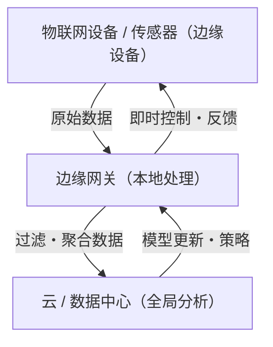

## 1. 简介：摆脱对云的过度依赖

在过去的几十年中，云计算已经确立了其作为IT基础设施标准的地位。无限可扩展的计算资源、托管数据库和按需提供的高级机器学习API从根本上改变了软件开发的范式。然而，在一切事物都连接到互联网的物联网（IoT）时代，随着传感器和设备的爆炸式增长，“将所有数据发送到云端”的架构正面临其极限。

分布在世界各地的数十亿台设备每秒钟产生数千次传感数据。自动驾驶汽车、工厂中的智能机器和医疗可穿戴设备正在不断产生海量数据。将所有这些数据传输到云端的中央服务器进行处理，然后将结果送回设备，从物理、经济和安全的角度来看，正变得越来越不切实际。在本文中，我们将深入探讨集中式云处理的局限性，并从架构的角度详细解释在靠近数据源的地方进行处理的边缘计算的必然性。

## 2. 集中式云架构面临的三个局限性

将所有数据发送到云端的方法主要存在三个致命问题：“带宽枯竭”、“延迟增加”以及“隐私和安全挑战”。

### 2.1 带宽枯竭（Bandwidth Exhaustion）

网络带宽不是无限的。例如，一辆自动驾驶汽车每天从摄像头、激光雷达（LIDAR）和雷达等传感器产生数太字节（TB）的数据。如果在世界各地道路上行驶的数百万辆自动驾驶汽车试图将所有这些原始数据发送到云端，那么4G和5G等蜂窝网络将会瞬间崩溃。

通过网络传输的数据量存在物理限制，正如香农信道编码定理所代表的那样。虽然可以通过增强基础设施来确保带宽，但这需要巨大的成本。此外，向云提供商支付的数据传输费用和存储成本也不容忽视。将所有数据（包括“无价值的噪声数据”）发送到云端，从经济角度来看也是完全低效的。

### 2.2 延迟（Latency）问题

光速约为30万公里/秒，数据传输速度无法超越这一物理定律。当云服务器位于数百或数千公里外的数据中心时，数据的往返（round trip）会产生数十到数百毫秒的延迟。

在许多应用程序中，这种延迟可能是可以接受的。然而，在以下关键任务系统中，哪怕是微小的延迟也可能是致命的：

*   **自动驾驶汽车:** 如果依靠云端来决定检测到障碍物后是否刹车，通信延迟可能会带来引发事故的风险。
*   **工业机器人:** 控制工厂生产线上高速运行的机器人需要毫秒级的响应能力。
*   **医疗设备:** 用于远程手术等操作的设备需要实时反馈。

因此，在“必须立即做出决定”的场景下，将数据发送到云端并等待响应的架构是行不通的。

### 2.3 隐私与安全

通过网络传输数据本身就会增加安全风险。特别是与隐私直接相关的敏感数据，例如家庭智能摄像头的画面和医疗可穿戴设备收集的生命体征数据，应尽可能避免对外传输。

如果所有数据都集中在云端，云服务器就会成为极具吸引力的攻击目标。一旦发生数据泄露，其影响将不可估量。此外，各国的数据保护法律法规（如GDPR——欧盟一般数据保护条例）严格限制数据的跨境传输，并高度重视数据的物理存储位置（数据驻留）。在本地处理数据并仅将匿名化和聚合后的结果发送到云端的方法已成为必然趋势。

## 3. 边缘计算的必然性与架构

为了解决这些挑战，“边缘计算（Edge Computing）”应运而生。边缘计算是一种分布式计算范式，它在靠近数据生成的设备或本地服务器（网络的边缘=外围）处理数据，而不是在云端的中央服务器中。

### 3.1 引入分层架构

在物联网系统中，引入边缘计算的架构通常具有以下层次结构：

1.  **边缘设备层（设备边缘）:** 终端设备，如传感器、执行器和智能摄像头。数据的收集和非常简单的过滤在这里进行。
2.  **边缘网关/节点层（网络边缘）:** 路由器、专用网关设备或基站（MEC: 多接入边缘计算）等。它具有一定的计算能力，可执行实时数据分析、过滤、异常检测等。
3.  **云层:** 负责长期数据存储、大规模机器学习模型训练和整体运营管理的中央系统。

在边缘立即判断的内容（本地范围）在边缘处理，而需要长期趋势分析或大规模处理的内容（全局范围）则交给云端，这种**责任分离（Separation of Concerns）**是架构的关键。

## 4. 物联网设备的限制与现实

尽管边缘计算很理想，但生成数据的末端物联网设备存在严格的限制。架构师在设计系统时必须充分理解这些限制。

### 4.1 电池寿命的限制

许多物联网设备并未持续连接到电源，而是由电池或环境能量收集（Energy Harvesting）驱动的。执行计算过程会消耗电力，但实际上，**无线通信（通过Wi-Fi或LTE传输数据）比处理器中的计算消耗的电力要多得多**。因此，与“发送所有数据”相比，“在本地计算，丢弃不需要的数据，并仅发送重要结果”通常能在更大程度上降低设备的整体功耗并延长电池寿命。

### 4.2 计算能力和内存的限制

大多数物联网设备运行在廉价、低功耗的微控制器（MCU）上。只有几百KB RAM的设备无法运行复杂的操作系统或庞大的软件栈。因此，如果要执行高级处理，则需要设计一种将处理卸载到资源稍宽裕的网络边缘（例如网关）的方法，而不是在资源严格受限的设备边缘进行。

## 5. 边缘计算与雾计算（Fog Computing）

“雾计算（Fog Computing）”是与边缘计算类似的概念。由思科系统公司提出的这一概念，意味着漂浮在比云端更靠近地面（边缘）的雾。

两者是非常接近的概念，但在架构焦点上有所不同：

*   **边缘计算:** 侧重于在生成数据的物理“位置”（设备及其附近）进行处理。主要目的是提高端点（设备本身）的处理能力。
*   **雾计算:** 这是一个架构框架，它将从边缘到云的网络路径（路由器、交换机、网关等）进行分层，并将整个基础设施视为分布式处理的平台。它具有更以网络为中心的视角。

在实践中，两者并不排斥，而是结合使用以优化整个系统。

## 6. 边缘AI与TinyML带来的未来

加速边缘计算发展的最大动力是“边缘AI（Edge AI）”的崛起。传统上，机器学习模型的推理（预测）需要大量的计算资源，并且通常在云端进行。然而，随着硬件的演进和模型轻量化技术的发展，在边缘侧进行实时推理已成为可能。

特别引人注目的是**TinyML（微型机器学习）**。TinyML是一种在以几毫瓦功率运行的微控制器（MCU）上运行机器学习模型的技术。这催生了以前难以想象的创新用例：

*   **语音关键字检测:** 智能音箱识别唤醒词（如“Hey, Siri”或“OK, Google”）的过程，始终在设备（边缘）上运行，而不是在云端。这可以防止无关的对话被发送到云端。
*   **预测性维护（Predictive Maintenance）:** 边缘设备实时分析电机的振动和声学数据，以检测故障的早期迹象。无需将几天份的正常数据连续发送到云端。
*   **视觉AI:** 智能摄像头在本地分析视频，仅在检测到可疑人员或特定事件时才将快照发送到云端。

在收集大量数据的云端进行模型训练（Training），并将优化和量化的轻量级模型部署到边缘进行推理（Inference）。这种学习和推理的混合循环可以说是现代物联网架构的完美形式。

## 7. 结论：走向云与边缘的最佳平衡

对“为什么不要把所有数据都发送到云端”这个问题的答案很明确。因为物理定律、经济学和安全性都使其变得不可能。

边缘计算并非旨在取代云，相反，它是最大化云价值不可或缺的合作伙伴。在边缘过滤大量低价值的原始数据，并在本地做出需要实时响应的决策；同时，云端负责提取长期的洞察并统筹全局系统。

这种“责任分散”正是支撑着数千亿台设备连接的未来物联网社会的唯一可持续架构。在这个新时代，软件工程师和架构师亟需摆脱对云的过度依赖思维，培养设计在整个系统中优化数据流转和处理节点布局的视角。
