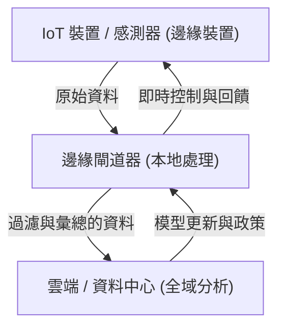

## 1. 簡介：擺脫過度依賴雲端

在過去的數十年裡，雲端運算已經確立了其作為 IT 基礎設施標準的地位。能夠隨需使用無限擴展的運算資源、代管資料庫以及進階的機器學習 API，雲端從根本上改變了軟體開發的典範。然而，隨著我們進入萬物聯網的 IoT（物聯網）時代，感測器和裝置呈現爆炸性成長，「將所有資料送到雲端」的架構正逐漸面臨極限。

散布在世界各地的數十億個裝置，每秒鐘都在產生數千次的感測資料。自動駕駛汽車、工廠的智慧機台、醫療用的穿戴式裝置等，不斷地產生龐大的資料量。將這些資料全部發送到雲端的中央伺服器進行處理，再將結果回傳給裝置，無論從實體、經濟還是安全的角度來看，都變得越來越不切實際。本文將深入探討集中式雲端處理的極限，並從架構的角度詳細說明在資料來源附近進行處理的邊緣運算之必然性。

## 2. 集中式雲端架構面臨的三大極限

將所有資料發送到雲端的方法，主要存在「頻寬耗盡」、「延遲增加」和「隱私與安全問題」這三個致命的缺陷。

### 2.1 頻寬耗盡（Bandwidth Exhaustion）

網路的頻寬並非無限。舉例來說，一輛自動駕駛汽車每天會從攝影機、光達（LIDAR）、雷達等感測器產生數 TB（Terabyte）的資料。如果世界上行駛在道路上的數百萬輛自動駕駛汽車都試圖將這些原始資料全部傳送到雲端，那麼 4G 或 5G 等行動網路將會瞬間崩潰。

網路上可傳送的資料量，存在著以夏農通訊通道編碼定理為代表的物理極限。雖然可以為了確保頻寬而擴充基礎設施，但這需要花費巨大的成本。此外，支付給雲端業者的資料傳輸費用和儲存成本也不容忽視。將包含「無價值雜訊資料」在內的所有內容都發送到雲端，從經濟角度來看完全是缺乏效率的。

### 2.2 延遲（Latency）的問題

光速大約是每秒 30 萬公里，資料的傳輸速度無法超越這個物理法則。如果雲端伺服器位於數百公里甚至數千公里外的資料中心，資料的來回（Round-trip）就會產生數十到數百毫秒的延遲。

在許多應用程式中，這樣的延遲或許可以被接受。然而，在以下這類關鍵任務（Mission-critical）系統中，些微的延遲都可能致命：

*   **自動駕駛汽車:** 如果依賴雲端來判斷偵測到障礙物並踩下煞車，通訊延遲可能會引發車禍的風險。
*   **工業機器人:** 工廠生產線上高速運作的機器人控制，需要達到毫秒級的反應速度。
*   **醫療設備:** 用於遠距手術等的設備，即時的意見回饋是不可或缺的。

因此，在「必須立即做出判斷」的情境下，將資料送到雲端並等待回應的架構是行不通的。

### 2.3 隱私與安全

透過網路傳輸資料本身就會增加安全風險。特別是家庭內智慧攝影機的影像，或是醫療穿戴式裝置所收集的生命體徵資料等，這些直接關係到隱私的機密資料，應盡可能避免外流。

如果將所有資料集中在雲端，雲端伺服器將成為顯著的攻擊目標。一旦發生資料外洩，影響將難以估計。此外，如 GDPR（歐盟一般資料保護規則）等各國的資料保護法規，嚴格限制了資料的跨境傳輸，實體資料的儲存位置（Data Residency）受到高度重視。在本地處理資料，並僅將匿名化、彙總後的結果發送到雲端的方法，已成為不可避免的趨勢。

## 3. 邊緣運算的必然性與架構

為了解決這些問題，「邊緣運算（Edge Computing）」應運而生。邊緣運算是一種分散式運算典範，它不將資料放在雲端的中央伺服器處理，而是在靠近資料產生位置（網路的邊緣）的裝置或本地伺服器上進行處理。

### 3.1 導入分層式架構

在 IoT 系統中，導入邊緣運算的架構通常具有以下的分層結構：

1.  **邊緣裝置層（Device Edge）:** 感測器、致動器、智慧攝影機等終端裝置。這裡負責收集資料以及進行非常簡單的過濾。
2.  **邊緣閘道器 / 節點層（Network Edge）:** 路由器、專用閘道器裝置，或是基地台（MEC: Multi-access Edge Computing）等。這裡具備一定程度的運算能力，進行即時的資料分析、過濾、異常偵測等。
3.  **雲端層:** 負責長期資料保存、大規模機器學習模型訓練以及整體營運管理的中央系統。

將需要在邊緣立即判斷的事務（本地範圍）交由邊緣處理，而需要長期趨勢分析或大規模處理的事務（全域範圍）則交由雲端，這種**職責分離（Separation of Concerns）**是架構的關鍵。

## 4. IoT 裝置的限制與現實

儘管邊緣運算十分理想，但產生資料的終端 IoT 裝置卻存在著嚴格的限制。架構師必須充分了解這些限制來設計系統。

### 4.1 電池壽命的限制

許多 IoT 裝置並非一直連接電源，而是由電池或環境獵能（Energy Harvesting）驅動。執行運算處理會消耗電力，但事實上，**無線通訊（透過 Wi-Fi 或 LTE 發送資料）所消耗的電力，遠比處理器進行運算來得多**。因此，與其「發送所有資料」，不如「在本地計算並捨棄不需要的資料，只發送重要的結果」，這樣往往更能降低裝置整體的耗電量，進而延長電池壽命。

### 4.2 運算能力與記憶體的限制

大多數 IoT 裝置都在廉價且低功耗的微控制器（MCU）上運作。只有數百 KB RAM 的裝置，無法執行複雜的作業系統或龐大的軟體堆疊。因此，若想執行進階處理，就需要設計將處理卸載（Offload）到資源稍微充裕的網路邊緣（如閘道器），而不是限制嚴格的裝置邊緣。

## 5. 邊緣運算 vs. 霧運算

與邊緣運算相似的概念還有「霧運算（Fog Computing）」。這個由思科系統（Cisco Systems）提出的概念，其意涵是指漂浮在比雲端（Cloud）更靠近地面（邊緣）的霧（Fog）。

兩者是非常相近的概念，但在架構的焦點上有所不同：

*   **邊緣運算:** 著重在資料產生的實體「位置（裝置或其附近）」進行處理。主要目標是提升端點（裝置本身）的處理能力。
*   **霧運算:** 將從邊緣到雲端的網路路徑（路由器、交換器、閘道器等）分層化，把整個基礎設施作為分散式處理平台的架構框架。它具有較為以網路為中心的觀點。

實際上，這兩者並不互相排斥，而是融合在一起使用，以實現整個系統的最佳化。

## 6. 邊緣 AI 與 TinyML 帶來的未來

最能加速邊緣運算發展的，莫過於「邊緣 AI（Edge AI）」的崛起。過去，機器學習模型的推論（預測）需要大量的運算資源，通常在雲端進行。然而，隨著硬體的進步和模型輕量化技術的發展，在邊緣端進行即時推論已成為可能。

其中特別受到矚目的是 **TinyML（Tiny Machine Learning）**。TinyML 是一項在只需幾毫瓦電力運作的微控制器（MCU）上執行機器學習模型的技術。這催生了過去難以想像的創新應用案例：

*   **語音關鍵字偵測:** 智慧音箱辨識「Hey, Siri」或「OK, Google」等喚醒詞（Wake word）的處理，是一直在裝置（邊緣）上執行的，而非雲端。這防止了無關的對話被傳送到雲端。
*   **預測性維護（Predictive Maintenance）:** 邊緣裝置即時分析馬達的震動和聲音資料，偵測故障的預兆。不需要將好幾天的正常資料持續送到雲端。
*   **視覺 AI:** 智慧攝影機在本地分析影像，只有在偵測到可疑人物或特定事件時，才將快照發送到雲端。

在彙整了龐大資料的雲端進行模型訓練（Training），並將最佳化、量化後的輕量模型部署到邊緣進行推論（Inference）。這種訓練與推論的混合循環，可以說是現代 IoT 架構的完成型態。

## 7. 結論：邁向雲端與邊緣的最佳平衡

對於「為什麼不該把所有資料都送到雲端」這個問題，答案非常明確：物理法則、經濟性以及安全性，都使得這件事變得不可能。

邊緣運算並非要取代雲端，相反地，它是將雲端價值最大化不可或缺的夥伴。在邊緣過濾低價值的大量原始資料，並在本地做出需要即時性的判斷；而長期洞察的萃取和整個系統的協調（Orchestration）則由雲端負責。

這種「職責分散」，正是支撐未來數千億裝置相連的 IoT 社會，唯一可持續的架構。軟體工程師和架構師必須擺脫完全依賴雲端的思維，具備設計跨越整個系統的資料流動和處理最佳配置的觀點，這是未來時代的強烈需求。
