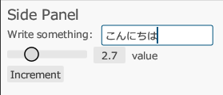

## egui का नमूना प्राप्त करें

आप निम्न कमांड के साथ egui नमूना चला सकते हैं।

```
git clone https://github.com/emilk/eframe_template/ egui_test
cd egui_test
cargo run
```

## जापानी-समर्थित फ़ॉन्ट लोड करें

जापानी प्रदर्शित करने के लिए, आपको एक ऐसा फ़ॉन्ट लोड करना होगा जो जापानी भाषा का समर्थन करता हो।

`src/app.rs` में, `pub fn new` विधि के अंदर निम्नलिखित पंक्तियाँ जोड़ें।

```rust
// जापानी-समर्थित फ़ॉन्ट लोड करें
let mut fonts = egui::FontDefinitions::default();
fonts.font_data.insert(
    "Meiryo".to_owned(),
    egui::FontData::from_static(include_bytes!("C:/Windows/Fonts/Meiryo.ttc")),
);
fonts
    .families
    .entry(egui::FontFamily::Proportional)
    .or_default()
    .insert(0, "Meiryo".to_owned());
cc.egui_ctx.set_fonts(fonts);
```

## अब आप जापानी प्रदर्शित कर सकते हैं।


