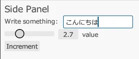

## Obtenha a amostra do egui

Você pode executar a amostra do egui com o seguinte comando.

```
git clone https://github.com/emilk/eframe_template/ egui_test
cd egui_test
cargo run
```

## Carregue uma fonte compatível com japonês

Para exibir texto em japonês, você deve carregar uma fonte que suporte o idioma japonês.

No arquivo `src/app.rs`, adicione as seguintes linhas dentro do método `pub fn new`.

```rust
// Carregar a fonte compatível com japonês
let mut fonts = egui::FontDefinitions::default();
fonts.font_data.insert(
    "Meiryo".to_owned(),
    egui::FontData::from_static(include_bytes!("C:/Windows/Fonts/Meiryo.ttc")),
);
fonts
    .families
    .entry(egui::FontFamily::Proportional)
    .or_default()
    .insert(0, "Meiryo".to_owned());
cc.egui_ctx.set_fonts(fonts);
```

## Agora você pode exibir japonês.


